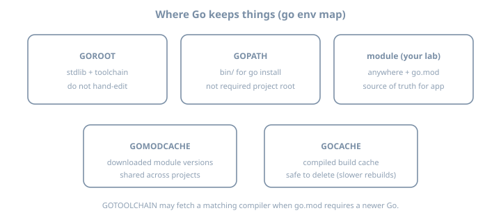
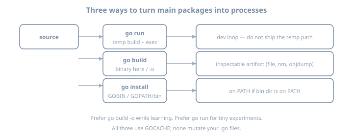
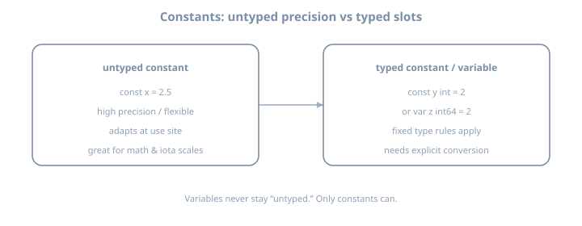

# Day 1 — Toolchain, Variables, Types & Control Flow


# Day 1 — Toolchain & mental model

**Stage I · ~3h (theory-heavy)**  
**Goal:** Build a correct model of how Go finds code, compiles it, and places artifacts—then prove it with a module you can inspect.

::: {.callout-note}
Today is intentionally **more theory than feature checklist**. The labs exist to verify the model, not to invent domain logic.
:::

## Why this day exists

Most “I know Go” failures in week one are not syntax—they are **toolchain misconceptions**:

- Treating `go run` as the same thing as shipping a binary  
- Believing projects must live under `GOPATH`  
- Confusing **module path**, **import path**, and **directory path**  
- Not knowing which `go` binary is on `PATH` when multiple installs exist  

If the model is solid, Days 2–10 are friction, not confusion.

---

## Theory 1 — Four artifacts (and how they nest)

{fig-alt="Pipeline from Go module through package and source files to a binary artifact"}

| Artifact | Definition | Example |
|----------|------------|---------|
| **Module** | Versioned unit of distribution; root has `go.mod` | `example.com/day01` |
| **Package** | Compilation unit: one directory, one `package` clause | `package main` or `package config` |
| **Source file** | One `.go` file belonging to that package | `main.go`, `banner.go` |
| **Artifact** | Compiler output: executable or library archive | `./day01`, `pkg.a` |

### Rule that saves hours

- **Directories** group files into packages.  
- **`package` name** is what other Go code uses *inside* the language (with import path).  
- **Module path** in `go.mod` is the prefix for import paths of packages in that module.

**Example — layout**

```text
day01/
  go.mod          # module example.com/day01
  main.go         # package main
  banner.go       # package main  (same package!)
  internal/
    greeter/
      greeter.go  # package greeter
                  # import "example.com/day01/internal/greeter"
```

**Example — wrong mental model**

```text
# Myth: "each .go file is its own package"
main.go     package main
banner.go   package banner   # FAIL if both are entry for same binary
```

Both files of an executable’s root usually share `package main`. Split packages only when you introduce subdirectories intentionally.

### Worked micro-example: one package, two files

```go
// main.go
package main

import "fmt"

func main() {
	fmt.Println(greeting)
}
```

```go
// banner.go
package main

const greeting = "hello from day 01"
```

Same package → `greeting` is visible without import. That is **package scope**, not “global to the universe.”

---

## Theory 2 — GOPATH era vs modules era

{fig-alt="Side by side comparison of GOPATH workspace layout and modules layout"}

### GOPATH era (you will still *see* it)

Historically:

- All code under `$GOPATH/src/...`  
- Import path ≈ filesystem path under `src`  
- Dependencies were a shared workspace problem  

`go env GOPATH` still prints a path. **`go install` still drops binaries under `$GOPATH/bin` (or `GOBIN`)**. That does **not** mean your project must live there.

### Modules era (default for this volume)

| Property | Behavior |
|----------|----------|
| Location | Any directory with `go.mod` |
| Identity | `module` line is a **name** (often a URL-like path) |
| Dependencies | Versions in `go.mod`; checksums in `go.sum` |
| Cache | Downloaded modules in `GOMODCACHE` |

**Example `go.mod`**

```go
module example.com/day01

go 1.26
```

**Example import of an external module** (later days; shown for theory)

```go
import "golang.org/x/mod/semver"
// resolved via go.mod require + GOMODCACHE copy
```

### Semantic import versioning (preview, not mastery today)

Major versions ≥ v2 often appear in import paths (`.../v2`). You do not need the full design today—only: **import paths and versions are coupled by policy**, not by guesswork.

---

## Theory 3 — What “installing Go” actually installs

{fig-alt="Map of GOROOT GOPATH GOMODCACHE GOCACHE and your module"}

| Variable | Theory | Practice |
|----------|--------|----------|
| `GOROOT` | Toolchain + standard library | Treat as read-only |
| `GOPATH` | Workspace for installed tools + legacy | Often `~/go` |
| `GOMODCACHE` | Content cache of downloaded modules | Shared across projects |
| `GOCACHE` | Build cache of compiled packages | Delete ⇒ slower rebuilds, not wrongness |
| `GOTOOLCHAIN` | Policy for auto-fetching toolchains | Prefer local 1.26.x for this volume |
| `GO111MODULE` | Historical switch | Modern Go: modules on by default |

### Multiple Go installs (classic footgun)

```bash
which -a go
type go
go version
ls "$(go env GOROOT)"
```

**Example failure story:** IDE uses toolchain A; terminal uses toolchain B → “works in editor, fails in CI.” Always ask `go env GOROOT` in the same shell you build with.

### `GOTOOLCHAIN` theory (Go 1.21+)

If `go.mod` says `go 1.26` and your installed toolchain is older, Go may **download** a matching toolchain depending on `GOTOOLCHAIN` (`auto` / `local` / version pin). That is deliberate design for reproducible module requirements—not malware.

For learning: install 1.26.x yourself so notes match your binary.

---

## Theory 4 — `go run` vs `go build` vs `go install`

{fig-alt="Three compilation entry points go run go build and go install"}

| Command | Produces | Leaves behind | Best for |
|---------|----------|---------------|----------|
| `go run .` | Temporary binary + execute | Usually nothing durable | Experiments |
| `go build -o name .` | Named binary in cwd (or path) | File you can ship/inspect | Learning + release candidates |
| `go install .` | Binary in `GOBIN`/`GOPATH/bin` | On PATH if configured | Installing CLIs you use often |

### Compilation is not “interpreting”

Go is compiled. `go run` still compiles; it just hides the artifact lifecycle.

### Example: same source, three outcomes

```bash
go run .                 # print output; no stable ./binary
go build -o day01 .      # ./day01 exists
go install .             # $GOPATH/bin or GOBIN
```

### Inspecting a real artifact (theory → evidence)

```bash
file ./day01
go tool nm ./day01 | head
# go tool objdump -s main.main ./day01 | head -40
```

You are proving the **machine code exists**. Later profiling (Stage VII) builds on this comfort.

---

## Theory 5 — Packages, visibility, and `main`

### Exported vs unexported (preview that matters immediately)

| Name | Visibility |
|------|------------|
| `Hello` | Exported (capital letter) — other packages can refer |
| `hello` | Unexported — same package only |

Inside `package main` split across files, lowercase is fine. When you create `package greeter`, capitals become the API.

### The `main` contract

An executable package:

1. Must be named `package main`  
2. Must define `func main()` with **no parameters and no return values**  
3. Should live in a directory you intentionally build as a command  

**Counter-example (will not link as you expect):**

```go
package main

func Main() {} // wrong name — not an entry point
```

---

## Theory 6 — Build cache and reproducibility (honest)

- **GOCACHE** speeds rebuilds; it is not a substitute for modules.  
- **Reproducible builds** (bit-for-bit) need more than `go build` defaults (flags, paths, cgo, OS). Do not claim bit-identity yet.  
- **Module sums** (`go.sum`) protect dependency integrity for module downloads—not your own uncommitted source.

---

## Lab 1 — Install and interrogate the toolchain

### Install

Install **Go 1.26.x** from [https://go.dev/dl/](https://go.dev/dl/) (or a package manager that tracks 1.26 closely).

```bash
go version
# expect: go1.26.x
```

### Map the environment (write answers)

```bash
go env GOROOT GOPATH GOMODCACHE GOCACHE GOTOOLCHAIN GO111MODULE
go env | sort | head -40
```

Fill:

| Question | Your answer |
|----------|-------------|
| Where is the stdlib? | `GOROOT` → … |
| Where will `go install` put binaries? | … |
| Where do module downloads land? | … |

---

## Lab 2 — First module with multi-file package

```bash
mkdir -p ~/lab/90daysofx/go/day01
cd ~/lab/90daysofx/go/day01
go mod init example.com/day01
```

Create `main.go` and `banner.go` as in Theory 1. Then:

```bash
go run .
go build -o day01 .
./day01
file ./day01
```

### Deliberate failures (read the errors)

1. Change `banner.go` to `package other` → rebuild.  
2. Rename `main` → `Main` → rebuild.  
3. Introduce `var x = 1 + "2"` → rebuild.  

Paste errors into your journal. **Compiler messages are part of the language UX.**

---

## Lab 3 — Prove install path theory

```bash
go install .
ls "$(go env GOPATH)/bin"
# or: ls "$(go env GOBIN)" if set
```

Compare binary names from `go build -o` vs `go install`. Note surprises.

---

## Common misconceptions (theory checklist)

| Myth | Reality |
|------|---------|
| “Go is interpreted because of `go run`” | Always compiled |
| “Project must be under GOPATH” | Modules: any directory |
| “`go.mod` is optional in 2026” | Required for real work |
| “Deleting the binary uninstalls the module” | Source remains; install bin is separate |
| “One `.go` file = one package” | Package = directory (+ package clause) |

---

## Checkpoint

- [ ] `go version` is 1.26.x  
- [ ] Can draw module → package → file → binary from memory  
- [ ] Can explain GOPATH vs modules without notes  
- [ ] Produced `./day01` via `go build` and ran it  
- [ ] Caused and fixed at least two compile errors  
- [ ] Documented `GOROOT` / `GOMODCACHE` / `GOCACHE`  

### Commit

```bash
git init  # if needed
git add go.mod main.go banner.go
git commit -m "day01: toolchain mental model + hello module"
```

---

## Tomorrow

**Day 2 — Variables, types, constants, conversions** (theory of zero values, typed vs untyped constants, explicit conversions) + units CLI lab.

---


# Day 2 — Variables, types & constants

**Stage I · ~3h (theory-heavy)**  
**Goal:** Internalize Go’s type rules—zero values, declarations, constants, and **explicit** conversions—then apply them in a small units CLI.

## Why this day exists

Go’s type system is small but strict. The pain points are predictable:

- Expecting C-style implicit numeric promotions  
- Treating zero values as “unset” without a separate signal  
- Mixing typed and untyped constants incorrectly  
- Using integer division for physical quantities  

Mastering these early prevents mysterious bugs in later concurrency and API code.

---

## Theory 1 — Types are sets of values + operations

A type answers:

1. What values are allowed?  
2. What operations are legal?  
3. How is it represented (size/alignment)—later relevant for performance  

### Predeclared numeric types (selected)

| Type | Role |
|------|------|
| `int`, `uint` | Architecture-sized (at least 32-bit; typically 64 on modern desktops) |
| `int8`…`int64`, `uint8`…`uint64` | Fixed width |
| `float32`, `float64` | IEEE floats; prefer `float64` unless constrained |
| `byte` | Alias of `uint8` |
| `rune` | Alias of `int32` (Unicode code point) |
| `complex64`, `complex128` | Exist; rarely needed in this volume |

**Example — representation matters for overflow theory**

```go
var u uint8 = 255
// u = u + 1  // wraps to 0 in Go (modular arithmetic for integers)
```

You will not exploit wrap in the units CLI—but you must know it exists.

---

## Theory 2 — Zero values

{fig-alt="Diagram of Go zero values for numbers bool string and nil-able types"}

### Law

> Allocating a variable without initialization yields the **zero value**, not garbage.

### Examples

```go
var i int           // 0
var f float64       // 0
var b bool          // false
var s string        // ""
var p *int          // nil
var xs []int        // nil slice (len 0, cap 0, no array)
var m map[string]int // nil map (read-only safe; write panics)
```

### Design consequence

APIs often cannot use `0` or `""` to mean “missing.” Patterns later:

- `*T` pointer (nil = absent)  
- `ok` boolean from maps  
- `sql.Null*` types  
- custom option types  

**Example — zero value bug class**

```go
func average(nums []int) float64 {
	var sum int
	for _, n := range nums {
		sum += n
	}
	return float64(sum) / float64(len(nums)) // panics or Inf if len==0
}
```

Zero-length input is a **domain** problem; zero values did not cause it, but they encourage forgetting edge cases.

---

## Theory 3 — Declaration forms

### Four common shapes

```go
var x int                 // zero value
var y int = 3             // explicit type + init
var z = 3                 // type inferred (int)
w := 3                    // short declare; function scope only
```

### Multiple assignment

```go
a, b := 1, 2
a, b = b, a               // swap
v, err := strconv.Atoi("42")
```

### Redeclaration rule with `:=`

```go
x, err := f()
x, err := g()   // ERROR if no new variable on left
x, err = g()    // OK: assignment
x, err2 := g()  // OK: err2 is new
```

### Package-level vs function-level

```go
var globalCounter int     // OK at package level
// count := 0             // ILLEGAL at package level
```

**Example — prefer clarity**

```go
// Good when zero then fill
var buf []byte
if need {
	buf = make([]byte, 1024)
}

// Good when known init
name := "gopher"
```

---

## Theory 4 — No implicit conversion between named types

```go
var a int = 1
var b int64 = 2
// var c = a + b     // compile error
var c = int64(a) + b // explicit conversion
```

### Conversion vs assertion (preview)

| Construct | Meaning |
|-----------|---------|
| `T(x)` | Conversion when allowed (numerics, strings/bytes, etc.) |
| `x.(T)` | Type assertion on interfaces (later days) |

### String ↔ numeric is not free

```go
// n := int("42")           // illegal
n, err := strconv.Atoi("42") // decoding, can fail
s := strconv.Itoa(42)
```

### Worked examples

```go
var x int32 = 65
fmt.Println(string(rune(x))) // "A" — rune conversion intentional

b := []byte("hi")
s := string(b)               // copy of bytes as string
```

**Caution:** `string(65)` as `string(rune(65))` is a code point, not decimal text `"65"`.

---

## Theory 5 — Constants: typed vs untyped

{fig-alt="Comparison of untyped flexible constants and typed constants or variables"}

### Untyped constants

```go
const Pi = 3.14159265358979323846 // untyped floating
const Two = 2                     // untyped integer
```

They can be used in more contexts until they must become a concrete type:

```go
var f32 float32 = Two   // OK
var i int = Two         // OK
var u uint = Two        // OK
```

### Typed constants

```go
const Max int = 100
// var u uint = Max     // error: cannot use Max (type int) as uint
var u uint = uint(Max)
```

### `iota` — enumerator generator

```go
const (
	KB = 1 << (10 * iota) // 1 << 0 = 1
	MB                    // 1 << 10
	GB                    // 1 << 20
)

const (
	StatusOK = iota // 0
	StatusFail      // 1
	StatusRetry     // 2
)
```

**Example — skip values**

```go
const (
	_ = iota // 0 discarded
	Readable // 1
	Writable // 2
	Executable // 3
)
```

### Constants must be compile-time

```go
// const now = time.Now() // illegal — function call not constant
```

---

## Theory 6 — Integer division and mixed arithmetic

```go
fmt.Println(5 / 2)          // 2
fmt.Println(5.0 / 2.0)      // 2.5
fmt.Println(float64(5) / 2) // 2.5
```

**Physical quantities** (metres, °C) should almost always use `float64` for intermediate math in this course.

### Temperature theory (for the lab)

- Fahrenheit from Celsius: `F = C * (9.0/5.0) + 32`
- Celsius from Fahrenheit: `C = (F - 32) * (5.0/9.0)`

Use float constants `9.0/5.0`, not `9/5` (integer → `1`).

---

## Theory 7 — Conversion architecture for CLIs

{fig-alt="Pipeline from input units to base unit to target unit to output"}

### Why a base unit?

For **N** units, pairwise converters need on the order of **N²** functions. Via a base unit you only need about **2N** (to-base and from-base).

### Families

| Family | Base (suggested) | Members |
|--------|------------------|---------|
| Length | metre | `m`, `km` |
| Temperature | Celsius | `c`, `f` |

Cross-family conversion must **error**, not invent physics.

### Error theory (preview of Day 11–13)

Return `error` as a value:

```go
return 0, fmt.Errorf("unknown unit %q", unit)
```

Do not panic for user input mistakes.

---

## Worked examples bank (study these)

### Example A — zero values print

```go
var i int
var s string
var p *int
fmt.Printf("%d %q %v\n", i, s, p) // 0 "" <nil>
```

### Example B — constant kind flexibility

```go
const K = 1000
var a int = K
var b int64 = K
var c float64 = K
```

### Example C — illegal mix

```go
var x int = 1
var y int64 = 2
// fmt.Println(x + y) // must not compile
fmt.Println(int64(x) + y)
```

### Example D — iota flags pattern (stretch theory)

```go
const (
	FlagRead = 1 << iota // 1
	FlagWrite            // 2
	FlagExec             // 4
)
```

---

## Lab 1 — Zeros and illegal conversions

```bash
mkdir -p ~/lab/90daysofx/go/day02
cd ~/lab/90daysofx/go/day02
go mod init example.com/day02
```

Write `sandbox.go` that prints zero values and contains a **commented** illegal `int+int64` line. Uncomment once to read the error, then restore.

---

## Lab 2 — Units CLI (application of theory)

### Spec

```text
units <value> <from> <to>
```

Minimum units: `m`, `km`, `c`, `f`.

### Skeleton (main)

```go
package main

import (
	"fmt"
	"os"
	"strconv"
	"strings"
)

func main() {
	if len(os.Args) != 4 {
		fmt.Fprintf(os.Stderr, "usage: %s <value> <from> <to>\n", os.Args[0])
		os.Exit(2)
	}
	value, err := strconv.ParseFloat(os.Args[1], 64)
	if err != nil {
		fmt.Fprintf(os.Stderr, "invalid value: %v\n", err)
		os.Exit(2)
	}
	from := strings.ToLower(os.Args[2])
	to := strings.ToLower(os.Args[3])
	out, err := convert(value, from, to)
	if err != nil {
		fmt.Fprintf(os.Stderr, "%v\n", err)
		os.Exit(1)
	}
	fmt.Printf("%g %s\n", out, to)
}
```

Implement `convert` using **base-unit normalization** and `const` factors. Reject cross-family.

### Test matrix

```bash
go build -o units .
./units 1 km m
./units 1000 m km
./units 0 c f
./units 32 f c
./units 1 m c      # error
./units 5 xyz m    # error
```

### Expected theory checks in code review (self)

- [ ] No integer division in temperature formulas  
- [ ] Explicit `float64` parse path  
- [ ] Clear errors (unknown unit / family mismatch)  
- [ ] Constants for factors, not magic numbers only  

---

## Stretch theory

Add `mi` ↔ `km` with a documented constant approximation, still via metres as base.

---

## Common gotchas

| Gotcha | Fix |
|--------|-----|
| `9/5` in temperature | Use `9.0/5.0` |
| `:=` redeclaration | Introduce a new name or use `=` |
| Float `==` | Prefer printing; tests use epsilon later |
| `string(65)` confusion | Use `strconv` for decimal text |
| Nil map write | `make` before write |

---

## Checkpoint

- [ ] Explain zero values for `int`, `string`, `*T`, `map`  
- [ ] Show compile error for `int + int64` without conversion  
- [ ] Explain untyped vs typed constants with an example  
- [ ] Units CLI passes the test matrix  
- [ ] Cross-family conversion fails clearly  

### Commit

```bash
git add .
git commit -m "day02: type theory + units CLI"
```

---

## Tomorrow

**Day 3 — Control flow:** `if`, `switch`, and the many forms of `for`—with non-toy control problems and short-circuit theory.

---


# Day 3 — Control flow

**Stage I · ~3h (theory-heavy)**  
**Goal:** Master Go’s three control constructs—`if`, `switch`, and `for`—well enough to write a non-toy line classifier with correct exit codes, short-circuit safety, and modern range semantics.

::: {.callout-note}
Go has **no** `while` or `do-while`. Everything that loops is a form of `for`. That is a feature: one keyword, four shapes.
:::

## Why this day exists

Control flow is where language differences bite hardest for people arriving from C, Java, Python, or JavaScript:

- `switch` does **not** fall through by default  
- `if` has an optional **short statement** that scopes variables tightly  
- There is only **`for`**—while, infinite loop, C-style, and `range`  
- Since **Go 1.22**, loop variables no longer share a single per-loop address (the classic “goroutine captures loop var” bug was fixed)  
- `range` over a `string` yields **runes**, not bytes  

If these are solid, parsers, CLIs, and later workers become mechanical rather than mysterious.

---

## Theory 1 — `if`: condition, short statement, and scoping

### Basic form

```go
if condition {
	// ...
} else if other {
	// ...
} else {
	// ...
}
```

Conditions must be **boolean**. There is no “truthiness” of `0`, `""`, or `nil`.

```go
// if n { }        // compile error: non-boolean condition
if n != 0 { }      // OK
if s != "" { }     // OK
if p != nil { }    // OK
```

### Short statement

```go
if err := doWork(); err != nil {
	return err
}
// err is not in scope here
```

The short statement runs **once** before the condition. Variables declared there are scoped to the entire `if` / `else if` / `else` chain—not to the surrounding block.

**Why it matters**

| Pattern | Scope of `err` |
|---------|----------------|
| `err := f(); if err != nil` | Outer block (leaks) |
| `if err := f(); err != nil` | If-chain only (preferred when you only need it for the check) |

### Nested short statements

```go
if v, err := strconv.Atoi(s); err != nil {
	return 0, err
} else if v < 0 {
	return 0, fmt.Errorf("negative: %d", v)
} else {
	return v, nil
}
```

Readable for two branches; for more logic, declare outside and use plain `if`.

### Short-circuit evaluation

Boolean operators short-circuit left-to-right:

```go
if p != nil && p.Ready() {
	// p.Ready() never called if p is nil
}

if ok || expensive() {
	// expensive() skipped if ok is already true
}
```

**Law:** put the cheap/safe check first when the second expression would panic or be costly.

---

## Theory 2 — `switch`: tagged, tagless, and type (preview)

### No automatic fallthrough

```go
switch kind {
case "info":
	info++
case "warn":
	warn++
default:
	// unknown
}
```

Unlike C, execution stops at the end of a matching case. Use the `fallthrough` keyword **explicitly** and sparingly—it falls into the **next case body**, ignoring that case’s match condition.

```go
switch n {
case 1:
	fmt.Println("one")
	fallthrough
case 2:
	fmt.Println("two-or-fell-from-one")
}
```

### Multi-value cases

```go
switch day {
case "sat", "sun":
	fmt.Println("weekend")
case "mon", "tue", "wed", "thu", "fri":
	fmt.Println("weekday")
}
```

### Expression switch with short statement

```go
switch v := strings.ToLower(raw); v {
case "y", "yes":
	return true
case "n", "no":
	return false
default:
	return false
}
```

### Tagless switch (if-else chain)

```go
switch {
case score >= 90:
	grade = "A"
case score >= 80:
	grade = "B"
default:
	grade = "C"
}
```

Cases are evaluated in order; first true wins. Prefer this over nested `if` when each branch is a pure condition.

### Type switch (preview only)

```go
switch x := anyVal.(type) {
case int:
	fmt.Println("int", x)
case string:
	fmt.Println("string", x)
default:
	fmt.Printf("other %T\n", x)
}
```

Full treatment lands on Day 12. Today: know it exists and that `x` has a different type in each case.

---

## Theory 3 — `for`: four shapes, one keyword

### 1. Three-clause (C-style)

```go
for i := 0; i < n; i++ {
	// ...
}
```

Any clause may be empty:

```go
for ; cond; {
	// while-style with explicit empty init/post
}
```

### 2. Condition-only (while)

```go
for pending > 0 {
	pending = drain()
}
```

### 3. Infinite loop

```go
for {
	line, err := r.ReadString('\n')
	if err == io.EOF {
		break
	}
	if err != nil {
		return err
	}
	// handle line
}
```

### 4. `range`

```go
for i, v := range slice { /* index, value */ }
for i := range slice { /* index only */ }
for _, v := range slice { /* value only */ }
for k, v := range m { /* map key, value */ }
for i, r := range s { /* string: byte index, rune */ }
for v := range ch { /* channel receive until closed */ }
```

### `break` and `continue`

```go
for i, line := range lines {
	if strings.HasPrefix(line, "#") {
		continue // skip comments
	}
	if line == "STOP" {
		break // leave the loop
	}
	_ = i
}
```

### Labeled `break` / `continue` (use rarely)

```go
Outer:
	for i := 0; i < n; i++ {
		for j := 0; j < m; j++ {
			if bad(i, j) {
				break Outer
			}
		}
	}
```

Prefer refactoring nested loops into a function with early `return` when labels start multiplying.

---

## Theory 4 — Range semantics that surprise people

### Strings: byte index + rune value

```go
s := "Go🚀"
for i, r := range s {
	fmt.Printf("i=%d r=%c U+%04X\n", i, r, r)
}
// i advances by UTF-8 width; r is the decoded rune
```

Iterating with a C-style index over `len(s)` walks **bytes**, not characters.

### Maps: random iteration order

```go
m := map[string]int{"a": 1, "b": 2, "c": 3}
for k, v := range m {
	fmt.Println(k, v) // order not stable across runs
}
```

Never depend on map range order for tests or protocols. Sort keys if you need stability (Day 6 depth).

### Go 1.22+ loop variable semantics

Before Go 1.22, each loop reused **one** variable; closures captured the final value. Since 1.22 (and thus your 1.26 baseline), each iteration gets a **fresh** variable:

```go
var funcs []func()
for i := 0; i < 3; i++ {
	funcs = append(funcs, func() { fmt.Println(i) })
}
for _, f := range funcs {
	f() // prints 0 1 2 on modern Go — not 2 2 2
}
```

Still write clear code: capture by value if you hand code to older toolchains or want explicit intent.

```go
for i := 0; i < 3; i++ {
	i := i // intentional shadow; documents capture
	go func() { fmt.Println(i) }()
}
```

### Integer range (Go 1.22+)

```go
for i := range 5 {
	fmt.Println(i) // 0..4
}
```

Useful for fixed-count loops without a dummy slice.

---

## Theory 5 — Control flow at the process boundary

CLIs communicate status with **exit codes**, not only printed text:

| Code | Typical meaning |
|------|-----------------|
| `0` | Success |
| `1` | Runtime / domain failure |
| `2` | Usage / argument error |

```go
if len(os.Args) < 2 {
	fmt.Fprintln(os.Stderr, "usage: classifier <file>")
	os.Exit(2)
}
```

Prefer returning `error` from helpers and deciding `os.Exit` **once** in `main`—you will formalize that on Day 4 with `defer` and multiple returns.

---

## Worked examples bank

### Example A — Classifier core with switch

```go
package main

import (
	"bufio"
	"fmt"
	"io"
	"strings"
)

type counts struct {
	info, warn, error, fatal, unknown int
}

func classifyLine(line string, c *counts) (fatal bool) {
	line = strings.TrimSpace(line)
	if line == "" {
		return false
	}
	kind, _, _ := strings.Cut(line, " ")
	switch strings.ToLower(kind) {
	case "info":
		c.info++
	case "warn":
		c.warn++
	case "error":
		c.error++
	case "fatal":
		c.fatal++
		return true
	default:
		c.unknown++
	}
	return false
}

func classify(r io.Reader) (counts, bool, error) {
	var c counts
	sawFatal := false
	sc := bufio.NewScanner(r)
	for sc.Scan() {
		if classifyLine(sc.Text(), &c) {
			sawFatal = true
		}
	}
	return c, sawFatal, sc.Err()
}

func main() {
	// wired in lab
	_ = fmt.Sprintf
}
```

### Example B — Tagless switch for HTTP-ish status buckets

```go
func bucket(code int) string {
	switch {
	case code >= 200 && code < 300:
		return "success"
	case code >= 400 && code < 500:
		return "client_error"
	case code >= 500:
		return "server_error"
	default:
		return "other"
	}
}
```

### Example C — Nested loop with early continue

```go
func firstNonComment(lines []string) (string, bool) {
	for _, line := range lines {
		line = strings.TrimSpace(line)
		if line == "" || strings.HasPrefix(line, "#") {
			continue
		}
		return line, true
	}
	return "", false
}
```

### Example D — Safe nil check with short-circuit

```go
type Conn struct {
	closed bool
}

func (c *Conn) Ready() bool { return c != nil && !c.closed }

func use(c *Conn) {
	if c != nil && c.Ready() {
		// safe
	}
}
```

Note: calling a method with a nil receiver is **allowed** in Go if the method handles `c == nil`. Short-circuit still documents intent.

### Example E — Parsing with if short statement

```go
func parsePort(s string) (int, error) {
	if s == "" {
		return 0, fmt.Errorf("empty port")
	}
	if n, err := strconv.Atoi(s); err != nil {
		return 0, fmt.Errorf("port %q: %w", s, err)
	} else if n < 1 || n > 65535 {
		return 0, fmt.Errorf("port out of range: %d", n)
	} else {
		return n, nil
	}
}
```

---

## Labs

Suggested workspace: `~/lab/90daysofx/go/day03`

### Lab 1 — Line classifier CLI

Build a stdin (or file) line classifier.

**Input format** (one event per line):

```text
KIND payload...
```

Kinds: `info`, `warn`, `error`, `fatal` (case-insensitive). Anything else is `unknown`.

**Behavior**

1. Read lines until EOF.  
2. Count each kind.  
3. Print a summary to stdout:

```text
info=3 warn=1 error=0 fatal=1 unknown=2
```

4. If any `fatal` line was seen, exit with code **1**.  
5. On I/O / open errors, print to stderr and exit **1**.  
6. On bad usage (if you take a path arg incorrectly), exit **2**.

```bash
mkdir -p ~/lab/90daysofx/go/day03
cd ~/lab/90daysofx/go/day03
go mod init example.com/day03
```

### Lab 2 — Fixture-driven manual tests

Create `testdata/sample.log`:

```text
info started
WARN disk low
error open failed
fatal cannot continue
not-a-kind garbage
info still running
```

```bash
go build -o classifier .
./classifier < testdata/sample.log; echo exit:$?
# expect non-zero because of fatal
```

Create `testdata/clean.log` with only `info`/`warn` and confirm exit `0`.

### Lab 3 — Deliberate control exercises

In a second file or `_experiments.go` (or a small `explore` program):

1. `range` a string containing multi-byte runes; print index and rune.  
2. Write a tagless `switch` that grades scores.  
3. Demonstrate that `fallthrough` is required for C-style multi-case body sharing.

---

## Common gotchas

| Gotcha | Reality / fix |
|--------|----------------|
| Expecting C `switch` fallthrough | Cases break automatically; use `fallthrough` only when deliberate |
| `if x { }` with non-bool | Illegal; compare explicitly |
| `for i, c := range s` thinking `i` is character index | `i` is **byte** offset |
| Depending on `range` map order | Order is randomized; sort keys if needed |
| Using `os.Exit` deep in helpers | Prefer `error` returns; exit in `main` |
| Silent unknown kinds | Count them or fail loudly—pick a policy and document it |
| Pre-1.22 loop-var myths | Fixed since 1.22; still avoid unclear captures |

---

## Checkpoint

- [ ] Can write all four `for` shapes from memory  
- [ ] `if` short statement used at least once with intentional scoping  
- [ ] `switch` with `default` and multi-value cases  
- [ ] Explained string `range` (byte index + rune)  
- [ ] Classifier counts kinds correctly  
- [ ] Exit code `1` when any `fatal` present; `0` otherwise on clean input  
- [ ] Documented three personal gotchas  

### Commit

```bash
git add .
git commit -m "day03: control flow + line classifier"
```

---

## Tomorrow

**Day 4 — Functions, multiple returns & defer:** named results, `defer` timing and LIFO, function values, and structuring `main` so errors—not panics—drive exit codes.
