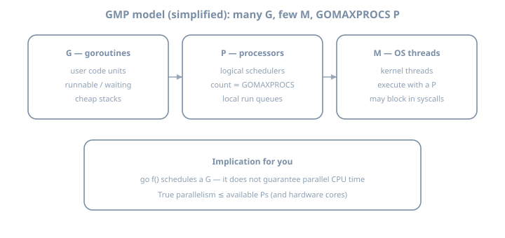
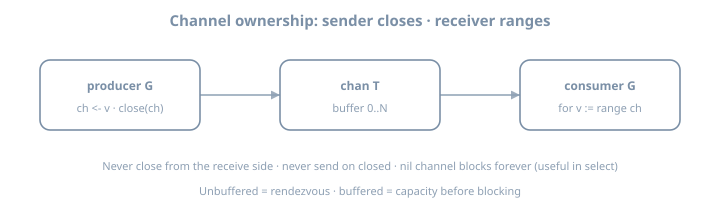

# Day 9 — Goroutines, Channels & Select


# Day 19 — Goroutines & the GMP model

**Stage III · ~3h (theory-heavy)**  
**Goal:** Build a correct mental model of goroutines, the G/M/P scheduler, and how to *start and join* concurrent work without races or leaks.

::: {.callout-note}
Today is **concurrency foundation**, not channel mastery. You will spawn thousands of goroutines, join them correctly, and measure `GOMAXPROCS`. Channels arrive Day 20.
:::

## Why this day exists

Most concurrency bugs start as **model bugs**:

- Treating a goroutine like a free OS thread  
- Forgetting to **join** (WaitGroup / channel / context)  
- Assuming “cheap” means “unbounded is fine”  
- Using shared variables without synchronization  

If the model is solid, Days 20–30 become design choices—not superstition.

{fig-alt="Go GMP model: goroutines processors and OS threads"}

---

## Theory 1 — What a goroutine is (and is not)

A **goroutine** is a lightweight unit of concurrent execution managed by the Go runtime.

| Property | Reality |
|----------|---------|
| Stack | Starts small (~2 KiB order of magnitude); grows/shrinks |
| Creation cost | Far cheaper than `pthread_create` |
| Scheduling | Cooperative with preemption; runtime multiplexes onto OS threads |
| Identity | No stable “thread ID” API for application logic |
| Lifecycle | Runs until its function returns (or process exits) |

### `go` is not “run in parallel”

```go
go f()   // schedule f; do not wait for it
```

- **Concurrency** = structure of independent tasks  
- **Parallelism** = those tasks running at the same wall-clock time on multiple CPUs  

You get parallelism only when the scheduler has multiple runnable Gs and multiple Ps (see Theory 2).

### Worked micro-example

```go
package main

import (
	"fmt"
	"sync"
)

func main() {
	var wg sync.WaitGroup
	wg.Add(1)
	go func() {
		defer wg.Done()
		fmt.Println("hello from a goroutine")
	}()
	wg.Wait() // join: main must not exit early
}
```

Without `wg.Wait()`, `main` can return and **kill the process** before the child prints.

---

## Theory 2 — GMP lite (G, M, P)

Go’s scheduler is often described with three letters:

| Letter | Name | Role |
|--------|------|------|
| **G** | Goroutine | The runnable unit of Go code |
| **M** | Machine | An OS thread that executes Gs |
| **P** | Processor | A logical processor; holds a run queue; needed to run Go code |

Rough picture:

```text
  Gs (many)  →  run queues on Ps  →  Ms (OS threads) execute them
                    ↑
              GOMAXPROCS ≈ number of Ps
```

### Rules of thumb

1. **`GOMAXPROCS`** (default: number of logical CPUs) is the max number of Gs running Go code **simultaneously**.  
2. An M can block in a system call; the runtime can create more Ms so other Gs keep running.  
3. Blocking on a channel or mutex parks the **G**, not necessarily permanently the whole process.  
4. You almost never set `GOMAXPROCS` in app code for “tuning performance” first—measure first (later stages).

### Inspecting the environment

```bash
go env GOMAXPROCS   # often empty; runtime uses NumCPU default
```

```go
import (
	"fmt"
	"runtime"
)

func main() {
	fmt.Println("NumCPU:", runtime.NumCPU())
	fmt.Println("GOMAXPROCS:", runtime.GOMAXPROCS(0)) // 0 = query
}
```

### What GMP is *not*

- Not a promise every `go` statement gets a dedicated core  
- Not a real-time scheduler  
- Not a reason to spawn millions of long-lived blocked goroutines without design  

---

## Theory 3 — Starting work: patterns that scale

### Pattern A — fire-and-join with WaitGroup

```go
var wg sync.WaitGroup
for i := 0; i < n; i++ {
	wg.Add(1)
	go func(id int) {
		defer wg.Done()
		work(id)
	}(i)
}
wg.Wait()
```

**Critical:** pass `i` as an argument (or use a local copy). Capturing the loop variable by reference is a classic footgun in older mental models—and still a readability hazard.

### Pattern B — result channel (preview)

```go
ch := make(chan int, n)
for i := 0; i < n; i++ {
	go func(v int) { ch <- v * v }(i)
}
// must receive n times or close-contract later
```

Channels are Day 20; today prefer WaitGroup + shared counter with **atomics** for the lab.

### Pattern C — do not use bare `go` in library APIs without a join story

Exporting a function that starts a goroutine and returns, with no cancel or Wait, is how services leak.

---

## Theory 4 — Shared memory: atomics today, mutexes tomorrow

Two concurrent writers to a plain `int` are a **data race** (undefined behavior under the memory model; Day 28).

```go
// WRONG
var count int
go func() { count++ }()
go func() { count++ }()
```

Safe counter without mutex (for simple integers):

```go
import "sync/atomic"

var count atomic.Int64 // Go 1.19+ API

func inc() { count.Add(1) }
func get() int64 { return count.Load() }
```

Older style:

```go
var count int64
atomic.AddInt64(&count, 1)
```

Day 22 covers `Mutex`, `RWMutex`, and when channels beat locks.

---

## Theory 5 — Goroutine leaks (conceptual)

A **leak** is a goroutine that never becomes runnable again and is never collected because it is still “alive” (blocked forever on a channel, lock, or select with no exit).

Classic causes:

- Send on a channel with no receiver  
- Receive with no sender and no close  
- `WaitGroup` Wait with mismatched Add/Done  
- Early return after spawning workers that still send  

Go **1.26** adds experimental **goroutine leak profiling** (`GOEXPERIMENT=goroutineleakprofile`)—useful later; today, **design** for finite lifetime.

### Process exit is not a join

When `main` returns, the process exits. Pending goroutines are **not** gracefully finished—they are torn down. Always join work you care about.

---

## Theory 6 — Preemption, blocking, and “fairness”

- Long-running tight loops without function calls can delay scheduling (modern Go has async preemption; still write interruptable work for cancellation—Day 24).  
- Network/file blocking is fine; the runtime parks the G.  
- `runtime.Gosched()` yields voluntarily—rarely needed in app code.  
- `time.Sleep` parks the G; do not use sleep as a synchronization mechanism.

---

## Worked example — 10k workers, atomic join

```go
package main

import (
	"fmt"
	"runtime"
	"sync"
	"sync/atomic"
	"time"
)

func main() {
	const n = 10_000
	var (
		wg    sync.WaitGroup
		count atomic.Int64
	)

	start := time.Now()
	wg.Add(n)
	for i := 0; i < n; i++ {
		go func() {
			defer wg.Done()
			// simulate tiny work
			count.Add(1)
		}()
	}
	wg.Wait()
	elapsed := time.Since(start)

	fmt.Printf("GOMAXPROCS=%d NumCPU=%d\n", runtime.GOMAXPROCS(0), runtime.NumCPU())
	fmt.Printf("count=%d elapsed=%s\n", count.Load(), elapsed)
}
```

Expected: `count == 10000`. Under `-race`, clean.

---

## Lab 1 — Environment + first join

Suggested workspace: `~/lab/90daysofx/01-go/day19`

```bash
mkdir -p ~/lab/90daysofx/01-go/day19
cd ~/lab/90daysofx/01-go/day19
go mod init example.com/day19
```

1. Print `runtime.NumCPU()` and `runtime.GOMAXPROCS(0)`.  
2. Spawn one goroutine that prints a message; join with `WaitGroup`.  
3. Deliberately remove `Wait()` once and observe flaky/missing output.

```bash
go run .
```

---

## Lab 2 — 10k goroutines + atomic counter + `-race`

Implement the worked example (or your variant). Run:

```bash
go run -race .
GOMAXPROCS=1 go run -race .
GOMAXPROCS=4 go run -race .
```

Record in your journal:

| Setting | Elapsed (approx) | count |
|---------|------------------|-------|
| default | | |
| 1 | | |
| 4 | | |

**Theory check:** with tiny work, wall time may not scale linearly—startup and scheduling overhead dominate.

---

## Lab 3 — Break then fix a race

```go
// race.go — intentionally wrong
package main

import (
	"fmt"
	"sync"
)

func main() {
	var (
		wg sync.WaitGroup
		n  int
	)
	for i := 0; i < 1000; i++ {
		wg.Add(1)
		go func() {
			defer wg.Done()
			n++ // DATA RACE
		}()
	}
	wg.Wait()
	fmt.Println(n)
}
```

```bash
go run -race .
# expect: WARNING: DATA RACE
```

Fix with `atomic.Int64` (or mutex). Re-run until race-clean. Note the **wrong final value** sometimes appears even without `-race`—nondeterminism is a symptom.

---

## Lab 4 — Loop variable discipline

Write two versions of a printer:

```go
// buggy style (do not ship)
for i := 0; i < 5; i++ {
	wg.Add(1)
	go func() {
		defer wg.Done()
		fmt.Println(i) // may print unexpected values depending on version/habits
	}()
}
```

```go
// correct
for i := 0; i < 5; i++ {
	wg.Add(1)
	go func(id int) {
		defer wg.Done()
		fmt.Println(id)
	}(i)
}
```

Go 1.22+ changed per-iteration loop variable semantics; **still pass by value** for clarity in concurrent closures.

---

## Common gotchas

| Gotcha | Fix |
|--------|-----|
| `main` exits before work finishes | WaitGroup / channel drain / errgroup |
| Unbounded `go` in a hot request path | Bound concurrency (pool, semaphore—Day 23) |
| Shared `int` counters | `atomic` or `Mutex` |
| Ignoring `-race` until production | `go test -race` / `go run -race` habit |
| “More GOMAXPROCS always faster” | Measure; I/O-bound work may not care |
| Detached goroutine with no cancel | Context (Day 24) + join design |

---

## Checkpoint

- [ ] Can explain G, M, P in one short paragraph each  
- [ ] Can state what `GOMAXPROCS` bounds  
- [ ] Spawned and joined ≥ 10 000 goroutines successfully  
- [ ] Used `atomic` (or mutex) for a shared counter  
- [ ] `go run -race` is clean on your solution  
- [ ] Deliberately saw a data race report and fixed it  
- [ ] Documented NumCPU vs GOMAXPROCS in your notes  

### Commit

```bash
git add .
git commit -m "day19: goroutines, GMP lite, WaitGroup + atomic + race"
```

Write three personal gotchas before continuing.

---

## Tomorrow

**Day 20 — Channels:** ownership, send/receive, close, range, buffered vs unbuffered, and nil-channel tricks—without turning everything into a channel.

---


# Day 20 — Channels

**Stage III · ~3h (theory-heavy)**  
**Goal:** Use channels as **typed pipes with ownership rules**—not as a substitute for every mutex—and implement a correct producer/consumer pipeline.

::: {.callout-note}
Channels coordinate **goroutines that pass values**. Prefer them when ownership transfers; prefer mutexes when many readers/writers share a structure in place (Day 22).
:::

## Why this day exists

Channels look simple (`ch <- v`, `v := <-ch`) and then surprise you with:

- Deadlocks on unbuffered sends  
- Panic on send to closed channel  
- Zero-value receives after close  
- Goroutine leaks when nobody receives  
- “Who closes?” ownership fights  

Master the **rules**, then the patterns (Days 21–27) compose cleanly.

{fig-alt="Producer sends and closes channel consumer ranges"}

---

## Theory 1 — Channel as a value and a type

```go
var ch chan int          // nil channel
ch = make(chan int)      // unbuffered
ch = make(chan int, 8)   // buffered capacity 8
```

| Kind | Behavior |
|------|----------|
| **Unbuffered** | Send blocks until a receiver is ready (and vice versa)—**rendezvous** |
| **Buffered** | Send blocks only when buffer is full; receive blocks when empty |
| **Nil** | Send and receive **block forever** (useful in `select`—Day 21) |
| **Closed** | Receive gets remaining values then zero value + `ok==false`; send **panics** |

Channels are **reference types**: assignment copies the handle, not the queue.

```go
a := make(chan int, 1)
b := a
b <- 1
fmt.Println(<-a) // 1 — same channel
```

### Directional types (API clarity)

```go
func produce(out chan<- int) { out <- 1 } // send-only
func consume(in <-chan int) int { return <-in } // receive-only
```

Converters: a bidirectional `chan T` can be passed where `chan<- T` or `<-chan T` is expected; not the reverse.

---

## Theory 2 — Close semantics and the comma-ok idiom

```go
v, ok := <-ch
// ok == true  → v is a real send
// ok == false → ch is closed and drained; v is zero value of T
```

Range over a channel:

```go
for v := range ch {
	// receives until ch is closed and empty
}
```

### Who closes?

**Rule:** the sender (or the last of N senders, carefully) closes. Receivers almost never close.

Why: close is a signal “no more values.” Multiple closers → panic. Receivers closing while senders still send → panic.

### Multiple senders

Usually **do not** let each sender close. Options:

- One coordinator closes after WaitGroup of producers  
- Use `sync.Once` around close  
- Prefer a single producer goroutine  

---

## Theory 3 — Ownership and “don’t communicate by sharing memory”

The slogan is directional advice, not law:

> Prefer passing *ownership* of data through channels over mutating shared structures.

Good fit for channels:

- Pipeline stages (read → parse → write)  
- Task queues with backpressure (buffer size)  
- Fan-in of completed results  

Poor fit for channels:

- Incrementing a counter (use atomic/mutex)  
- Shared caches with random access (mutex map / specialized store)  
- Every function parameter “just in case”

---

## Theory 4 — Blocking, deadlock, and `main`

Classic deadlock:

```go
ch := make(chan int)
ch <- 1          // blocks forever: no receiver
fmt.Println(<-ch)
```

Unbuffered send in `main` before a receiver exists → hang.

Buffered escape hatch (limited):

```go
ch := make(chan int, 1)
ch <- 1 // ok
fmt.Println(<-ch)
```

Buffer is **not** a free pass to avoid design—it only absorbs bursts of size N.

### Detecting deadlocks

The runtime detects some *global* deadlocks (all goroutines asleep). Partial deadlocks (one leaked G while others run) need discipline and later tooling (Day 25, Day 36, Go 1.26 leak profile).

---

## Theory 5 — Zero values after close (silent bugs)

```go
ch := make(chan int, 2)
ch <- 1
close(ch)
fmt.Println(<-ch) // 1
fmt.Println(<-ch) // 0, ok=false if checked
fmt.Println(<-ch) // 0 forever after close
```

If you ignore `ok`, a closed channel looks like an infinite stream of zeros—dangerous for `int`/`bool` protocols. Prefer:

```go
for v := range ch { ... }
// or
v, ok := <-ch
if !ok { return }
```

---

## Theory 6 — Producer/consumer contracts

Write contracts down:

| Role | Responsibility |
|------|----------------|
| Producer | Creates values; closes when done |
| Consumer | Reads until closed; does not close |
| Buffer size | Max in-flight items (backpressure) |

### Backpressure

A full buffered channel slows producers (send blocks). That is a feature: it prevents unbounded memory growth. Unbounded `go` spawn without a full buffer is the real memory bomb (Day 23 pools).

---

## Worked example — single producer, single consumer

```go
package main

import (
	"fmt"
	"sync"
)

func producer(out chan<- int, n int) {
	defer close(out)
	for i := 1; i <= n; i++ {
		out <- i
	}
}

func consumer(in <-chan int, sum *int) {
	for v := range in {
		*sum += v
	}
}

func main() {
	ch := make(chan int, 4)
	var sum int
	var wg sync.WaitGroup

	wg.Add(1)
	go func() {
		defer wg.Done()
		consumer(ch, &sum)
	}()

	producer(ch, 10) // runs in main; closes when done
	wg.Wait()
	fmt.Println(sum) // 55
}
```

Note: `sum` is only written by the consumer goroutine after join—no race. If both sides mutated `sum`, you would need synchronization.

---

## Worked example — multi-producer, single closer

```go
package main

import (
	"fmt"
	"sync"
)

func main() {
	out := make(chan int, 16)
	var wg sync.WaitGroup

	for id := 0; id < 4; id++ {
		wg.Add(1)
		go func(id int) {
			defer wg.Done()
			for i := 0; i < 3; i++ {
				out <- id*10 + i
			}
		}(id)
	}

	go func() {
		wg.Wait()
		close(out) // single closer
	}()

	var n int
	for range out {
		n++
	}
	fmt.Println("received", n) // 12
}
```

---

## Lab 1 — Unbuffered rendezvous

Workspace: `~/lab/90daysofx/01-go/day20`

```bash
mkdir -p ~/lab/90daysofx/01-go/day20 && cd ~/lab/90daysofx/01-go/day20
go mod init example.com/day20
```

1. Two goroutines: one sends `"ping"`, the other receives and replies `"pong"` on a second channel.  
2. Join both; print the exchange.  
3. Run with `-race`.

```bash
go run -race .
```

---

## Lab 2 — Producer/consumer with buffer sizing

Build a pipeline:

1. Producer generates integers `1..N` (`N=1000`).  
2. Stage squares values.  
3. Consumer sums squares.

Requirements:

- Close channels correctly  
- Use directional types in function signatures  
- Experiment with buffer sizes `0`, `1`, `64`  
- Journal qualitative backpressure observations  

```bash
go run -race .
```

Optional: print stage progress every 100 items (careful of races on shared counters—use atomic or print only from one G).

---

## Lab 3 — Deliberate panics and hangs (safe learning)

In throwaway files:

1. Send on closed channel → observe panic.  
2. Double `close` → panic.  
3. Unbuffered send with no receiver → hang (Ctrl-C).  
4. Receive loop without close → hang.

Write the error messages into your notes. **Fear of close goes away when rules are mechanical.**

---

## Lab 4 — Nil channel behavior

```go
var ch chan int
// <-ch  // blocks forever
// ch <- 1 // blocks forever
```

Confirm with a program that uses `select` with `default` (preview Day 21) or a timeout parent. Journal: “nil channel never ready.”

---

## Common gotchas

| Gotcha | Fix |
|--------|-----|
| Send on closed channel | Only senders close; track lifecycle |
| Forgetting to close | `range` never ends; leak or hang |
| Closing from receivers | Don’t—transfer ownership to sender side |
| Using buffer to “fix” deadlocks | Fix structure; buffer only for burst |
| Sharing channel and mutating payload race | Prefer copy or hand off exclusive ownership |
| `len(ch)` for control logic | Unreliable for synchronization decisions |

---

## Checkpoint

- [ ] Explain unbuffered vs buffered in terms of blocking  
- [ ] Explain nil and closed channel behavior  
- [ ] Implemented producer/consumer with correct close  
- [ ] Used `chan<-` / `<-chan` in at least one API  
- [ ] Multi-producer uses a **single** closer  
- [ ] `go run -race` clean on your pipeline  
- [ ] Documented one panic and one hang you caused on purpose  

### Commit

```bash
git add .
git commit -m "day20: channels — producer/consumer, close ownership, -race"
```

Write three personal gotchas before continuing.

---

## Tomorrow

**Day 21 — `select` & timeouts:** multiplex channels, non-blocking ops, cancellation previews, and fan-in without busy loops.

---


# Day 21 — Select & timeouts

**Stage III · ~3h (theory-heavy)**  
**Goal:** Multiplex channel operations with `select`, implement timeouts and non-blocking sends/receives, and build a correct fan-in.

::: {.callout-note}
`select` is the **control structure of concurrent Go**—like `switch`, but cases are channel ops. Master fairness, default, and nil-case disabling.
:::

## Why this day exists

Without `select` you can only wait on **one** channel at a time. Real systems need:

- “Whichever result arrives first”  
- Timeouts and deadlines  
- Optional cancellation (context—Day 24)  
- Turning cases on/off dynamically (nil channels)  

Misusing `select` causes busy loops, random starvation myths, and leaked timers.

---

## Theory 1 — `select` as multi-way wait

```go
select {
case v := <-a:
	fmt.Println("from a", v)
case b <- x:
	fmt.Println("sent to b")
case <-time.After(time.Second):
	fmt.Println("timeout")
}
```

Rules:

1. If multiple cases are ready, **one is chosen pseudo-randomly**.  
2. If none are ready and there is **no `default`**, the goroutine blocks.  
3. If none are ready and there **is** `default`, it runs immediately.  
4. A `case` on a **nil** channel is never selected (disabled case).

There is no priority among cases—order in source does not matter for readiness.

---

## Theory 2 — Non-blocking send/receive

```go
select {
case ch <- v:
	// sent
default:
	// would block; drop, count, or retry later
}
```

```go
select {
case v := <-ch:
	use(v)
default:
	// nothing available
}
```

Use sparingly: non-blocking ops are for **optional** work or instrumentation, not for spinning:

```go
// BAD: busy loop burns CPU
for {
	select {
	case v := <-ch:
		use(v)
	default:
		// spin
	}
}
```

Prefer blocking `select` or `for v := range ch`.

---

## Theory 3 — Timeouts with `time.After` vs timers

### Simple timeout

```go
select {
case res := <-work:
	return res, nil
case <-time.After(2 * time.Second):
	return zero, errTimeout
}
```

`time.After` returns a channel that receives after duration. In a **hot loop**, it can leak timers until they fire—prefer `time.NewTimer` + `Stop`/`Reset` patterns for high-frequency timeouts.

### Reusable timer sketch

```go
t := time.NewTimer(2 * time.Second)
defer t.Stop()

select {
case res := <-work:
	if !t.Stop() {
		<-t.C // drain if already fired
	}
	return res, nil
case <-t.C:
	return zero, errTimeout
}
```

For request-scoped deadlines, **context** (Day 24) is usually clearer than ad-hoc timers everywhere.

---

## Theory 4 — Fan-in (merge many channels into one)

```go
func fanIn[T any](cs ...<-chan T) <-chan T {
	out := make(chan T)
	var wg sync.WaitGroup
	wg.Add(len(cs))
	for _, c := range cs {
		go func(c <-chan T) {
			defer wg.Done()
			for v := range c {
				out <- v
			}
		}(c)
	}
	go func() {
		wg.Wait()
		close(out)
	}()
	return out
}
```

Notes:

- Each input is drained by its own goroutine  
- Single closer on `out` after all inputs finish  
- Backpressure: slow consumer slows all producers through `out`  

Generics here are optional; you can write `fanInInt` if Day 31 hasn’t landed for you yet—but the pattern is the same.

---

## Theory 5 — Nil channel: dynamic enabling

```go
var out chan int
if !ready {
	out = nil // disable send case
} else {
	out = realOut
}

select {
case v := <-in:
	// ...
case out <- v:
	// only if out != nil and buffer/receiver ready
}
```

This is how sophisticated state machines pause a direction without spawning extra goroutines.

---

## Theory 6 — Cancellation case (preview of context)

```go
select {
case <-ctx.Done():
	return ctx.Err()
case job := <-jobs:
	return handle(job)
}
```

You will wire this for real on Day 24. Today, practice with a `done` channel:

```go
done := make(chan struct{})
// somewhere: close(done)
```

`struct{}` signals carry no data—only the event of close.

---

## Worked example — first response wins

```go
package main

import (
	"fmt"
	"time"
)

func mirror(url string, d time.Duration) <-chan string {
	ch := make(chan string, 1)
	go func() {
		time.Sleep(d) // pretend network
		ch <- url
	}()
	return ch
}

func main() {
	a := mirror("https://a.example", 120*time.Millisecond)
	b := mirror("https://b.example", 40*time.Millisecond)

	select {
	case u := <-a:
		fmt.Println("winner", u)
	case u := <-b:
		fmt.Println("winner", u)
	case <-time.After(100 * time.Millisecond):
		fmt.Println("timeout")
	}
}
```

Losing requests may still complete in background—**leak/waste** unless cancelled (context later).

---

## Worked example — tick + quit

```go
package main

import (
	"fmt"
	"time"
)

func main() {
	tick := time.NewTicker(200 * time.Millisecond)
	defer tick.Stop()
	done := time.After(1 * time.Second)

	for {
		select {
		case t := <-tick.C:
			fmt.Println("tick", t.Format("15:04:05.000"))
		case <-done:
			fmt.Println("done")
			return
		}
	}
}
```

Always `Stop` tickers you create to free resources.

---

## Lab 1 — Multiplex two producers

Workspace: `~/lab/90daysofx/01-go/day21`

```bash
mkdir -p ~/lab/90daysofx/01-go/day21 && cd ~/lab/90daysofx/01-go/day21
go mod init example.com/day21
```

1. Producer A sends ints every 100ms; producer B every 150ms.  
2. Main `select`s between them for ~2s, then exits.  
3. Use a timeout or `done` channel to stop cleanly.  
4. `go run -race .`

Journal how many values each side produced (atomics if counting from multiple Gs).

---

## Lab 2 — Fan-in three channels

Implement `fanIn` for `string` (or generic).

1. Three producers each send 5 labeled messages then close.  
2. Consumer ranges over merged channel and prints.  
3. Assert total 15 messages.  
4. Race-clean.

---

## Lab 3 — Non-blocking drop metrics

Simulate a full metrics channel:

```go
metrics := make(chan int, 2)
// try send 10 values non-blocking; count drops
```

Print `sent` vs `dropped`. Discuss when dropping is acceptable (telemetry) vs never (money transfers).

---

## Lab 4 — Timeout a slow function

Wrap a function that sleeps 500ms; select with 100ms timeout. Return an error on timeout. Re-run with 1s timeout success path.

```bash
go test -race ./...
```

If you write tests, use `t.Parallel` carefully (Day 36).

---

## Common gotchas

| Gotcha | Fix |
|--------|-----|
| Empty `select {}` blocks forever | Intentional only for block-main hacks; prefer WaitGroup |
| `default` in a hot loop | Busy-spin; remove default or block |
| `time.After` in tight loop | Use `Timer` or context deadline |
| Forgetting `Ticker.Stop` | Defer Stop |
| Assuming case order = priority | No priority; random among ready |
| Ignoring loser goroutines | Cancel with context (Day 24) |

---

## Checkpoint

- [ ] Explain `select` readiness + random choice  
- [ ] Implemented timeout with `time.After` or `Timer`  
- [ ] Built fan-in with single close on output  
- [ ] Used `default` correctly once (non-spin)  
- [ ] Explained nil-channel case disabling  
- [ ] `go run -race` / `go test -race` clean  

### Commit

```bash
git add .
git commit -m "day21: select, timeouts, fan-in, non-blocking ops"
```

Write three personal gotchas before continuing.

---

## Tomorrow

**Day 22 — `sync` primitives:** `Mutex`, `RWMutex`, `WaitGroup`, `Once`, `atomic`—and when *not* to replace a mutex with a channel.
