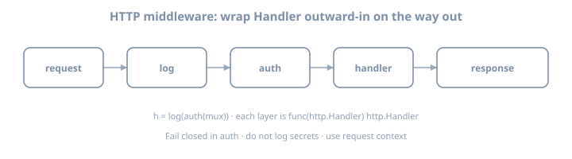

# Day 18 — HTTP Server, Client & Structured Logging


# Day 45 — net/http server

**Stage V · ~3h**  
**Goal:** Build a small JSON HTTP API with Go **1.22+ `ServeMux` method/path patterns**, a middleware chain, and clean handler structure—stdlib only.

{fig-alt="HTTP middleware wrap chain"}

## Why this day exists

`net/http` is the default way Go speaks to the world. Frameworks come and go; `Handler` stays. After Day 44’s sockets, today you operate one layer up:

- `http.Handler` / `HandlerFunc`  
- Routing with modern `ServeMux`  
- Middleware as `func(http.Handler) http.Handler`  
- JSON request/response discipline  

---

## Theory 1 — The Handler interface

```go
type Handler interface {
	ServeHTTP(ResponseWriter, *Request)
}

type HandlerFunc func(ResponseWriter, *Request)

func (f HandlerFunc) ServeHTTP(w ResponseWriter, r *Request) {
	f(w, r)
}
```

Everything is a `Handler`: muxes, middleware, your API.

### ResponseWriter basics

```go
w.Header().Set("Content-Type", "application/json")
w.WriteHeader(http.StatusOK) // first write of status; once only effectively
_, _ = w.Write(body)
```

Headers must be set **before** `WriteHeader` / first `Write`.

---

## Theory 2 — ServeMux patterns (Go 1.22+)

Modern patterns support **methods** and **wildcards**:

```go
mux := http.NewServeMux()
mux.HandleFunc("GET /healthz", health)
mux.HandleFunc("GET /items/{id}", getItem)
mux.HandleFunc("POST /items", createItem)
mux.HandleFunc("GET /files/{path...}", getFile) // trailing wildcard
```

Extract path values:

```go
id := r.PathValue("id")
```

### Matching notes

- More specific patterns win over less specific.  
- `"GET /x"` does not match `POST /x`.  
- Host-specific patterns exist (`"GET example.com/x"`)—rarely needed in labs.  
- Legacy patterns without methods still work; prefer method-aware forms for APIs.

::: {.callout-important}
If your local Go is older than 1.22, upgrade to the volume baseline **1.26.x**. Method patterns are required for today’s labs.
:::

---

## Theory 3 — Middleware chain

```go
type Middleware func(http.Handler) http.Handler

func Chain(h http.Handler, mws ...Middleware) http.Handler {
	for i := len(mws) - 1; i >= 0; i-- {
		h = mws[i](h)
	}
	return h
}

func RequestID(next http.Handler) http.Handler {
	return http.HandlerFunc(func(w http.ResponseWriter, r *http.Request) {
		id := r.Header.Get("X-Request-ID")
		if id == "" {
			id = fmt.Sprintf("%d", time.Now().UnixNano())
		}
		w.Header().Set("X-Request-ID", id)
		next.ServeHTTP(w, r)
	})
}

func Recover(next http.Handler) http.Handler {
	return http.HandlerFunc(func(w http.ResponseWriter, r *http.Request) {
		defer func() {
			if rec := recover(); rec != nil {
				http.Error(w, "internal error", http.StatusInternalServerError)
			}
		}()
		next.ServeHTTP(w, r)
	})
}
```

Order matters: recover outermost, then logging, then auth (later days).

---

## Theory 4 — Server struct

```go
srv := &http.Server{
	Addr:              ":8080",
	Handler:           handler,
	ReadHeaderTimeout: 5 * time.Second, // mitigate slowloris
	ReadTimeout:       10 * time.Second,
	WriteTimeout:      20 * time.Second,
	IdleTimeout:       60 * time.Second,
}
err := srv.ListenAndServe()
```

Always set **ReadHeaderTimeout** at minimum in production-shaped code.

Graceful shutdown (deepened on Day 50):

```go
ctx, cancel := context.WithTimeout(context.Background(), 10*time.Second)
defer cancel()
_ = srv.Shutdown(ctx)
```

---

## Theory 5 — JSON helpers

```go
func writeJSON(w http.ResponseWriter, status int, v any) {
	w.Header().Set("Content-Type", "application/json; charset=utf-8")
	w.WriteHeader(status)
	_ = json.NewEncoder(w).Encode(v)
}

func readJSON(r *http.Request, dst any) error {
	defer r.Body.Close()
	dec := json.NewDecoder(io.LimitReader(r.Body, 1<<20))
	dec.DisallowUnknownFields()
	if err := dec.Decode(dst); err != nil {
		return err
	}
	// optional: reject trailing junk
	if err := dec.Decode(&struct{}{}); err != io.EOF {
		return fmt.Errorf("trailing data")
	}
	return nil
}
```

---

## Worked example — items API (in-memory)

```go
package api

import (
	"net/http"
	"sync"
)

type Item struct {
	ID   string `json:"id"`
	Name string `json:"name"`
}

type Server struct {
	mu    sync.RWMutex
	items map[string]Item
	mux   *http.ServeMux
}

func New() *Server {
	s := &Server{items: make(map[string]Item), mux: http.NewServeMux()}
	s.routes()
	return s
}

func (s *Server) Handler() http.Handler {
	return Chain(s.mux, Recover, RequestID, AccessLog)
}

func (s *Server) routes() {
	s.mux.HandleFunc("GET /healthz", s.health)
	s.mux.HandleFunc("GET /items", s.listItems)
	s.mux.HandleFunc("GET /items/{id}", s.getItem)
	s.mux.HandleFunc("POST /items", s.createItem)
}

func (s *Server) health(w http.ResponseWriter, r *http.Request) {
	writeJSON(w, http.StatusOK, map[string]string{"status": "ok"})
}

func (s *Server) getItem(w http.ResponseWriter, r *http.Request) {
	id := r.PathValue("id")
	s.mu.RLock()
	item, ok := s.items[id]
	s.mu.RUnlock()
	if !ok {
		writeJSON(w, http.StatusNotFound, map[string]string{"error": "not found"})
		return
	}
	writeJSON(w, http.StatusOK, item)
}

// listItems, createItem: similar; generate ID with crypto/rand or strconv
```

Implement `AccessLog` middleware logging method, path, status (needs a wrapping `ResponseWriter` that records status code—classic pattern).

```go
type statusWriter struct {
	http.ResponseWriter
	code int
}

func (w *statusWriter) WriteHeader(code int) {
	w.code = code
	w.ResponseWriter.WriteHeader(code)
}
```

---

## Lab 1 — Scaffold

```bash
mkdir -p ~/lab/90daysofx/01-go/day45
cd ~/lab/90daysofx/01-go/day45
go mod init example.com/day45
```

Packages: `api/` handlers, `cmd/itemsd/main.go` server process.

---

## Lab 2 — Routes + middleware

Requirements:

1. `GET /healthz` → `{"status":"ok"}`  
2. `POST /items` JSON body `{"name":"..."}` → `201` + item with id  
3. `GET /items/{id}` → item or 404  
4. `GET /items` → array  
5. Middleware: request ID + recover + basic log  

Manual smoke:

```bash
go run ./cmd/itemsd
curl -s localhost:8080/healthz
curl -s -X POST localhost:8080/items -d '{"name":"widget"}' -H 'Content-Type: application/json'
```

---

## Lab 3 — Validation

Reject empty `name` with `400` and JSON error body. Limit body size. Unknown JSON fields → 400.

---

## Lab 4 — Method mismatch

`POST /healthz` should 405 (ServeMux behavior with method patterns). Confirm with curl; note status.

---

## Lab 5 — Wrap for later tests

Export `New().Handler()` so Day 49 can use `httptest` without listening. Keep state behind mutex for concurrent requests.

---

## Common gotchas

| Gotcha | Fix |
|--------|-----|
| WriteHeader after Write | Set status first path carefully |
| Forgetting Content-Type | Set on JSON responses |
| Shared map without mutex | `sync.RWMutex` |
| Middleware order inverted | Apply in reverse in `Chain` |
| No ReadHeaderTimeout | Set on `http.Server` |
| Using old mux only `/items/` slash tricks | Prefer 1.22 patterns + `PathValue` |
| Returning plaintext errors inconsistently | Always JSON error objects for API |

---

## Checkpoint

- [ ] Method-aware routes work  
- [ ] PathValue extracts `{id}`  
- [ ] Middleware chain applied  
- [ ] JSON create/get/list  
- [ ] Body limit + basic validation  
- [ ] Server timeouts set  

### Commit

```bash
git add .
git commit -m "day45: http server ServeMux 1.22+ JSON API middleware"
```

Write three personal gotchas before continuing.

---

## Tomorrow

**Day 46 — `net/http` client:** timeouts at every layer, transports, context cancellation, and safe body handling.

---


# Day 46 — net/http client

**Stage V · ~3h**  
**Goal:** Build a disciplined HTTP client—timeouts, shared `Transport`, context cancellation, and correct body drain/close—tested with `httptest`.

## Why this day exists

```go
resp, err := http.Get(url) // default client: no timeout
```

is a production footgun. Hung servers stall goroutines; connection pools misbehave if bodies are not drained; every outbound call needs a deadline story.

---

## Theory 1 — Client vs Transport

```go
type Client struct {
	Transport     RoundTripper
	CheckRedirect func(req *Request, via []*Request) error
	Jar           CookieJar
	Timeout       time.Duration // entire request including body read
}
```

| Layer | Controls |
|-------|----------|
| `Client.Timeout` | End-to-end budget (simple blunt tool) |
| `Transport` dial/TLS/header timeouts | Connection establishment |
| `context` on Request | Cancellation / deadline propagation |
| Response body read | Your code must still bound reads |

### Prefer an explicit client

```go
var httpClient = &http.Client{
	Timeout: 10 * time.Second,
	Transport: &http.Transport{
		Proxy:                 http.ProxyFromEnvironment,
		DialContext:           (&net.Dialer{Timeout: 3 * time.Second}).DialContext,
		ForceAttemptHTTP2:     true,
		MaxIdleConns:          100,
		IdleConnTimeout:       90 * time.Second,
		TLSHandshakeTimeout:   5 * time.Second,
		ExpectContinueTimeout: 1 * time.Second,
		ResponseHeaderTimeout: 5 * time.Second,
	},
}
```

Reuse **one** client process-wide so TCP connections pool. Do not `http.Client{}` per request without sharing Transport.

---

## Theory 2 — Context on requests

```go
req, err := http.NewRequestWithContext(ctx, http.MethodGet, url, nil)
req.Header.Set("Accept", "application/json")
resp, err := httpClient.Do(req)
if err != nil {
	return err
}
defer resp.Body.Close()
```

When `ctx` cancels, in-flight request aborts. Combine with `Client.Timeout` carefully—understand which fires first.

---

## Theory 3 — Body discipline

```go
defer resp.Body.Close()
// Always read or drain if you want connection reuse:
defer func() {
	_, _ = io.Copy(io.Discard, io.LimitReader(resp.Body, 1<<20))
}()
```

Or simply `io.ReadAll(io.LimitReader(resp.Body, max))` then close.

Check status before decoding:

```go
if resp.StatusCode != http.StatusOK {
	b, _ := io.ReadAll(io.LimitReader(resp.Body, 4096))
	return fmt.Errorf("unexpected status %d: %s", resp.StatusCode, b)
}
```

---

## Theory 4 — POST JSON

```go
body, err := json.Marshal(payload)
req, err := http.NewRequestWithContext(ctx, http.MethodPost, url, bytes.NewReader(body))
req.Header.Set("Content-Type", "application/json")
resp, err := client.Do(req)
```

For large streams, pass an `io.Reader` that is not fully buffered (pipe/encoder)—Day 39 pipe pattern.

---

## Theory 5 — Redirects and cookies (awareness)

Default client follows up to 10 redirects. Customize `CheckRedirect` to deny or log. Cookie jars are optional; most service-to-service calls are token headers, not cookies.

---

## Worked example — API client

```go
package itemclient

import (
	"bytes"
	"context"
	"encoding/json"
	"fmt"
	"io"
	"net/http"
	"time"
)

type Client struct {
	base   string
	http   *http.Client
}

func New(base string) *Client {
	return &Client{
		base: strings.TrimRight(base, "/"),
		http: &http.Client{
			Timeout: 5 * time.Second,
			Transport: &http.Transport{
				Proxy:               http.ProxyFromEnvironment,
				DialContext:         (&net.Dialer{Timeout: 2 * time.Second}).DialContext,
				TLSHandshakeTimeout: 3 * time.Second,
				ResponseHeaderTimeout: 3 * time.Second,
				MaxIdleConns:        20,
			},
		},
	}
}

type Item struct {
	ID   string `json:"id"`
	Name string `json:"name"`
}

func (c *Client) Create(ctx context.Context, name string) (Item, error) {
	var zero Item
	b, err := json.Marshal(map[string]string{"name": name})
	if err != nil {
		return zero, err
	}
	req, err := http.NewRequestWithContext(ctx, http.MethodPost, c.base+"/items", bytes.NewReader(b))
	if err != nil {
		return zero, err
	}
	req.Header.Set("Content-Type", "application/json")
	resp, err := c.http.Do(req)
	if err != nil {
		return zero, err
	}
	defer resp.Body.Close()
	data, err := io.ReadAll(io.LimitReader(resp.Body, 1<<20))
	if err != nil {
		return zero, err
	}
	if resp.StatusCode != http.StatusCreated && resp.StatusCode != http.StatusOK {
		return zero, fmt.Errorf("create: status %d body %s", resp.StatusCode, data)
	}
	if err := json.Unmarshal(data, &zero); err != nil {
		return zero, err
	}
	return zero, nil
}
```

(Add `Get`, imports for `net`, `strings`.)

---

## Lab 1 — Setup

```bash
mkdir -p ~/lab/90daysofx/01-go/day46
cd ~/lab/90daysofx/01-go/day46
go mod init example.com/day46
```

You may vendor a minimal handler from Day 45 or define a tiny stub server in tests only.

---

## Lab 2 — httptest as upstream

```go
func TestCreate(t *testing.T) {
	ts := httptest.NewServer(http.HandlerFunc(func(w http.ResponseWriter, r *http.Request) {
		if r.Method != http.MethodPost || r.URL.Path != "/items" {
			http.NotFound(w, r)
			return
		}
		w.Header().Set("Content-Type", "application/json")
		w.WriteHeader(http.StatusCreated)
		_, _ = w.Write([]byte(`{"id":"1","name":"x"}`))
	}))
	t.Cleanup(ts.Close)

	c := New(ts.URL)
	item, err := c.Create(context.Background(), "x")
	if err != nil {
		t.Fatal(err)
	}
	if item.ID != "1" {
		t.Fatalf("%+v", item)
	}
}
```

---

## Lab 3 — Timeout test

```go
ts := httptest.NewServer(http.HandlerFunc(func(w http.ResponseWriter, r *http.Request) {
	time.Sleep(2 * time.Second)
}))
// client with Timeout: 200ms → expect error
```

Assert error is non-nil; optionally `errors.Is` / string contains `deadline` or `Timeout`.

---

## Lab 4 — Context cancel

Start a slow server; call with `context.WithCancel`; cancel immediately; assert failure quickly.

---

## Lab 5 — Live optional

If Day 45 server is running, point client at it and create an item. Document `BASE_URL` env.

---

## Common gotchas

| Gotcha | Fix |
|--------|-----|
| Default client no timeout | Custom `http.Client` |
| New client per request | Reuse for pooling |
| Not closing body | `defer resp.Body.Close()` |
| Not draining body | Read/limit/discard |
| Ignoring non-2xx | Check `StatusCode` |
| Infinite redirects | Custom `CheckRedirect` |
| Context only on dial | Use `NewRequestWithContext` |

---

## Checkpoint

- [ ] Shared client with Timeout + Transport dial timeouts  
- [ ] Create/Get methods with limited body reads  
- [ ] httptest tests green  
- [ ] Timeout test proves deadline  
- [ ] Context cancel test proves abort  
- [ ] Can explain Client vs Transport split  

### Commit

```bash
git add .
git commit -m "day46: http client timeouts transport context"
```

Write three personal gotchas before continuing.

---

## Tomorrow

**Day 47 — `log/slog`:** structured logging as the stdlib default—handlers, levels, attributes, and wiring into HTTP middleware.

---


# Day 47 — log/slog

**Stage V · ~3h**  
**Goal:** Replace ad-hoc `fmt`/`log` logging with **`log/slog`**—structured attributes, JSON/text handlers, levels, and request-scoped logging in your HTTP API.

## Why this day exists

Unstructured logs (`fmt.Printf("user %s failed %v", ...)`) fight you in production:

- Hard to query in log systems  
- Inconsistent field names  
- No levels / no sampling hooks  
- Request correlation becomes archaeology  

`log/slog` (stdlib since 1.21) is the modern default: fast enough, structured, replaceable handlers. Day 47 makes it habit for every later HTTP day.

---

## Theory 1 — Logger and records

```go
import "log/slog"

slog.Info("server starting", "addr", addr)
slog.Error("db ping failed", "err", err)
```

Each call becomes a **record**: time, level, message, attributes. Handlers format and write records.

Default logger is convenient; prefer explicit loggers for libraries and tests:

```go
logger := slog.New(slog.NewJSONHandler(os.Stdout, &slog.HandlerOptions{
	Level: slog.LevelInfo,
}))
slog.SetDefault(logger)
```

Libraries should accept `*slog.Logger` (or an interface) rather than calling `slog.Default()` so tests can inject a buffer handler.

### Levels

| Level | Typical use |
|-------|-------------|
| Debug | High-volume diagnostics |
| Info | Normal ops events |
| Warn | Recoverable issues |
| Error | Failures needing attention |

```go
opts := &slog.HandlerOptions{Level: slog.LevelDebug}
```

Dynamic levels: custom `LevelVar` (hot reload of verbosity without restart).

```go
var level slog.LevelVar
level.Set(slog.LevelInfo)
opts := &slog.HandlerOptions{Level: &level}
// later from admin/env: level.Set(slog.LevelDebug)
```

---

## Theory 2 — Attributes and grouping

Prefer typed attributes when building shared helpers; keyvals are fine at call sites:

```go
slog.Info("request",
	slog.String("method", r.Method),
	slog.String("path", r.URL.Path),
	slog.Int("status", status),
	slog.Duration("dur", time.Since(start)),
)
```

Or loosely typed keyvals: `"method", r.Method` (pairs must alternate; a missing value is a footgun).

### With / groups

```go
log := logger.With("service", "items", "env", "dev")
reqLog := log.With(slog.String("request_id", id))
reqLog.Info("handled")

logger.WithGroup("http").Info("done", "status", 200)
// JSON: {"http":{"status":200}, ...}
```

`With` creates a child logger that always emits the attached attrs—ideal for request-scoped fields.

---

## Theory 3 — Handlers

| Handler | Output |
|---------|--------|
| `NewTextHandler` | Human key=value |
| `NewJSONHandler` | Machine JSON lines |
| Custom `Handler` | Redaction, sampling, OpenTelemetry bridge |

```go
func newLogger(jsonOut bool, w io.Writer, level slog.Level) *slog.Logger {
	opts := &slog.HandlerOptions{
		Level:     level,
		AddSource: false, // true in dev if you want file:line
	}
	var h slog.Handler
	if jsonOut {
		h = slog.NewJSONHandler(w, opts)
	} else {
		h = slog.NewTextHandler(w, opts)
	}
	return slog.New(h)
}
```

**ReplaceDefault** only at process edge (`main`). Mid-request `SetDefault` races and confuses tests.

### ReplaceAttr (redaction sketch)

```go
opts := &slog.HandlerOptions{
	Level: slog.LevelInfo,
	ReplaceAttr: func(groups []string, a slog.Attr) slog.Attr {
		if a.Key == "authorization" || a.Key == "password" {
			return slog.String(a.Key, "[REDACTED]")
		}
		return a
	},
}
```

---

## Theory 4 — Errors and context

```go
if err != nil {
	logger.Error("create item", "err", err)
}
```

`slog` will format `error` values usefully. For wrapped errors, `%+v` stack dumps are not slog’s job—log `err` plus stable codes separately. Keep client-facing codes out of the “mystery string only” trap (Day 55).

### Context carriers (pattern)

stdlib does not force context logging, but you can:

```go
type ctxKey struct{}

func WithLogger(ctx context.Context, l *slog.Logger) context.Context {
	return context.WithValue(ctx, ctxKey{}, l)
}

func FromContext(ctx context.Context) *slog.Logger {
	if l, ok := ctx.Value(ctxKey{}).(*slog.Logger); ok && l != nil {
		return l
	}
	return slog.Default()
}
```

Middleware injects a request-scoped logger with `request_id`. Handlers call `FromContext(r.Context())`—never invent a second correlation scheme mid-handler.

---

## Theory 5 — What not to log

- Passwords, tokens, session IDs (or truncate/hash)  
- Full request bodies with PII  
- High-cardinality unbounded strings as **field keys** (keys should be stable)  
- Entire config dumps containing secrets  

Cardinality belongs in values carefully; metrics explode on unbounded label keys—same intuition for some log backends. Prefer stable keys: `user_id`, not dynamic key names.

---

## Theory 6 — slog vs log vs fmt

| API | Role in 2026 services |
|-----|------------------------|
| `fmt` | User-facing CLI output, one-off scripts |
| `log` | Legacy; avoid new code |
| `log/slog` | Default for services and libraries |

Bridge old code with `slog.NewLogLogger(handler, level)` only when a dependency demands `*log.Logger`.

---

## Worked example — HTTP access middleware

```go
type statusWriter struct {
	http.ResponseWriter
	code int
}

func (w *statusWriter) WriteHeader(statusCode int) {
	w.code = statusCode
	w.ResponseWriter.WriteHeader(statusCode)
}

func SlogAccess(log *slog.Logger) func(http.Handler) http.Handler {
	return func(next http.Handler) http.Handler {
		return http.HandlerFunc(func(w http.ResponseWriter, r *http.Request) {
			start := time.Now()
			id := r.Header.Get("X-Request-ID")
			if id == "" {
				id = fmt.Sprintf("%d", start.UnixNano())
			}
			ww := &statusWriter{ResponseWriter: w, code: http.StatusOK}
			reqLog := log.With(
				"request_id", id,
				"method", r.Method,
				"path", r.URL.Path,
			)
			ctx := WithLogger(r.Context(), reqLog)
			w.Header().Set("X-Request-ID", id)
			next.ServeHTTP(ww, r.WithContext(ctx))
			reqLog.Info("request completed",
				"status", ww.code,
				"dur_ms", time.Since(start).Milliseconds(),
			)
		})
	}
}
```

Handlers:

```go
func (s *Server) createItem(w http.ResponseWriter, r *http.Request) {
	log := FromContext(r.Context())
	// ... create ...
	log.Info("item created", "id", item.ID)
}
```

---

## Worked example — main wiring (Go 1.26)

```go
func main() {
	jsonLogs := flag.Bool("json-log", false, "emit JSON logs")
	levelStr := flag.String("log-level", "info", "debug|info|warn|error")
	flag.Parse()

	var level slog.Level
	if err := level.UnmarshalText([]byte(*levelStr)); err != nil {
		fmt.Fprintf(os.Stderr, "bad log-level: %v\n", err)
		os.Exit(2)
	}
	log := newLogger(*jsonLogs, os.Stdout, level)
	slog.SetDefault(log)

	mux := http.NewServeMux()
	// register routes...
	handler := SlogAccess(log)(mux)
	log.Info("listening", "addr", ":8080")
	log.Error("server exit", "err", http.ListenAndServe(":8080", handler))
}
```

---

## Lab 1 — Wire slog into Day 45 shape

```bash
mkdir -p ~/lab/90daysofx/01-go/day47
cd ~/lab/90daysofx/01-go/day47
go mod init example.com/day47
```

Copy or reimplement a minimal API (health + one CRUD path). Flags:

```text
-json-log
-log-level=debug|info|warn|error
```

Prove both text and JSON modes start cleanly.

---

## Lab 2 — Prove structure

Run server with JSON logs; `curl` a few endpoints; show one log line is valid JSON with `method`, `path`, `status`, `request_id`.

```bash
go run ./cmd/itemsd -json-log=true 2>&1 | head
# other terminal
curl -s -H 'X-Request-ID: lab-1' localhost:8080/healthz
```

Paste one pretty-printed line into your journal.

---

## Lab 3 — Test handler with slog

Capture logs in tests:

```go
func TestAccessLog(t *testing.T) {
	var buf bytes.Buffer
	log := slog.New(slog.NewJSONHandler(&buf, &slog.HandlerOptions{Level: slog.LevelInfo}))
	h := SlogAccess(log)(http.HandlerFunc(func(w http.ResponseWriter, r *http.Request) {
		w.WriteHeader(http.StatusNoContent)
	}))
	req := httptest.NewRequest(http.MethodGet, "/x", nil)
	rec := httptest.NewRecorder()
	h.ServeHTTP(rec, req)
	if !strings.Contains(buf.String(), `"status":204`) {
		t.Fatalf("logs=%s", buf.String())
	}
}
```

---

## Lab 4 — Level filtering

With level=Info, `log.Debug("x")` must not appear. Toggle `LevelVar` in a test:

```go
var lv slog.LevelVar
lv.Set(slog.LevelInfo)
log := slog.New(slog.NewTextHandler(&buf, &slog.HandlerOptions{Level: &lv}))
log.Debug("hidden")
log.Info("visible")
// assert buf has visible, not hidden
lv.Set(slog.LevelDebug)
log.Debug("now visible")
```

---

## Lab 5 — Error attribute consistency

Always use key `"err"` for errors (team convention). Document in README. Grep handlers for `fmt.Println` / `log.Println` and remove them. Add one intentional `Error` log when create fails validation or store error.

---

## Common gotchas

| Gotcha | Fix |
|--------|-----|
| Logging huge structs | Select fields |
| Unstable keys | Fixed vocabulary |
| Default logger in libraries | Accept `*slog.Logger` param |
| Secrets in logs | Redact / careful fields |
| Using `log` and `slog` mixed | Standardize on slog |
| Forgetting request association | With + context |
| Odd-length keyvals | Use typed attrs or lint carefully |
| `SetDefault` in tests without restore | Inject logger; avoid global when testing |

---

## Checkpoint

- [ ] JSON and text handlers switchable  
- [ ] Access log middleware emits structured fields  
- [ ] Request-scoped logger via context  
- [ ] Level filtering demonstrated  
- [ ] No secrets in log lines  
- [ ] Tests capture and assert log output  

### Commit

```bash
git add .
git commit -m "day47: slog structured logging in HTTP API"
```

Write three personal gotchas before continuing.

---

## Tomorrow

**Day 48 — templates & regexp:** `text/template` vs `html/template`, compile-once regexp, and one real text-processing task.
