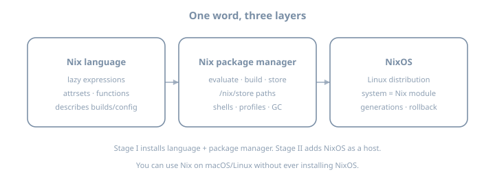
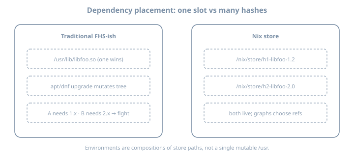

# Day 1 — Lab Setup, Why Nix, Store & Language Basics


# Lab 0 — Overview: roles before Day 1

**Before Day 1.** Do **not** skip this if you will follow the full journey on real hardware. The curriculum assumes you can **break and rebuild** machines without fear. That only works if lab roles are clear.

## Why a lab host exists

NixOS learning fails when:

- The only machine is your daily driver and every `nixos-rebuild` is scary  
- Disk fills because `/nix/store` and VM images share a tiny root  
- Nested “VM inside VM inside laptop on battery” becomes the whole evening  

A **single spare machine** (your case: HP Elitebook 2570p · 16 GB RAM) is enough for the entire path—if you treat it as a **lab server**, not a casual browser laptop.

## Philosophy: host is not an appliance

Homelab hypervisors like Proxmox are excellent—and often **GUI-first**. You *can* automate them (CLI, API, Terraform, Ansible), but day-to-day debugging still tempts **one-off imperative fixes** that never return to git. That drift is annoying for humans and messy if an agent runs dozens of shell “fixes” that leave the machine unreproducible.

This curriculum optimizes for a different contract, in the spirit of operators who moved **Proxmox → NixOS + Incus** (see [Bas Nijholt, *I’ve gone full Nix*](https://www.nijho.lt/post/proxmox-to-nixos/)):

| Idea | What it means for Lab 0 |
|------|-------------------------|
| **Git is the source of truth** | Host networking quirks, hypervisor packages, firewall ports live in the flake—not only in shell history |
| **Host is fully yours** | NixOS-as-host is not a locked appliance: you *may* run tools on metal, but **journey breakage stays in guests** |
| **CLI-first ops** | Prefer `virsh` / `incus` / `nixos-rebuild` over click-only workflows so every step is copy-pasteable |
| **Simulate before bare metal** | Prove a config in a VM that mirrors the host role *before* you reinstall the Elitebook |
| **Hardware fixes are modules** | NIC offload bugs, firmware flags, microcode → commented Nix + systemd, not “I ran ethtool once in 2019” |

Proxmox remains fine software. For **this** guide we default to **NixOS on metal** so one language describes host + guests.

## Three roles (do not collapse them)

| Role | What it is | Mutability |
|------|------------|------------|
| **Lab host (hypervisor)** | Metal OS: KVM/libvirt and/or **Incus**, storage, networking, maybe Podman | Stable; rare rebuilds; **fully declarative** |
| **Journey guest(s)** | NixOS VMs (or Incus VMs) you rebuild, break, roll back (Days 11+) | **Disposable** |
| **Dev environment** | Where you edit flakes, run `nix` CLI, commit git | Stable tools; can be host *or* a dedicated VM |

{fig-alt="Physical host with KVM VMs and containers for NixOS lab"}

## Chapters in this section

| Chapter | Purpose |
|---------|---------|
| **[Lab 0A — Journey single-server](#lab-0a)** | One metal box: **libvirt and/or Incus**, containers, storage, simulate-before-metal |
| **[Lab 0B — NixOS dev machine](#lab-0b)** | Editor, flakes, SSH, caches, drift discipline |
| **[Lab 0C — Elitebook 2570p profile](#lab-0c)** | Concrete RAM/CPU/disk/BIOS plan for **your** spare HP |
| **[Lab 0D — Ops cheatsheet](#lab-0d)** | Daily commands |

You can run **0A and 0B on the same laptop** (recommended for 16 GB): host = stable NixOS with hypervisor; guests = journey; host also has Nix + editor for flakes.

## Recommended topology for this curriculum

```text
Elitebook 2570p (16 GB)
├── Host OS (NixOS 26.05 preferred)     ← fully yours; flake-managed
│   ├── Hypervisor (pick one primary)
│   │   ├── libvirt/KVM  (default for this guide)
│   │   └── and/or Incus (CLI-first VMs + system containers; optional)
│   │       ├── nixlab     4–6 GB   ← primary journey machine
│   │       ├── deploy-a   2 GB     ← deploy-rs / Colmena target
│   │       └── (optional builder)  on demand
│   ├── Podman (rootless)             ← OCI days
│   ├── ~/src/nix-config              ← git = source of truth
│   └── optional: Attic/Cachix
└── Do NOT: run k3s multi-node + desktop + 3 heavy VMs all day
```

## Decision: host OS

| Host choice | Pros | Cons |
|-------------|------|------|
| **NixOS host** | One mental model; host reclaimable via generations; great for Lab 0B | Early days need care not to smash host |
| **Debian/Ubuntu host** | Familiar if you are not ready | Two worlds (apt host + NixOS guests); more drift risk |

**Expert default:** **NixOS as host** with strong separation—host flake boring and pinned; guests are the playground.

### Hypervisor choice (libvirt vs Incus)

| Stack | Strength | Use when |
|-------|----------|----------|
| **libvirt + virt-manager** | Familiar, great snapshots, virt-install simple | **Default** for this curriculum on 16 GB |
| **Incus** (LXD community fork) | CLI-first VMs + system containers; strong for pets + automation | After host is solid, if you want one CLI surface |
| Both | Possible but heavy | Avoid on Elitebook unless you know why |

Lab 0A documents **libvirt fully** and **Incus as an optional path** (aligned with Proxmox→NixOS+Incus style migrations).

## What “ready for Day 1” means

- [ ] Spare machine boots reliably; disk has free space (see Lab 0C)  
- [ ] Virtualization enabled in BIOS; at least one NixOS VM can boot  
- [ ] You can SSH into the VM from the host (or use console)  
- [ ] You know which disk/VM you are allowed to wipe  
- [ ] Dev tools path chosen (Lab 0B): editor + `nix` + git on host or dev VM  
- [ ] Host (and guest) config lives in **git**, not only live state  

## Time budget

| Task | Estimate |
|------|----------|
| BIOS + disk + host install | 2–4 h |
| KVM/Incus + first guest | 1–2 h |
| Dev tooling (Lab 0B) | 1–2 h |
| Elitebook tuning (Lab 0C) | 30–60 min |

Do this **once** before Day 1; revisit when Stage II and Stage VI need second VMs.

## Further reading

- [I’ve gone full Nix: Proxmox to NixOS + Incus](https://www.nijho.lt/post/proxmox-to-nixos/) — Bas Nijholt (why declarative host + Incus; simulate-before-metal; hardware quirks in git)

## Next

→ **[Lab 0A — Journey single-server](#lab-0a)**  

---


# Lab 0A — Journey single-server (KVM + containers) {#lab-0a}

**Goal:** Turn **one physical machine** into a lab server that can run the entire Nix & NixOS journey: disposable NixOS VMs under **KVM/libvirt** (default) or **Incus** (optional CLI-first path), light **containers**, enough disk for `/nix` and disk images, and a network layout that makes deploy-rs/Colmena feel real.

**Audience:** anyone on a single spare box (including HP Elitebook 2570p · 16 GB—see Lab 0C).

::: {.callout-note}
Several operational ideas below are aligned with [Bas Nijholt’s write-up of leaving Proxmox for NixOS + Incus](https://www.nijho.lt/post/proxmox-to-nixos/) (2025–2026): git as source of truth, CLI-first hypervisor ops, simulate host configs in VMs before reinstalling metal, and capturing hardware quirks as Nix—not shell history. Proxmox itself remains fine software; the point is **reproducible host state**, not “GUI bad.”
:::

## What this lab optimizes for

| Curriculum need | Lab feature |
|-----------------|-------------|
| Days 1–10 Nix on host or VM | `nix` available; flakes on |
| Days 11–22 break/rebuild NixOS | **VM snapshots** + generations |
| Days 33–44 services | One primary guest with RAM for DB/proxy |
| Days 57–70 deploy / multi-host | Second small VM on same lab network |
| Containers days | Podman and/or Incus system containers |
| Capstone wipe/rebuild | Guest disks you can delete without guilt |
| Host recoverability | Host flake + generations; optional “simulate host in VM” first |

## Architecture

```text
                    ┌─────────────────────────────────────┐
                    │  libvirt default or lab bridge        │
                    │  192.168.122.0/24 (example NAT)       │
                    └─────────────────────────────────────┘
                           │              │
              ┌────────────┘              └────────────┐
              ▼                                        ▼
     ┌─────────────────┐                    ┌─────────────────┐
     │ nixlab          │  ssh               │ deploy-a        │
     │ 4–6G RAM        │ ─────────────────► │ 2G RAM          │
     │ journey primary │                    │ deploy target   │
     └─────────────────┘                    └─────────────────┘
              ▲
              │ edit flakes from host
     ┌─────────────────┐
     │ host (metal)    │
     │ KVM · git · nix │
     └─────────────────┘
```

**NAT is enough** for the journey. Bridge to LAN only if you need LAN access from VMs and understand your network.

## Part 1 — Host OS install (metal)

### Option H1 (recommended): NixOS host

1. Backup anything on the Elitebook you still care about.  
2. Install **NixOS 26.05** minimal or graphical ISO on metal.  
3. Use **whole-disk** install on internal drive (or external SSD if you want zero risk to another OS).  
4. Enable flakes from first config (Lab 0B expands this).  

Minimal host modules (concept)—**all of this belongs in git**, including later hardware quirks:

```nix
{
  virtualisation.libvirtd.enable = true;
  virtualisation.libvirtd.qemu = {
    package = pkgs.qemu_kvm;
    swtpm.enable = true; # optional
  };
  programs.virt-manager.enable = true; # GUI optional; CLI remains primary
  users.users.YOU.extraGroups = [ "libvirtd" "kvm" "wheel" ];
  networking.firewall.allowedTCPPorts = [ 22 ];
  services.openssh.enable = true;

  # Disk: leave large room for /var/lib/libvirt and /nix
  nix.settings.experimental-features = [ "nix-command" "flakes" ];

  # Example pattern: document WHY a host tweak exists (see Part 9)
  # systemd.services.fix-nic-offload = { ... };
}
```

**Host is not a locked appliance.** Unlike “don’t touch the hypervisor OS” products, NixOS-as-host *allows* you to run tools on metal (editor, caches, even a media app). Still: **curriculum breakage stays in guests.** If you change the host, change the **flake**, not only a live command.

### Option H2: Debian/Ubuntu host

```bash
sudo apt update
sudo apt install -y qemu-kvm libvirt-daemon-system libvirt-clients \
  bridge-utils virt-manager
sudo usermod -aG libvirt,kvm "$USER"
# log out/in
virsh list --all
```

Install **Nix multi-user** on the host for Lab 0B (editing flakes without only working inside guests):

```bash
# official installer — follow nixos.org/download
nix --version
```

## Part 2 — Storage plan (critical on 16 GB RAM laptops)

RAM is fine; **disk** is usually the failure mode.

| Path | Role | Guidance |
|------|------|----------|
| `/nix` | Host store (if NixOS/Nix on host) | 40–80+ GB free if possible |
| `/var/lib/libvirt/images` | VM disks | 40–100 GB free |
| `~/src` | Flake git repos | SSD strongly preferred |

### If the Elitebook still has a spinning HDD

- Prefer a **used SATA SSD** (even 256–512 GB) before investing more evenings.  
- Or use **external USB3 SSD** for libvirt images + large store (acceptable for lab).  

### Thin provision

Use `qcow2` with modest virtual size (e.g. 32–40 GB per guest) so you do not preallocate everything.

## Part 3 — KVM: create journey VMs

### Resource template (16 GB host)

| VM | vCPU | RAM | Disk | Purpose |
|----|------|-----|------|---------|
| **nixlab** | 2 | **4096–6144** MiB | 32–40 G | Main curriculum |
| **deploy-a** | 1–2 | **2048** MiB | 20–25 G | Remote deploy target |
| builder (optional) | 2 | 2048 | 20 G | Offload builds (Stage V+) |

Leave **≥4 GB** for the host if you run a graphical desktop on metal.

### Example: `virt-install` (adjust ISO path)

```bash
# Download NixOS 26.05 minimal ISO to ~/iso/
ISO=~/iso/nixos-minimal-26.05-x86_64-linux.iso

virt-install \
  --name nixlab \
  --memory 4096 \
  --vcpus 2 \
  --disk path=/var/lib/libvirt/images/nixlab.qcow2,size=40,format=qcow2 \
  --cdrom "$ISO" \
  --os-variant nixos-unknown \
  --network network=default \
  --graphics spice \
  --noautoconsole
```

Use `virt-manager` GUI if you prefer.

### Snapshots = courage

Before risky Stage II/IV experiments:

```bash
virsh snapshot-create-as nixlab pre-stage-II "clean before break"
# restore:
# virsh snapshot-revert nixlab pre-stage-II
```

Also learn **NixOS generations** inside the guest—both matter.

### Networking for “remote” deploy

On the host:

```bash
virsh net-dhcp-leases default
# note nixlab and deploy-a IPs
ssh YOU@192.168.122.XX
```

Put stable hostnames in host `/etc/hosts` or libvirt network XML if you get tired of changing IPs.

## Part 4 — Containers (Podman)

Use containers for **OCI days**, not as a substitute for learning NixOS modules.

**On host (NixOS):**

```nix
virtualisation.podman.enable = true;
virtualisation.containers.enable = true;
```

**Rootless Podman** preferred for daily experiments.

```bash
podman run --rm -it docker.io/library/alpine:latest uname -a
```

When the curriculum says “declarative OCI on NixOS,” prefer defining that **inside `nixlab`**, so the journey guest remains the system under study.

Many operators eventually run **Compose-style “pets”** inside a VM while the **host** stays pure NixOS. That split (declarative host + stateful guest workloads) is valid later; early stages should still teach **NixOS modules** before outsourcing everything to containers.

## Part 4b — Optional hypervisor: Incus (CLI-first VMs + system containers)

[Incus](https://linuxcontainers.org/incus/) (community fork of LXD) is a strong fit when you want **one CLI** for VMs and system containers, and when you care about agentic/automation workflows that hate opaque UIs. It is **optional** for this curriculum; libvirt remains the default on 16 GB laptops.

### When to consider Incus on the lab host

| Choose Incus if… | Prefer libvirt if… |
|------------------|--------------------|
| You want `incus launch` / profiles as daily API | You already know virt-manager and want fastest start |
| You may import Proxmox LXC/VM images later | You only need 1–2 simple NixOS guests |
| You like image profiles + clean CLI | You want minimal host packages |

**Do not run full Incus + full libvirt stacks + desktop + heavy VMs** on the Elitebook without a reason—pick a **primary**.

### NixOS host sketch (Incus)

```nix
{
  virtualisation.incus.enable = true;
  # networking: follow current nixpkgs Incus docs for bridge (incusbr0) vs custom
  users.users.YOU.extraGroups = [ "incus-admin" ]; # group name may vary by package
  networking.firewall.trustedInterfaces = [ "incusbr0" ]; # only if you use default bridge
}
```

Verify against **nixpkgs 26.05** option names (`man configuration.nix` / search.nixos.org)—Incus module knobs evolve.

```bash
incus admin init   # first-time interactive; then encode stable choices into docs/flake notes
incus list
# VM example (image names change — use `incus image list images:`):
# incus launch images:nixos/unstable nixlab --vm -c limits.memory=4GiB
```

### Simulate the **host** before you reinstall metal

Powerful idea from the Proxmox→NixOS migration write-up: run an Incus (or libvirt) VM that imports **almost the same modules** as the physical host, with a small **overrides** file (disk device names, interface names, disable real-metal-only services).

```text
modules/host-common.nix     ← ssh, libvirt/incus, users, nix settings
hosts/elitebook.nix         ← real hardware-configuration + product
hosts/elitebook-sim.nix     ← imports common + overrides (virtio NICs, qcow root)
```

Workflow:

1. Get `elitebook-sim` healthy in a VM.  
2. Only then install/reinstall the physical Elitebook from the same flake.  
3. Keep `incus-overrides.nix`-style diffs tiny and commented.  

This removes “nuking the only lab machine” fear—especially valuable once the host itself is NixOS.

### If you already run Proxmox

You do **not** need to migrate mid-curriculum. If you later consolidate:

| Workload | Typical move |
|----------|----------------|
| Proxmox LXC | `vzdump` → import into Incus (community scripts exist; treat as advanced) |
| Proxmox VM disk | `qemu-img convert` → qcow2 → Incus or libvirt import |
| NixOS journey guests | Prefer **fresh** NixOS VMs for learning; migrate pets only |

Keep migration notes in your flake repo (inventory of CT/VM IDs, disk backends). Optional reading: migration notes linked from [the same article’s references](https://www.nijho.lt/post/proxmox-to-nixos/).

## Part 5 — Nested virtualization?

Elitebook Ivy Bridge: **VT-x** yes (enable in BIOS). Nested KVM (VM inside VM) is **optional** and often slow on this generation.

| Need nested? | When |
|--------------|------|
| No | Default path: guests are the NixOS systems under test |
| Maybe | You insist on running libvirt *inside* nixlab |

Recommendation: **do not** nest until you have a specific reason.

## Part 6 — Services the host should run (boring is good)

| Service | Why |
|---------|-----|
| `sshd` | Access from your main laptop if Elitebook is headless-ish |
| `libvirtd` and/or `incus` | Hypervisor |
| `chrony`/`systemd-timesyncd` | TLS and logs make sense |
| Optional `cockpit` / virt-manager | GUI if local—still commit CLI equivalents |

Do **not** turn the host into the Stage IV app zoo. Guests carry curriculum apps.  
(Exception later: a *deliberate* host service that is in the flake—e.g. a binary cache—never “I apt installed it at 2am.”)

## Part 7 — Daily workflow for the journey

```text
1. Open host terminal / editor on ~/src/nix-config
2. Edit flake modules for nixlab / deploy-a  (and host/ only when intentional)
3. Prefer: nix build / nixos-rebuild build-vm / --target-host
4. Apply inside guest; avoid unexplained one-off guest shell config
5. Snapshot before scary changes
6. Commit flake.lock + config  ← if it isn’t in git, it didn’t happen
```

Alternative: `nixos-rebuild --target-host` / deploy-rs from host into guests (Stage VI).

### Debugging without drift

When something breaks, the order is:

1. Reproduce  
2. Fix in **Nix** (or Incus profile / cloud-init you track)  
3. `switch` / redeploy  
4. Commit with a comment that cites *why* (forum link, hardware quirk)  

Avoid: fix live → forget → six months of mystery. That is the same class of failure as “checkbox in a web UI three years ago.”

## Part 8 — Declarative hardware quirks (host flake)

Older Intel NICs and laptops often need one-line kernel/driver workarounds. Example pattern (adapt; **do not** copy blindly):

```nix
# hosts/elitebook/networking.nix — illustrative
{
  # Document: link to bug/forum in a comment above the service.
  systemd.services.disable-nic-offload = {
    description = "Disable problematic NIC offloads on this hardware";
    wantedBy = [ "multi-user.target" ];
    after = [ "network-pre.target" ];
    serviceConfig.Type = "oneshot";
    serviceConfig.RemainAfterExit = true;
    script = ''
      # Example only — identify YOUR interface with `ip link`
      # ethtool -K enp0s25 tso off gso off gro off || true
    '';
    path = [ pkgs.ethtool ];
  };
}
```

On the Elitebook, when WiFi/Ethernet misbehaves: capture the fix **here**, not only in a successful interactive shell. Same for microcode, `boot.kernelParams`, and firmware.

## Part 9 — Failure modes checklist

| Symptom | Fix |
|---------|-----|
| VMs won’t start | BIOS VT-x; user in `libvirtd`/`kvm` / `incus-admin` groups |
| Host OOM killer | Lower guest RAM; shut deploy-a when idle |
| Disk full | GC carefully; delete old snapshots; move images to external SSD |
| Nested rebuild hell | You nested by accident—flatten topology |
| WiFi-only flaky SSH | Prefer Ethernet dock/USB ethernet for lab sessions |
| “Works after I typed stuff” unreproducible | Re-apply from flake; delete untracked live changes |
| Incus + libvirt both fighting bridges | Pick one primary network stack |

## Checkpoint — Lab 0A complete

- [ ] Host installed and updated; **host flake** exists in git  
- [ ] `virsh list --all` **or** `incus list` works (primary stack chosen)  
- [ ] **nixlab** VM created (ISO install can finish on Day 11 if needed)  
- [ ] Snapshot (libvirt) or publish/restore strategy (Incus) tested once  
- [ ] Optional: host-sim VM validates host modules before metal reinstall  
- [ ] Podman (or Incus container) smoke test optional  
- [ ] Written note: IPs/hostnames of guests  
- [ ] Know wipe boundary: **guests + lab disks**; host only via generations + git  
- [ ] At least one hardware or network quirk documented **in Nix** if you hit it  

## Next

→ **[Lab 0B — NixOS dev machine](#lab-0b)** (tooling on this same host)  
→ **[Lab 0C — Elitebook 2570p](#lab-0c)** (your hardware numbers)  
  

---


# Lab 0B — NixOS development machine {#lab-0b}

**Goal:** Configure a **comfortable, stable** environment for writing flakes, reviewing nixpkgs, running builds, and pushing configs to lab VMs—without turning your editor session into the system under test.

On a single Elitebook, **Lab 0B usually lives on the host** (same metal as Lab 0A). The split is **role**, not necessarily second hardware.

::: {.callout-tip}
Text-first infrastructure (flakes, modules, `virsh`/`incus` CLI) is also what makes **human + AI** co-maintenance safe: agents can read and propose diffs against git. GUI-only state and untracked shell fixes cannot. Keep Lab 0B disciplined: **if it matters, it is in the repo.**
:::

## Dev machine vs journey guest

| | Dev (this lab) | Journey guest (`nixlab`) |
|--|----------------|---------------------------|
| Purpose | Author configs, run `nix` tools | Be the OS you break |
| Rebuild frequency | Low | High |
| Secrets | Your age keys, git ssh | Lab secrets only |
| Editor | Yes | Optional |
| “Does this need to be pretty?” | Yes (you live here) | No |

## Part 1 — Install Nix (if host is not NixOS)

Multi-user install; enable flakes:

```bash
# ~/.config/nix/nix.conf
experimental-features = nix-command flakes
```

On **NixOS host**, put the same under `nix.settings.experimental-features`.

## Part 2 — Essential packages

### NixOS host module sketch

```nix
{ pkgs, ... }: {
  environment.systemPackages = with pkgs; [
    git
    git-lfs
    vim
    neovim
    ripgrep
    fd
    jq
    tree
    htop
    tmux
    direnv
    nix-direnv
    nixfmt-rfc-style   # or nixfmt — pick one and stick to it
    nil                # LSP for Nix
    # optional:
    # vscode / emacs — your preference
  ];

  programs.direnv.enable = true;
  programs.direnv.nix-direnv.enable = true;

  # nice for rebuilds against VMs
  environment.systemPackages = with pkgs; [
    # already have git etc.
  ];
}
```

### Non-NixOS host

```bash
nix profile install nixpkgs#git nixpkgs#neovim nixpkgs#direnv nixpkgs#nix-direnv nixpkgs#nil
```

## Part 3 — Editor + LSP

| Editor | Nix LSP |
|--------|---------|
| Neovim/VS Code | `nil` or `nixd` |
| Emacs | same + envrc |

Minimal checks:

```bash
nil --help   # or nixd
rg "mkOption" ~/src/nix-config -n | head
```

## Part 4 — Git layout for the whole journey

```text
~/src/nix-config/          # or ~/lab/90daysofx/nixos-config
  flake.nix
  flake.lock
  hosts/
    nixlab/
    deploy-a/
  modules/
  homes/                   # from Stage III
  secrets/                 # encrypted only (Stage IV)
  .envrc                   # use flake
  README.md
```

```bash
cd ~/src/nix-config
git init
echo ".direnv" >> .gitignore
echo "result" >> .gitignore
echo "result-*" >> .gitignore
```

`.envrc`:

```bash
use flake
```

```bash
direnv allow
```

## Part 5 — Build ergonomics

### Keep host builds from melting a 2012 laptop

```nix
nix.settings = {
  max-jobs = 2;          # Elitebook: start low
  cores = 2;
  # auto-optimise-store = true; # optional
};
```

### Substituters

Default `cache.nixos.org` is fine. Later stages may add Cachix/Attic—document tokens only in sops, never in world-readable nix.

### Remote / guest as builder (optional, Stage V+)

When `nixlab` is stronger or you want isolation:

```bash
# conceptual — configure nix.buildMachines later in curriculum
```

Early on: **build on host, deploy to guest** is simplest.

## Part 6 — Access to journey VMs

```bash
# ssh config ~/.ssh/config
Host nixlab
  HostName 192.168.122.10
  User YOU
  IdentityFile ~/.ssh/id_ed25519_lab

Host deploy-a
  HostName 192.168.122.11
  User YOU
  IdentityFile ~/.ssh/id_ed25519_lab
```

Generate a **lab-only** key:

```bash
ssh-keygen -t ed25519 -f ~/.ssh/id_ed25519_lab -C "lab-elitebook"
```

Do not reuse your primary GitHub key as the only lab key if you prefer blast-radius control.

## Part 7 — Workflow commands you will live with

```bash
# evaluate / build a guest config from the flake (host)
nix build .#nixosConfigurations.nixlab.config.system.build.toplevel

# apply (from host, once SSH works)
nixos-rebuild switch --flake .#nixlab --target-host YOU@nixlab --use-remote-sudo

# or: ssh and rebuild inside guest
ssh nixlab 'sudo nixos-rebuild switch --flake /path/to/config#nixlab'

# format
nix fmt   # if configured
```

## Part 8 — Home Manager on the **dev** role

Optional but nice on the host:

- Shell (fish/zsh), git, ssh config  
- Keep HM on host **separate** from guest HM experiments  

When Stage III teaches HM, practice on `nixlab` first if you want isolation; port habits back to host later.

## Part 9 — Binary cache & secrets (preview only)

| Later stage | Dev machine prep |
|-------------|------------------|
| sops-nix | Install `sops`, `age`; create age key **backup** offline |
| CI | GitHub/GitLab SSH deploy key for the flake repo |
| Cachix | Account ready; don’t put signing key in git |

Create age key early if you want:

```bash
mkdir -p ~/.config/sops/age
age-keygen -o ~/.config/sops/age/keys.txt
# back up keys.txt to password manager / encrypted USB
```

## Part 10 — Quality of life on old hardware

| Tip | Why |
|-----|-----|
| External monitor + keyboard | 2570p is a server that happens to fold |
| `tmux`/`zellij` | Long builds survive SSH drops |
| Disable heavy desktop effects on host | Free RAM for VMs |
| `nix-store --optimise` occasionally | Disk |
| Don’t run browser + 2 VMs + big compile | Sequentialize |

## Dev machine checklist

- [ ] `nix flake metadata` works in `~/src/nix-config` (even empty flake)  
- [ ] direnv loads a simple `devShell`  
- [ ] Editor can jump/lint Nix files  
- [ ] SSH to `nixlab` (or console) documented  
- [ ] Lab SSH key created; age key backup plan written  
- [ ] `max-jobs`/`cores` set conservatively  
- [ ] `.gitignore` includes `result` and `.direnv`  

## Anti-patterns

| Anti-pattern | Prefer |
|--------------|--------|
| Editing production-like host to “try modules” | Try on `nixlab` (or host-sim VM) |
| One 2k-line `configuration.nix` on host | Layout from Stage III early for guests |
| Storing secrets in world-readable nix | sops/agenix later |
| Building with `max-jobs = auto` until OOM | Cap jobs on Elitebook |
| “YOLO” imperative fix left uncommitted | Encode fix in flake; commit with *why* |
| Relying on virt-manager clicks you cannot replay | Keep a `virt-install` / `incus` snippet in README |

## Next

→ **[Lab 0C — HP Elitebook 2570p profile](#lab-0c)**  
→ Then **[Why Nix exists](#why-nix-exists)**  

---


# Lab 0C — HP Elitebook 2570p · 16 GB RAM lab profile {#lab-0c}

**Concrete profile** for a spare **HP Elitebook 2570p** with **16 GB RAM**, used as the single-server lab for this NixOS volume (Labs 0A + 0B on the same chassis).

::: {.callout-note}
The 2570p is ~2012 Ivy Bridge hardware. It is **excellent** as a quiet lab server for learning NixOS. It is **not** a modern workstation: respect thermals, disk, and CPU age.
:::

## Hardware snapshot (typical 2570p)

| Component | Typical | Lab implication |
|-----------|---------|-----------------|
| CPU | Intel Core i5/i7-3xxxM (Ivy Bridge) | 2 cores / 4 threads class; VT-x yes |
| RAM | Up to 16 GB DDR3 (you have 16 GB) | Comfortable for 1 heavy + 1 light VM |
| GPU | Intel HD 4000 | Fine for console/light desktop host; not GPU passthrough playground |
| Disk | Factory HDD or aftermarket SATA SSD | **SSD strongly recommended** |
| Display | 12.5" | Treat as headless-ish; external monitor helps |
| NIC | Intel wired + WiFi | Prefer **Ethernet** for long SSH sessions |
| Firmware | HP BIOS | Enable Virtualization Technology |

Exact CPU SKU varies (`lscpu` after boot). Confirm:

```bash
lscpu | rg -i 'Model name|Virtualization|CPU\\(s\\)|Thread'
free -h
lsblk
```

## BIOS checklist (do this first)

1. **Virtualization Technology (VTx)** — Enabled  
2. **VT-d** — Enable if present (not required for basic KVM)  
3. Boot mode — UEFI preferred if disk allows; legacy OK for lab  
4. Disable unused boot devices if they slow POST  
5. Set fans/thermal to a sane default; keep vents clear  

Save & reboot.

## Disk strategy for *this* laptop

### Best

| Disk | Use |
|------|-----|
| Internal **SATA SSD** 512 GB+ | Host root + `/nix` + libvirt images |
| Optional USB3 SSD | Overflow images / backups |

### Acceptable

| Disk | Use |
|------|-----|
| Internal SSD 256 GB | Host + one VM; external for second VM images |
| HDD only | Usable but painful; prioritize SSD upgrade |

### Partition sketch (NixOS host, single disk)

```text
ESP          512 MB   FAT32
root         rest     ext4 or btrfs
  /nix                (same FS is fine; optional subvol on btrfs)
```

If dual-booting is tempting: **don’t** for this spare. Dedicate the machine to lab.

## RAM budget (16 GB fixed)

| Consumer | Allocation | Notes |
|----------|------------|--------|
| Host OS + desktop/ssh | **4–5 GB** | Prefer lightweight DE or none |
| **nixlab** VM | **4–6 GB** | Primary journey |
| **deploy-a** VM | **2 GB** | Stop when idle |
| Headroom / browser | **2–3 GB** | Close browser during big builds |
| **Total** | ≤16 GB | Never overcommit hard on this chassis |

### Suggested virsh memory

```bash
# examples
# nixlab:  4096 or 6144 MiB
# deploy-a: 2048 MiB
```

During Stage IV (DB + proxy + observability): prefer **6 GB nixlab** and **powered-off deploy-a** unless needed.

## CPU budget

| Setting | Value |
|---------|--------|
| nixlab vCPUs | 2 |
| deploy-a vCPUs | 1–2 |
| Host `nix.settings.max-jobs` | **1–2** |
| Host `nix.settings.cores` | **2** |

Ivy Bridge will thermal-throttle under sustained compile. That is normal—not a broken Nix.

## What this machine is good for (curriculum map)

| Stage | On 2570p? |
|-------|-----------|
| I Foundations | Yes |
| II One NixOS host (in VM) | Yes |
| III HM + layout | Yes |
| IV Secrets + small services | Yes (watch RAM) |
| V Packaging | Yes (be patient; use caches) |
| VI Deploy two VMs | Yes |
| VI k3s / heavy observability | Optional/light only |
| VII Internals | Yes |
| VIII Capstone | Yes (scope to hardware) |
| Nested libvirt | Avoid |
| Multi-node k8s + desktop | No |

## Networking on the Elitebook

| Mode | Recommendation |
|------|----------------|
| WiFi only | OK for browsing; flaky for long rebuilds |
| USB Ethernet / dock | **Preferred** for lab evenings |
| Bridged VM to LAN | Optional; NAT default is safer |

Port-forwarding example (if you must reach a guest service from another PC): use host SSH tunnel rather than exposing VMs broadly.

```bash
ssh -L 8080:192.168.122.10:80 user@elitebook-host
```

## Power & thermals

- Use **AC power** for builds and VM sessions  
- Elevate rear for airflow if temps high  
- `tlp` / power-profiles: on host, prefer performance when labbing on AC  
- Expect fan noise under `nix build`—plan quiet hours  

## Firmware & drivers notes

| Area | Note |
|------|------|
| WiFi | Prefer `linux-firmware`; some cards need `allowUnfree` for redistributable firmware |
| CPU microcode | `hardware.cpu.intel.updateMicrocode = true;` on NixOS host |
| GPU | Modesetting is enough; no NVIDIA complexity on stock 2570p |
| Fingerprint / WWAN | Ignore for lab |
| Ethernet | Older Intel NICs sometimes need offload disabled (`ethtool -K …`); **put that in the host flake** with a comment (pattern in Lab 0A Part 8), not only in a one-off root shell |

### Host is fully yours (but still a lab)

On appliance hypervisors you are often discouraged from “messing with the host.” On **NixOS host**, you *can* install an editor, run a local cache, or attach a display—and still recover via generations. That does **not** mean the Elitebook should become your Stage IV app zoo. Keep metal useful; keep **journey risk in VMs**.

## Concrete “day zero” procedure (you)

1. **Backup** anything left on the 2570p.  
2. Install **SSD** if still on HDD (worth it).  
3. BIOS: enable VT-x.  
4. *(Optional but wise)* On another machine or live USB workflow: draft `hosts/elitebook-sim.nix` and boot it as a VM first (Lab 0A “simulate host”).  
5. Install **NixOS 26.05** as host (Lab 0A Option H1).  
6. Apply host config from git: libvirt **or** Incus (pick one primary), ssh, flakes, microcode, your user.  
7. Create **nixlab** (4–6 GB) + **deploy-a** (2 GB).  
8. Snapshot blank/fresh installs.  
9. Clone/create `~/src/nix-config` flake (Lab 0B); commit host + guest stubs.  
10. SSH from your daily laptop into Elitebook; from Elitebook into VMs.  
11. Only then start **Day 1**.  

## Optional extras that fit this chassis

| Extra | Why |
|-------|-----|
| Automatic libvirt start | `nixlab` available after host boot |
| External USB SSD labeled `nix-lab` | Images + `nix copy` backups |
| UPS not required | Laptop battery is a mini-UPS for short blips |
| Second-hand 8 GB→16 GB already done | Good—don’t bother 32 GB (max 16 on this platform) |
| Replace thermal paste | Only if throttling is extreme |

## What not to run on the 2570p

- Desktop + gaming + three 8 GB VMs  
- Full Observability stack + k3s + browser on host simultaneously  
- Treating host as wipe-target for Stage II installs (use **nixlab**)  
- Expecting modern Secure Boot/TPM2 demos (Stage VI Secure Boot day may be **document-only** on this hardware)  

For Lanzaboote/TPM chapters: complete theory + skip or use a newer machine if you have one later.

## Elitebook readiness checklist

- [ ] 16 GB confirmed in `free -h`  
- [ ] VT-x enabled; `kvm-ok` or equivalent happy  
- [ ] SSD or external fast disk for images  
- [ ] Host NixOS (or Debian+Nix) installed  
- [ ] libvirt works; **nixlab** defined  
- [ ] RAM split written down and enforced  
- [ ] `max-jobs` ≤ 2  
- [ ] Ethernet or stable WiFi plan  
- [ ] Lab 0A + 0B checklists done  
- [ ] Wipe boundary: guests only  

## After this page

You are ready for **[Why Nix exists](#why-nix-exists)** (continues below in this same Day 1 chapter).

When Day 11 says “install NixOS,” install into **nixlab** (or replace its disk), not by reinstalling the Elitebook host unless you intentionally redesign Lab 0A.  

---


# Lab 0D — Ops cheatsheet (single-server lab) {#lab-0d}

Quick reference while studying. Details live in Labs 0A–0C.

## Daily

```bash
# host — libvirt (default path)
virsh list --all
virsh start nixlab
virsh snapshot-list nixlab

# host — Incus (if that is your primary)
incus list
incus start nixlab
incus info nixlab

# network (libvirt NAT example)
virsh net-dhcp-leases default

# ssh
ssh nixlab
ssh deploy-a
```

## Snapshots / restore points

```bash
# libvirt
virsh snapshot-create-as nixlab "label" "notes"
virsh snapshot-revert nixlab "label"
virsh snapshot-delete nixlab "label"

# Incus (publish image / snapshot features — see `incus snapshot` help for your version)
incus snapshot create nixlab pre-change
incus snapshot restore nixlab pre-change
```

## Disk pressure

```bash
df -h / /nix /var/lib/libvirt/images
nix store gc          # careful: know generations
nix store optimise
du -sh /var/lib/libvirt/images/*
```

## Guest rebuild (from host flake)

```bash
cd ~/src/nix-config
nix build .#nixosConfigurations.nixlab.config.system.build.toplevel
nixos-rebuild switch --flake .#nixlab --target-host USER@nixlab --use-remote-sudo
```

## When the Elitebook sweats

1. Shut down `deploy-a`  
2. Set `max-jobs = 1`  
3. Close browser  
4. Prefer substitutes over local compiles when possible  
5. Pause nested experiments  

## Drift control

```bash
cd ~/src/nix-config
git status          # uncommitted host/guest edits?
git diff
# After a live debug: encode the fix in *.nix, rebuild, then commit
```

## Emergency

| Problem | Action |
|---------|--------|
| Host unresponsive | REISUB if enabled; else hard power; check disk full |
| Guest won’t boot | libvirt/Incus snapshot **or** NixOS generation from boot menu |
| Locked out of guest | virt-manager / `virsh console` / `incus console` |
| Store full | Delete old snapshots; `nix store gc` with eyes open |
| “Fixed it in the shell, lost it on reboot” | That was drift—put it in the flake |

## Inventory template (fill once)

```text
Host hostname: ________
Host IP: ________
nixlab IP: ________
deploy-a IP: ________
Flake path: ________
Lab SSH key: ________
Age key backup: ________
Wipe-allowed disks: ________
```

---


# Day 1 — Why Nix exists {#why-nix-exists}

**Stage I · ~4h (theory-heavy)**  
**Goal:** Separate the three meanings of “Nix,” understand the *problem statement* honestly, install the package manager with **flakes + modern CLI**, and evaluate first expressions in a REPL.

::: {.callout-note}
Today installs **Nix language + package manager**, not NixOS. The OS host arrives in Stage II.
:::

## Why this day exists

People fail Nix for social reasons as much as technical ones: they read a blog that mixes **language**, **CLI**, and **NixOS modules**, then paste commands from three eras of tooling. Theory first reduces that thrash.

---

## Theory 1 — Three faces of the same ecosystem

{fig-alt="Three layers: Nix language, Nix package manager, and NixOS"}

| Layer | Question it answers | You touch it today? |
|-------|---------------------|---------------------|
| **Language** | How do we *describe* packages and configs? | Yes — REPL |
| **Package manager** | How do we *build/store/compose* software? | Yes — install + `nix run` |
| **NixOS** | How do we describe an entire *OS*? | No — later |

### Analogy (imperfect but useful)

| Idea | Rough analogy |
|------|----------------|
| Nix expression | A pure function recipe |
| Derivation | A build plan (inputs → output path) |
| Store path | The baked loaf with a serial number |
| Profile / shell | A lunch tray pointing at selected loaves |
| NixOS system | The whole kitchen layout as code |

Analogies break; the table is orientation, not law.

---

## Theory 2 — Failure modes of traditional systems

### Dependency hell

Classic package managers often assume **one** version of a library in a global prefix (`/usr/lib/...`). Applications A and B that need different versions conflict.

**Example story**

- App A needs `libssl.so.1.1`  
- App B needs `libssl.so.3`  
- Distro upgrade breaks A, or pinning freezes security updates for B  

### Snowflake servers

Imperative drift:

```text
ssh prod
apt install foo
vim /etc/foo.conf
# six months later: nobody knows the full story
```

### Language-level global installs

```bash
pip install --user something
npm install -g other
cargo install another
```

Each ecosystem invents isolation. None composes cleanly with the others or with the OS.

### What “reproducible” can mean (honesty ladder)

| Claim | Strength |
|-------|----------|
| “Same machine rebuilds the same store paths” | Often achievable with locks |
| “Same flake lock on two Linux machines → same paths” | Common with pure fixed-output inputs |
| “Bit-for-bit identical across OS/CPU forever” | Strong; not always true |
| “My *data* is reproducible” | Not Nix’s job unless you design state |

Nix optimizes for **controlled, rebuildable software graphs**. It does not delete ops.

---

## Theory 3 — Nix’s core bet: pure builds + hashed store

{fig-alt="Traditional single library slot versus multiple hashed store paths"}

### Content-addressed intuition

If a build is a function of its inputs, then informally:

> **output path** = *f*(build recipe, input paths, system, …)

In the common **input-addressed** world, the hash reflects the derivation inputs. (Content-addressed derivations are an advanced evolution—Stage VII.)

### Coexistence

```text
/nix/store/hAAAAA-libfoo-1.2.3
/nix/store/hBBBBB-libfoo-2.0.0
```

Both can exist. Package A references `hAAAAA`; package B references `hBBBBB`. No single `/usr/lib/libfoo.so` gladiator match.

### Environments as compositions

A “shell” or “profile” is not a pile of files dumped into `/usr`. It is a **set of store paths** arranged on `PATH`, `LIB`, etc.

**Example mental model**

```text
devShell = { go_1_26, git, hello }
         → PATH entries under those store paths
```

---

## Theory 4 — Evaluation vs realization

{fig-alt="Nix expression evaluation to plan then realization to store paths"}

| Phase | What happens | Failure examples |
|-------|--------------|------------------|
| **Evaluate** | Nix language runs; produces derivation plans | Infinite recursion, missing attr, type errors |
| **Realize** | Build or download outputs into the store | Compile error, hash mismatch, network/cache miss |

### Substituters (binary caches)

If a trusted cache already has the output path, realization becomes **download**, not compile. That is why first `nix run nixpkgs#hello` can be fast *or* slow depending on cache/network.

**Example**

```text
eval:  nixpkgs.hello → derivation → planned out path P
realize: P exists on cache.nixos.org? download : build
```

---

## Theory 5 — Installer shapes and multi-user daemon

| Shape | Idea |
|-------|------|
| **Multi-user + nix-daemon** | Builds run as daemon; shared store; recommended default |
| **Single-user** | Store owned by your user; simpler, less isolation |
| **Determinate installer** | UX wrapper; still Nix—**record that you used it** |

### Why a daemon?

Sandbox builds need privileges to set up namespaces/mounts cleanly. Multi-user installs also protect the store from accidental mutation.

### Config locations (theory)

| File | Role |
|------|------|
| `~/.config/nix/nix.conf` | User Nix settings |
| `/etc/nix/nix.conf` | System-wide (multi-user) |

Experimental features (`nix-command`, `flakes`) must be visible to the Nix that actually runs.

---

## Theory 6 — Flakes as the modern pinning model (preview)

You enable flakes today; deep flake authoring is Day 8+.

| Concept | Meaning |
|---------|---------|
| `flake.nix` | Declarative inputs + outputs |
| `flake.lock` | Pinned revisions/hashes of inputs |
| `nixpkgs#hello` | Indirect flake reference to package `hello` |

**Contrast with channels**

| Channels | Flakes |
|----------|--------|
| Mutable “what is nixpkgs today?” | Lock file pins *exactly* |
| `NIX_PATH` / `<nixpkgs>` | Explicit inputs |
| Easy to drift | Designed for collaboration |

This volume: **flakes default**, channels as literacy only.

---

## Theory 7 — CLI eras (so docs don’t gaslight you)

| Era | Examples | Status in this volume |
|-----|----------|------------------------|
| Classic | `nix-env`, `nix-build`, `nix-shell` | Literacy later (Day 9) |
| Modern | `nix build`, `nix run`, `nix develop`, `nix flake` | **Default** |

Same underlying store; different UX and defaults.

---

## Worked examples (conceptual)

### Example A — “Install” without polluting a global profile

```bash
nix run nixpkgs#hello
```

Runs `hello` from a realized store path without committing to a permanent user profile.

### Example B — Why two machines diverge without locks

```text
Machine A: nixpkgs as of Monday
Machine B: nixpkgs as of Friday
→ different hashes for "hello", different closures
```

Flake locks exist to end that story.

### Example C — What Nix does *not* do

```text
Declarative Postgres service ≠ automatic migration of your prod data
Encrypted secrets in git ≠ “Nix encrypts the store”
```

---

## Lab 1 — Install Nix

Use current docs: [https://nixos.org/download/](https://nixos.org/download/)  
Or Determinate installer if you choose—**write which**.

```bash
# new shell after install
nix --version
```

Disk: leave tens of GB free for later stages.

---

## Lab 2 — Enable modern features

`~/.config/nix/nix.conf`:

```ini
experimental-features = nix-command flakes
```

Verify:

```bash
nix config show | grep -i experimental
nix flake --help | head
```

---

## Lab 3 — First modern commands

```bash
nix search nixpkgs hello | head
nix run nixpkgs#hello
```

### REPL

```bash
nix repl
```

```nix
1 + 1
{ a = 1; b = "x"; }.a
builtins.typeOf { x = 1; }
```

Load nixpkgs when available (`:lf nixpkgs` or version-appropriate equivalent) and inspect `pkgs.hello`.

---

## Lab 4 — Write the model

In your journal, answer without looking up:

1. Language vs PM vs OS—one sentence each  
2. Why two `libfoo` versions can coexist  
3. Eval failure vs build failure—one example each  
4. Which installer you used  

---

## Common gotchas

| Symptom | Theory link |
|---------|-------------|
| `nix` not found | Install/PATH; shell not reloaded |
| experimental feature errors | `nix.conf` not read by that Nix |
| Slow first command | Cold substituter / eval of nixpkgs |
| Permission errors | Single vs multi-user mismatch |
| Old blog uses only `nix-env -i` | Classic era; map later |

---

## Checkpoint

- [ ] Can explain three faces of Nix  
- [ ] Can state two problems Nix targets and two it does not  
- [ ] `nix run nixpkgs#hello` works  
- [ ] Flakes + nix-command enabled  
- [ ] REPL evaluated an attrset  
- [ ] Installer name recorded  

---

## Tomorrow

**Day 2 — Store & closures:** path anatomy, reference graphs, GC roots, and why deleting a project folder does not free the store.

---


# Day 2 — Store & closures

**Stage I · ~4h (theory-heavy)**  
**Goal:** Read `/nix/store` paths as a graph database of software, define **closures** precisely, and explain **GC roots**—with labs that only *observe* (no aggressive GC yet).

## Why this day exists

Every advanced Nix topic—binary caches, deploy, Docker-from-Nix, NixOS activations—is a story about **store paths and references**. Without that theory, later tools feel like superstition.

---

## Theory 1 — The store is the database

The directory `/nix/store` is not a random cache folder. It is the **authoritative object store** for:

- Package outputs  
- Derivation files (`.drv`)  
- Fixed-output download results  
- Sometimes source mirrors  

### Invariants (practical)

| Invariant | Meaning |
|-----------|---------|
| Paths are immutable | You do not `vim` a store path to “fix prod” |
| Names include hashes | Collision-resistant identity |
| References are explicit | Runtime deps encoded as string refs inside outputs |
| Mutation is via new paths | “Upgrade” means new hash, not overwrite |

Hand-editing the store voids the model (and often permissions prevent it).

---

## Theory 2 — Path anatomy

{fig-alt="Diagram of /nix/store hash and name components"}

```text
/nix/store/<hash>-<name>-<version>
     │        │       │
     │        │       └─ convenience label (not trust)
     │        └─ cryptographic fingerprint of inputs (typical case)
     └─ global namespace of this Nix installation
```

### Examples (illustrative shapes)

```text
/nix/store/abc…-hello-2.12.1
/nix/store/def…-glibc-2.40-36
/nix/store/ghi…-bash-5.2-p37
```

**Theory punchline:** two paths with the same pretty name and different hashes are **different objects**. Tools that only show names are lying by omission.

### Input-addressed vs content-addressed (awareness)

| Model | Hash depends on | Note |
|-------|-----------------|------|
| Input-addressed (classic default) | Build inputs / derivation | Rebuild if inputs change |
| Content-addressed (experimental/advanced) | Output content | Same bytes → same hash potential |

You will live mostly in input-addressed land until Stage VII.

---

## Theory 3 — References and the closure

{fig-alt="hello package referencing libraries forming a closure"}

### Direct references

A store path’s **references** are other store paths it mentions (dynamic linker paths, wrapped scripts, metadata). Query:

```bash
nix-store -q --references "$P"
```

### Closure (requisites)

The **closure** of a path **P** is the smallest set **S** such that:

1. **P** is in **S**  
2. If **x** is in **S** and **x** references **y**, then **y** is in **S**

Operationally:

```bash
nix-store -q --requisites "$P"
nix path-info -r "$P"
```

### Why closures matter — worked scenarios

| Scenario | Why closure is the unit |
|----------|-------------------------|
| Copy software to another host | Need all runtime deps |
| Binary cache upload | Serve complete graphs |
| Disk usage of “hello” | Sum of requisites, not one path |
| Container image from Nix | Pack a closure |

### Example narrative

```text
hello
  ├─ glibc
  │    ├─ … 
  ├─ (other runtime inputs)
```

`hello` is a thin node; **glibc** often dominates size. That is normal.

### Closure size theory

```bash
nix path-info -S "$P"      # approx size of one path
nix path-info -rS "$P"     # recursive / closure-oriented sizing
```

Compare single vs recursive. The gap is the theory lesson.

---

## Theory 4 — Evaluation vs realization (store-centric)

Recall Day 1:

{fig-alt="Evaluation versus realization reminder diagram"}

| Artifact | Typical location / form |
|----------|-------------------------|
| Expression | `.nix` / flake |
| Derivation | `.drv` in store (build plan) |
| Output path | realized directory in store |

**Example commands**

```bash
# realize outputs (modern)
nix build nixpkgs#hello --print-out-paths

# classic query tools still educational
nix-store -q --tree "$HELLO" | head
```

You can evaluate without realizing in some workflows; beginners usually realize first because they want a runnable binary.

---

## Theory 5 — Profiles, generations, and roots

{fig-alt="User profiles result links and system generations as GC roots"}

### Why GC exists

Every experiment can add paths. Without collection, disks fill. Collection must not delete paths still **needed**.

### Root types (non-exhaustive)

| Root kind | Example |
|-----------|---------|
| User profile generations | `~/.nix-profile`, state profiles |
| Result symlinks | `./result` from `nix build` |
| NixOS system profiles | `/nix/var/nix/profiles/system*` (later) |
| Indirect roots under gcroots | Registered links |

### The `./result` trap (critical theory)

```bash
nix build nixpkgs#hello
# creates ./result -> /nix/store/…-hello-…
```

That symlink is a **GC root**. Leave hundreds of `result` links in temp dirs → permanent pins → “mystery” disk use.

**Discipline:** `rm result` when finished experimenting.

### Generations theory (preview)

Profiles are versioned. Rolling back a profile generation re-points the user environment. Deleting old generations **makes previously live closures collectable** if nothing else roots them.

::: {.callout-important}
Do **not** run `nix-collect-garbage -d` on a machine you care about until you understand generations. Observation only today.
:::

---

## Theory 6 — Substituters, signatures, trust (preview)

When realizing path **P**:

1. Ask configured **substituters** (e.g. `cache.nixos.org`)  
2. Verify **signatures** against trusted keys  
3. Else build locally  

**Trust model punchline:** a random HTTP server offering store paths is not enough; signatures matter. Self-hosted caches (later) require key management.

---

## Theory 7 — What “uninstall” means

| Action | Effect |
|--------|--------|
| Remove package from profile | Drop root edge; paths may remain |
| Delete project directory | Does not delete store |
| `rm result` | Drop one root |
| GC | Delete unreferenced paths |

**Example misconception**

```text
"I deleted ~/code/foo, so Nix freed 2GB"
→ False unless GC ran and nothing else rooted those paths
```

---

## Worked examples bank

### Example A — Build and print path

```bash
HELLO=$(nix build nixpkgs#hello --print-out-paths)
echo "$HELLO"
"$HELLO/bin/hello"
```

### Example B — Direct vs full graph

```bash
nix-store -q --references "$HELLO"
nix-store -q --requisites "$HELLO" | wc -l
```

Expect requisites count ≫ references count.

### Example C — Tree view

```bash
nix-store -q --tree "$HELLO" | head -60
```

### Example D — Result root lifecycle

```bash
cd /tmp
rm -f result
nix build nixpkgs#hello
readlink result
# inspect roots (command variants exist)
nix-store --gc --print-roots 2>/dev/null | grep -i result || true
rm result
```

### Example E — Path info metadata

```bash
nix path-info -sh "$HELLO"
nix path-info -rS "$HELLO" | tail
```

---

## Lab 1 — Realize `hello` and dissect the path

```bash
cd /tmp
nix build nixpkgs#hello --print-out-paths
HELLO=$(nix build nixpkgs#hello --print-out-paths)
echo "$HELLO"
ls -la "$HELLO"
ls -la "$HELLO/bin"
```

Journal: full path, name segment, whether `./result` exists in cwd.

---

## Lab 2 — Closure measurements

```bash
echo "direct refs: $(nix-store -q --references "$HELLO" | wc -l)"
echo "requisites:  $(nix-store -q --requisites "$HELLO" | wc -l)"
nix path-info -S "$HELLO"
nix path-info -rS "$HELLO" | tail -5
```

Write one sentence: *What dominates the closure?*

---

## Lab 3 — Follow one dependency

```bash
nix-store -q --references "$HELLO"
# pick a non-hello path, ls it
```

Observe: another complete package prefix, not a classic `/usr` layout.

---

## Lab 4 — Roots observation

```bash
ls -la /nix/var/nix/gcroots 2>/dev/null | head
ls -la ~/.nix-profile 2>/dev/null
nix profile list 2>/dev/null || true
```

Perform Example D (`result` create/remove). Note difference.

---

## Lab 5 — Teach-back

Without notes, define:

1. Store path  
2. Reference  
3. Closure  
4. GC root  
5. Why `rm -rf project` ≠ free disk  

---

## Common gotchas

| Symptom | Theory |
|---------|--------|
| Disk full after demos | Roots + caches + no GC |
| `result` broken link | GC collected after root removed |
| “Uninstalled but still huge” | Roots remain; GC not run |
| Different hash on friend machine | Different nixpkgs revision |
| Permission denied writing store | Correct — immutability |

---

## Checkpoint

- [ ] Parse a store path into hash + name  
- [ ] Define closure as a transitive reference set  
- [ ] Show requisites count for `hello`  
- [ ] Explain `./result` as a GC root  
- [ ] List ≥2 root kinds  
- [ ] Agree not to blind `-d` GC yet  

### Journal

1. Closure vs single-path size surprise  
2. Where *you* will accidentally create roots  
3. One deploy implication of closures  

---

## Tomorrow

**Day 3 — Language: values & attrsets.** Theory of Nix values, `let`, nested sets, and `inherit`—enough to *read* nixpkgs snippets and model config-shaped data.

---


# Day 3 — Language: values & attrsets

**Stage I · ~4h (theory-heavy)**  
**Goal:** Read and write Nix **values**, **attrsets**, `let`…`in`, and `inherit` well enough to model config-shaped data and follow nixpkgs snippets.

::: {.callout-note}
Today is language only—no flakes, no NixOS rebuilds. Everything runs in `nix repl` or `nix eval`.
:::

## Why this day exists

NixOS configuration *is* nested attribute sets with types and merge rules layered on top. If attrsets feel alien, every later day becomes copy-paste. Master the data model once; modules will make sense.

---

## Theory 1 — Values are few; composition is everything

Nix has a small value inventory:

| Kind | Examples | Notes |
|------|----------|--------|
| Integer | `1`, `-3` | Arbitrary precision integers |
| Float | `1.5` | Prefer integers unless you need floats |
| Boolean | `true`, `false` | |
| String | `"hello"`, `''multi''` | Two quoting styles |
| Path | `./foo.nix`, `/etc/hosts` | Distinct from strings |
| Null | `null` | Often “unset” in APIs |
| List | `[ 1 2 3 ]` | Heterogeneous allowed; spaces separate elements |
| Attrset | `{ a = 1; b = "x"; }` | The backbone |
| Function | `x: x + 1` | Day 4 |

### Type inspection

```nix
builtins.typeOf 1          # "int"
builtins.typeOf "x"        # "string"
builtins.typeOf ./foo      # "path"
builtins.typeOf { a = 1; } # "set"
builtins.typeOf [ 1 2 ]    # "list"
builtins.typeOf (x: x)     # "lambda"
```

**Punchline:** almost all “config” is **attrsets of attrsets**, with lists of packages/strings hanging off leaves.

---

## Theory 2 — Strings: interpolation and two quote forms

### Double quotes

```nix
let name = "yarara"; in "NixOS ${name}"
# → "NixOS yarara"
```

`${…}` interpolates an expression that stringifies cleanly (strings, paths, numbers, …).

### Indented strings (`'' … ''`)

```nix
''
  line one
  line two
''
```

Common for shell scripts and multi-line text. Leading indentation is stripped relative to the least-indented line.

### Paths vs path-looking strings

```nix
./config.nix     # path — can be imported, copied into store
"./config.nix"   # string — just characters
```

Import expects a **path** (or something that resolves to one). Confusing the two is a classic beginner bug.

---

## Theory 3 — Lists

```nix
[ "git" "vim" "curl" ]
[ 1 2 (3 + 4) ]
```

- **No commas** between elements  
- Parenthesize subexpressions when needed: `[ (f x) y ]`  
- Concatenate with `++`: `[ 1 2 ] ++ [ 3 ]`  

Lists are **ordered**. Attrsets are **keyed**. Use the right shape:

| Need | Prefer |
|------|--------|
| Ordered packages on `PATH` | list |
| Named options / config tree | attrset |
| Set of users by name | attrset of attrsets |

---

## Theory 4 — Attribute sets (the main event)

```nix
{
  hostName = "lab";
  enable = true;
  ports = [ 22 80 ];
}
```

### Access

```nix
let cfg = { hostName = "lab"; enable = true; };
in cfg.hostName
# or
cfg.${"hostName"}
```

### Nested sets

```nix
{
  networking = {
    hostName = "lab";
    firewall = {
      enable = true;
      allowedTCPPorts = [ 22 ];
    };
  };
}
```

This is the *shape* of NixOS config, even before the module system:

```text
config
 └─ networking
      ├─ hostName
      └─ firewall
           ├─ enable
           └─ allowedTCPPorts
```

### Dynamic keys

```nix
let key = "hostName";
in { ${key} = "lab"; }
```

Quoted keys for unusual names: `{ "my-key" = 1; }`.

### Update / merge intuition

```nix
# shallow “override” via //
{ a = 1; b = 2; } // { b = 9; c = 3; }
# → { a = 1; b = 9; c = 3; }
```

`//` is **shallow**. Nested sets are replaced wholesale unless you merge carefully (later: `lib.recursiveUpdate`, module merge).

```nix
{ n = { x = 1; }; } // { n = { y = 2; }; }
# → { n = { y = 2; }; }   # x is gone!
```

---

## Theory 5 — `let` … `in` (local bindings)

```nix
let
  a = 1;
  b = a + 2;
in
  a + b
# → 4
```

### Rules that matter

1. Bindings in one `let` can refer to each other (order-independent among pure values).  
2. Scope ends at the `in` expression.  
3. Prefer `let` over repeating huge expressions.  
4. Infinite recursion is possible if a binding depends on itself without a fixed point.

```nix
let x = x + 1; in x   # boom: infinite recursion
```

### Nested lets vs one flat let

Either works; flat is often clearer for small configs:

```nix
let
  host = "lab";
  user = "alice";
  packages = [ "git" "vim" ];
in {
  networking.hostName = host;
  users.users.${user}.isNormalUser = true;
  environment.systemPackages = packages; # shape only — not real pkgs yet
}
```

---

## Theory 6 — `inherit` (pull names into sets or lets)

### Into an attrset

```nix
let
  pkgs = { hello = "h"; git = "g"; };
  system = "x86_64-linux";
in {
  inherit pkgs system;
  # equivalent to: pkgs = pkgs; system = system;
}
```

### Rename form

```nix
let hello = "world"; in { inherit ( { x = hello; } ) x; }
```

Common real form:

```nix
{ inherit (pkgs) git vim curl; }
# → { git = pkgs.git; vim = pkgs.vim; curl = pkgs.curl; }
```

### Into `let`

```nix
let
  inherit (builtins) typeOf attrNames;
in
  typeOf { a = 1; }
```

**When to inherit:** the name in the outer scope *is* the name you want. When names differ, write the binding explicitly.

---

## Theory 7 — `with` (know it; use sparingly)

```nix
with builtins; typeOf [ 1 2 ]
```

`with set; expr` injects `set`’s attributes into scope. Powerful and **easy to shadow silently**.

```nix
let
  lib = { id = x: x; };
  id = "oops";
in
  with lib; id   # which id?
```

**House rule for this volume:** prefer `let inherit (lib) …` or qualified `lib.foo` over broad `with lib;`. You will still *read* `with` in older code.

---

## Theory 8 — Conditionals and operators (minimal set)

```nix
if true then "a" else "b"

true && false
true || false
!true

1 == 1
1 != 2
# ordering on numbers/strings exists; avoid over-cleverness
```

`assert cond; value` fails evaluation if `cond` is false—useful later for module assertions; try once today:

```nix
let x = 2; in assert x > 0; x
```

---

## Theory 9 — Config-shaped modeling (bridge to NixOS)

You are not writing a full module today. You are practicing the **data shape**:

```nix
let
  hostName = "lab-vm";
  admin = "alice";
  sshPort = 22;
in {
  networking = {
    inherit hostName;
    firewall = {
      enable = true;
      allowedTCPPorts = [ sshPort ];
    };
  };
  users.users.${admin} = {
    isNormalUser = true;
    extraGroups = [ "wheel" ];
  };
  environment.systemPackages = [
    "git"   # stand-ins; real pkgs are derivations later
    "vim"
  ];
}
```

Notice:

- Nested attrsets mirror option paths  
- `${admin}` dynamic key for username  
- `inherit hostName` avoids repetition  
- Lists for multi-valued options  

---

## Worked examples bank

### Example A — REPL tour

```bash
nix repl
```

```nix
1 + 1
{ a = 1; b = { c = 2; }; }.b.c
let x = "nix"; in "hello ${x}"
[ 1 2 ] ++ [ 3 ]
{ a = 1; } // { b = 2; }
builtins.attrNames { z = 1; a = 2; }
```

### Example B — Deep access and missing attrs

```nix
let
  cfg = { networking.firewall.enable = true; };
in
  cfg.networking.firewall.enable
```

Missing attribute → evaluation error. That is good: fail early.

### Example C — `inherit` package list pattern

```nix
let
  tools = {
    git = "git-placeholder";
    vim = "vim-placeholder";
    curl = "curl-placeholder";
  };
in {
  environment.systemPackages = with tools; [ git vim curl ];
  # or better without with:
  # environment.systemPackages = [ tools.git tools.vim tools.curl ];
}
```

### Example D — Shallow merge trap

```nix
let
  base = { services.foo = { enable = true; port = 80; }; };
  overlay = { services.foo = { port = 8080; }; };
in
  base // overlay
# services.foo.enable disappeared — shallow //
```

Journal this; module system merges differently later.

---

## Lab 1 — Workspace and file evaluation

```bash
mkdir -p ~/lab/90daysofx/02-nixos/day03
cd ~/lab/90daysofx/02-nixos/day03
```

Create `host-model.nix`:

```nix
let
  hostName = "lab";
  adminUser = "alice";
  packages = [ "git" "vim" "htop" ];
in {
  networking = {
    inherit hostName;
    firewall.enable = true;
    firewall.allowedTCPPorts = [ 22 ];
  };
  users.users.${adminUser} = {
    isNormalUser = true;
    extraGroups = [ "wheel" ];
  };
  environment.systemPackages = packages;
}
```

Evaluate:

```bash
nix eval --file ./host-model.nix
nix eval --file ./host-model.nix --apply 'cfg: cfg.networking.hostName'
```

---

## Lab 2 — Nested merge experiments

In `merge-trap.nix`, reproduce Example D. Also try nested manual merge:

```nix
let
  base = { services.foo = { enable = true; port = 80; }; };
  overlay = { services.foo = { port = 8080; }; };
  deep =
    base
    // {
      services = base.services // {
        foo = base.services.foo // overlay.services.foo;
      };
    };
in
  deep
```

Confirm `enable` survives. Write one sentence on why `//` alone is not “config merge.”

---

## Lab 3 — Attrset utilities in the REPL

```nix
builtins.attrNames { c = 1; a = 2; b = 3; }
builtins.attrValues { a = 10; b = 20; }
builtins.hasAttr "a" { a = 1; }
builtins.getAttr "a" { a = 1; }
```

Build a tiny “user directory”:

```nix
let
  users = {
    alice = { uid = 1000; shell = "bash"; };
    bob = { uid = 1001; shell = "zsh"; };
  };
in {
  names = builtins.attrNames users;
  aliceShell = users.alice.shell;
}
```

---

## Lab 4 — Model something real from your life

Expand `host-model.nix` (or a second file) to include *fictional but realistic* keys for:

1. Hostname + domain  
2. Two users (one admin)  
3. Three “packages” as strings  
4. Firewall ports for SSH + one app  
5. A `services.myapp = { enable = true; … }` nest  

Use `let` + `inherit` at least twice. No need for real NixOS options names to validate—accuracy of *shape* matters.

---

## Lab 5 — Teach-back

Without looking up, write:

1. Difference between path and string  
2. Why lists use spaces not commas  
3. What `//` does to nested sets  
4. When you would use `inherit`  
5. Why broad `with` is risky  

---

## Common gotchas

| Symptom | Theory |
|---------|--------|
| `error: undefined variable` | Scope / missing `let` binding |
| `unexpected ','` in list | No commas in Nix lists |
| Path vs string import confusion | Paths are a distinct type |
| Nested keys “disappeared” after `//` | Shallow merge |
| `with` silently shadows | Prefer explicit / `inherit` |
| Dynamic key without `${}` | Use `{ ${name} = …; }` |
| Infinite recursion in `let` | Self-reference without base |

---

## Checkpoint

- [ ] Named all major value kinds  
- [ ] Wrote nested attrset for host-shaped config  
- [ ] Used `let`…`in` and `inherit` deliberately  
- [ ] Demonstrated shallow `//` pitfall  
- [ ] Evaluated a `.nix` file with `nix eval`  
- [ ] Personal notes include ≥3 gotchas  

### Commit

```bash
cd ~/lab/90daysofx/02-nixos/day03
git init 2>/dev/null || true
git add .
git commit -m "day03: language values attrsets let inherit"
```

---

## Tomorrow

**Day 4 — Language: functions.** Pattern arguments `{ a, b ? d }:`, `@` args, ellipsis `...`, and small helpers you will reuse in flakes.
