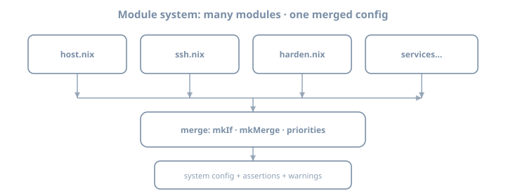

# Day 7 — systemd Services & NixOS Modules


# Day 17 — systemd via Nix

**Stage II · ~4h**  
**Goal:** Express **systemd services and timers** in NixOS modules—ship one custom service + one timer, and verify units with standard systemd tools.

## Why this day exists

NixOS does not replace systemd; it **generates** units. If you only know `systemctl` on mutable distros, you will fight activation. Today connects module options → unit files → runtime.

---

## Theory 1 — Module options generate units

```nix
systemd.services.hello-lab = {
  description = "Day17 hello service";
  wantedBy = [ "multi-user.target" ];
  serviceConfig = {
    Type = "oneshot";
    ExecStart = "${pkgs.coreutils}/bin/echo hello-from-nix";
  };
};
```

On rebuild, NixOS materializes unit files under the system closure and activates them.

| You write | systemd sees |
|-----------|--------------|
| `systemd.services.<name>` | `name.service` |
| `systemd.timers.<name>` | `name.timer` |
| `systemd.user.services…` | user units (later/HM) |

---

## Theory 2 — Service essentials

| Field | Role |
|-------|------|
| `description` | Human text |
| `wantedBy` | Targets that pull this in |
| `after` / `requires` / `wants` | Ordering/deps |
| `serviceConfig.Type` | simple, oneshot, notify, … |
| `serviceConfig.ExecStart` | Command (prefer **absolute store paths**) |
| `path` | Extra PATH packages for the unit |
| `script` | Convenience instead of ExecStart in some cases |
| `enable` / `wantedBy` | Whether it starts |

### Absolute paths matter

```nix
ExecStart = "${pkgs.hello}/bin/hello";
```

Not bare `hello`—units may not share your interactive PATH.

---

## Theory 3 — Timers

```nix
systemd.services.lab-tick = {
  serviceConfig.Type = "oneshot";
  script = ''
    echo "tick $(date -Is)" >> /var/log/lab-tick.log
  '';
};

systemd.timers.lab-tick = {
  wantedBy = [ "timers.target" ];
  timerConfig = {
    OnBootSec = "1min";
    OnUnitActiveSec = "5min";
    Unit = "lab-tick.service";
  };
};
```

| Timer idea | Example |
|------------|---------|
| Calendar | `OnCalendar = "daily"` |
| After boot | `OnBootSec` |
| Periodic | `OnUnitActiveSec` |

Prefer timers over classic cron on NixOS unless you have a reason.

---

## Theory 4 — State directories and permissions

Services that write state need:

- Writable paths (`/var/lib/…`)  
- Correct `User=` / `Group=`  
- Sometimes `StateDirectory=` in `serviceConfig`  

```nix
serviceConfig = {
  User = "labbot";
  StateDirectory = "labbot"; # → /var/lib/labbot
};
```

Do not write into the Nix store.

---

## Theory 5 — Inspecting generated units

```bash
systemctl status lab-tick.timer
systemctl cat lab-tick.service
journalctl -u lab-tick.service -n 50
systemctl list-timers --all | head
```

`systemctl cat` shows the unit text—great for verifying Nix rendered what you meant.

---

## Theory 6 — Relationship to `services.*` high-level modules

High-level modules (`services.nginx`, `services.postgresql`) **wrap** systemd units with options, hardening, and firewall hooks. Custom `systemd.services` is the escape hatch and learning tool.

Pattern:

```text
prefer services.<known> when it exists
else systemd.services.<custom>
```

---

## Theory 7 — Failure and rollback

A bad unit can fail activation. Generations still help:

1. Fix config  
2. Or rollback generation  
3. `journalctl -xe` for clues  

`test` mode is your friend for unit experiments.

---

## Worked examples bank

### Example A — oneshot + timer writing a log

See Theory 3.

### Example B — long-running simple service

```nix
systemd.services.lab-http-static = {
  wantedBy = [ "multi-user.target" ];
  after = [ "network.target" ];
  serviceConfig = {
    Type = "simple";
    ExecStart = "${pkgs.python3}/bin/python3 -m http.server 8000 --bind 127.0.0.1";
    Restart = "on-failure";
  };
};
# open firewall only if you intentionally expose it
```

Bind to localhost for lab safety unless you mean to expose.

### Example C — `path` for tools in script

```nix
systemd.services.lab-path-demo = {
  path = [ pkgs.jq pkgs.coreutils ];
  script = ''
    echo '{"ok":true}' | jq .
  '';
  serviceConfig.Type = "oneshot";
};
```

---

## Lab 1 — Ship `lab-tick` timer

Add service+timer from Theory 3 (adjust log path permissions—use `StateDirectory` or a path you own).

```bash
sudo nixos-rebuild switch --flake .#lab
systemctl status lab-tick.timer
systemctl start lab-tick.service
journalctl -u lab-tick.service -n 20
```

---

## Lab 2 — `systemctl cat` literacy

```bash
systemctl cat lab-tick.service
systemctl cat lab-tick.timer
```

Annotate in notes: which lines came from your Nix options.

---

## Lab 3 — One long-running service (localhost)

Deploy Example B or simpler. Verify:

```bash
curl -sS http://127.0.0.1:8000/ | head
systemctl status lab-http-static
```

Ensure firewall does **not** expose 8000 unless intentional.

---

## Lab 4 — Break ExecStart on purpose

Point `ExecStart` at a missing path, rebuild, watch failure, fix, rebuild. Note whether generation advanced.

---

## Lab 5 — Document units in README

```markdown
## Custom units
- lab-tick.timer: …
- lab-http-static.service: …
```

---

---

## Theory 8 — Hardening starters for custom units

Even lab units benefit from a few defaults:

```nix
systemd.services.lab-http-static.serviceConfig = {
  Type = "simple";
  ExecStart = "${pkgs.python3}/bin/python3 -m http.server 8000 --bind 127.0.0.1";
  Restart = "on-failure";
  # hardening starters (tune per workload)
  NoNewPrivileges = true;
  PrivateTmp = true;
  ProtectSystem = "strict";
  ProtectHome = true;
  # ReadWritePaths = [ "/var/lib/lab-http" ]; # if needed
};
```

Do not cargo-cult every sandbox flag onto a unit that must write state—pair with `StateDirectory` / `ReadWritePaths`.

---

## Theory 9 — `systemd.tmpfiles` for paths units need

```nix
systemd.tmpfiles.rules = [
  "d /var/log/lab-tick 0755 root root -"
];
```

Creates directories at boot/activation. Prefer `StateDirectory=` when the unit’s runtime user owns the state under `/var/lib`.

---

## Theory 10 — Activation vs live `systemctl edit`

| Path | SoT? |
|------|------|
| Flake `systemd.services.*` | Yes |
| `systemctl edit --full` drop-ins | Drift; vanishes from mental model |
| Hand unit in `/etc/systemd/system` | Fights NixOS activation |

If you must debug live, capture the working unit into the flake before the next rebuild.

---

## Worked example D — oneshot with `RemainAfterExit`

```nix
systemd.services.lab-seed = {
  wantedBy = [ "multi-user.target" ];
  serviceConfig = {
    Type = "oneshot";
    RemainAfterExit = true;
    ExecStart = "${pkgs.coreutils}/bin/touch /var/lib/lab-seed/ok";
    StateDirectory = "lab-seed";
  };
};
```

Useful for “run once to prepare state” patterns without a long-running daemon.

---

## Lab 6 — Timer calendar form

Replace interval timer with:

```nix
timerConfig.OnCalendar = "*-*-* *:0/15:00"; # every 15 minutes — verify syntax
```

```bash
systemctl cat lab-tick.timer
systemd-analyze calendar '*-*-* *:0/15:00'
```

Document which calendar expression you settled on.

---

## Lab 7 — Unit dependency map

For your long-running service, write:

```text
network.target → lab-http-static.service → (curl clients)
```

Add `after` / `wants` only when real. Over-`requires` makes boot fragile.


## Common gotchas

| Symptom | Theory |
|---------|--------|
| `Executable not found` | Need store absolute path or `path` |
| Timer never fires | not `wantedBy` timers.target |
| Permission denied writing log | state dir / user |
| Service works manually not under systemd | PATH / env differences |
| Forgotten firewall | Day 15 + service ports |

---

## Checkpoint

- [ ] Custom service in flake  
- [ ] Custom timer in flake  
- [ ] `systemctl cat` inspected  
- [ ] journalctl read for your unit  
- [ ] Localhost service verified  

### Commit

```bash
cd ~/nixos-config
git add .
git commit -m "day17: systemd services and timers"
```

---

## Tomorrow

**Day 18 — Modules as consumer.** Read real nixpkgs modules; use `mkIf` / `mkDefault` by **setting options**, not forking modules.

---


# Day 18 — Modules as consumer

**Stage II · ~4h (theory-heavy)**  
**Goal:** Use the NixOS module system **as a consumer**—read options and source for real modules, apply `mkIf` / `mkDefault` concepts correctly, and change behavior via **options** rather than forking nixpkgs.

{fig-alt="Multiple NixOS modules merge into one system config"}

## Why this day exists

Copy-pasting entire module files into your repo is a maintenance trap. Power users set options, import small local modules, and only override when necessary. That skill starts with **reading**.

---

## Theory 1 — A module is a function (usually)

```nix
{ config, lib, pkgs, ... }: {
  options = { /* declarations */ };
  config = { /* implementations */ };
}
```

| Argument | Role |
|----------|------|
| `config` | Final merged configuration (lazy) |
| `lib` | Library + `mkOption`, `mkIf`, … |
| `pkgs` | Package set for this system |
| `…` | Other module args |

Some files are plain attrsets; most nixpkgs modules use the function form.

---

## Theory 2 — Options vs config

| Side | Meaning |
|------|---------|
| **options** | Schema: what *may* be set, types, defaults, descriptions |
| **config** | Values and implementations that produce system artifacts |

As a consumer you mostly **set option values**:

```nix
{
  services.openssh.enable = true;
  networking.firewall.allowedTCPPorts = [ 22 ];
}
```

You are writing `config` fragments that merge into the global config.

---

## Theory 3 — Merge semantics (intuition)

Multiple modules set the same option; the module system **merges** by type:

| Type vibe | Merge idea |
|-----------|------------|
| Boolean | Priority rules / any true patterns depend on option |
| List | Concatenate |
| Attrset | Deep merge of attributes |
| Exclusive values | Conflict error or priority |

This is why shallow `//` (Day 3) is not how NixOS config works.

---

## Theory 4 — `lib.mkIf`

```nix
{ config, lib, ... }: {
  config = lib.mkIf config.services.foo.enable {
    environment.systemPackages = [ /* … */ ];
    networking.firewall.allowedTCPPorts = [ 8080 ];
  };
}
```

`mkIf cond value` includes `value` only when `cond` is true—**without** breaking merge when false (unlike a raw `if` that might remove structure incorrectly in some patterns).

Consumer pattern: you rarely write `mkIf` until Day 19; you **benefit** from modules that use it when you set `enable = true`.

---

## Theory 5 — `lib.mkDefault` and priority

```nix
services.openssh.enable = lib.mkDefault true;
```

| Helper | Idea |
|--------|------|
| `mkDefault` | Low priority default; easy to override |
| `mkForce` | High priority; stomps others |
| `mkOverride n` | Numeric priority control |

**Consumer rule:** prefer ordinary assignment first. Use `mkForce` only when you understand why a default wins.

```nix
# last resort
networking.hostName = lib.mkForce "lab";
```

---

## Theory 6 — How to read a nixpkgs module

### Step path

1. Find option on [search.nixos.org/options](https://search.nixos.org/options)  
2. Note default and type  
3. Open “Declared in” source file  
4. Skim `options` then `config = mkIf cfg.enable`  

### Local source on a NixOS system

```bash
# approximate — paths vary by version
nix eval --raw 'nixpkgs#path'
# then browse nixos/modules/...
```

Or:

```bash
nix repl
:lf nixpkgs
# explore; or use ripgrep in a checkout
```

### What to extract mentally

| Question | Why |
|----------|-----|
| What does `enable` turn on? | Side effects |
| Which ports open? | Firewall |
| Which user created? | Permissions |
| What state dir? | Backup/persist |
| Hardening defaults? | Security |

---

## Theory 7 — Consumer anti-patterns

| Anti-pattern | Prefer |
|--------------|--------|
| Vendor-copy whole module | Set options; small local module |
| Patch store files | Declarative options / overlays later |
| `mkForce` everything | Understand merge |
| Ignore option descriptions | Read them |
| Edit generated unit files in `/etc` | Change Nix; rebuild |

---

## Theory 8 — `imports` as composition

```nix
{
  imports = [
    ./hardware-configuration.nix
    ./modules/ssh.nix
    ./modules/packages.nix
  ];
}
```

Each import is a module. Order rarely matters for merges (priorities do). Day 19 authors one.

---

## Worked examples bank

### Example A — Read openssh options

Conceptually you will find:

```nix
options.services.openssh.enable = mkEnableOption "…";
config = mkIf cfg.enable { … };
```

Set as consumer:

```nix
services.openssh.enable = true;
services.openssh.settings.PasswordAuthentication = false;
```

### Example B — Override a default carefully

```nix
# module might mkDefault some package set
# you add:
environment.systemPackages = [ pkgs.htop ];
# lists merge — usually no mkForce needed
```

### Example C — When `mkForce` appears in blogs

Often silencing a conflict:

```nix
boot.kernelPackages = lib.mkForce pkgs.linuxPackages_latest;
```

Use sparingly; document why.

---

## Lab 1 — Study three modules

Pick **three** from:

- `services.openssh`  
- `services.timesyncd` or `time`  
- `programs.git`  
- `networking.firewall`  
- `services.nginx` (even if unused)  

For each, fill:

| Module | enable option | 2 interesting options | One side effect |
|--------|---------------|----------------------|-----------------|
| | | | |

Keep notes in `~/nixos-config/docs/modules-study.md`.

---

## Lab 2 — Change behavior via options only

Without forking module source:

1. Tighten or loosen one SSH setting  
2. Change timezone or NTP-related option  
3. Adjust firewall ports  

Rebuild; verify with `systemctl` / `ss` / `ssh`.

---

## Lab 3 — Trace an option to source

Using search.nixos.org or local nixpkgs:

1. Choose `networking.firewall.enable`  
2. Find declaring file  
3. Read how firewall backend is selected  

Write five lines on what `enable = true` actually does.

---

## Lab 4 — Priority experiment (safe)

In a throwaway module snippet:

```nix
{ lib, ... }: {
  networking.hostName = lib.mkDefault "default-name";
}
```

And in main config:

```nix
networking.hostName = "lab";
```

Confirm final hostname is `lab`. Then reverse priorities with `mkForce` experimentally and reset to clean state.

---

## Lab 5 — Consumer checklist

Before inventing a custom module tomorrow, ask:

1. Does an option already exist?  
2. Can two options combine?  
3. Am I fighting a default that `mkDefault` set?  

---

## Common gotchas

| Symptom | Theory |
|---------|--------|
| Option does not exist | Typos / wrong release |
| Infinite recursion | `config` referring badly in custom modules |
| Silent override | Priorities / mkForce elsewhere |
| Copied outdated module | Diverges from nixpkgs |
| `mkIf` confusion | Study enable patterns first |

---

## Checkpoint

- [ ] Three modules studied with notes  
- [ ] Behavior changed via options only  
- [ ] Can explain options vs config  
- [ ] Can explain mkIf / mkDefault roles  
- [ ] Avoided forking nixpkgs modules  

### Commit

```bash
cd ~/nixos-config
git add .
git commit -m "day18: modules as consumer mkIf mkDefault literacy"
```

---

## Tomorrow

**Day 19 — First custom module.** Extract spaghetti into `options` + `config`, imports, and one assertion.

---


# Day 19 — First custom module

**Stage II · ~4h**  
**Goal:** Author a **small local module** with `options` + `config`, import it into the host, gate behavior with `mkIf`, and fail early with an **assertion**.

## Why this day exists

Stage II ends with a production-shaped host—not a 400-line `configuration.nix`. Custom modules are how you name intent (`myLab.monitoring.enable`) instead of scattering unrelated assignments.

---

## Theory 1 — Minimal custom module shape

`modules/hello-lab.nix`:

```nix
{ config, lib, pkgs, ... }:
let
  cfg = config.myLab.hello;
in {
  options.myLab.hello = {
    enable = lib.mkEnableOption "hello lab demo module";

    package = lib.mkOption {
      type = lib.types.package;
      default = pkgs.hello;
      description = "Package providing the hello binary";
    };

    greetInterval = lib.mkOption {
      type = lib.types.str;
      default = "hourly";
      description = "systemd OnCalendar expression for greeting timer";
    };
  };

  config = lib.mkIf cfg.enable {
    environment.systemPackages = [ cfg.package ];

    systemd.services.my-lab-hello = {
      serviceConfig = {
        Type = "oneshot";
        ExecStart = "${cfg.package}/bin/hello";
      };
    };

    systemd.timers.my-lab-hello = {
      wantedBy = [ "timers.target" ];
      timerConfig = {
        OnCalendar = cfg.greetInterval;
        Persistent = true;
        Unit = "my-lab-hello.service";
      };
    };
  };
}
```

---

## Theory 2 — `mkOption` and types (starter set)

| Type | Use |
|------|-----|
| `lib.types.bool` | Flags |
| `lib.types.str` | Strings |
| `lib.types.int` | Integers |
| `lib.types.package` | Packages |
| `lib.types.listOf lib.types.str` | Lists |
| `lib.types.attrsOf …` | Maps |
| `lib.types.port` | Ports |
| `lib.types.nullOr …` | Optional |

Deep type catalogs come later. Today: **bool + package + str** is enough.

`mkEnableOption "doc"` → boolean option with standard description pattern.

---

## Theory 3 — `cfg = config.…` pattern

Always bind:

```nix
let cfg = config.myLab.hello; in …
```

Then `mkIf cfg.enable` and read `cfg.package`. Avoid long repeated paths; avoid accidental recursion by not defining options in terms of themselves carelessly.

---

## Theory 4 — Assertions

```nix
config = lib.mkIf cfg.enable {
  assertions = [
    {
      assertion = cfg.greetInterval != "";
      message = "myLab.hello.greetInterval must be non-empty";
    }
  ];
};
```

Assertions fail **evaluation** with a clear message—better than a mysterious empty timer.

Also available: `warnings = [ "…" ];` for non-fatal nags.

---

## Theory 5 — Import into the host

`hosts/lab/configuration.nix`:

```nix
{
  imports = [
    ./hardware-configuration.nix
    ../../modules/hello-lab.nix
  ];

  myLab.hello.enable = true;
  # myLab.hello.greetInterval = "daily";
}
```

Or list modules in `flake.nix` `modules = [ … ]`.

---

## Theory 6 — Namespace your options

| Good | Risky |
|------|-------|
| `myLab.*` / `myOrg.*` | Top-level inventing `services.foo` that collides |
| Clear enable flags | Global options without prefix |

Use a personal/org prefix until you contribute upstream.

---

## Theory 7 — What to extract first

Extract **cohesive features**, not random lines:

| Good extraction | Weak extraction |
|-----------------|-----------------|
| “lab SSH hardening bundle” | One unrelated package |
| “tick timer feature” | Half a firewall + half a user |
| “admin tools profile” | Entire host config as one module forever |

God modules become tomorrow’s spaghetti.

---

## Worked examples bank

### Example A — Enable site

```nix
myLab.hello.enable = true;
```

### Example B — Assertion trip

Set an invalid option deliberately; rebuild; read error; fix.

### Example C — Package override

```nix
myLab.hello.package = pkgs.hello; # or another pkg with similar interface carefully
```

---

## Lab 1 — Create module file

```bash
mkdir -p ~/nixos-config/modules
# write modules/hello-lab.nix (Theory 1)
```

Import + enable. Rebuild:

```bash
cd ~/nixos-config
sudo nixos-rebuild switch --flake .#lab
hello
systemctl list-timers | grep my-lab-hello || true
```

---

## Lab 2 — Add a real assertion

Extend options with something checkable, e.g.:

```nix
port = lib.mkOption {
  type = lib.types.port;
  default = 22;
};
```

Assert `port != 0` or that firewall contains the port when a hypothetical service is enabled—keep it simple but real.

---

## Lab 3 — Extract something from your host config

Identify 10–40 lines in `configuration.nix` (packages bundle, SSH settings, timer) and move into `modules/<feature>.nix` with an enable flag.

Before/after: host file should get shorter and more intentional.

---

## Lab 4 — Disable path

```nix
myLab.hello.enable = false;
```

Rebuild; confirm packages/units from the module disappear (or stop being enabled). Re-enable.

---

## Lab 5 — Document the module

`modules/README.md`:

```markdown
# modules
## hello-lab
Options: myLab.hello.*
Purpose: …
```

---

---

## Theory 8 — `mkDefault` vs bare assignment (producer side)

Inside your module’s `config`, prefer leaving room for host overrides:

```nix
config = lib.mkIf cfg.enable {
  environment.systemPackages = [ cfg.package ];
  # If you set a global-ish value, consider mkDefault so hosts can override:
  # networking.firewall.allowPing = lib.mkDefault true;
};
```

| Helper | Intent |
|--------|--------|
| bare `=` | Force (subject to merge priority rules) |
| `mkDefault` | Soft default |
| `mkForce` | Rare; win conflicts deliberately |

Day 18 covered consumer-side `mkDefault`; today you **emit** values carefully.

---

## Theory 9 — Option descriptions are UX

```nix
greetInterval = lib.mkOption {
  type = lib.types.str;
  default = "hourly";
  example = "daily";
  description = ''
    systemd OnCalendar expression for the greeting timer.
    Prefer named calendars like hourly/daily while learning.
  '';
};
```

Future you reads `nixos-option` output under pressure—write for that moment.

---

## Theory 10 — Module args you receive

```nix
{ config, lib, pkgs, modulesPath, ... }:
```

| Arg | Use |
|-----|-----|
| `config` | Read final/merged values (`cfg = config.…`) |
| `lib` | `mkOption`, `mkIf`, `types`, … |
| `pkgs` | Packages for defaults and units |
| `modulesPath` | Import nixpkgs NixOS modules by path (advanced) |

Do not add custom top-level args unless you wire `specialArgs` / `_module.args` intentionally (later).

---

## Worked example D — warnings for soft policy

```nix
config = lib.mkIf cfg.enable {
  warnings =
    lib.optional (cfg.greetInterval == "minutely")
      "myLab.hello.greetInterval = minutely will spam logs on the lab host";
};
```

---

## Lab 6 — `nixos-option` on your option

```bash
nixos-option myLab.hello.enable
nixos-option myLab.hello.greetInterval
```

If the option is missing, the module is not imported into the evaluated system.

---

## Lab 7 — Priority conflict drill

Set the same option in host config and inside the module (with/without `mkDefault`). Rebuild and note which wins. Write one sentence on the result in `modules/README.md`.


## Common gotchas

| Symptom | Theory |
|---------|--------|
| Infinite recursion | options/config cycle |
| Option not found | Not imported |
| Type error | Wrong types.* |
| Module always on | Forgot mkIf |
| Colliding option names | Namespace |
| Assertion silent | Not inside merged config properly |

---

## Checkpoint

- [ ] Custom module with options + config  
- [ ] `mkIf` on enable  
- [ ] At least one assertion  
- [ ] Imported into host flake  
- [ ] Extracted real config into a feature module  
- [ ] Enable/disable verified  

### Commit

```bash
cd ~/nixos-config
git add .
git commit -m "day19: first custom module options assertions"
```

---

## Tomorrow

**Day 20 — Boot & hardware.** systemd-boot vs GRUB, kernels, firmware—document your lab’s boot path.
