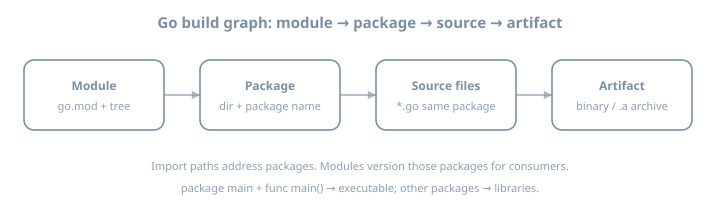
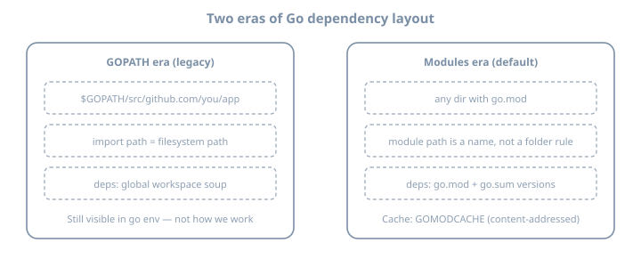

# Day 1 — Toolchain & mental model

**Stage I · ~3h (theory-heavy)**  
**Goal:** Build a correct model of how Go finds code, compiles it, and places artifacts—then prove it with a module you can inspect.

::: {.callout-note}
Today is intentionally **more theory than feature checklist**. The labs exist to verify the model, not to invent domain logic.
:::

## Why this day exists

Most “I know Go” failures in week one are not syntax—they are **toolchain misconceptions**:

- Treating `go run` as the same thing as shipping a binary  
- Believing projects must live under `GOPATH`  
- Confusing **module path**, **import path**, and **directory path**  
- Not knowing which `go` binary is on `PATH` when multiple installs exist  

If the model is solid, Days 2–10 are friction, not confusion.

---

## Theory 1 — Four artifacts (and how they nest)

{fig-alt="Pipeline from Go module through package and source files to a binary artifact"}

| Artifact | Definition | Example |
|----------|------------|---------|
| **Module** | Versioned unit of distribution; root has `go.mod` | `example.com/day01` |
| **Package** | Compilation unit: one directory, one `package` clause | `package main` or `package config` |
| **Source file** | One `.go` file belonging to that package | `main.go`, `banner.go` |
| **Artifact** | Compiler output: executable or library archive | `./day01`, `pkg.a` |

### Rule that saves hours

- **Directories** group files into packages.  
- **`package` name** is what other Go code uses *inside* the language (with import path).  
- **Module path** in `go.mod` is the prefix for import paths of packages in that module.

**Example — layout**

```text
day01/
  go.mod          # module example.com/day01
  main.go         # package main
  banner.go       # package main  (same package!)
  internal/
    greeter/
      greeter.go  # package greeter
                  # import "example.com/day01/internal/greeter"
```

**Example — wrong mental model**

```text
# Myth: "each .go file is its own package"
main.go     package main
banner.go   package banner   # FAIL if both are entry for same binary
```

Both files of an executable’s root usually share `package main`. Split packages only when you introduce subdirectories intentionally.

### Worked micro-example: one package, two files

```go
// main.go
package main

import "fmt"

func main() {
	fmt.Println(greeting)
}
```

```go
// banner.go
package main

const greeting = "hello from day 01"
```

Same package → `greeting` is visible without import. That is **package scope**, not “global to the universe.”

---

## Theory 2 — GOPATH era vs modules era

{fig-alt="Side by side comparison of GOPATH workspace layout and modules layout"}

### GOPATH era (you will still *see* it)

Historically:

- All code under `$GOPATH/src/...`  
- Import path ≈ filesystem path under `src`  
- Dependencies were a shared workspace problem  

`go env GOPATH` still prints a path. **`go install` still drops binaries under `$GOPATH/bin` (or `GOBIN`)**. That does **not** mean your project must live there.

### Modules era (default for this volume)

| Property | Behavior |
|----------|----------|
| Location | Any directory with `go.mod` |
| Identity | `module` line is a **name** (often a URL-like path) |
| Dependencies | Versions in `go.mod`; checksums in `go.sum` |
| Cache | Downloaded modules in `GOMODCACHE` |

**Example `go.mod`**

```go
module example.com/day01

go 1.26
```

**Example import of an external module** (later days; shown for theory)

```go
import "golang.org/x/mod/semver"
// resolved via go.mod require + GOMODCACHE copy
```

### Semantic import versioning (preview, not mastery today)

Major versions ≥ v2 often appear in import paths (`.../v2`). You do not need the full design today—only: **import paths and versions are coupled by policy**, not by guesswork.

---

## Theory 3 — What “installing Go” actually installs

{fig-alt="Map of GOROOT GOPATH GOMODCACHE GOCACHE and your module"}

| Variable | Theory | Practice |
|----------|--------|----------|
| `GOROOT` | Toolchain + standard library | Treat as read-only |
| `GOPATH` | Workspace for installed tools + legacy | Often `~/go` |
| `GOMODCACHE` | Content cache of downloaded modules | Shared across projects |
| `GOCACHE` | Build cache of compiled packages | Delete ⇒ slower rebuilds, not wrongness |
| `GOTOOLCHAIN` | Policy for auto-fetching toolchains | Prefer local 1.26.x for this volume |
| `GO111MODULE` | Historical switch | Modern Go: modules on by default |

### Multiple Go installs (classic footgun)

```bash
which -a go
type go
go version
ls "$(go env GOROOT)"
```

**Example failure story:** IDE uses toolchain A; terminal uses toolchain B → “works in editor, fails in CI.” Always ask `go env GOROOT` in the same shell you build with.

### `GOTOOLCHAIN` theory (Go 1.21+)

If `go.mod` says `go 1.26` and your installed toolchain is older, Go may **download** a matching toolchain depending on `GOTOOLCHAIN` (`auto` / `local` / version pin). That is deliberate design for reproducible module requirements—not malware.

For learning: install 1.26.x yourself so notes match your binary.

---

## Theory 4 — `go run` vs `go build` vs `go install`

{fig-alt="Three compilation entry points go run go build and go install"}

| Command | Produces | Leaves behind | Best for |
|---------|----------|---------------|----------|
| `go run .` | Temporary binary + execute | Usually nothing durable | Experiments |
| `go build -o name .` | Named binary in cwd (or path) | File you can ship/inspect | Learning + release candidates |
| `go install .` | Binary in `GOBIN`/`GOPATH/bin` | On PATH if configured | Installing CLIs you use often |

### Compilation is not “interpreting”

Go is compiled. `go run` still compiles; it just hides the artifact lifecycle.

### Example: same source, three outcomes

```bash
go run .                 # print output; no stable ./binary
go build -o day01 .      # ./day01 exists
go install .             # $GOPATH/bin or GOBIN
```

### Inspecting a real artifact (theory → evidence)

```bash
file ./day01
go tool nm ./day01 | head
# go tool objdump -s main.main ./day01 | head -40
```

You are proving the **machine code exists**. Later profiling (Stage VII) builds on this comfort.

---

## Theory 5 — Packages, visibility, and `main`

### Exported vs unexported (preview that matters immediately)

| Name | Visibility |
|------|------------|
| `Hello` | Exported (capital letter) — other packages can refer |
| `hello` | Unexported — same package only |

Inside `package main` split across files, lowercase is fine. When you create `package greeter`, capitals become the API.

### The `main` contract

An executable package:

1. Must be named `package main`  
2. Must define `func main()` with **no parameters and no return values**  
3. Should live in a directory you intentionally build as a command  

**Counter-example (will not link as you expect):**

```go
package main

func Main() {} // wrong name — not an entry point
```

---

## Theory 6 — Build cache and reproducibility (honest)

- **GOCACHE** speeds rebuilds; it is not a substitute for modules.  
- **Reproducible builds** (bit-for-bit) need more than `go build` defaults (flags, paths, cgo, OS). Do not claim bit-identity yet.  
- **Module sums** (`go.sum`) protect dependency integrity for module downloads—not your own uncommitted source.

---

## Lab 1 — Install and interrogate the toolchain

### Install

Install **Go 1.26.x** from [https://go.dev/dl/](https://go.dev/dl/) (or a package manager that tracks 1.26 closely).

```bash
go version
# expect: go1.26.x
```

### Map the environment (write answers)

```bash
go env GOROOT GOPATH GOMODCACHE GOCACHE GOTOOLCHAIN GO111MODULE
go env | sort | head -40
```

Fill:

| Question | Your answer |
|----------|-------------|
| Where is the stdlib? | `GOROOT` → … |
| Where will `go install` put binaries? | … |
| Where do module downloads land? | … |

---

## Lab 2 — First module with multi-file package

```bash
mkdir -p ~/lab/90daysofx/go/day01
cd ~/lab/90daysofx/go/day01
go mod init example.com/day01
```

Create `main.go` and `banner.go` as in Theory 1. Then:

```bash
go run .
go build -o day01 .
./day01
file ./day01
```

### Deliberate failures (read the errors)

1. Change `banner.go` to `package other` → rebuild.  
2. Rename `main` → `Main` → rebuild.  
3. Introduce `var x = 1 + "2"` → rebuild.  

Paste errors into your journal. **Compiler messages are part of the language UX.**

---

## Lab 3 — Prove install path theory

```bash
go install .
ls "$(go env GOPATH)/bin"
# or: ls "$(go env GOBIN)" if set
```

Compare binary names from `go build -o` vs `go install`. Note surprises.

---

## Common misconceptions (theory checklist)

| Myth | Reality |
|------|---------|
| “Go is interpreted because of `go run`” | Always compiled |
| “Project must be under GOPATH” | Modules: any directory |
| “`go.mod` is optional in 2026” | Required for real work |
| “Deleting the binary uninstalls the module” | Source remains; install bin is separate |
| “One `.go` file = one package” | Package = directory (+ package clause) |

---

## Checkpoint

- [ ] `go version` is 1.26.x  
- [ ] Can draw module → package → file → binary from memory  
- [ ] Can explain GOPATH vs modules without notes  
- [ ] Produced `./day01` via `go build` and ran it  
- [ ] Caused and fixed at least two compile errors  
- [ ] Documented `GOROOT` / `GOMODCACHE` / `GOCACHE`  

### Commit

```bash
git init  # if needed
git add go.mod main.go banner.go
git commit -m "day01: toolchain mental model + hello module"
```

---

## Tomorrow

**Day 2 — Variables, types, constants, conversions** (theory of zero values, typed vs untyped constants, explicit conversions) + units CLI lab.
