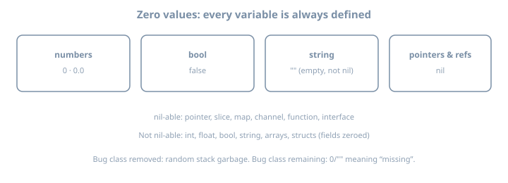
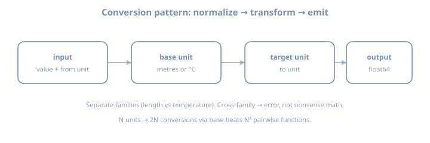

# Day 2 — Variables, types & constants

**Stage I · ~3h (theory-heavy)**  
**Goal:** Internalize Go’s type rules—zero values, declarations, constants, and **explicit** conversions—then apply them in a small units CLI.

## Why this day exists

Go’s type system is small but strict. The pain points are predictable:

- Expecting C-style implicit numeric promotions  
- Treating zero values as “unset” without a separate signal  
- Mixing typed and untyped constants incorrectly  
- Using integer division for physical quantities  

Mastering these early prevents mysterious bugs in later concurrency and API code.

---

## Theory 1 — Types are sets of values + operations

A type answers:

1. What values are allowed?  
2. What operations are legal?  
3. How is it represented (size/alignment)—later relevant for performance  

### Predeclared numeric types (selected)

| Type | Role |
|------|------|
| `int`, `uint` | Architecture-sized (at least 32-bit; typically 64 on modern desktops) |
| `int8`…`int64`, `uint8`…`uint64` | Fixed width |
| `float32`, `float64` | IEEE floats; prefer `float64` unless constrained |
| `byte` | Alias of `uint8` |
| `rune` | Alias of `int32` (Unicode code point) |
| `complex64`, `complex128` | Exist; rarely needed in this volume |

**Example — representation matters for overflow theory**

```go
var u uint8 = 255
// u = u + 1  // wraps to 0 in Go (modular arithmetic for integers)
```

You will not exploit wrap in the units CLI—but you must know it exists.

---

## Theory 2 — Zero values

{fig-alt="Diagram of Go zero values for numbers bool string and nil-able types"}

### Law

> Allocating a variable without initialization yields the **zero value**, not garbage.

### Examples

```go
var i int           // 0
var f float64       // 0
var b bool          // false
var s string        // ""
var p *int          // nil
var xs []int        // nil slice (len 0, cap 0, no array)
var m map[string]int // nil map (read-only safe; write panics)
```

### Design consequence

APIs often cannot use `0` or `""` to mean “missing.” Patterns later:

- `*T` pointer (nil = absent)  
- `ok` boolean from maps  
- `sql.Null*` types  
- custom option types  

**Example — zero value bug class**

```go
func average(nums []int) float64 {
	var sum int
	for _, n := range nums {
		sum += n
	}
	return float64(sum) / float64(len(nums)) // panics or Inf if len==0
}
```

Zero-length input is a **domain** problem; zero values did not cause it, but they encourage forgetting edge cases.

---

## Theory 3 — Declaration forms

### Four common shapes

```go
var x int                 // zero value
var y int = 3             // explicit type + init
var z = 3                 // type inferred (int)
w := 3                    // short declare; function scope only
```

### Multiple assignment

```go
a, b := 1, 2
a, b = b, a               // swap
v, err := strconv.Atoi("42")
```

### Redeclaration rule with `:=`

```go
x, err := f()
x, err := g()   // ERROR if no new variable on left
x, err = g()    // OK: assignment
x, err2 := g()  // OK: err2 is new
```

### Package-level vs function-level

```go
var globalCounter int     // OK at package level
// count := 0             // ILLEGAL at package level
```

**Example — prefer clarity**

```go
// Good when zero then fill
var buf []byte
if need {
	buf = make([]byte, 1024)
}

// Good when known init
name := "gopher"
```

---

## Theory 4 — No implicit conversion between named types

```go
var a int = 1
var b int64 = 2
// var c = a + b     // compile error
var c = int64(a) + b // explicit conversion
```

### Conversion vs assertion (preview)

| Construct | Meaning |
|-----------|---------|
| `T(x)` | Conversion when allowed (numerics, strings/bytes, etc.) |
| `x.(T)` | Type assertion on interfaces (later days) |

### String ↔ numeric is not free

```go
// n := int("42")           // illegal
n, err := strconv.Atoi("42") // decoding, can fail
s := strconv.Itoa(42)
```

### Worked examples

```go
var x int32 = 65
fmt.Println(string(rune(x))) // "A" — rune conversion intentional

b := []byte("hi")
s := string(b)               // copy of bytes as string
```

**Caution:** `string(65)` as `string(rune(65))` is a code point, not decimal text `"65"`.

---

## Theory 5 — Constants: typed vs untyped

{fig-alt="Comparison of untyped flexible constants and typed constants or variables"}

### Untyped constants

```go
const Pi = 3.14159265358979323846 // untyped floating
const Two = 2                     // untyped integer
```

They can be used in more contexts until they must become a concrete type:

```go
var f32 float32 = Two   // OK
var i int = Two         // OK
var u uint = Two        // OK
```

### Typed constants

```go
const Max int = 100
// var u uint = Max     // error: cannot use Max (type int) as uint
var u uint = uint(Max)
```

### `iota` — enumerator generator

```go
const (
	KB = 1 << (10 * iota) // 1 << 0 = 1
	MB                    // 1 << 10
	GB                    // 1 << 20
)

const (
	StatusOK = iota // 0
	StatusFail      // 1
	StatusRetry     // 2
)
```

**Example — skip values**

```go
const (
	_ = iota // 0 discarded
	Readable // 1
	Writable // 2
	Executable // 3
)
```

### Constants must be compile-time

```go
// const now = time.Now() // illegal — function call not constant
```

---

## Theory 6 — Integer division and mixed arithmetic

```go
fmt.Println(5 / 2)          // 2
fmt.Println(5.0 / 2.0)      // 2.5
fmt.Println(float64(5) / 2) // 2.5
```

**Physical quantities** (metres, °C) should almost always use `float64` for intermediate math in this course.

### Temperature theory (for the lab)

- Fahrenheit from Celsius: `F = C * (9.0/5.0) + 32`
- Celsius from Fahrenheit: `C = (F - 32) * (5.0/9.0)`

Use float constants `9.0/5.0`, not `9/5` (integer → `1`).

---

## Theory 7 — Conversion architecture for CLIs

{fig-alt="Pipeline from input units to base unit to target unit to output"}

### Why a base unit?

For **N** units, pairwise converters need on the order of **N²** functions. Via a base unit you only need about **2N** (to-base and from-base).

### Families

| Family | Base (suggested) | Members |
|--------|------------------|---------|
| Length | metre | `m`, `km` |
| Temperature | Celsius | `c`, `f` |

Cross-family conversion must **error**, not invent physics.

### Error theory (preview of Day 11–13)

Return `error` as a value:

```go
return 0, fmt.Errorf("unknown unit %q", unit)
```

Do not panic for user input mistakes.

---

## Worked examples bank (study these)

### Example A — zero values print

```go
var i int
var s string
var p *int
fmt.Printf("%d %q %v\n", i, s, p) // 0 "" <nil>
```

### Example B — constant kind flexibility

```go
const K = 1000
var a int = K
var b int64 = K
var c float64 = K
```

### Example C — illegal mix

```go
var x int = 1
var y int64 = 2
// fmt.Println(x + y) // must not compile
fmt.Println(int64(x) + y)
```

### Example D — iota flags pattern (stretch theory)

```go
const (
	FlagRead = 1 << iota // 1
	FlagWrite            // 2
	FlagExec             // 4
)
```

---

## Lab 1 — Zeros and illegal conversions

```bash
mkdir -p ~/lab/90daysofx/go/day02
cd ~/lab/90daysofx/go/day02
go mod init example.com/day02
```

Write `sandbox.go` that prints zero values and contains a **commented** illegal `int+int64` line. Uncomment once to read the error, then restore.

---

## Lab 2 — Units CLI (application of theory)

### Spec

```text
units <value> <from> <to>
```

Minimum units: `m`, `km`, `c`, `f`.

### Skeleton (main)

```go
package main

import (
	"fmt"
	"os"
	"strconv"
	"strings"
)

func main() {
	if len(os.Args) != 4 {
		fmt.Fprintf(os.Stderr, "usage: %s <value> <from> <to>\n", os.Args[0])
		os.Exit(2)
	}
	value, err := strconv.ParseFloat(os.Args[1], 64)
	if err != nil {
		fmt.Fprintf(os.Stderr, "invalid value: %v\n", err)
		os.Exit(2)
	}
	from := strings.ToLower(os.Args[2])
	to := strings.ToLower(os.Args[3])
	out, err := convert(value, from, to)
	if err != nil {
		fmt.Fprintf(os.Stderr, "%v\n", err)
		os.Exit(1)
	}
	fmt.Printf("%g %s\n", out, to)
}
```

Implement `convert` using **base-unit normalization** and `const` factors. Reject cross-family.

### Test matrix

```bash
go build -o units .
./units 1 km m
./units 1000 m km
./units 0 c f
./units 32 f c
./units 1 m c      # error
./units 5 xyz m    # error
```

### Expected theory checks in code review (self)

- [ ] No integer division in temperature formulas  
- [ ] Explicit `float64` parse path  
- [ ] Clear errors (unknown unit / family mismatch)  
- [ ] Constants for factors, not magic numbers only  

---

## Stretch theory

Add `mi` ↔ `km` with a documented constant approximation, still via metres as base.

---

## Common gotchas

| Gotcha | Fix |
|--------|-----|
| `9/5` in temperature | Use `9.0/5.0` |
| `:=` redeclaration | Introduce a new name or use `=` |
| Float `==` | Prefer printing; tests use epsilon later |
| `string(65)` confusion | Use `strconv` for decimal text |
| Nil map write | `make` before write |

---

## Checkpoint

- [ ] Explain zero values for `int`, `string`, `*T`, `map`  
- [ ] Show compile error for `int + int64` without conversion  
- [ ] Explain untyped vs typed constants with an example  
- [ ] Units CLI passes the test matrix  
- [ ] Cross-family conversion fails clearly  

### Commit

```bash
git add .
git commit -m "day02: type theory + units CLI"
```

---

## Tomorrow

**Day 3 — Control flow:** `if`, `switch`, and the many forms of `for`—with non-toy control problems and short-circuit theory.
