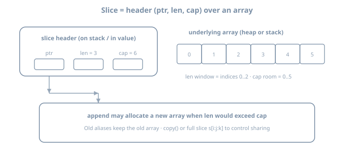

# Day 5 — Arrays, slices & append

**Stage I · ~3h (theory-heavy)**  
**Goal:** Internalize the slice **header** (pointer, length, capacity), how `append` may reallocate, and how to avoid silent aliasing—then implement a growable buffer or ring buffer with deliberate capacity control.

::: {.callout-note}
If you remember only one picture from Stage I: a slice is a small descriptor pointing at an **array**, not the array itself. Most production bugs around “I modified a copy” are header misunderstandings.
:::

## Why this day exists

Slices are the workhorse collection type:

- Function args, JSON arrays, HTTP body chunks, table-test cases—all slices  
- Arrays exist and matter for size-in-type and some crypto/fixed buffers, but day-to-day code is slices  
- `append`, sub-slicing, and shared backing arrays create **aliasing** that looks like magic until the model is clear  

Day 5 is theory you will reuse on every later day that touches data.

{fig-alt="Go slice header with pointer length capacity over underlying array"}

---

## Theory 1 — Arrays: value types with fixed length

```go
var a [3]int           // [0 0 0]
b := [3]int{1, 2, 3}
c := [...]int{4, 5, 6} // length inferred: [3]int
```

### Length is part of the type

```go
var x [3]int
var y [4]int
// x = y // compile error: different types
```

### Assignment copies the entire array

```go
a := [3]int{1, 2, 3}
b := a
b[0] = 99
fmt.Println(a[0]) // 1 — a unchanged
```

Arrays are rare in APIs because size is rigid. They appear in:

- SHA digest sizes (`[32]byte`)  
- Small fixed protocol headers  
- Backing storage you then slice

---

## Theory 2 — The slice header

A slice value is a **header** with three fields (conceptually):

| Field | Meaning |
|-------|---------|
| pointer | Address of element 0 of this slice view |
| length | Number of accessible elements (`len`) |
| capacity | Number of elements in the backing array from the pointer to the end (`cap`) |

```go
s := make([]int, 3, 5) // len=3, cap=5
fmt.Println(len(s), cap(s)) // 3 5
```

### Nil vs empty

```go
var nilSlice []int          // nil: len=0, cap=0
empty := []int{}            // non-nil empty (usually)
empty2 := make([]int, 0)    // non-nil empty

fmt.Println(nilSlice == nil) // true
fmt.Println(empty == nil)    // false
```

Both have `len == 0`. Prefer `len(s) == 0` over `s == nil` when checking “no elements,” unless you intentionally treat nil as a distinct signal (e.g., “unset” vs “empty list” in JSON can still both become nil depending on encoding—be careful).

### Literal and make

```go
s1 := []int{1, 2, 3}     // len=3, cap=3
s2 := make([]int, 10)    // len=10, cap=10, zeroed
s3 := make([]int, 0, 64) // len=0, cap=64 — pre-grow
```

---

## Theory 3 — Slicing and shared backing arrays

```go
a := []int{0, 1, 2, 3, 4}
b := a[1:4] // [1 2 3], len=3, cap=4 (to end of a's capacity)
b[0] = 99
fmt.Println(a) // [0 99 2 3 4] — shared storage!
```

### Expression forms

```go
s[low:high]      // low included, high excluded
s[low:high:max]  // also limits cap to max-low (full slice expression)
s[:high]
s[low:]
s[:]
```

### Full slice expression to prevent append clobbering

```go
a := []int{0, 1, 2, 3, 4}
b := a[1:3:3] // len=2, cap=2 — append must allocate
b = append(b, 9)
fmt.Println(a) // a[3] not overwritten by 9
```

Without the third index, `append` on `b` may write into `a`’s unused capacity.

### Law

> Sub-slicing does **not** copy elements. It creates a new header into the same array (unless a prior `append` reallocated).

To own a copy:

```go
cp := append([]int(nil), s...)
// or
cp := make([]int, len(s))
copy(cp, s)
```

---

## Theory 4 — `append` growth

```go
var s []int
s = append(s, 1)
s = append(s, 2, 3)
s = append(s, []int{4, 5}...)
```

### Rules of thumb

1. If `len < cap`, append writes in place and returns a header with `len+n`.  
2. If not enough capacity, runtime allocates a **larger** array, copies, returns a new header.  
3. Always assign the result: `s = append(s, x)`.  

```go
s = append(s, x) // correct
append(s, x)     // compile error: result unused (as of modern Go checks) — still: never ignore it
```

### Capacity growth is implementation detail

Do not hard-code assumptions about exact growth factors across Go versions. For performance, preallocate when you know size:

```go
out := make([]T, 0, len(in))
for _, v := range in {
	out = append(out, transform(v))
}
```

### `copy`

```go
dst := make([]int, 2)
src := []int{1, 2, 3}
n := copy(dst, src) // n=2; dst=[1 2]
```

`copy` copies `min(len(dst), len(src))` elements and handles overlap correctly.

---

## Theory 5 — Passing slices to functions

Slices are passed as **headers by value**. The header is copied; the backing array is shared.

```go
func setFirst(s []int) {
	if len(s) > 0 {
		s[0] = 100 // visible to caller
	}
}

func appendLocal(s []int) {
	s = append(s, 9) // may not be visible: local header only
}

func appendReturn(s []int) []int {
	return append(s, 9) // caller must use returned header
}
```

| Mutation | Visible to caller? |
|----------|-------------------|
| Change `s[i]` | Yes (shared array) |
| `append` that fits in cap | Maybe yes for elements, but caller’s `len` unchanged unless they use returned slice |
| `append` that reallocates | Caller still holds old header unless they assign return |

**Idiom:** functions that grow a slice **return** the new slice (or use a pointer to slice: `*[]T`, less common).

---

## Theory 6 — Strings, bytes, and runes (slice-adjacent)

```go
s := "Go"
b := []byte(s) // copy of bytes
r := []rune(s) // Unicode code points
s2 := string(b)
```

- `string` is immutable; converting to `[]byte` or `[]rune` copies  
- Prefer `range` on string for runes; prefer `[]byte` for I/O  

`bytes` and `strings` packages share many APIs (Day 40). Today: do not mutate a `[]byte` that aliases a string’s storage (you cannot get that alias safely without `unsafe`).

---

## Worked examples bank

### Example A — Header introspection

```go
package main

import "fmt"

func header(name string, s []int) {
	fmt.Printf("%s len=%d cap=%d %v\n", name, len(s), cap(s), s)
}

func main() {
	a := make([]int, 3, 6)
	for i := range a {
		a[i] = i + 1
	}
	header("a", a)
	b := a[1:3]
	header("b", b)
	b = append(b, 9)
	header("b after append", b)
	header("a after b append", a) // may show a[3]==9 if capacity shared
}
```

### Example B — Safe grow helper

```go
func push(s []int, v int) []int {
	return append(s, v)
}

func pushAll(s []int, vs ...int) []int {
	return append(s, vs...)
}
```

### Example C — Filter without aliasing pitfalls

```go
func filterEven(in []int) []int {
	out := make([]int, 0, len(in))
	for _, v := range in {
		if v%2 == 0 {
			out = append(out, v)
		}
	}
	return out
}
```

### Example D — In-place filter (same slice, careful)

```go
func filterEvenInPlace(s []int) []int {
	n := 0
	for _, v := range s {
		if v%2 == 0 {
			s[n] = v
			n++
		}
	}
	return s[:n]
}
```

Still shares capacity with original; fine if you only use the returned header.

### Example E — Ring buffer sketch

```go
type Ring struct {
	buf  []int
	head int
	size int
}

func NewRing(cap int) *Ring {
	return &Ring{buf: make([]int, cap)}
}

func (r *Ring) Push(v int) {
	if r.size < len(r.buf) {
		r.size++
	} else {
		r.head = (r.head + 1) % len(r.buf)
	}
	idx := (r.head + r.size - 1) % len(r.buf)
	r.buf[idx] = v
}

func (r *Ring) Snapshot() []int {
	out := make([]int, r.size)
	for i := 0; i < r.size; i++ {
		out[i] = r.buf[(r.head+i)%len(r.buf)]
	}
	return out
}
```

### Example F — Remove element without leaving garbage (slice tricks)

```go
func deleteAt(s []int, i int) []int {
	// order-preserving
	return append(s[:i], s[i+1:]...)
}

func deleteAtUnordered(s []int, i int) []int {
	s[i] = s[len(s)-1]
	return s[:len(s)-1]
}
```

Know that `append(s[:i], s[i+1:]...)` can alias; if other headers still point into `s`, they may see surprising contents.

---

## Labs

Suggested workspace: `~/lab/90daysofx/go/day05`

### Lab 1 — Prove aliasing

```bash
mkdir -p ~/lab/90daysofx/go/day05
cd ~/lab/90daysofx/go/day05
go mod init example.com/day05
```

Write a program that:

1. Creates a slice with `len < cap`  
2. Sub-slices it  
3. `append`s into the sub-slice  
4. Prints parent and child before/after  

Then fix the clobber with a full slice expression `s[low:high:high]` or an explicit `copy`.

### Lab 2 — Growable buffer

Implement a line buffer type:

```go
type Buffer struct {
	lines []string
}

func (b *Buffer) Add(line string) { /* append */ }
func (b *Buffer) Len() int
func (b *Buffer) Lines() []string // return a copy OR document that caller must not mutate
```

Decide and document: does `Lines()` return a defensive copy? Implement that choice.

CLI: read stdin, store lines, print count and last 5 lines.

### Lab 3 — Ring buffer (stretch)

Implement fixed-capacity ring of the last N integers (or lines). On overflow, drop oldest. Print contents in chronological order.

```bash
go build -o ring .
echo -e "1\n2\n3\n4\n5" | ./ring -n 3
# expect 3 4 5
```

---

## Common gotchas

| Gotcha | Fix |
|--------|-----|
| Forgetting `s = append(s, x)` | Always assign |
| Sub-slice append overwrites parent | Full slice expr or copy |
| Assuming `[]T{}` equals nil | Compare with `len` for emptiness |
| Passing slice to grow in-place without return | Return new header |
| Using arrays when size varies | Use slices |
| `range` copy of large array | `for i := range a` avoids copying elements if you only need indices; ranging `for i, v := range largeArray` copies array to range over—prefer slice |
| Memory “leak” via large backing array | Copy to shrink if you keep a tiny sub-slice of a huge buffer |

---

## Checkpoint

- [ ] Draw pointer/len/cap for a slice and a sub-slice  
- [ ] Explain nil vs empty slice  
- [ ] Demonstrate shared backing array mutation  
- [ ] Prevent clobber with full slice expression or `copy`  
- [ ] Buffer or ring lab works  
- [ ] Can explain why `append` sometimes reallocates  

### Commit

```bash
git add .
git commit -m "day05: slices, append, buffer/ring"
```

---

## Tomorrow

**Day 6 — Maps:** make vs nil, comma-ok, delete, iteration randomness, and using maps as counters and simple caches without data races (single-goroutine rules for now).
