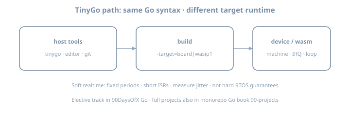

# TinyGo elective 1 — Toolchain & blink

**Elective · ~3h** (after Stage VII or any time you want embedded Go)  
**Goal:** Install TinyGo, pick a target, build blink or wasip1 hello, understand host Go vs device runtime.

{fig-alt="TinyGo path from host tools to device or wasm"}

::: {.callout-note}
This elective is **optional**. The main Go Days 1–90 never require a microcontroller. Full project write-ups also live in monorepo book **Go** → projects 41–45.
:::

## Why this elective exists

Desktop Go teaches concurrency and services. **TinyGo** reuses Go syntax for **MCUs and WASM** with a smaller runtime and the `machine` package. Soft realtime loops (sensors, buttons, UART) are a different design muscle than HTTP handlers.

## Theory

| Desktop Go | TinyGo |
|------------|--------|
| Full stdlib, GC, OS threads | Subset stdlib; target-specific runtime |
| `go build` | `tinygo build -target=...` |
| `net/http` everyday | Often no network stack on bare metal |
| Soft RT only | Soft RT with IRQs/timers — **not** certified hard RTOS |

### Targets

```bash
tinygo version
tinygo targets | head
tinygo info wasip1
tinygo info pico   # example board — use yours
```

## Lab

```bash
mkdir -p ~/lab/90daysofx/go/tinygo01 && cd ~/lab/90daysofx/go/tinygo01
go mod init example.com/tinygo01
```

**WASIp1 hello (no hardware):**

```go
package main

import "fmt"

func main() {
	fmt.Println("tinygo elective 01 ok")
}
```

```bash
tinygo run -target=wasip1 .
```

**Blink** (board with `machine.LED`):

```go
package main

import (
	"machine"
	"time"
)

func main() {
	led := machine.LED
	led.Configure(machine.PinConfig{Mode: machine.PinOutput})
	for {
		led.High()
		time.Sleep(500 * time.Millisecond)
		led.Low()
		time.Sleep(500 * time.Millisecond)
	}
}
```

```bash
tinygo flash -target=YOUR_BOARD .
```

## Checkpoint

- [ ] `tinygo version` works  
- [ ] wasip1 **or** blink succeeds  
- [ ] Notes: target name + pin  

## Tomorrow (elective)

**TinyGo 2 — Button + interrupt / debounce** (`93-tinygo-02-…`).  
