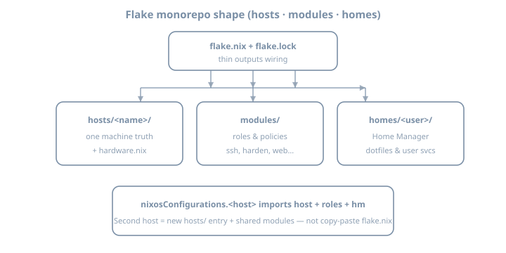

# Day 23 — Flake layout

**Stage III · ~4h**  
**Goal:** Refactor a Stage II single-host flake into a **hosts / modules / homes** layout that stays rebuildable, readable, and ready for multi-host growth—without a 2 000-line `flake.nix`.

::: {.callout-note}
**Baseline:** NixOS / nixpkgs **26.05**, flakes, modern `nix` CLI. Home Manager lands on Day 25; today only *create the `homes/` slot* so later imports have a home.
:::

## Why this day exists

Stage II proved you can own one machine from a flake. Stage III is about **shape**: the difference between a lab notebook and a repo you can still navigate in six months—or hand to a second host.

A common failure mode:

```text
flake.nix          # 1800 lines of mixed host, packages, users, networking
hardware-configuration.nix
```

That works until the second machine, the second user, or the first “extract this SSH policy” refactor. Layout is not aesthetics; it is **dependency direction and import graph hygiene**.

{fig-alt="NixOS flake layout with hosts modules and homes directories"}

---

## Theory 1 — What “layout” means in a flake monorepo

A flake has two layers:

| Layer | Role |
|-------|------|
| **`flake.nix` outputs** | Thin wiring: inputs → `nixosConfigurations`, later `devShells` / `checks` / `packages` |
| **Module tree** | Almost all real config: options + config fragments imported by hosts |

**Rule of thumb:** if a file is only true for *one machine*, it lives under `hosts/<name>/`. If it is true for *a role or policy*, it lives under `modules/`. If it is true for *a user*, it will live under `homes/` (HM starts Day 25).

### Recommended tree (target for today)

```text
flake.nix
flake.lock
hosts/
  lab/
    default.nix              # host entry: imports modules + hardware
    hardware-configuration.nix
modules/
  common/
    default.nix              # baseline shared by all hosts
    nix.nix                  # nix settings, flakes, gc policy (optional split)
    users.nix
    ssh.nix
    networking.nix
  roles/
    workstation.nix          # optional role
    server.nix
  services/
    # empty or one tiny service extracted from Stage II
homes/
  alice/
    default.nix              # stub for Day 25
lib/
  default.nix                # optional helpers (mkHost, etc.)
```

Names are conventions, not law. **The invariant is layering**, not exact folder names.

---

## Theory 2 — Dependency direction (prevent circular imports)

Think of imports as a DAG:

```text
flake.nix
  → hosts/lab
       → modules/common/*
       → modules/roles/*
       → modules/services/*
       → hardware-configuration
       → (later) homes via HM module
```

| Allowed | Forbidden |
|---------|-----------|
| Host imports modules | Module imports a *specific* host |
| Role imports common modules | Common imports role |
| Service module is self-contained | Service module reaches into `hosts/lab` paths |
| `lib` pure helpers used by modules | `lib` that evaluates full NixOS configs |

Circular imports fail evaluation with confusing “infinite recursion” or “attribute missing” symptoms. Design the graph **before** you split files blindly.

### What belongs where

| Concern | Place |
|---------|-------|
| `networking.hostName`, hardware, disk labels | `hosts/<name>/` |
| SSH policy, firewall defaults, time zone, locale | `modules/common/` |
| “This is a headless server” package set | `modules/roles/server.nix` |
| One service option bundle | `modules/services/<name>.nix` |
| User shell, git, editors | `homes/<user>/` (Day 25+) |
| `specialArgs`, input plumbing | `flake.nix` only |

---

## Theory 3 — Host entry pattern

A host file is a **module**, not a second flake:

```nix
# hosts/lab/default.nix
{ config, pkgs, lib, ... }:
{
  imports = [
    ./hardware-configuration.nix
    ../../modules/common
    ../../modules/roles/server.nix
    # ../../modules/services/my-timer.nix
  ];

  networking.hostName = "lab";

  # Host-only overrides (mkForce / mkDefault as needed)
  # services.openssh.openFirewall = true;  # if you keep SSH on lab LAN
}
```

And the flake stays thin:

```nix
# flake.nix (sketch — adjust system and input names to your Stage II flake)
{
  description = "90DaysOfX NixOS lab — Stage III layout";

  inputs = {
    nixpkgs.url = "github:NixOS/nixpkgs/nixos-26.05";
  };

  outputs = { self, nixpkgs, ... }:
  let
    system = "x86_64-linux"; # or aarch64-linux
  in {
    nixosConfigurations.lab = nixpkgs.lib.nixosSystem {
      inherit system;
      modules = [
        ./hosts/lab
      ];
      # specialArgs = { inherit inputs; }; # when you need inputs in modules
    };
  };
}
```

### `default.nix` vs explicit path

Importing `./hosts/lab` loads `./hosts/lab/default.nix`. Prefer that over listing every leaf in `flake.nix`.

---

## Theory 4 — Module “barrel” files

`modules/common/default.nix` re-exports fragments:

```nix
# modules/common/default.nix
{
  imports = [
    ./nix.nix
    ./users.nix
    ./ssh.nix
    ./networking.nix
  ];
}
```

Benefits:

- Hosts import **one** common entry  
- You can still open a single policy file for review  
- Diffs stay small when only SSH changes  

Refactor **behavior-preserving** first: cut → import → rebuild → only then change options. Never mix layout moves with hardening or new services in one commit.

---

## Theory 5 — Hardware config and purity

`hardware-configuration.nix` is **host-local** (UUIDs, firmware). Do **not** share it across machines. Optional `lib/mkHost` helpers can wait until you have three hosts—prefer an obvious explicit `nixosSystem` until then.

**Before → after:** Stage II points `flake.nix` at a monolith `configuration.nix`; Stage III points at `./hosts/lab`, which imports hardware + `modules/common` (+ roles/services). Same behavior; smaller change surface.

---

## Lab 1 — Inventory the monolith

Suggested workspace: `~/lab/90daysofx/02-nixos/day23` (or your real flake repo).

```bash
cd /path/to/your-flake
find . -name '*.nix' | sort
wc -l flake.nix configuration.nix hosts/*/*.nix 2>/dev/null
```

In your journal:

1. List every *concern* in the big file (users, SSH, packages, networking, custom module, …)  
2. Mark each as **host / common / role / service / user**  
3. Note any absolute paths or secrets (flag secrets for Stage IV—do not leave plaintext passwords in git)

---

## Lab 2 — Create the directory skeleton

```bash
mkdir -p hosts/lab modules/common modules/roles modules/services homes/alice lib
```

Move hardware config:

```bash
# adjust names to your Stage II layout
mv hardware-configuration.nix hosts/lab/
# if configuration.nix was the monolith, keep a copy for reference
cp configuration.nix /tmp/configuration.nix.bak
```

---

## Lab 3 — Split common modules

Create focused files. Example SSH fragment:

```nix
# modules/common/ssh.nix
{ lib, ... }:
{
  services.openssh = {
    enable = true;
    settings = {
      PasswordAuthentication = false;
      KbdInteractiveAuthentication = false;
      PermitRootLogin = "no";
    };
  };
}
```

Users (replace with your Stage II usernames/keys—**keys only**, no password hashes in examples here):

```nix
# modules/common/users.nix
{ pkgs, ... }:
{
  users.users.alice = {
    isNormalUser = true;
    extraGroups = [ "wheel" ];
    openssh.authorizedKeys.keys = [
      "ssh-ed25519 AAAA...REPLACE_WITH_YOUR_PUBLIC_KEY alice@lab"
    ];
  };
  # security.sudo.wheelNeedsPassword = true; # your policy
}
```

Nix settings:

```nix
# modules/common/nix.nix
{
  nix.settings = {
    experimental-features = [ "nix-command" "flakes" ];
    # auto-optimise-store = true; # optional
  };
  nixpkgs.config.allowUnfree = false; # be explicit about policy
}
```

Barrel:

```nix
# modules/common/default.nix
{
  imports = [
    ./nix.nix
    ./users.nix
    ./ssh.nix
    ./networking.nix
  ];
}
```

Host entry:

```nix
# hosts/lab/default.nix
{ ... }:
{
  imports = [
    ./hardware-configuration.nix
    ../../modules/common
  ];

  networking.hostName = "lab";
  system.stateVersion = "26.05"; # keep your real stateVersion
}
```

Point `flake.nix` at `./hosts/lab` only.

---

## Lab 4 — Rebuild and prove equivalence

```bash
# dry evaluation / build first if you prefer
nixos-rebuild build --flake .#lab

# then switch on the lab host
sudo nixos-rebuild switch --flake .#lab
```

Verify:

```bash
hostname
systemctl is-active sshd
nixos-version
```

If something broke: roll back (Day 13 muscle memory), fix one module, retry.

---

## Lab 5 — Document the tree

Write `docs/layout.md` or a short journal entry:

```text
flake.nix          → outputs only
hosts/lab          → hostname, hardware, host overrides
modules/common     → shared policy
modules/roles      → (empty or one role)
modules/services   → extracted Stage II service if any
homes/alice        → Day 25
```

Commit the layout as its own commit (message below). Optional stretch: sketch `hosts/spare/` reusing `modules/common` but do not wire a non-bootable `nixosConfigurations` entry without real hardware.

---

## Common gotchas

| Symptom / mistake | What to do |
|-------------------|------------|
| Infinite recursion after split | Module imports a host or `config` cycle; straighten the DAG |
| `error: path '…' does not exist` | Relative paths wrong after move; re-check `../../modules` |
| Flake still points at old `configuration.nix` | Update `modules = [ ./hosts/lab ];` |
| Hardware UUIDs missing | You moved hardware file but forgot to import it |
| “Works on eval, fails on boot” | Bootloader/filesystem only in hardware host file—verify |
| Mixed absolute `/home/you/...` imports | Use flake-relative paths only |
| Giant PR of layout + features | Split commits: move-only first |

---

## Checkpoint

- [ ] Directory tree matches hosts / modules / homes (homes may be stub)  
- [ ] `flake.nix` is thin wiring, not the bulk of config  
- [ ] `nixos-rebuild switch --flake .#lab` (or your hostname) succeeds  
- [ ] Import graph has no host→module reverse deps  
- [ ] Layout documented in a short tree note  
- [ ] Behavior roughly matches pre-refactor Stage II host  

### Commit

```bash
git add .
git commit -m "day23: flake layout hosts/modules/homes"
```

Write three personal gotchas before continuing.

---

## Tomorrow

**Day 24 — Lock discipline:** selective `flake update`, reading lock diffs, and pinning strategy so “layout clean” does not become “nixpkgs random walk.”
