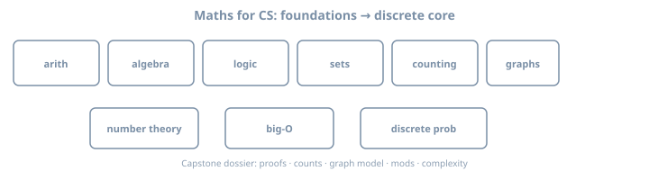

# Volume 3: Maths for CS & programming

**Role in the series:** independent volume — **from scratch** through the **discrete mathematics** computer science and programming actually use.  
**Pacing:** ~2–3h per day when you work every example and exercise; any calendar is fine.  
**Style:** **definitions · theorems · worked examples · exercises** — no programming labs, no lab machines. Pen and paper is enough. Optional calculator/Python only to *check* arithmetic after hand work.

{fig-alt="Path from arithmetic through discrete math topics for CS"}

## Who this volume is for

- Programmers rusty on foundations, or never taught them cleanly  
- Learners who need **logic, sets, counting, graphs, modular arithmetic, asymptotics, and discrete probability** for algorithms and systems  
- Anyone who prefers **understanding concepts** over building software while learning math  

## What this volume is *not*

- A coding bootcamp with math sprinkled in  
- Full calculus / real analysis / olympiad training  
- A full linear-algebra or automata-theory course (we own $2\times2$ matrix systems and discrete structures deeply; continua and machines are companions later)  
- Production cryptography engineering (RSA/DH appear as **math stories**, not implementations)

## Coverage at a glance

| Area | You will own |
|------|----------------|
| Arithmetic & bases | ℤ/ℚ fluency, primes, div/mod, binary/hex, error |
| Algebra | Equations, functions, $\sum$, $2\times2$ matrices |
| Logic & proofs | Boolean algebra, quantifiers, induction, invariants |
| Discrete structures | Sets, relations, posets, bijections, countability, pigeonhole |
| Combinatorics | Product/sum, $P$/$C$, binomial, Catalan *lite*, IE, derangements, GF *lite* |
| Graphs | Trees, BFS/DFS, DAGs, shortest paths, bipartite/Hall, Euler/color |
| Number theory for CS | Euclid, mods, inverses, Fermat/Euler, CRT, hashing, RSA story |
| Asymptotics & probability | $O/\Theta$, Master, expectation, variance, coupon collector |

Full contract: **[Maths syllabus](01-syllabus.qmd)**.

## What “done” looks like

- Algebra and number sense no longer block algorithms texts  
- Read and write basic **logic** and short **proofs** (direct, contrapositive/contradiction, induction)  
- Fluent with **sets, relations, functions** in discrete settings  
- Count with justification (product/sum, $P$/$C$, IE, simple recurrences)  
- Model **graphs** (paths, trees, DAGs, bipartite awareness)  
- Use **modular arithmetic** and gcd; explain what RSA *relies on*  
- Read **big-O / Θ / Ω** and apply Master theorem *cases*  
- Use **expectation** and indicator variables on finite spaces  
- Capstone: a defensible **written dossier** (definitions, 3 proofs, 2 counts, graph model, modular problem, complexity note, retrospective)

## How the volume is ordered

| Stage | Days | Theme |
|-------|------|--------|
| **0** | — | How to study (definitions, examples, exercises) |
| **I** | 1–10 | Number sense & arithmetic (incl. bases) |
| **II** | 11–22 | Algebra & functions (+ $2\times2$ matrices) |
| **III** | 23–34 | Logic & proofs |
| **IV** | 35–46 | Sets, relations, functions |
| **V** | 47–58 | Combinatorics |
| **VI** | 59–70 | Graphs |
| **VII** | 71–80 | Number theory for CS |
| **VIII** | 81–90 | Asymptotics, discrete probability, capstone |

Gates sit at days **10, 22, 34, 46, 58, 70, 80**. Fail a gate → retest that stage before advancing.

## How to study

**[How to study maths for CS](01a-how-to-study-maths.qmd)** — definition cards, proof cards, error log, weekly review.

## Optional study note

After big-O / graphs, you may re-read algorithm code in any language using this volume’s vocabulary. That is optional. **This volume stands alone**—no other monorepo book is required.

## Companions (not required)

- Lehman, Leighton, Meyer — *Mathematics for Computer Science*  
- Rosen — *Discrete Mathematics and Its Applications*  
- Graham, Knuth, Patashnik — *Concrete Mathematics* (later depth)
