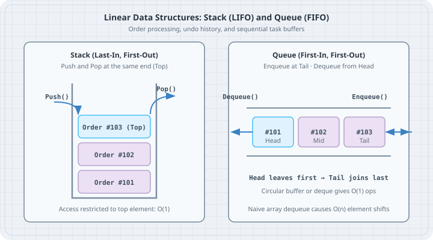

# Stacks, Queues, and Ring Buffers

A **stack** is a Last-In, First-Out (LIFO) structure used for state rollback, undo histories, and expression parsing. A **queue** is a First-In, First-Out (FIFO) pipeline used for scheduling orders, dispatching workers, and stream buffering. In Go, the boring default is an array-backed slice, but subtle traps lurk when dequeuing or popping pointers without zeroing their slots.



## Mental model

In a stack, all activity happens at the top. Pushing appends to the end of a slice in $O(1)$ amortized time. Popping shrinks the slice length by one in $O(1)$ time.

```
Stack (LIFO)                   Queue (FIFO)
+-------------+
| Order #103  | <-- Top (Push/Pop)     Enqueue -> [ #103 | #102 | #101 ] -> Dequeue
+-------------+                         (Tail)                     (Head)
| Order #102  |
+-------------+
| Order #101  |
+-------------+
```

In a naive queue, calling `queue = queue[1:]` keeps the underlying array allocated. As elements are consumed, earlier slots become unreachable garbage that cannot be reclaimed by the garbage collector until the whole slice backing array is reallocated. For high-throughput dispatchers, a **Ring Buffer** (circular array) wraps read and write pointers around a fixed-size buffer using modulo arithmetic, giving true $O(1)$ operations with zero garbage collector churn:

```
Ring Buffer (Capacity: 4)
           [0] Order-1
          /   \
  [3] Empty    [1] Order-2  <-- Read Head: 0, Write Tail: 3
          \   /
           [2] Order-3
```

## Worked examples

### Case 1: Generic LIFO Stack with Balanced Expression Check

Save as `stack_undo.go`. Implement a generic `Stack[T]` with Go generics and use it to validate whether desk formula brackets are balanced.

```go
// stack_undo.go
package main

import (
	"fmt"
)

type Stack[T any] struct {
	items []T
}

func NewStack[T any]() *Stack[T] {
	return &Stack[T]{items: make([]T, 0, 8)}
}

func (s *Stack[T]) Push(val T) {
	s.items = append(s.items, val)
}

func (s *Stack[T]) Pop() (T, bool) {
	var zero T
	if len(s.items) == 0 {
		return zero, false
	}
	lastIdx := len(s.items) - 1
	item := s.items[lastIdx]
	s.items[lastIdx] = zero // Zero out slot to avoid memory leaks
	s.items = s.items[:lastIdx]
	return item, true
}

func (s *Stack[T]) Peek() (T, bool) {
	var zero T
	if len(s.items) == 0 {
		return zero, false
	}
	return s.items[len(s.items)-1], true
}

func (s *Stack[T]) Len() int {
	return len(s.items)
}

func isBalanced(expr string) bool {
	pairs := map[rune]rune{
		')': '(',
		'}': '{',
		']': '[',
	}
	openers := map[rune]bool{
		'(': true,
		'{': true,
		'[': true,
	}

	stack := NewStack[rune]()

	for _, ch := range expr {
		if openers[ch] {
			stack.Push(ch)
		} else if match, exists := pairs[ch]; exists {
			top, ok := stack.Pop()
			if !ok || top != match {
				return false
			}
		}
	}

	return stack.Len() == 0
}

func main() {
	expr1 := "TABLE_TOTAL([ITEM(12) + TAX{0.08}] * QTY(2))"
	expr2 := "TABLE_TOTAL([ITEM(12) + TAX{0.08)]" // Mismatched ) and }

	fmt.Printf("Expression 1 valid: %t\n", isBalanced(expr1))
	fmt.Printf("Expression 2 valid: %t\n", isBalanced(expr2))
}
```

Run:

```bash
go run stack_undo.go
```

Output:

```
Expression 1 valid: true
Expression 2 valid: false
```

### Case 2: Ring Buffer FIFO Queue

Save as `ring_buffer.go`. Implement a fixed-capacity circular buffer queue for incoming orders that avoids repeated allocations.

```go
// ring_buffer.go
package main

import (
	"errors"
	"fmt"
)

var (
	ErrBufferFull  = errors.New("ring buffer is full")
	ErrBufferEmpty = errors.New("ring buffer is empty")
)

type RingBuffer[T any] struct {
	buf   []T
	head  int // Read position
	tail  int // Write position
	count int
	cap   int
}

func NewRingBuffer[T any](capacity int) *RingBuffer[T] {
	return &RingBuffer[T]{
		buf:  make([]T, capacity),
		cap:  capacity,
		head: 0,
		tail: 0,
	}
}

func (r *RingBuffer[T]) Enqueue(item T) error {
	if r.count == r.cap {
		return ErrBufferFull
	}
	r.buf[r.tail] = item
	r.tail = (r.tail + 1) % r.cap
	r.count++
	return nil
}

func (r *RingBuffer[T]) Dequeue() (T, error) {
	var zero T
	if r.count == 0 {
		return zero, ErrBufferEmpty
	}
	item := r.buf[r.head]
	r.buf[r.head] = zero // Free slot reference
	r.head = (r.head + 1) % r.cap
	r.count--
	return item, nil
}

func (r *RingBuffer[T]) Len() int {
	return r.count
}

type Order struct {
	ID    int
	Table int
	Item  string
}

func main() {
	rb := NewRingBuffer[Order](3)

	fmt.Println("Enqueueing 3 orders...")
	_ = rb.Enqueue(Order{ID: 101, Table: 1, Item: "Tea"})
	_ = rb.Enqueue(Order{ID: 102, Table: 4, Item: "Soup"})
	_ = rb.Enqueue(Order{ID: 103, Table: 2, Item: "Salad"})

	err := rb.Enqueue(Order{ID: 104, Table: 5, Item: "Bread"})
	fmt.Printf("4th enqueue when full: %v\n", err)

	first, _ := rb.Dequeue()
	fmt.Printf("Dequeued head: ID=%d Item=%s\n", first.ID, first.Item)

	fmt.Println("Enqueueing Order 104 into vacated slot...")
	_ = rb.Enqueue(Order{ID: 104, Table: 5, Item: "Bread"})

	for rb.Len() > 0 {
		ord, _ := rb.Dequeue()
		fmt.Printf("Remaining queue order: ID=%d Table=%d Item=%s\n", ord.ID, ord.Table, ord.Item)
	}
}
```

Run:

```bash
go run ring_buffer.go
```

Output:

```
Enqueueing 3 orders...
4th enqueue when full: ring buffer is full
Dequeued head: ID=101 Item=Tea
Enqueueing Order 104 into vacated slot...
Remaining queue order: ID=102 Table=4 Item=Soup
Remaining queue order: ID=103 Table=2 Item=Salad
Remaining queue order: ID=104 Table=5 Item=Bread
```

## The trap

The most common memory leak in Go stacks and queues is forgetting to zero out references before shrinking a slice. If the slice holds pointers (`[]*Ticket`), simply truncating `s = s[:len(s)-1]` leaves the pointer in the backing array. As long as the slice capacity exists, the GC will never free the referenced `Ticket`, causing an invisible memory leak.

```go
// bad_pop.go
package main

import "fmt"

type HugePayload struct {
	Data [1024]byte
}

type BadStack struct {
	items []*HugePayload
}

func (b *BadStack) BadPop() *HugePayload {
	last := len(b.items) - 1
	item := b.items[last]
	b.items = b.items[:last] // TRAP: b.items[last] still holds the pointer!
	return item
}

func (b *BadStack) GoodPop() *HugePayload {
	last := len(b.items) - 1
	item := b.items[last]
	b.items[last] = nil // FIXED: Clear slot for garbage collector
	b.items = b.items[:last]
	return item
}

func main() {
	stack := &BadStack{items: []*HugePayload{{}, {}}}
	_ = stack.GoodPop()
	fmt.Printf("Good pop safely decremented length: %d\n", len(stack.items))
}
```

Run:

```bash
go run bad_pop.go
```

Output:

```
Good pop safely decremented length: 1
```

## The boring rule

1. Use a plain slice `[]T` for stacks. Append to push; slice off the end to pop.
2. Always overwrite the popped index with `var zero T` (or `nil` for pointers) before slicing down.
3. For small queues ($< 1000$ operations), a slice with `queue = queue[1:]` is fine, but periodic compaction or a two-index approach is necessary for long-running services.
4. For high-frequency streaming workloads, choose a fixed-size `RingBuffer` to eliminate GC allocation pressure entirely.

## Try this

1. Modify `stack_undo.go` to implement an `UndoHistory` struct with `Do(action)` and `Undo()` methods that revert desk ticket state changes.
2. Extend `RingBuffer` in `ring_buffer.go` to automatically double its internal capacity when full rather than returning `ErrBufferFull`.
