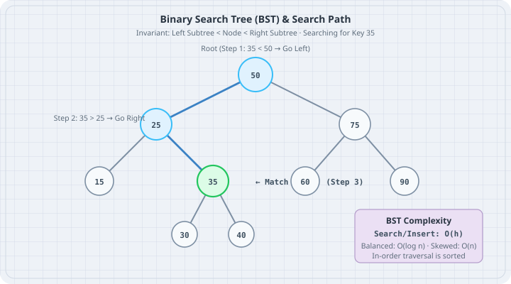

# Binary Search Trees

A **Binary Search Tree (BST)** organizes comparable keys in a hierarchical structure where every left descendant is strictly smaller than the node, and every right descendant is strictly greater. The boring default in Go for key-value lookups is the built-in `map`, but a BST provides ordered iteration, range queries, and minimum/maximum finding in $O(h)$ time where $h$ is the tree height.



## Mental model

In a balanced BST with $n$ nodes, the height $h \approx \log_2 n$. Searching, inserting, and deleting require traversing from root to leaf, taking $O(\log n)$ operations.

```
            [ 50: Desk-A ]
            /            \
     [ 25: Desk-B ]     [ 75: Desk-C ]
      /          \
[ 15: Desk-D ]  [ 35: Desk-E ]
```

- **Search Rule:** To find key `35`, compare with root `50`. Since $35 < 50$, go Left to `25`. Since $35 > 25$, go Right to `35` (Match!).
- **Traversals:**
  - **In-Order** (Left, Node, Right): Visits keys in strictly sorted ascending order (`15, 25, 35, 50, 75`).
  - **Pre-Order** (Node, Left, Right): Useful for serializing the tree structure.
  - **Post-Order** (Left, Right, Node): Useful for bottom-up cleanup or expression evaluation.

## Worked examples

### Case 1: Generic BST with Insert, Search, and In-Order Traversal

Save as `bst_desk.go`. Implement a generic BST where keys satisfy `cmp.Ordered` and values represent desk dispatch records.

```go
// bst_desk.go
package main

import (
	"cmp"
	"fmt"
)

type BSTNode[K cmp.Ordered, V any] struct {
	Key   K
	Value V
	Left  *BSTNode[K, V]
	Right *BSTNode[K, V]
}

type BST[K cmp.Ordered, V any] struct {
	Root *BSTNode[K, V]
	size int
}

func (t *BST[K, V]) Insert(key K, val V) {
	t.Root = insertNode(t.Root, key, val)
	t.size++
}

func insertNode[K cmp.Ordered, V any](node *BSTNode[K, V], key K, val V) *BSTNode[K, V] {
	if node == nil {
		return &BSTNode[K, V]{Key: key, Value: val}
	}
	if key < node.Key {
		node.Left = insertNode(node.Left, key, val)
	} else if key > node.Key {
		node.Right = insertNode(node.Right, key, val)
	} else {
		node.Value = val // Update existing key
	}
	return node
}

func (t *BST[K, V]) Search(key K) (V, bool) {
	curr := t.Root
	for curr != nil {
		if key == curr.Key {
			return curr.Value, true
		} else if key < curr.Key {
			curr = curr.Left
		} else {
			curr = curr.Right
		}
	}
	var zero V
	return zero, false
}

func (t *BST[K, V]) InOrder(visit func(key K, val V)) {
	inOrderWalk(t.Root, visit)
}

func inOrderWalk[K cmp.Ordered, V any](node *BSTNode[K, V], visit func(key K, val V)) {
	if node == nil {
		return
	}
	inOrderWalk(node.Left, visit)
	visit(node.Key, node.Value)
	inOrderWalk(node.Right, visit)
}

func main() {
	tree := &BST[int, string]{}
	tree.Insert(50, "Central Depot")
	tree.Insert(25, "North Annex")
	tree.Insert(75, "South Terminal")
	tree.Insert(15, "Substation 1")
	tree.Insert(35, "Substation 2")

	// Lookups
	target := 35
	if val, ok := tree.Search(target); ok {
		fmt.Printf("Search Key %d: Found '%s'\n", target, val)
	}

	// Sorted in-order traversal
	fmt.Println("\nIn-order sorted walkthrough:")
	tree.InOrder(func(k int, v string) {
		fmt.Printf("  Key %d -> %s\n", k, v)
	})
}
```

Run:

```bash
go run bst_desk.go
```

Output:

```
Search Key 35: Found 'Substation 2'

In-order sorted walkthrough:
  Key 15 -> Substation 1
  Key 25 -> North Annex
  Key 35 -> Substation 2
  Key 50 -> Central Depot
  Key 75 -> South Terminal
```

### Case 2: Deleting a node from a BST

Save as `bst_delete.go`. Implement node deletion considering three structural cases: leaf node, node with one child, and node with two children (replaced by in-order successor).

```go
// bst_delete.go
package main

import (
	"cmp"
	"fmt"
)

type Node[K cmp.Ordered] struct {
	Key   K
	Left  *Node[K]
	Right *Node[K]
}

func insert[K cmp.Ordered](root *Node[K], key K) *Node[K] {
	if root == nil {
		return &Node[K]{Key: key}
	}
	if key < root.Key {
		root.Left = insert(root.Left, key)
	} else if key > root.Key {
		root.Right = insert(root.Right, key)
	}
	return root
}

func minNode[K cmp.Ordered](node *Node[K]) *Node[K] {
	curr := node
	for curr.Left != nil {
		curr = curr.Left
	}
	return curr
}

func deleteNode[K cmp.Ordered](root *Node[K], key K) *Node[K] {
	if root == nil {
		return nil
	}

	if key < root.Key {
		root.Left = deleteNode(root.Left, key)
	} else if key > root.Key {
		root.Right = deleteNode(root.Right, key)
	} else {
		// Found node to delete

		// Case 1 & 2: 0 or 1 child
		if root.Left == nil {
			return root.Right
		} else if root.Right == nil {
			return root.Left
		}

		// Case 3: 2 children -> Find in-order successor (smallest in right subtree)
		successor := minNode(root.Right)
		root.Key = successor.Key
		root.Right = deleteNode(root.Right, successor.Key)
	}
	return root
}

func printTree[K cmp.Ordered](root *Node[K]) {
	if root == nil {
		return
	}
	printTree(root.Left)
	fmt.Printf("%v ", root.Key)
	printTree(root.Right)
}

func main() {
	var root *Node[int]
	keys := []int{50, 30, 70, 20, 40, 60, 80}
	for _, k := range keys {
		root = insert(root, k)
	}

	fmt.Print("Initial tree: ")
	printTree(root)
	fmt.Println()

	fmt.Println("Deleting leaf 20 (no children)...")
	root = deleteNode(root, 20)
	printTree(root)
	fmt.Println()

	fmt.Println("Deleting node 30 (one child 40)...")
	root = deleteNode(root, 30)
	printTree(root)
	fmt.Println()

	fmt.Println("Deleting root 50 (two children: replaced by successor 60)...")
	root = deleteNode(root, 50)
	printTree(root)
	fmt.Println()
}
```

Run:

```bash
go run bst_delete.go
```

Output:

```
Initial tree: 20 30 40 50 60 70 80 
Deleting leaf 20 (no children)...
30 40 50 60 70 80 
Deleting node 30 (one child 40)...
40 50 60 70 80 
Deleting root 50 (two children: replaced by successor 60)...
40 60 70 80 
```

## The trap

The degenerate tree trap occurs when keys are inserted in pre-sorted order (`1, 2, 3, 4, 5`). Without self-balancing (such as Red-Black or AVL rotations), each new node attaches exclusively to the right pointer, turning the tree into a linked list with $O(n)$ height. A query that should take 20 hops in a balanced tree takes 1,000,000 hops in a degenerate tree, blowing out stack frames.

```
Degenerate BST (from sorted input):
[ 1 ]
     \
     [ 2 ]
          \
          [ 3 ]
               \
               [ 4 ]  <-- Search time degraded to O(n)!
```

## The boring rule

1. If you only need fast $O(1)$ lookups and updates, use Go's built-in `map`. Do not build a tree.
2. Use a tree when you need sorted traversal, predecessor/successor queries, or finding keys within a numerical range (`minKey <= k <= maxKey`).
3. If keys arrive in sorted order, shuffle them or use a balanced variant to avoid degenerate $O(n)$ linked list chains.
4. Prefer iterative loops over deep recursion for `Search` to eliminate function call overhead and stack exhaustion.

## Try this

1. Implement `FindRange(min, max K) []V` on `BST` to collect all desk orders between two ticket IDs.
2. Calculate the height of the tree using a recursive `Height(node)` function and compare it between random vs sorted insertions.
