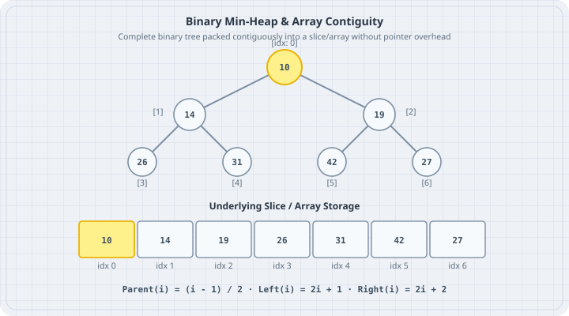

# Heaps and Priority Queues

A **binary heap** is a complete binary tree packed contiguously into a slice without pointer overhead. A **priority queue** uses this heap structure to ensure that the element with the highest (or lowest) priority is always available at the root in $O(1)$ time, with additions and removals running in $O(\log n)$ time. In Go, the boring default is the standard library's `container/heap` package, but understanding the underlying array arithmetic explains how it works.



## Mental model

A binary heap satisfies two core invariants:

1. **Shape Property:** It is a complete binary tree. Every level is fully filled, except possibly the bottom level, which is filled from left to right.
2. **Heap Property:** In a **Min-Heap**, every parent is $\le$ its children ($Root$ is the absolute minimum). In a **Max-Heap**, every parent is $\ge$ its children.

Because the tree is complete, it requires zero pointers. It maps directly to an array or slice:

```
Tree view:                Array index view:
       [ 10 (idx:0) ]     +----+----+----+----+----+----+
       /            \     | 10 | 14 | 19 | 26 | 31 | 42 |
  [ 14 (1) ]    [ 19 (2) ] +----+----+----+----+----+----+
   /      \      /          0    1    2    3    4    5
[ 26(3)] [31(4)][42(5)]
```

Given any index $i$:

- $\text{Parent}(i) = \lfloor (i - 1) / 2 \rfloor$
- $\text{Left Child}(i) = 2i + 1$
- $\text{Right Child}(i) = 2i + 2$

Operations:

- **Push (Sift-Up):** Append item to the end of the slice; repeatedly swap with its parent until heap order is restored.
- **Pop (Sift-Down):** Swap the root with the last element; pop the end off the slice; repeatedly sift the new root down by swapping with its smallest child.

## Worked examples

### Case 1: Generic Min-Heap from scratch

Save as `heap_scratch.go`. Build an array-backed generic min-heap using Go generics and index arithmetic.

```go
// heap_scratch.go
package main

import (
	"cmp"
	"fmt"
)

type MinHeap[T cmp.Ordered] struct {
	items []T
}

func (h *MinHeap[T]) Push(val T) {
	h.items = append(h.items, val)
	h.siftUp(len(h.items) - 1)
}

func (h *MinHeap[T]) Pop() (T, bool) {
	var zero T
	if len(h.items) == 0 {
		return zero, false
	}
	min := h.items[0]
	lastIdx := len(h.items) - 1
	h.items[0] = h.items[lastIdx]
	h.items = h.items[:lastIdx]

	if len(h.items) > 0 {
		h.siftDown(0)
	}
	return min, true
}

func (h *MinHeap[T]) siftUp(idx int) {
	for idx > 0 {
		parent := (idx - 1) / 2
		if h.items[idx] < h.items[parent] {
			h.items[idx], h.items[parent] = h.items[parent], h.items[idx]
			idx = parent
		} else {
			break
		}
	}
}

func (h *MinHeap[T]) siftDown(idx int) {
	n := len(h.items)
	for {
		smallest := idx
		left := 2*idx + 1
		right := 2*idx + 2

		if left < n && h.items[left] < h.items[smallest] {
			smallest = left
		}
		if right < n && h.items[right] < h.items[smallest] {
			smallest = right
		}
		if smallest != idx {
			h.items[idx], h.items[smallest] = h.items[smallest], h.items[idx]
			idx = smallest
		} else {
			break
		}
	}
}

func main() {
	h := &MinHeap[int]{}
	scores := []int{42, 10, 31, 14, 26, 19}
	fmt.Println("Pushing scores:", scores)
	for _, s := range scores {
		h.Push(s)
	}

	fmt.Print("Popping in ascending priority order: ")
	for {
		val, ok := h.Pop()
		if !ok {
			break
		}
		fmt.Printf("%d ", val)
	}
	fmt.Println()
}
```

Run:

```bash
go run heap_scratch.go
```

Output:

```
Pushing scores: [42 10 31 14 26 19]
Popping in ascending priority order: 10 14 19 26 31 42 
```

### Case 2: Standard Library container/heap Priority Queue

Save as `desk_priority_queue.go`. Triage incoming desk maintenance tickets where priority 1 is critical emergency and priority 5 is routine cleanup.

```go
// desk_priority_queue.go
package main

import (
	"container/heap"
	"fmt"
)

type Ticket struct {
	ID       int
	Title    string
	Priority int // 1 = Critical, 2 = High, 3 = Normal, 4 = Low
	index    int // Index needed for update/fix operations
}

// PriorityQueue implements heap.Interface
type PriorityQueue []*Ticket

func (pq PriorityQueue) Len() int           { return len(pq) }
func (pq PriorityQueue) Less(i, j int) bool { return pq[i].Priority < pq[j].Priority }
func (pq PriorityQueue) Swap(i, j int) {
	pq[i], pq[j] = pq[j], pq[i]
	pq[i].index = i
	pq[j].index = j
}

func (pq *PriorityQueue) Push(x any) {
	n := len(*pq)
	item := x.(*Ticket)
	item.index = n
	*pq = append(*pq, item)
}

func (pq *PriorityQueue) Pop() any {
	old := *pq
	n := len(old)
	item := old[n-1]
	old[n-1] = nil // Avoid memory leak
	item.index = -1
	*pq = old[0 : n-1]
	return item
}

func main() {
	pq := &PriorityQueue{}
	heap.Init(pq)

	heap.Push(pq, &Ticket{ID: 201, Title: "Restock register tape", Priority: 4})
	heap.Push(pq, &Ticket{ID: 202, Title: "Kitchen grill failure", Priority: 1})
	heap.Push(pq, &Ticket{ID: 203, Title: "VIP Table Reservation", Priority: 2})
	heap.Push(pq, &Ticket{ID: 204, Title: "Wipe table 8", Priority: 3})

	fmt.Println("Dispatching tickets by urgency:")
	for pq.Len() > 0 {
		ticket := heap.Pop(pq).(*Ticket)
		fmt.Printf("  [Priority %d] Ticket #%d: %s\n", ticket.Priority, ticket.ID, ticket.Title)
	}
}
```

Run:

```bash
go run desk_priority_queue.go
```

Output:

```
Dispatching tickets by urgency:
  [Priority 1] Ticket #202: Kitchen grill failure
  [Priority 2] Ticket #203: VIP Table Reservation
  [Priority 3] Ticket #204: Wipe table 8
  [Priority 4] Ticket #201: Restock register tape
```

## The trap

The most prevalent bug with `container/heap` is calling the slice methods `pq.Push()` or `pq.Pop()` directly instead of the package-level functions `heap.Push(pq, x)` and `heap.Pop(pq)`. Calling `pq.Push()` appends without re-sifting; calling `heap.Push(pq, x)` invokes `pq.Push()` and then calls `siftUp()` to maintain the heap invariant.

```go
// bad_heap_call.go
package main

import (
	"container/heap"
	"fmt"
)

type IntHeap []int

func (h IntHeap) Len() int           { return len(h) }
func (h IntHeap) Less(i, j int) bool { return h[i] < h[j] }
func (h IntHeap) Swap(i, j int)      { h[i], h[j] = h[j], h[i] }
func (h *IntHeap) Push(x any)        { *h = append(*h, x.(int)) }
func (h *IntHeap) Pop() any {
	old := *h
	n := len(old)
	x := old[n-1]
	*h = old[0 : n-1]
	return x
}

func main() {
	h := &IntHeap{20, 30}
	heap.Init(h)

	// WRONG: Direct method call bypasses heap ordering
	h.Push(5)
	fmt.Printf("After direct Push(5), root is still wrong: %d\n", (*h)[0])

	// RIGHT: heap.Push maintains invariant
	heap.Push(h, 2)
	fmt.Printf("After heap.Push(2), root is true minimum: %d\n", (*h)[0])
}
```

Run:

```bash
go run bad_heap_call.go
```

Output:

```
After direct Push(5), root is still wrong: 20
After heap.Push(2), root is true minimum: 2
```

## The boring rule

1. Use `container/heap` for production priority queues in Go. It avoids reinventing sift math and is heavily optimized.
2. Always call `heap.Push(pq, item)` and `heap.Pop(pq)` through the `heap` package, never on the type directly.
3. In `Pop()`, always assign `old[n-1] = nil` before truncating the slice to prevent memory leaks when holding pointer references.
4. If you need a Max-Heap instead of a Min-Heap, simply reverse the comparison in `Less(i, j)` (`return pq[i] > pq[j]`).

## Try this

1. Implement `heap.Fix(pq, i)` in `desk_priority_queue.go` to upgrade an existing ticket's priority from 4 (routine) to 1 (critical) after it has already been pushed.
2. Use a Min-Heap of fixed size $k$ to track the top-$k$ most expensive orders in a continuous stream of desk transactions.
