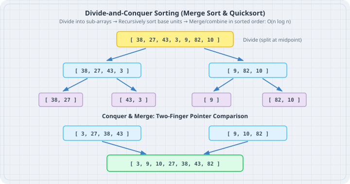

# Sorting Algorithms

Sorting arranges data in a predictable order so that searches, aggregations, and deduplications can execute in logarithmic time. In modern Go (1.21+), the boring default is `slices.Sort` and `slices.SortFunc`, which implement an adaptive pattern-defeating quicksort (pdqsort). Understanding the classical algorithms—**Insertion Sort**, **Merge Sort**, and **Quicksort**—explains why standard libraries choose hybrid approaches and how to avoid catastrophic worst-case traps.



## Mental model

Different sorting algorithms optimize for different constraints:

| Algorithm | Time (Best) | Time (Avg) | Time (Worst) | Memory | Stable? | Best Used When |
|---|---|---|---|---|---|---|
| **Insertion Sort** | $O(n)$ | $O(n^2)$ | $O(n^2)$ | $O(1)$ | Yes | Small slices ($n < 24$) or nearly-sorted data |
| **Merge Sort** | $O(n \log n)$ | $O(n \log n)$ | $O(n \log n)$ | $O(n)$ | Yes | Guaranteed predictable time and stable equality |
| **Quicksort** | $O(n \log n)$ | $O(n \log n)$ | $O(n^2)$ | $O(\log n)$ | No | General purpose, fast in-place cache locality |
| **Go `slices.Sort`** | $O(n)$ | $O(n \log n)$ | $O(n \log n)$ | $O(\log n)$ | No | Production default (pdqsort: hybrid quick+insertion+heap) |

### Insertion Sort
Works like sorting cards in hand: pick element $i$ and slide it backward into its sorted position among earlier cards.

### Merge Sort
Divides the slice into two halves, recursively sorts them, then merges the two sorted lists using two pointer comparisons into an auxiliary buffer.

### Quicksort
Picks a **pivot** element, partitions the slice so that all elements $\le pivot$ move to the left and all elements $> pivot$ move to the right, then recursively sorts both partitions in place.

```
Quicksort Partition step (Pivot: 25)
[ 14, 38, 10, 42, 25 ]
               ^ Pivot
After Partition:
[ 14, 10 ]  [ 25 ]  [ 38, 42 ]
 (<= 25)     Pivot     (> 25)
```

## Worked examples

### Case 1: Insertion Sort for Small/Nearly Sorted Batches

Save as `insertion_sort.go`. Implement generic insertion sort and demonstrate its linear speed on nearly sorted order streams.

```go
// insertion_sort.go
package main

import (
	"cmp"
	"fmt"
)

func InsertionSort[T cmp.Ordered](items []T) {
	n := len(items)
	for i := 1; i < n; i++ {
		key := items[i]
		j := i - 1
		// Shift elements greater than key one position right
		for j >= 0 && items[j] > key {
			items[j+1] = items[j]
			j--
		}
		items[j+1] = key
	}
}

type DeskOrder struct {
	ID    int
	Table int
}

func main() {
	// Nearly sorted tickets (common when late arrivals append to queue)
	tickets := []int{101, 102, 105, 103, 104, 106}
	fmt.Println("Before InsertionSort:", tickets)

	InsertionSort(tickets)
	fmt.Println("After InsertionSort: ", tickets)
}
```

Run:

```bash
go run insertion_sort.go
```

Output:

```
Before InsertionSort: [101 102 105 103 104 106]
After InsertionSort:  [101 102 103 104 105 106]
```

### Case 2: Stable Merge Sort

Save as `merge_sort.go`. Implement generic divide-and-conquer merge sort.

```go
// merge_sort.go
package main

import (
	"cmp"
	"fmt"
)

func MergeSort[T cmp.Ordered](items []T) []T {
	if len(items) <= 1 {
		return items
	}

	mid := len(items) / 2
	left := MergeSort(items[:mid])
	right := MergeSort(items[mid:])

	return merge(left, right)
}

func merge[T cmp.Ordered](left, right []T) []T {
	result := make([]T, 0, len(left)+len(right))
	i, j := 0, 0

	for i < len(left) && j < len(right) {
		if left[i] <= right[j] { // <= preserves stability
			result = append(result, left[i])
			i++
		} else {
			result = append(result, right[j])
			j++
		}
	}

	// Append leftovers
	result = append(result, left[i:]...)
	result = append(result, right[j:]...)
	return result
}

func main() {
	prices := []int{45, 12, 85, 32, 89, 39, 69, 44, 42, 1, 45}
	fmt.Println("Unsorted prices:", prices)

	sorted := MergeSort(prices)
	fmt.Println("Sorted prices:  ", sorted)
}
```

Run:

```bash
go run merge_sort.go
```

Output:

```
Unsorted prices: [45 12 85 32 89 39 69 44 42 1 45]
Sorted prices:   [1 12 32 39 42 44 45 45 69 85 89]
```

### Case 3: In-Place Quicksort with Lomuto Partition

Save as `quick_sort.go`. Implement in-place quicksort.

```go
// quick_sort.go
package main

import (
	"cmp"
	"fmt"
)

func QuickSort[T cmp.Ordered](items []T) {
	if len(items) <= 1 {
		return
	}
	quickSortHelper(items, 0, len(items)-1)
}

func quickSortHelper[T cmp.Ordered](items []T, low, high int) {
	if low < high {
		p := partition(items, low, high)
		quickSortHelper(items, low, p-1)
		quickSortHelper(items, p+1, high)
	}
}

func partition[T cmp.Ordered](items []T, low, high int) int {
	// Pick median or last element as pivot
	pivot := items[high]
	i := low

	for j := low; j < high; j++ {
		if items[j] < pivot {
			items[i], items[j] = items[j], items[i]
			i++
		}
	}
	items[i], items[high] = items[high], items[i]
	return i
}

func main() {
	orderIDs := []int{84, 12, 91, 45, 33, 72, 16, 50}
	fmt.Println("Before QuickSort:", orderIDs)

	QuickSort(orderIDs)
	fmt.Println("After QuickSort: ", orderIDs)
}
```

Run:

```bash
go run quick_sort.go
```

Output:

```
Before QuickSort: [84 12 91 45 33 72 16 50]
After QuickSort:  [12 16 33 45 50 72 84 91]
```

## The trap

The naive Quicksort trap is picking the first or last element as pivot without randomization or median-of-three sampling. When an array is already sorted, choosing the last element produces partitions of sizes $n-1$ and $0$. The recursion depth balloons from $\log n$ to $n$, causing $O(n^2)$ execution time and stack overflow on slices with 100,000 items.

This is why Go standard library's `slices.Sort` uses pattern-defeating quicksort, automatically falling back to HeapSort if recursion depth exceeds $2 \log_2 n$.

## The boring rule

1. In real Go production code, always use `slices.Sort(s)` for primitive values and `slices.SortFunc(s, cmpFunc)` for structs.
2. Never write a bespoke sorting algorithm unless you are operating under tight embedded memory constraints where zero stack frame allocation is mandatory.
3. If your data is guaranteed to be nearly sorted (e.g. periodically inserting 2 items into a list of 5,000 sorted records), Insertion Sort runs in $O(n)$ time and avoids quicksort setup overhead.
4. If you need a **stable** sort (where elements with equal keys retain their relative order), use `sort.SliceStable` or Merge Sort. Standard `slices.Sort` is not stable.

## Try this

1. Benchmark `InsertionSort` against `slices.Sort` on small slices of length $n = 8, 16, 32$. At what threshold does `slices.Sort` pull ahead?
2. Implement median-of-three pivot selection in `quick_sort.go` (comparing `low`, `mid`, and `high`) to neutralize the sorted array trap.
