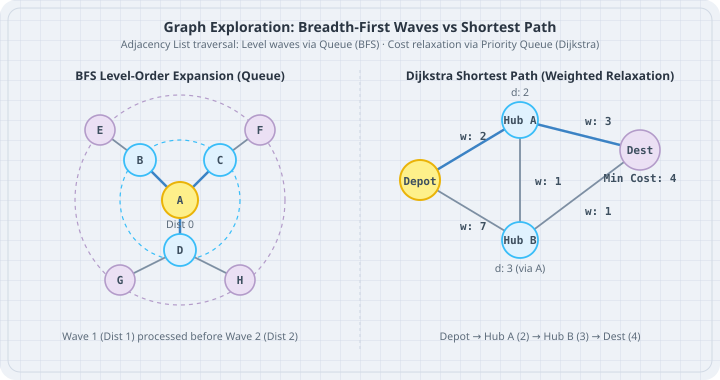

# Graphs and Traversals (BFS and DFS)

A **graph** represents relationships between entities as a set of **vertices** (nodes) connected by **edges**. Graphs model service dependencies, order routing networks, workflow pipelines, and social graphs. In Go, the boring default is an **adjacency list** represented using maps and slices. Traversing graphs via **Breadth-First Search (BFS)** and **Depth-First Search (DFS)** enables finding shortest hops, detecting cycles, and discovering connected components.



## Mental model

### Graph Representation: Adjacency List
An **adjacency matrix** allocates an $V \times V$ grid, consuming $O(V^2)$ memory even if most nodes have few connections. An **adjacency list** stores only existing edges, consuming $O(V + E)$ memory:

```
Adjacency List:
[Depot A] -> [Hub B, Hub C]
[Hub B]   -> [Depot A, Station D]
[Hub C]   -> [Depot A, Station D]
[Station D] -> [Hub B, Hub C]
```

### BFS vs DFS Traversals

- **Breadth-First Search (BFS):** Uses a **FIFO Queue**. It expands outward in concentric rings (all distance-1 neighbors first, then all distance-2 neighbors). **Guarantees the shortest path** in an unweighted graph.
- **Depth-First Search (DFS):** Uses a **Stack** (or call stack recursion). It plunges as deep as possible along each branch before backtracking. Ideal for topological sorting, maze solving, and cycle detection.

```
BFS Waves (Queue):            DFS Dive (Stack / Recursion):
       (A)                          (A)
     /  |  \                       /
   (B) (C) (D)  <- Wave 1        (B)
    |                             |
   (E)          <- Wave 2        (E) <- Dive deep before (C)
```

## Worked examples

### Case 1: Generic Graph with Adjacency List and BFS Shortest Hop

Save as `graph_bfs.go`. Model a fulfillment routing network and find the shortest hops from central depot to satellite hubs.

```go
// graph_bfs.go
package main

import (
	"fmt"
)

type Graph[T comparable] struct {
	adj map[T][]T
}

func NewGraph[T comparable]() *Graph[T] {
	return &Graph[T]{adj: make(map[T][]T)}
}

func (g *Graph[T]) AddEdge(u, v T, bidirectional bool) {
	g.adj[u] = append(g.adj[u], v)
	if bidirectional {
		g.adj[v] = append(g.adj[v], u)
	}
}

// BFS returns the shortest path (in number of edges) from start to target.
func (g *Graph[T]) ShortestPathBFS(start, target T) []T {
	if start == target {
		return []T{start}
	}

	visited := make(map[T]bool)
	parent := make(map[T]T)
	queue := []T{start}
	visited[start] = true

	found := false
	for len(queue) > 0 {
		curr := queue[0]
		queue = queue[1:]

		if curr == target {
			found = true
			break
		}

		for _, neighbor := range g.adj[curr] {
			if !visited[neighbor] {
				visited[neighbor] = true
				parent[neighbor] = curr
				queue = append(queue, neighbor)
			}
		}
	}

	if !found {
		return nil
	}

	// Reconstruct path backward from target to start
	var path []T
	curr := target
	for {
		path = append(path, curr)
		if curr == start {
			break
		}
		curr = parent[curr]
	}

	// Reverse path
	for i, j := 0, len(path)-1; i < j; i, j = i+1, j-1 {
		path[i], path[j] = path[j], path[i]
	}
	return path
}

func main() {
	network := NewGraph[string]()
	network.AddEdge("Central-Depot", "North-Hub", true)
	network.AddEdge("Central-Depot", "South-Hub", true)
	network.AddEdge("North-Hub", "Station-East", true)
	network.AddEdge("South-Hub", "Station-West", true)
	network.AddEdge("Station-East", "Terminal-Z", true)
	network.AddEdge("Station-West", "Terminal-Z", true)

	start := "Central-Depot"
	dest := "Terminal-Z"

	path := network.ShortestPathBFS(start, dest)
	fmt.Printf("BFS Shortest Route (%d hops):\n", len(path)-1)
	for i, stop := range path {
		if i > 0 {
			fmt.Print(" -> ")
		}
		fmt.Print(stop)
	}
	fmt.Println()
}
```

Run:

```bash
go run graph_bfs.go
```

Output:

```
BFS Shortest Route (3 hops):
Central-Depot -> North-Hub -> Station-East -> Terminal-Z
```

### Case 2: DFS for Workflow Cycle Detection

Save as `graph_dfs_cycle.go`. Check if a task dependency graph contains illegal circular dependencies before dispatching jobs.

```go
// graph_dfs_cycle.go
package main

import "fmt"

type TaskGraph struct {
	adj map[string][]string
}

func NewTaskGraph() *TaskGraph {
	return &TaskGraph{adj: make(map[string][]string)}
}

func (g *TaskGraph) AddDependency(task, dependsOn string) {
	// task -> dependsOn
	g.adj[task] = append(g.adj[task], dependsOn)
}

// HasCycle uses 3-color DFS:
// 0: Unvisited, 1: Currently Visiting (in call stack), 2: Fully Visited
func (g *TaskGraph) HasCycle() bool {
	state := make(map[string]int)

	var dfs func(task string) bool
	dfs = func(u string) bool {
		state[u] = 1 // Mark visiting (in progress)

		for _, v := range g.adj[u] {
			if state[v] == 1 {
				// Found back-edge to an ancestor currently in recursion stack!
				return true
			}
			if state[v] == 0 {
				if dfs(v) {
					return true
				}
			}
		}

		state[u] = 2 // Mark fully visited
		return false
	}

	for task := range g.adj {
		if state[task] == 0 {
			if dfs(task) {
				return true
			}
		}
	}
	return false
}

func main() {
	g := NewTaskGraph()
	g.AddDependency("Print-Receipt", "Verify-Payment")
	g.AddDependency("Verify-Payment", "Calculate-Tax")
	g.AddDependency("Calculate-Tax", "Read-Cart")

	fmt.Printf("Initial linear pipeline has cycle? %t\n", g.HasCycle())

	// Introduce circular deadlock: Read-Cart requires Print-Receipt
	fmt.Println("Introducing circular dependency: Read-Cart -> Print-Receipt")
	g.AddDependency("Read-Cart", "Print-Receipt")
	fmt.Printf("Updated pipeline has cycle? %t\n", g.HasCycle())
}
```

Run:

```bash
go run graph_dfs_cycle.go
```

Output:

```
Initial linear pipeline has cycle? false
Introducing circular dependency: Read-Cart -> Print-Receipt
Updated pipeline has cycle? true
```

## The trap

The most dangerous graph bug is traversing cyclic graphs without a `visited` set. If vertex $A$ points to $B$ and $B$ points back to $A$, an unguided recursive DFS will loop infinitely until the runtime exhausts goroutine stack memory (`fatal error: stack overflow`). Always maintain a `visited[node] = true` map or bitset.

## The boring rule

1. Use an adjacency list (`map[K][]K`) by default. Graphs in business services are almost always sparse.
2. If you need the shortest path in an **unweighted** graph, always use **BFS** with a FIFO queue.
3. If you need to detect cycles or topological ordering in directed pipelines, use **DFS** with a 3-color state tracking map.
4. When reconstructing paths, store `parent[child] = curr` during traversal rather than copying slice paths inside the queue.

## Try this

1. Implement topological sorting (`TopologicalSort() []string`) using DFS post-order traversal to produce a valid execution schedule for non-cyclic desk workflows.
2. Enhance `ShortestPathBFS` to return all connected clusters in an unpartitioned desk routing network.
