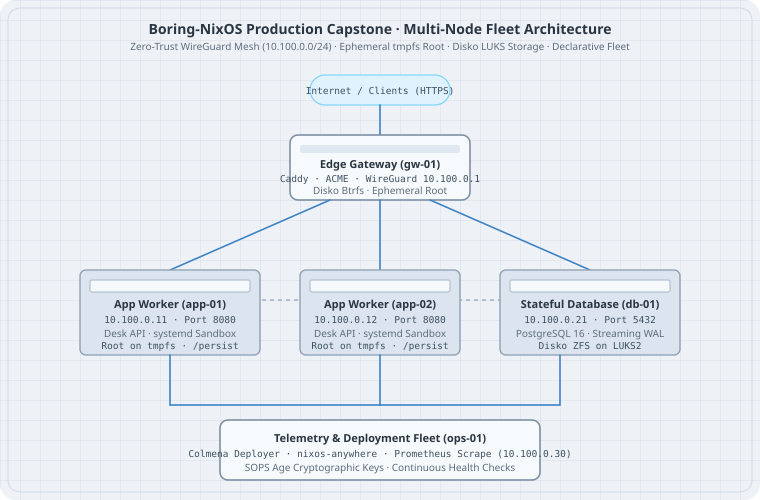

# Production Architecture and Threat Model

Toy VMs taught the pieces. The capstone is one **desk fleet** on NixOS 26.05: five roles, WireGuard, ephemeral workers, sops-nix, Colmena. The boring default is: **write the threat model first, then the flake — not a mesh of tools looking for a problem**.

## Mental model



| Host | Role | Persist |
|---|---|---|
| `gw-01` | Caddy, ACME, nftables; WireGuard `10.100.0.1` | certs, Caddy state |
| `app-01`, `app-02` | desk-api; tmpfs root; `DynamicUser` | nothing (ephemeral) |
| `db-01` | PostgreSQL; Disko LUKS + Btrfs | `/persist` |
| `ops-01` | Colmena, Prometheus, sops key broker | hive checkout, keys |

Invariants:

1. No secret bytes in git or `/nix/store`.
2. Store is read-only. Payloads in `/etc` die on reboot (workers).
3. WireGuard for all east-west. No DB port on the public NIC.
4. `flake.lock` on **nixos-26.05**; rollback is a generation, not a restore CD.
5. Backups of `/persist` (restic), not of `/nix/store`.

Public surface: TCP 443 on `gw-01` (and UDP 51820 on every peer). SSH from the office VPN or the `ops-01` jump only.

## Worked examples

### Case 1: Inventory in the flake

Save as `flake.nix`:

```nix
# flake.nix
{
  description = "Desk production fleet";

  inputs.nixpkgs.url = "github:NixOS/nixpkgs/nixos-26.05";

  outputs = { self, nixpkgs }:
    let
      mk = name: modules: nixpkgs.lib.nixosSystem {
        system = "x86_64-linux";
        modules = [
          { networking.hostName = name; system.stateVersion = "26.05"; }
        ] ++ modules;
      };
    in
    {
      nixosConfigurations = {
        gw-01  = mk "gw-01"  [ ./hosts/gw-01.nix ];
        app-01 = mk "app-01" [ ./hosts/app-01.nix ];
        app-02 = mk "app-02" [ ./hosts/app-02.nix ];
        db-01  = mk "db-01"  [ ./hosts/db-01.nix ];
        ops-01 = mk "ops-01" [ ./hosts/ops-01.nix ];
      };
    };
}
```

Five names. Five `system.stateVersion = "26.05"` because they are born here. Do not copy a `stateVersion` from a laptop that was installed on 24.11.

```bash
nix flake show
```

You should see five `nixosConfigurations`.

Save as `hosts/gw-01.nix` (shape — later chapters fill Caddy and WireGuard):

```nix
# hosts/gw-01.nix
{
  imports = [ ../modules/base-system.nix ../modules/wireguard-mesh.nix ];
  networking.firewall.allowedTCPPorts = [ 80 443 ];
  networking.firewall.allowedUDPPorts = [ 51820 ];
  # services.caddy … in the hardened-network chapter
}
```

If a port is not in `docs/threats.md`, it is not in this module.

### Case 2: Trust boundary in git

Save as `docs/threats.md`:

```markdown
# docs/threats.md
Public NIC: 443/tcp on gw-01, 51820/udp on every peer.
SSH: office VPN or ops-01 jump. No 22/tcp from 0.0.0.0/0.
Postgres: 5432/tcp on 10.100.0.21, wg0 only.
desk-api: 8080 on wg0; Caddy reverse-proxies from gw-01.
Attacker with a stolen app-01 disk: tmpfs, no secrets.
Attacker with a stolen db-01 disk: LUKS; restic passphrase is not on the disk.
```

If a port is not in this file, the firewall and the cloud SG must not open it.

```bash
git grep -n 'allowedTCPPorts\|allowedUDPPorts' -- '*.nix'
```

Every port in that grep lands in `docs/threats.md` or it is a bug. `0.0.0.0/0` on 22 is a bug even if the module lists 22.

### Case 3: Secret inventory

| Secret | Mechanism | Lives |
|---|---|---|
| WireGuard private keys | sops-nix → `/run/secrets` | encrypted in git |
| Postgres password | sops-nix `EnvironmentFile` | encrypted in git |
| ACME account / certs | Caddy module + `/persist` | `gw-01` persist |
| Colmena SSH key | `ops-01` persist | **not** the flake |
| restic password | sops-nix on `db-01` / `ops-01` | encrypted in git |

A secret that is only in a password manager is a secret that will not survive the next hire.

### Case 4: Failure drill list

| Failure | Response |
|---|---|
| Lose `app-01` | traffic already on `app-02`; nixos-anywhere a replacement; Colmena |
| Lose `db-01` | restic restore onto a new Disko disk; Colmena; check `pg_isready` on `wg0` |
| Bad generation on `app-01` | previous generation / Colmena rollback; revert git |
| Lose `gw-01` | ACME + persist restore; DNS TTL is why you kept it short |
| Stolen laptop with ops checkout | sops age key is **not** on the laptop; rotate the Colmena SSH key |

Write the restic repository URL in `docs/threats.md`. Not the password.

### Case 5: What this capstone is not

Not multi-region Kubernetes. Not Vault HA. Not a service mesh. Those are later, optional, and they each add a new trust boundary. If the five hosts rebuild from git + restic, you passed.

Order of the remaining capstone chapters: Disko + impermanence, WireGuard, application stack, Colmena + restic. Do not start with Istio.

## The trap

The trap is **starting with three clouds and a mesh** before SSH keys persist across reboot. Finish Disko, impermanence, sops, WireGuard, Colmena, restic. In that order. A threat model that lists “Zero Trust” and does not list `/persist` is a slide, not an ops doc.

## The boring rule

- 26.05 lock. Five hosts. One mesh. One secret system (sops).
- Public surface is 443 (+ 22 only from a tight SG / VPN).
- `/persist` is the backup. Store is the cache.
- Rollback is a generation.
- Write the threat model in git next to the flake.

## Try this

1. Copy the host table into `docs/threats.md`. Fill module file names.
2. List every port you think is open; compare to firewall + cloud SG in later chapters.
3. Name the restic repository in `docs/threats.md`.
4. Confirm `stateVersion` will be `"26.05"` on new metal — not copied from an old laptop.
