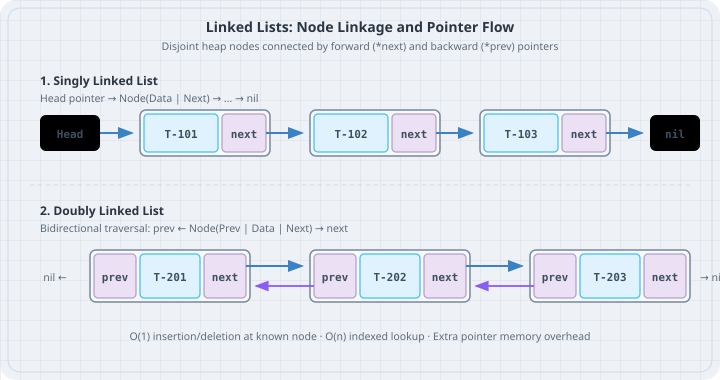

# Linked Lists

A **linked list** is a linear data structure where elements are stored in discrete node objects connected via pointers (`next` and `prev`) rather than contiguous memory slots. The boring default in Python is almost always a standard `list`, but building singly and doubly linked lists teaches explicit reference manipulation, recursive pointer traversal, and the trade-offs of CPU cache locality.



## Mental model

In a **singly linked list**, each node holds a data value and a reference to the next node. In a **doubly linked list**, each node holds references to both its successor (`next`) and predecessor (`prev`).

```
Singly Linked:
[Head] -> [Data: 101 | Next] -> [Data: 102 | Next] -> None

Doubly Linked:
None <- [Prev | Data: 101 | Next] <===> [Prev | Data: 102 | Next] -> None
```

### Python List vs Linked List: The Cache Reality

Python's built-in `list` is a dynamically resized contiguous array of pointers to objects:

| Feature | Python `list` | Doubly Linked List |
|---|---|---|
| Contiguity | Pointers stored contiguously | Nodes scattered arbitrarily across the heap |
| Memory Overhead | Very compact (single array) | Heavy (each node is a separate Python object with dict/slots) |
| Prepend / Insert at 0 | $O(n)$ (shifts pointer array) | $O(1)$ (rewires pointers) |
| Random Access `items[i]` | $O(1)$ instant lookup | $O(n)$ linear traversal |
| Cache Locality | High | Low (frequent CPU cache misses) |

Use linked lists when building complex structural graph foundations or an LRU cache where individual nodes must be moved between head and tail in $O(1)$ time without index lookups.

## Worked examples

### Case 1: Singly Linked List with in-place reversal

Save as `singly_linked.py`. Implement a generic singly linked list for desk routing tickets and reverse it in place.

```python
# singly_linked.py
from dataclasses import dataclass
from typing import Iterator


@dataclass
class Node[T]:
    value: T
    next: "Node[T] | None" = None


class SinglyLinkedList[T]:
    def __init__(self) -> None:
        self.head: Node[T] | None = None
        self._size = 0

    def append(self, val: T) -> None:
        new_node = Node(value=val)
        if self.head is None:
            self.head = new_node
            self._size += 1
            return

        curr = self.head
        while curr.next is not None:
            curr = curr.next
        curr.next = new_node
        self._size += 1

    def reverse(self) -> None:
        prev: Node[T] | None = None
        curr = self.head
        while curr is not None:
            next_node = curr.next
            curr.next = prev
            prev = curr
            curr = next_node
        self.head = prev

    def __iter__(self) -> Iterator[T]:
        curr = self.head
        while curr is not None:
            yield curr.value
            curr = curr.next

    def __len__(self) -> int:
        return self._size


def main() -> None:
    tickets: SinglyLinkedList[str] = SinglyLinkedList()
    tickets.append("Ticket-101")
    tickets.append("Ticket-102")
    tickets.append("Ticket-103")

    print("Original order:", list(tickets))

    print("Reversing linked list in place...")
    tickets.reverse()
    print("Reversed order: ", list(tickets))


if __name__ == "__main__":
    main()
```

Run:

```bash
uv run python singly_linked.py
```

Output:

```
Original order: ['Ticket-101', 'Ticket-102', 'Ticket-103']
Reversing linked list in place...
Reversed order:  ['Ticket-103', 'Ticket-102', 'Ticket-101']
```

### Case 2: Doubly Linked List with O(1) Node Removal

Save as `doubly_linked.py`. Implement a doubly linked list where any node can unlink itself from the chain in $O(1)$ time.

```python
# doubly_linked.py
class DNode[T]:
    __slots__ = ("value", "prev", "next")

    def __init__(self, value: T) -> None:
        self.value: T = value
        self.prev: DNode[T] | None = None
        self.next: DNode[T] | None = None


class DoublyLinkedList[T]:
    def __init__(self) -> None:
        self.head: DNode[T] | None = None
        self.tail: DNode[T] | None = None
        self._size = 0

    def append(self, val: T) -> DNode[T]:
        node = DNode(val)
        if self.tail is None:
            self.head = node
            self.tail = node
        else:
            node.prev = self.tail
            self.tail.next = node
            self.tail = node
        self._size += 1
        return node

    def remove(self, node: DNode[T]) -> None:
        if node.prev is not None:
            node.prev.next = node.next
        else:
            self.head = node.next

        if node.next is not None:
            node.next.prev = node.prev
        else:
            self.tail = node.prev

        node.next = None
        node.prev = None
        self._size -= 1

    def to_list(self) -> list[T]:
        items: list[T] = []
        curr = self.head
        while curr is not None:
            items.append(curr.value)
            curr = curr.next
        return items


def main() -> None:
    dll: DoublyLinkedList[int] = DoublyLinkedList()
    n1 = dll.append(201)
    n2 = dll.append(202)
    n3 = dll.append(203)

    print("Initial items:", dll.to_list())

    print(f"Removing middle node {n2.value} in O(1)...")
    dll.remove(n2)
    print("After middle removal:", dll.to_list())

    print(f"Removing head node {n1.value} in O(1)...")
    dll.remove(n1)
    print("After head removal:  ", dll.to_list())
    assert dll.tail is n3
```

Run:

```bash
uv run python doubly_linked.py
```

Output:

```
Initial items: [201, 202, 203]
Removing middle node 202 in O(1)...
After middle removal: [201, 203]
Removing head node 201 in O(1)...
After head removal:   [203]
```

## The trap

The most common trap in Python linked lists is memory bloat. Each Python object carries a substantial overhead (at least 56 bytes for an object dictionary and garbage collector headers). If you allocate 1,000,000 `Node` instances without `__slots__ = ("value", "prev", "next")`, your application consumes ~160 MB of memory just for node envelopes, compared to ~8 MB for a native `list`.

Always declare `__slots__` on node classes to prevent the creation of per-instance `__dict__` structures.

## The boring rule

1. Use standard Python `list` by default. It has superior cache locality and is implemented in C.
2. If you need efficient FIFO queue operations or deque pushes, use `collections.deque` instead of writing a custom linked list.
3. When authoring custom node classes, always add `__slots__ = (...)` to eliminate per-instance dictionary overhead.
4. When unlinking a node, explicitly clear `node.next = None` and `node.prev = None` to break cyclic references and aid Python's reference-counting garbage collector.

## Try this

1. Implement `find(predicate)` on `SinglyLinkedList` that returns the first matching node reference.
2. Build an `LRUCache(capacity=3)` using a combination of Python `dict` and `DoublyLinkedList` where reading an item moves its node to the head in $O(1)$ time.
