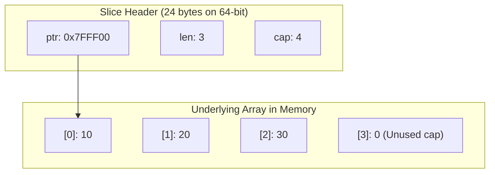
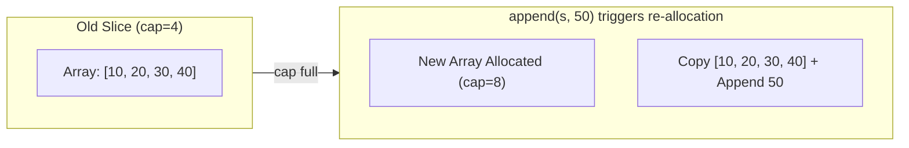

# Arrays and Slices

## Overview

Arrays and slices are Go's primary sequence types. Arrays are fixed-size, while slices are dynamic views into arrays.

## Arrays

### Declaration

```go
var arr [5]int                    // Zero values: [0 0 0 0 0]
arr := [5]int{1, 2, 3, 4, 5}     // Literal
arr := [...]int{1, 2, 3}          // Size inferred: [3]int
```

### Properties

- Fixed size (part of type): `[5]int` ≠ `[6]int`
- Value semantics: copying creates independent copy
- Zero value: array of zero values

```go
a := [3]int{1, 2, 3}
b := a        // Copy!
b[0] = 99
fmt.Println(a)  // [1 2 3] (unchanged)
```

## Slices

### Creation

```go
var s []int                      // nil slice
s := []int{1, 2, 3}             // Literal
s := make([]int, 5)             // Length 5, capacity 5
s := make([]int, 0, 10)         // Length 0, capacity 10
```

### From Array

```go
arr := [5]int{1, 2, 3, 4, 5}
s := arr[1:4]  // [2 3 4] - shares memory with arr
```

### Slice Internals & Reallocation

A slice header consists of three words: a pointer to the backing array, a length (`len`), and a capacity (`cap`).



When `append()` exceeds `cap`, Go allocates a new, larger backing array and copies existing elements:



### Length and Capacity

```go
s := make([]int, 3, 5)
len(s)  // 3 (elements accessible)
cap(s)  // 5 (space available)
```

## Slice Operations

### Append

```go
s := []int{1, 2, 3}
s = append(s, 4)           // [1 2 3 4]
s = append(s, 5, 6, 7)     // [1 2 3 4 5 6 7]
s = append(s, other...)    // Append another slice
```

### Slicing

```go
s := []int{0, 1, 2, 3, 4, 5}
s[1:4]   // [1 2 3]
s[:3]    // [0 1 2]
s[3:]    // [3 4 5]
s[:]     // [0 1 2 3 4 5] (copy of slice header)
```

### Copy

```go
src := []int{1, 2, 3}
dst := make([]int, len(src))
copy(dst, src)
```

## The `slices` Package (Go 1.21+)

The standard library `slices` package provides generic utilities for common operations.

```go
import "slices"

slices.Sort(nums)             // Sort in place
slices.Reverse(nums)          // Reverse in place
slices.Contains(nums, 42)     // Search
slices.Index(nums, 42)        // Find index
slices.Delete(nums, i, j)     // Remove range [i, j)
slices.Clone(nums)            // Shallow copy
slices.Equal(s1, s2)          // Compare
```

### Modern Loop Pattern (Go 1.23+)

Using iterators with slices:

```go
for i, v := range slices.All(nums) { /* ... */ }
for v := range slices.Values(nums) { /* ... */ }
```

## nil vs Empty Slice

```go
var nilSlice []int     // nil
emptySlice := []int{}  // not nil, but empty

nilSlice == nil        // true
emptySlice == nil      // false
len(nilSlice)          // 0
len(emptySlice)        // 0
```

## Common Patterns

### Remove Element

```go
s = append(s[:i], s[i+1:]...)  // Remove element at index i
```

### Insert Element

```go
s = append(s[:i], append([]int{v}, s[i:]...)...)
```

### Stack

```go
stack = append(stack, v)             // Push
v, stack = stack[len(stack)-1], stack[:len(stack)-1]  // Pop
```

## Summary

| Feature | Array | Slice |
|---------|-------|-------|
| Size | Fixed | Dynamic |
| Type | `[n]T` | `[]T` |
| Zero value | Array of zeros | `nil` |
| Comparison | `==` works | Not comparable |

## Related Topics
- [Working with Strings](16-strings.qmd)
- [Maps](17-maps.qmd)

## More examples

### Example: array vs slice

Save as `main.go` and `go run .` (with `go mod init example` if needed).

```go
package main

import "fmt"

func main() {
	var arr [3]int = [3]int{1, 2, 3}
	s := arr[:]
	s[0] = 9
	fmt.Println("arr:", arr)
	fmt.Println("slice:", s, "len", len(s), "cap", cap(s))
}
```

Expected:

```text
arr: [9 2 3]
slice: [9 2 3] len 3 cap 3
```

### Example: append and capacity growth

Save as `main.go` and `go run .` (with `go mod init example` if needed).

```go
package main

import "fmt"

func main() {
	s := make([]int, 0, 2)
	fmt.Printf("start len=%d cap=%d\n", len(s), cap(s))
	s = append(s, 1, 2)
	fmt.Printf("full  len=%d cap=%d %v\n", len(s), cap(s), s)
	s = append(s, 3)
	fmt.Printf("grow  len=%d cap=%d %v\n", len(s), cap(s), s)
}
```

Expected:

```text
start len=0 cap=2
full  len=2 cap=2 [1 2]
grow  len=3 cap=4 [1 2 3]
```

## Runnable example

Save as `main.go`. From an empty directory:

```bash
go mod init example
go run .
```

```go
package main

import (
	"fmt"
	"slices"
)

func main() {
	// Arrays: fixed size, value semantics
	a := [3]int{1, 2, 3}
	b := a
	b[0] = 99
	fmt.Println("array a (unchanged):", a)
	fmt.Println("array copy b:", b)

	// Slices: dynamic, share backing array until reallocation
	s := []int{10, 20, 30}
	fmt.Printf("s=%v len=%d cap=%d\n", s, len(s), cap(s))

	t := s[1:]
	t[0] = 200
	fmt.Println("after t[0]=200, s=", s, "t=", t)

	// append may reallocate when cap is exceeded
	s2 := make([]int, 3, 4)
	copy(s2, []int{1, 2, 3})
	fmt.Printf("before grow: %v len=%d cap=%d\n", s2, len(s2), cap(s2))
	s2 = append(s2, 4)
	fmt.Printf("cap full:    %v len=%d cap=%d\n", s2, len(s2), cap(s2))
	s2 = append(s2, 5)
	fmt.Printf("after grow:  %v len=%d cap=%d\n", s2, len(s2), cap(s2))

	// Independent copy
	src := []int{1, 2, 3}
	dst := make([]int, len(src))
	copy(dst, src)
	dst[0] = 7
	fmt.Println("src", src, "dst", dst)

	// nil vs empty
	var nilSlice []int
	empty := []int{}
	fmt.Printf("nil==nil? %v empty==nil? %v\n", nilSlice == nil, empty == nil)
	nilSlice = append(nilSlice, 1, 2)
	fmt.Println("append on nil:", nilSlice)

	// slices package (Go 1.21+)
	nums := []int{3, 1, 2}
	cloned := slices.Clone(nums)
	slices.Sort(cloned)
	fmt.Println("sorted clone:", cloned, "contains 2?", slices.Contains(cloned, 2))
}
```

**Expected output** (illustrative; exact new cap may vary by Go version):

```text
array a (unchanged): [1 2 3]
array copy b: [99 2 3]
s=[10 20 30] len=3 cap=3
after t[0]=200, s= [10 200 30] t= [200 30]
before grow: [1 2 3] len=3 cap=4
cap full:    [1 2 3 4] len=4 cap=4
after grow:  [1 2 3 4 5] len=5 cap=8
src [1 2 3] dst [7 2 3]
nil==nil? true empty==nil? false
append on nil: [1 2]
sorted clone: [1 2 3] contains 2? true
```

**What to notice:**
- Assigning an array copies elements; assigning/slicing a slice shares storage.
- `append` grows length and may allocate a larger backing array.
- `copy` creates an independent element sequence.
- `slices.Sort` / `Clone` are stdlib helpers—no third-party deps.

**Try next:** After `t := s[1:]`, append enough elements to `t` to force reallocation, then change `t[0]` and see whether `s` still changes.
