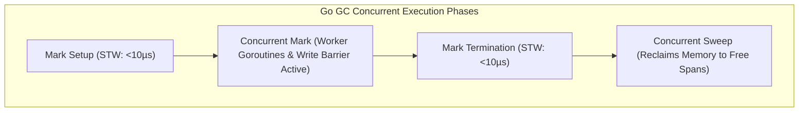
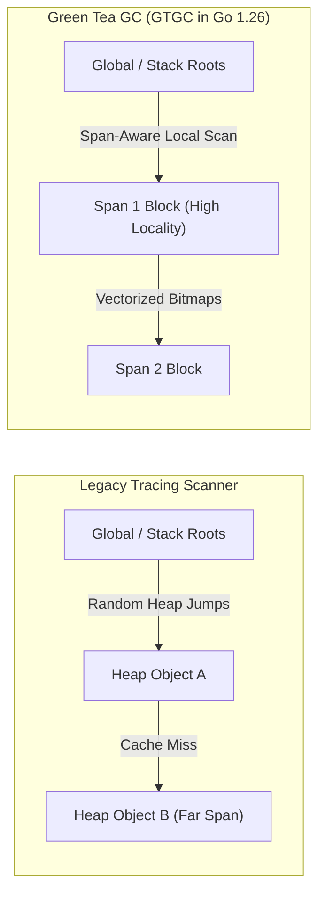

# Garbage Collection

## Overview

Go uses automatic garbage collection (GC) to manage memory. Understanding how it works helps you write GC-friendly code.

## Modern GC Architecture

### Concurrent Mark and Sweep
Go's GC is concurrent and non-moving. At a high level:
1. **Mark Setup**: (STW) Prepare for marking.
2. **Marking**: (Concurrent) Mark reachable objects.
3. **Mark Termination**: (STW) Finalize marking.
4. **Sweeping**: (Concurrent) Reclaim memory.



### Go 1.26: Green Tea GC (GTGC)

Go 1.26 switched the default collector to **Green Tea GC (GTGC)** for lower pause times and better cache locality in pointer-heavy workloads.



- **Span-Aware Locality**: Groups pointer scanning by physical memory spans to maximize CPU L1/L2 cache hits.
- **Lower CPU Overhead**: Reduces write-barrier costs in concurrent mutator workers.
- **Opt-Out**: If needed for debugging or legacy performance comparisons:

```bash
GOEXPERIMENT=nogreenteagc go test ./...
```

## GOGC and Memory Limits

Think of `GOGC` and `GOMEMLIMIT` as two controls:

- `GOGC` controls *when* to trigger based on heap growth.
- `GOMEMLIMIT` puts a soft cap on total Go-managed memory.

```text
Heap growth trigger                Memory budget trigger
live heap * (1 + GOGC/100)         total Go memory near GOMEMLIMIT
```

## Tuning with GOGC

```bash
# Default: GC when heap doubles (100% growth)
GOGC=100 ./myapp

# More aggressive: GC at 50% growth (uses less memory)
GOGC=50 ./myapp

# Less frequent: GC at 200% growth (faster, more memory)
GOGC=200 ./myapp

# Disable GC (not recommended)
GOGC=off ./myapp
```

## Tuning with GOMEMLIMIT

```bash
# Keep process around 2 GiB Go-managed memory
GOMEMLIMIT=2GiB ./myapp
```

Programmatic control:

```go
import "runtime/debug"

func init() {
    debug.SetMemoryLimit(2 << 30) // 2 GiB
}
```

## Memory Stats

```go
var m runtime.MemStats
runtime.ReadMemStats(&m)

fmt.Printf("Alloc: %d MB\n", m.Alloc/1024/1024)
fmt.Printf("Total Alloc: %d MB\n", m.TotalAlloc/1024/1024)
fmt.Printf("Heap Objects: %d\n", m.HeapObjects)
fmt.Printf("GC Cycles: %d\n", m.NumGC)
```

A low-overhead option for production telemetry:

```go
import "runtime/metrics"

samples := []metrics.Sample{
    {Name: "/gc/heap/live:bytes"},
    {Name: "/gc/heap/goal:bytes"},
}
metrics.Read(samples)
```

## Reducing GC Pressure

### 1. Reduce Allocations

```go
// Bad: allocates each call
func getBuffer() []byte {
    return make([]byte, 1024)
}

// Good: reuse with sync.Pool
var bufPool = sync.Pool{
    New: func() any { return make([]byte, 1024) },
}

func getBuffer() []byte {
    return bufPool.Get().([]byte)
}

func putBuffer(b []byte) {
    bufPool.Put(b)
}
```

### 2. Preallocate

```go
result := make([]int, 0, expectedSize)
```

### 3. Use Value Types

```go
// More allocations
type Points []*Point

// Fewer allocations
type Points []Point
```

### 4. Avoid String Concatenation in Loops

```go
// Bad: allocates each iteration
s := ""
for _, part := range parts {
    s += part
}

// Good: single allocation
var b strings.Builder
for _, part := range parts {
    b.WriteString(part)
}
s := b.String()
```

## Profiling

```bash
# CPU profile
go test -cpuprofile=cpu.out
go tool pprof cpu.out

# Memory profile
go test -memprofile=mem.out
go tool pprof mem.out

# View allocations
go tool pprof -alloc_space mem.out
```

## Summary

| Optimization | Technique |
|--------------|-----------|
| Reuse memory | `sync.Pool` |
| Preallocate | `make([]T, 0, cap)` |
| Values vs pointers | Use values for small types |
| String building | `strings.Builder` |

## Related Topics
- [Understanding Memory in Go](22-memory.qmd)
- [Performance Tuning](../09-performance-tooling/57-performance.qmd)

## More examples

### Example: preallocate slice capacity

Save as `main.go` and `go run .` (with `go mod init example` if needed).

```go
package main

import "fmt"

func main() {
	// Growing without capacity reallocates more often.
	var grow []int
	for i := 0; i < 5; i++ {
		grow = append(grow, i)
	}

	// Preallocated capacity reduces realloc churn.
	ready := make([]int, 0, 5)
	for i := 0; i < 5; i++ {
		ready = append(ready, i)
	}
	fmt.Println("grow:", grow, "len", len(grow), "cap", cap(grow))
	fmt.Println("ready:", ready, "len", len(ready), "cap", cap(ready))
}
```

Expected:

```text
grow: [0 1 2 3 4] len 5 cap 8
ready: [0 1 2 3 4] len 5 cap 5
```

### Example: strings.Builder vs naive concat

Save as `main.go` and `go run .` (with `go mod init example` if needed).

```go
package main

import (
	"fmt"
	"strings"
)

func main() {
	var b strings.Builder
	for i := 0; i < 4; i++ {
		fmt.Fprintf(&b, "%d,", i)
	}
	fmt.Println("builder:", b.String())

	// Educational contrast: repeated + creates more temporary strings.
	s := ""
	for i := 0; i < 4; i++ {
		s += fmt.Sprintf("%d,", i)
	}
	fmt.Println("concat:", s)
}
```

Expected:

```text
builder: 0,1,2,3,
concat: 0,1,2,3,
```

## Runnable example

Save as `main.go`. Then:

```bash
go mod init example
go run .
```

```go
package main

import (
	"fmt"
	"runtime"
)

func readStats() runtime.MemStats {
	var m runtime.MemStats
	runtime.ReadMemStats(&m)
	return m
}

func printStats(label string, m runtime.MemStats) {
	// HeapAlloc / HeapObjects are more stable educational signals than Alloc alone.
	fmt.Printf("%s: HeapAlloc=%d bytes HeapObjects=%d NumGC=%d\n",
		label, m.HeapAlloc, m.HeapObjects, m.NumGC)
}

func main() {
	runtime.GC()
	before := readStats()
	printStats("before alloc", before)

	// Keep a live reference so the GC cannot free these yet.
	keep := make([][]byte, 0, 100)
	for i := 0; i < 100; i++ {
		keep = append(keep, make([]byte, 64*1024)) // 64 KiB each
	}
	afterAlloc := readStats()
	printStats("after alloc", afterAlloc)

	// Drop references, then force a collection.
	keep = nil
	runtime.GC()
	afterGC := readStats()
	printStats("after GC", afterGC)

	fmt.Printf("objects grew by ~%d then GC cycles advanced by %d\n",
		int64(afterAlloc.HeapObjects)-int64(before.HeapObjects),
		afterGC.NumGC-before.NumGC)
}
```

**Expected output:** (numbers vary by platform and Go version; shape is stable)

```text
before alloc: HeapAlloc=... bytes HeapObjects=... NumGC=...
after alloc: HeapAlloc=... bytes HeapObjects=... NumGC=...
after GC: HeapAlloc=... bytes HeapObjects=... NumGC=...
objects grew by ~100 then GC cycles advanced by 1
```

Typically `HeapAlloc` and `HeapObjects` rise after the loop, then fall after `keep = nil` + `runtime.GC()`, while `NumGC` increases.

**What to notice:** Live pointers keep heap memory reachable; clearing the root and forcing GC lets the collector reclaim it. Absolute byte counts are not portable — look at direction of change.

**Try next:** Run with `GOGC=50` vs `GOGC=200` and compare how soon `NumGC` climbs during a longer allocation loop; try `sync.Pool` to reuse the 64 KiB buffers.
