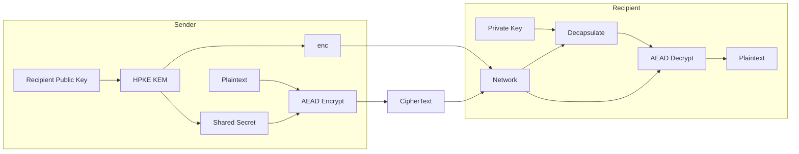

# Security Tools: Automating Defense

## Overview

Security should not depend on heroic manual review. Go has a strong toolchain for **static detection**, **reachable vulnerability analysis**, **capability inventory**, and **cryptographic testing**. Wire these into CI so regressions fail the build before they reach production.

This chapter covers `govulncheck`, `gosec`, `capslock`, `nilaway`, modern crypto helpers (`crypto/hpke`, `testing/cryptotest`), experimental secret handling, and how to assemble them into a pipeline.

## Suggested Security Pipeline

```text
commit
  --> go vet / golangci-lint
  --> gosec (or security linters)
  --> nilaway (optional, deeper nil analysis)
  --> govulncheck (reachable vulns)
  --> capslock (dependency capability review)
  --> go test (incl. crypto vectors)
  --> release / sign
```

```text
trust boundary diagram

developer laptop --> CI runners --> artifact registry --> runtime
     |                  |                 |                |
   secrets       pinned actions      cosign verify    least privilege
```

## 1. `govulncheck` — Reachability-Based Vuln Scanning

`govulncheck` uses the Go vulnerability database and **call graph reachability**. It prefers reporting issues your code can actually hit, not every CVE in the module graph.

```bash
go install golang.org/x/vuln/cmd/govulncheck@latest
govulncheck ./...

# JSON for CI parsing
govulncheck -json ./... > govulncheck.json
```

### CI snippet

```yaml
- name: govulncheck
  run: |
    go install golang.org/x/vuln/cmd/govulncheck@latest
    govulncheck ./...
```

### Interpreting results

1. Upgrade the module if a fixed version exists.
2. If unused, confirm with `govulncheck` (symbol level)—don't ignore blindly.
3. Vendor or replace only with a documented exception and expiry.

```bash
go get example.com/module@v1.2.4
go mod tidy
govulncheck ./...
```

## 2. `gosec` — AST Security Linter

`gosec` walks the AST looking for dangerous patterns.

```bash
go install github.com/securego/gosec/v2/cmd/gosec@latest
gosec ./...

# Exclude generated code
gosec -exclude-generated ./...
```

**Common findings:**

| Pattern | Risk |
|---------|------|
| Hardcoded credentials | Secret leakage |
| SQL via string concat | Injection |
| `math/rand` for security tokens | Predictable values |
| `chmod 0777` / weak file perms | Local privilege issues |
| `http` without TLS in prod configs | Cleartext |
| `unsafe` / weak crypto APIs | Memory / crypto breaks |

### Safer random and SQL examples

```go
// Bad: math/rand for tokens
// token := fmt.Sprintf("%d", rand.Int())

// Good: crypto/rand
func sessionToken() (string, error) {
    var b [16]byte
    if _, err := rand.Read(b[:]); err != nil {
        return "", err
    }
    return hex.EncodeToString(b[:]), nil
}
```

```go
// Bad
// db.Query("SELECT * FROM users WHERE name = '" + name + "'")

// Good
rows, err := db.QueryContext(ctx, `SELECT id, name FROM users WHERE name = $1`, name)
```

Tune severity in CI: fail on high/critical; track medium findings.

## 3. `capslock` — Capability Analysis

Google's **capslock** reports what *capabilities* a package graph uses: network, filesystem, runtime unsafe, os exec, etc.

```bash
go install github.com/google/capslock/cmd/capslock@latest
capslock -packages ./...
```

Use it when reviewing dependencies:

- A pure string helper that needs **Network** is a smell.
- A config parser that needs **OsExec** deserves scrutiny.
- Diff capslock output across PRs that bump dependencies.

```text
expected for a CLI file tool:  FileSystem, maybe Runtime
unexpected for left-pad clone: Network, CAP_SYS_ADMIN stories, etc.
```

## 4. `nilaway` — Static Nil Flows

Uber's **nilaway** tracks potential nil dereferences across functions more deeply than many linters.

```bash
go install go.uber.org/nilaway/cmd/nilaway@latest
nilaway ./...
```

It does not turn Go into Rust, but it catches real production panics:

```go
func loadUser(id string) (*User, error) {
    if id == "" {
        return nil, fmt.Errorf("empty id")
    }
    // ...
    return u, nil
}

func handler() {
    u, err := loadUser(id)
    if err != nil {
        return
    }
    // nilaway helps when err is ignored or only partially checked
    fmt.Println(u.Name)
}
```

Run as a periodic or blocking CI job if the signal-to-noise ratio works for your codebase.

## 5. Modern Crypto Tooling

### `crypto/hpke` (Hybrid Public Key Encryption)

HPKE (RFC 9180) combines KEM + KDF + AEAD for standardized envelope encryption—useful for config blobs, recipient-encrypted messages, and modern protocol designs.

```go
import (
    "crypto/hpke"
    "crypto/rand"
)

func encryptHPKE(recipientPub hpke.PublicKey, msg []byte) (enc, ciphertext []byte, err error) {
    suite := hpke.NewSuite(
        hpke.KEM_X25519_HKDF_SHA256,
        hpke.KDF_HKDF_SHA256,
        hpke.AEAD_AES_128_GCM,
    )
    sender, err := suite.NewSender(recipientPub, nil)
    if err != nil {
        return nil, nil, err
    }
    enc, sealer, err := sender.Setup(rand.Reader)
    if err != nil {
        return nil, nil, err
    }
    ciphertext, err = sealer.Seal(msg, nil)
    return enc, ciphertext, err
}
```



Prefer stdlib crypto primitives over hand-rolled combinations of ECDH + HKDF + GCM.

### `testing/cryptotest`

Use `testing/cryptotest` (where available in your Go version) to exercise cryptographic implementations against known vectors, basic correctness, and timing-related expectations for custom code that wraps stdlib primitives.

```go
func TestHMACVectors(t *testing.T) {
    // table-driven known-answer tests for your wrappers
    mac := hmac.New(sha256.New, []byte("key"))
    mac.Write([]byte("data"))
    got := mac.Sum(nil)
    want := mustHex("...") // known vector
    if !hmac.Equal(got, want) {
        t.Fatalf("mismatch")
    }
}
```

Always compare secrets with **constant-time** helpers (`subtle.ConstantTimeCompare`, `hmac.Equal`).

## 6. Experimental: `runtime/secret`

Experiments around tighter secret lifetimes appear behind build tags / `GOEXPERIMENT`. Treat them as **opt-in** and verify support for your Go version before relying on them in production.

```go
//go:build goexperiment.runtimesecret

import "runtime/secret"

func useSecret(token []byte) {
    secret.Do(func() {
        // limited lifetime window for sensitive material
        _ = token
    })
}
```

```bash
GOEXPERIMENT=runtimesecret go test ./...
```

Still follow classic hygiene: minimize copies, zero buffers when practical, don't log secrets, prefer OS keychains/HSMs for long-term keys.

## 7. Complementary Checks

| Tool | Role |
|------|------|
| `go vet` | Compiler-adjacent mistakes |
| `golangci-lint` | Aggregates many linters |
| `staticcheck` | High-signal correctness |
| `semgrep` / CodeQL | Org-wide custom rules |
| `govulncheck` | Module CVEs with reachability |
| Image scanners (`trivy`) | Container base CVEs |

Example golangci config fragment:

```yaml
linters:
  enable:
    - gosec
    - govet
    - staticcheck
    - errcheck
```

## Wiring a Makefile / CI Target

```makefile
.PHONY: sec
sec:
	go vet ./...
	gosec -quiet ./...
	govulncheck ./...
```

```yaml
# GitHub Actions job fragment
- name: Security
  run: make sec
```

## Production Checklist

- [ ] `govulncheck ./...` on every PR
- [ ] `gosec` or equivalent security linters enabled
- [ ] Dependency bumps reviewed with capslock when capabilities jump
- [ ] No `math/rand` for security tokens
- [ ] Parameterized SQL only
- [ ] Known-answer tests for crypto wrappers
- [ ] Secrets never in git; scanner in pre-commit optional
- [ ] Container images scanned on release
- [ ] Exceptions documented with owner + expiry

## Common Pitfalls

1. **Ignoring govulncheck because “it's transitive”** — reachability exists for a reason; verify.
2. **Disabling gosec rules globally** — narrow suppressions with comments and justification.
3. **Custom crypto** — combining primitives incorrectly; prefer HPKE/TLS/libsodium-grade designs.
4. **Logging tokens** — still the #1 operational leak.
5. **Security tools only on main** — PRs need the same gates.
6. **False confidence** — static tools don't replace threat modeling or fuzzing of parsers.

## Exercises

1. **Install and run** — Run `govulncheck` and `gosec` on this book's sample modules or a toy service; fix or document each finding.
2. **Token generator** — Implement `sessionToken` with `crypto/rand`; add a test that 1000 tokens are unique and correct length.
3. **SQL injection lab** — Write a deliberate vulnerable query (in a `_test` file or clearly broken sample) and show gosec flags it; then fix with parameters.
4. **Capslock review** — Run capslock on a module that imports `net/http` vs a pure algorithm package; compare capability sets.
5. **HMAC vectors** — Table-test an HMAC helper against a published RFC vector; use `hmac.Equal`.
6. **CI gate** — Add a `make sec` target and a workflow step that fails the build on findings.

## More examples

### Constant-time compare (HMAC / tokens)

```bash
mkdir -p /tmp/go-hmac-eq && cd /tmp/go-hmac-eq
go mod init example.com/hmac-eq
```

Save as `main.go`:

```go
package main

import (
	"crypto/hmac"
	"crypto/sha256"
	"encoding/hex"
	"fmt"
)

func sign(secret, msg string) string {
	m := hmac.New(sha256.New, []byte(secret))
	_, _ = m.Write([]byte(msg))
	return hex.EncodeToString(m.Sum(nil))
}

func valid(secret, msg, gotHex string) bool {
	want := sign(secret, msg)
	// Decode both; compare with hmac.Equal (constant-time on equal-length slices).
	a, err1 := hex.DecodeString(want)
	b, err2 := hex.DecodeString(gotHex)
	if err1 != nil || err2 != nil || len(a) != len(b) {
		return false
	}
	return hmac.Equal(a, b)
}

func main() {
	secret, msg := "s3cr3t", "POST /pay|42"
	sig := sign(secret, msg)
	fmt.Println("sig ok:", valid(secret, msg, sig))
	fmt.Println("tampered:", valid(secret, msg, sig[:len(sig)-1]+"0"))
	fmt.Println("wrong secret:", valid("other", msg, sig))
}
```

```bash
go run .
```

**Expected output:**

```
sig ok: true
tampered: false
wrong secret: false
```

### Path jail (block traversal)

```bash
mkdir -p /tmp/go-path-jail && cd /tmp/go-path-jail
go mod init example.com/path-jail
```

Save as `main.go`:

```go
package main

import (
	"fmt"
	"path/filepath"
	"strings"
)

func underRoot(root, userPath string) (string, error) {
	clean := filepath.Clean("/" + userPath) // force absolute-ish clean
	clean = strings.TrimPrefix(clean, string(filepath.Separator))
	full := filepath.Join(root, clean)
	rel, err := filepath.Rel(root, full)
	if err != nil || strings.HasPrefix(rel, "..") {
		return "", fmt.Errorf("escape: %q", userPath)
	}
	return full, nil
}

func main() {
	root := "/var/app/data"
	for _, p := range []string{"docs/a.txt", "../etc/passwd", "/etc/passwd"} {
		full, err := underRoot(root, p)
		if err != nil {
			fmt.Printf("%q -> ERR %v\n", p, err)
			continue
		}
		fmt.Printf("%q -> %s\n", p, full)
	}
}
```

```bash
go run .
```

**Expected output:**

```
"docs/a.txt" -> /var/app/data/docs/a.txt
"../etc/passwd" -> ERR escape: "../etc/passwd"
"/etc/passwd" -> ERR escape: "/etc/passwd"
```

## Runnable example

Security tools are external; the patterns they enforce are stdlib. This program generates session tokens with `crypto/rand`, signs and verifies an HMAC, and compares digests in constant time—the kind of code `gosec` expects instead of `math/rand`.

```bash
mkdir -p /tmp/go-sec-tools && cd /tmp/go-sec-tools
go mod init example.com/sec-tools
```

Save as `main.go`:

```go
package main

import (
	"crypto/hmac"
	"crypto/rand"
	"crypto/sha256"
	"encoding/hex"
	"fmt"
	"os"
)

func sessionToken(n int) (string, error) {
	b := make([]byte, n)
	if _, err := rand.Read(b); err != nil {
		return "", err
	}
	return hex.EncodeToString(b), nil
}

func sign(key, msg []byte) []byte {
	m := hmac.New(sha256.New, key)
	_, _ = m.Write(msg)
	return m.Sum(nil)
}

func main() {
	tok, err := sessionToken(16)
	if err != nil {
		fmt.Fprintln(os.Stderr, err)
		os.Exit(1)
	}
	fmt.Println("token:", tok)
	fmt.Println("token_len_hex:", len(tok))

	key := make([]byte, 32)
	if _, err := rand.Read(key); err != nil {
		fmt.Fprintln(os.Stderr, err)
		os.Exit(1)
	}
	msg := []byte("order:42:ship")
	sig := sign(key, msg)
	fmt.Println("hmac:", hex.EncodeToString(sig))

	// Constant-time compare (never == on secret slices).
	again := sign(key, msg)
	if !hmac.Equal(sig, again) {
		fmt.Println("verify: FAIL")
		os.Exit(1)
	}
	fmt.Println("verify: ok")

	// Wrong key must fail.
	badKey := make([]byte, 32)
	_, _ = rand.Read(badKey)
	if hmac.Equal(sig, sign(badKey, msg)) {
		fmt.Println("bad key unexpectedly matched")
		os.Exit(1)
	}
	fmt.Println("bad_key_rejected: ok")

	// Uniqueness smoke test.
	seen := map[string]struct{}{}
	for i := 0; i < 1000; i++ {
		t, err := sessionToken(16)
		if err != nil {
			fmt.Fprintln(os.Stderr, err)
			os.Exit(1)
		}
		if _, ok := seen[t]; ok {
			fmt.Println("duplicate token")
			os.Exit(1)
		}
		seen[t] = struct{}{}
	}
	fmt.Println("unique_tokens: 1000")
}
```

```bash
go run .
```

**Expected output** (illustrative; tokens random):

```
token: a3f1c9...
token_len_hex: 32
hmac: 9b2e...
verify: ok
bad_key_rejected: ok
unique_tokens: 1000
```

**What to notice**

- `crypto/rand` is for security-sensitive values; `math/rand` is a classic `gosec` finding.
- `hmac.Equal` (or `subtle.ConstantTimeCompare`) avoids timing leaks from `bytes.Equal` on secrets.
- Known-answer tests and uniqueness checks belong in CI next to `govulncheck` / `gosec`.

**Try next**

- Add a table-driven HMAC test with a fixed key/message and expected hex digest.
- Run `gosec ./...` and `govulncheck ./...` on this module once the tools are installed.

## Related Topics

- [Application Hardening](81-hardening.qmd)
- [CI/CD & Hardening](../10-infrastructure/73-ci-cd-security.qmd)
- [Static Analysis](../09-performance-tooling/58-static-analysis.qmd)
- [TLS / mTLS](../17-security-hardening/171-tls-mtls-deep-dive.qmd)
