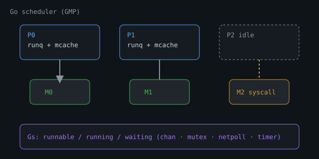

# Scheduler Deep Dive (GMP)

## Overview

Go multiplexes millions of **goroutines (G)** onto fewer OS **threads (M)** using **logical processors (P)**. Understanding GMP turns vague advice ("don't spawn unbounded goroutines") into capacity math.

> Diagram-rich companion series: [Internals for Interns — The Scheduler](https://internals-for-interns.com/posts/go-runtime-scheduler/).

::: {.content-visible when-format="html"}
{fig-alt="GMP: Ps with run queues bound to Ms; Gs runnable running or waiting"}
:::

```text
G  = goroutine (stack + state: runnable / running / waiting / dead)
M  = OS thread that executes Go code
P  = scheduling context (run queue, memory caches, limits) — count ≈ GOMAXPROCS
```

Only an **M bound to a P** runs ordinary Go code. Syscalls may park the P or spin another M so other Gs keep running.


## Diagram: GMP at a glance

```text
                    GOMAXPROCS ≈ number of Ps
  ┌─────────────────────────────────────────────────────────┐
  │  P0                    P1                    P2         │
  │  runq [G G G]          runq [G G]            runq []    │
  │  mcache …              mcache …              (idle)     │
  └──────────┬─────────────────────┬────────────────────────┘
             │ bound               │ bound
             v                     v
           M0 (OS thread)        M1 (OS thread)     M2 in syscall
             │                     │                  │
             v                     v                  │ P2 may be
           G-run                 G-run                │ retaken for
                                                      │ another M
  Waiting Gs: chan / mutex / netpoll / timer ──park──► wait queues
```

Only an **M bound to a P** runs ordinary Go code. Syscalls may free the P so other Gs keep running.

## Lifecycle of a G (creation → park → run)

```text
                    ┌──────────────┐
           recycle  │     Dead     │
          ┌────────►│  (free list) │◄──────── goexit
          │         └──────┬───────┘
          │                │ go f / goready
          │                v
          │         ┌──────────────┐
          │         │   Runnable   │◄──── wake / preempt
          │         └──────┬───────┘
          │                │ schedule (needs M+P)
          │                v
          │         ┌──────────────┐     entersyscall
          │         │   Running    │──────────────────┐
          │         └──────┬───────┘                  v
          │    park        │                   ┌──────────────┐
          │  (chan/mutex/  │                   │   Syscall    │
          │   sleep/poll)  │                   └──────┬───────┘
          │                v                          │
          │         ┌──────────────┐    return /      │
          │         │   Waiting    │    retake P      │
          │         └──────────────┘◄─────────────────┘
```

## Core Loop (Mental Model)

```text
                    +------------------+
  new G  ---------> |  global runq     |
                    +--------+---------+
                             | steal / distribute
                    +--------v---------+
                    |  P local runq    |  (per P)
                    +--------+---------+
                             |
              M executes G <-+
                             |
              G blocks (chan, mutex, I/O park)
                             |
              G becomes runnable again -----> runq
```

1. Each P has a **local run queue** (cheap, no global lock).
2. Overflow / balancing uses a **global run queue**.
3. Idle Ps **work-steal** from other Ps' local queues.
4. Network poller and timers inject runnable Gs.

## GOMAXPROCS

```go
runtime.GOMAXPROCS(0) // current setting
```

- Defaults to number of CPU cores (cgroup-aware on Linux in modern Go).
- Caps how many Gs run **Go code** in parallel (approx. number of Ps).
- Does **not** cap total goroutines or OS threads (threads can grow for syscalls).

Under a CPU quota (K8s), a wrong `GOMAXPROCS` causes either under-utilization or thrashing. Prefer auto-detection or set from cgroup limits intentionally.

## Preemption

Modern Go can preempt long-running Gs (async preemption) so a tight loop without function calls is less likely to starve the GC or other Gs. Still:

- Avoid owning a P forever with non-cooperative C code via cgo without care.
- `runtime.Gosched()` yields voluntarily — rare need if profiles do not show unfairness.

## Hand-off and Syscalls

When a G enters a syscall:

1. M may release its P so another M can run other Gs.
2. On return, M tries to reacquire a P; if none free, G goes runnable and M may park.

This is why blocking syscalls ≠ "all Go freezes," but **too many** blocking syscalls create many Ms and scheduler overhead.

## Scheduling Latency Signals

| Signal | Tool | Meaning |
|--------|------|---------|
| High `runtime.schedule` / `findrunnable` | CPU pprof | Scheduler overhead, not enough real work |
| Runnable Gs queueing | `go tool trace` | Over-subscription or lock/chan contention |
| Idle Ps + runnable Gs | trace | Load imbalance / GC / netpoll delays |
| Threads >> GOMAXPROCS | `runtime.NumCgoCall` / OS metrics | Syscall or cgo heavy |

## Design Rules From GMP

1. **Bound concurrency at the entrance** (semaphores, worker pools) — Gs are cheap, not free.
2. **Prefer non-blocking design at boundaries** — give every wait a context deadline.
3. **Match fan-out to Ps for CPU work** — `GOMAXPROCS` workers for pure CPU; more for I/O-bound wait.
4. **Measure under the real quota** — laptop cores ≠ pod millicores.

## Experiment

```bash
go mod init example
GOMAXPROCS=1 go run .
GOMAXPROCS=4 go run .
```

```go
package main

import (
	"fmt"
	"runtime"
	"sync"
	"time"
)

func burn(d time.Duration) {
	end := time.Now().Add(d)
	for time.Now().Before(end) {
		// busy spin
	}
}

func main() {
	fmt.Println("GOMAXPROCS", runtime.GOMAXPROCS(0))
	var wg sync.WaitGroup
	start := time.Now()
	n := 4
	for i := 0; i < n; i++ {
		wg.Add(1)
		go func() {
			defer wg.Done()
			burn(200 * time.Millisecond)
		}()
	}
	wg.Wait()
	fmt.Println("elapsed", time.Since(start))
}
```

**What to notice:** With `GOMAXPROCS=1`, four 200ms CPU burns serialize (~800ms). With 4, they overlap (~200ms). I/O-bound work would not scale the same way.

**Try next:** Capture `go tool trace` around a server under load; find "Proc start/stop" and long stretches where Gs are runnable but not running.

## Related

- [Concurrency basics](../07-concurrency-parallelism/40-concurrency-basics.qmd)
- [Contention tuning](../18-performance-engineering/183-contention-concurrency-tuning.qmd)
