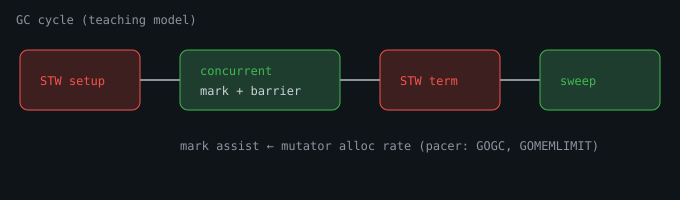

# GC Internals and Pacer

## Overview

Go's GC is a **concurrent, non-moving, mark-sweep** collector with a **pacer** that decides when to start marking so heap growth stays near a target. Go 1.26's **Green Tea GC** improves scan locality; the user-facing knobs (`GOGC`, `GOMEMLIMIT`) remain the control plane.

Practical tuning: [Garbage collection](../03-memory/25-garbage-collection.qmd), [Allocations & GC](../18-performance-engineering/182-memory-allocations-gc.qmd).

> Companion depth: [Internals for Interns — The Garbage Collector](https://internals-for-interns.com/posts/go-garbage-collector/) (GreenTea / mark phase notes).

::: {.content-visible when-format="html"}
{fig-alt="GC cycle: STW setup, concurrent mark, STW term, sweep"}
:::


## Diagram: GC cycle

```text
  mutator allocates ──► pacer (GOGC / GOMEMLIMIT)
                              │
                              v
                    ┌─────────────────┐
                    │ mark setup STW  │  (short)
                    └────────┬────────┘
                             v
                    ┌─────────────────┐
                    │ concurrent mark │◄── mark assist from allocators
                    │  + write barrier│
                    └────────┬────────┘
                             v
                    ┌─────────────────┐
                    │ mark term STW   │  (short)
                    └────────┬────────┘
                             v
                    ┌─────────────────┐
                    │ concurrent sweep│  reclaim spans
                    └─────────────────┘
```

## Heap Building Blocks

```text
arena / pages
    -> spans (size classes for small objects)
        -> objects
large objects: dedicated spans
```

Allocators (per-P caches) reduce cross-thread contention. When caches miss, they pull from central free lists / the heap.

## Tri-color intuition

```text
  white (unmarked) ──reach──► grey (to-scan) ──scan kids──► black
       │
       └── not reached ──► sweep reclaim
```

Write barriers keep the invariant safe while mutators run during concurrent mark.

## Mark and Sweep Phases

```text
1. Mark setup      STW (short)  — enable write barrier, root prep
2. Concurrent mark             — workers + mutator assists
3. Mark termination STW (short)
4. Concurrent sweep            — reclaim unmarked objects by span
```

### Write barrier

While marking, pointer writes are instrumented so the GC does not lose objects. Barriers add a small tax on pointer-heavy code — one reason reducing pointer count (or packing) helps.

### Mark assist

If the mutator allocates faster than markers can scan, the allocating G **helps mark**. This couples allocation rate to GC CPU and shows up as latency on the allocating path — not only in a GC thread.

## Pacer Goals

The pacer aims roughly:

```text
live heap after GC * (1 + GOGC/100)  ≈  heap size that triggers next GC
```

- **GOGC=100** (default): next GC when heap roughly doubles live size.
- Lower GOGC → more frequent GC, less peak memory.
- Higher GOGC → less GC CPU, more memory.

### GOMEMLIMIT

Soft limit on Go-managed memory. When approaching the limit, GC becomes more aggressive (and may return memory to the OS more eagerly depending on version/settings). Use with container memory limits to reduce OOM-kills:

```bash
GOMEMLIMIT=512MiB GOGC=100 ./service
```

Prefer **limit + reasonable GOGC** over `GOGC=off` fantasies.

## Green Tea GC (1.26+)

Span-aware scanning improves cache locality for pointer-rich heaps. Opt-out for experiments:

```bash
GOEXPERIMENT=nogreenteagc ./service
```

Validate with your workload's p95 and CPU profiles — do not assume every service wins equally.

## Reading GC Telemetry

```go
var m runtime.MemStats
runtime.ReadMemStats(&m)
// m.NumGC, GCCPUFraction, HeapAlloc, HeapInuse, NextGC, PauseTotalNs
```

Or metrics:

```text
go_gc_duration_seconds
go_memstats_heap_alloc_bytes
go_memstats_next_gc_bytes
```

### Latency pattern

Periodic p95 spikes aligned with `NumGC` increases often mean **assist or STW**, not "Go is slow." Fixes: fewer allocs, smaller pointer graphs, raise memory budget, or smooth allocation rate.

## Design Rules

1. **Allocate less** before tuning GOGC.
2. **Reuse buffers** (`[]byte` pools) on hot paths.
3. **Avoid pointer-heavy tiny objects** in huge graphs when possible (flatten).
4. **Set GOMEMLIMIT** in containers.
5. **Profile** — `pprof` heap + `trace` GC events.

## Experiment

```bash
go mod init example
go run .
```

```go
package main

import (
	"fmt"
	"runtime"
	"time"
)

func stats(label string) {
	var m runtime.MemStats
	runtime.ReadMemStats(&m)
	fmt.Printf("%s alloc=%dKiB nextGC=%dKiB numGC=%d gccpu=%.3f\n",
		label,
		m.Alloc/1024,
		m.NextGC/1024,
		m.NumGC,
		m.GCCPUFraction,
	)
}

func main() {
	stats("start")
	keep := make([][]byte, 0, 1000)
	for i := 0; i < 1000; i++ {
		keep = append(keep, make([]byte, 32*1024))
	}
	stats("after alloc")
	keep = nil
	runtime.GC()
	time.Sleep(50 * time.Millisecond)
	stats("after GC")
}
```

**What to notice:** `NextGC` rises with live heap; forced `GC` drops alloc; `GCCPUFraction` is a long-run average (not instant).

**Try next:** Run the same under `GOGC=50` vs `GOGC=200` and compare `NumGC` after identical work.

## Related

- [GC chapter](../03-memory/25-garbage-collection.qmd)
- [Escape analysis](../03-memory/25c-escape-analysis-alignment.qmd)
