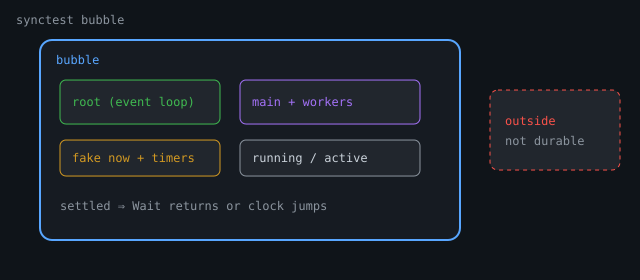

# testing/synctest: Bubbles, Durable Blocks, Fake Time

## Overview

`testing/synctest` is **not** a polite `time.Sleep` helper. It is a **runtime feature** exposed through a thin testing API: the scheduler tracks an isolated **bubble** of goroutines, channels, and timers, and can answer a precise question instead of guessing.

```text
Has every goroutine in this test either finished, or reached a block
that only another goroutine in the *same* bubble can unblock?
```

If yes, the bubble is **settled**. Then `synctest.Wait` can return, or the **fake clock** can jump to the next timer deadline—without burning wall-clock time.

> **Sources / depth.** This chapter synthesizes the public API with runtime-level concepts documented in guest runtime walkthroughs such as [*Fake Clocks, Real Guarantees: Inside Go's synctest*](https://internals-for-interns.com/posts/inside-go-synctest/) (Alex Rios / Internals for Interns; runtime as of ~Go 1.25–1.27). Prose and diagrams here are original. Always verify symbols against your `GOROOT` and `go doc testing/synctest`.

**Availability sketch:** experiment in 1.24 → stable package from ~1.25 → `synctest.Sleep` convenience in ~1.27. Check `go version` before relying on APIs.

::: {.content-visible when-format="html"}
{fig-alt="synctest bubble with root, main workers, fake clock, outside world"}
:::

## The problem it solves

```go
// Ordinary concurrent test — a guess dressed as a test
go doSomething()
time.Sleep(10 * time.Millisecond) // hope the G ran
if !done {
	t.Fatal("not done")
}
```

Longer sleeps only buy a **slower guess**. Scheduling order, machine load, and GC jitter all change whether 10ms was enough.

```text
  ordinary test                         synctest
  ─────────────                         ────────
  go doWork()                           bubble { workers, timers, chans }
       │                                       │
       v                                       v
  time.Sleep(10ms)  ◄── guess            Wait / clock jump  ◄── proof
       │                                       │
       v                                       v
  assert "probably done"                assert only after SETTLED
                                        (all Gs done or durably blocked)
```

## Public API (small overlay)

Typical surface (confirm on your version):

```go
synctest.Test(t, func(t *testing.T) { ... })
synctest.Wait()
synctest.Sleep(d) // ~Go 1.27: Sleep + Wait convenience
// older / internal shape also used synctest.Run(func(){...})
```

```text
testing/synctest          thin public package
        │
        ▼
internal/synctest        glue
        │
        ▼
runtime/synctest.go      bubble, counters, event loop
        +
runtime proc/chan/time/sema/select   durability hooks
```

`synctest.Test` creates a bubble, adapts `*testing.T` (child `T` marked as synctest), and runs your function through normal `tRunner` so Fail/Fatal/cleanup/logs/race still work.

**Inside a bubble, some `T` methods panic** (e.g. `t.Parallel`, `t.Run` as normal nested subtests, `t.Deadline` in designs where wall deadline vs fake `time.Now` would be nonsense). Treat the bubble as a special domain, not a nested subtest tree.

## The bubble

Conceptual structure (names follow runtime ideas; fields evolve):

```text
synctestBubble
  now      fake clock (ns) — starts at a fixed epoch (often 2000-01-01 UTC)
  timers   private timer heap driven by bubble.now
  root     controller G (event loop; not your test body)
  main     G that runs the test function
  running  count of Gs not yet proven durably blocked
  active   bookkeeping for mid-park / wake gaps
  ...
```

```text
  ┌───────────────── synctest bubble ─────────────────┐
  │  root G  (event loop; not test body)              │
  │     │                                             │
  │     ├── bubble.now     (fake clock)               │
  │     └── bubble.timers  (private heap)             │
  │                                                   │
  │  main G  (test function)                          │
  │     └── worker Gs  (inherit bubble on go)         │
  │                                                   │
  │  running / active counters  →  settled?           │
  └───────────────────────┬───────────────────────────┘
                          │ may touch (not durable)
                          v
                   outside world / globals / net
```

### Membership

Every `g` may carry `bubble *synctestBubble`.

On `go f()` (`newproc1`):

- **User Gs inherit** the parent’s bubble pointer.
- **System Gs** (GC, netpoll helpers, …) **do not** inherit membership.

So membership spreads automatically down the spawn tree without tagging every `go` statement.

```text
Test body (in bubble)
  └─ go worker     → in bubble
       └─ go nested → in bubble
Runtime GC G         → not in bubble
```

### Root vs main

`Run`/`Test` does **not** run your function on the root. Root becomes the **controller**; a **main** goroutine runs the test (and for `Test`, adapters/`tRunner` are also members). Root owns the fake-time event loop.

## Durable blocking = wait reason

**Durable block (docs language):** blocked and can only be unblocked by another goroutine in the **same** bubble.

Runtime implements this with `waitReason` when a G parks (`_Gwaiting`). A table marks which reasons are **idle in synctest**.

| Typically durable (idle) | Typically **not** durable |
|--------------------------|---------------------------|
| `time.Sleep` (fake timer) | `sync.Mutex.Lock` / RWMutex |
| send/recv on **bubbled** channel | send/recv on **outside** channel |
| select where **every** case is bubbled | select with any outside channel |
| `sync.Cond.Wait` (with bubble wake checks) | — |
| `WaitGroup.Wait` when **associated** to this bubble | WaitGroup not associated / wrong bubble |
| nil-chan send/recv, empty `select{}` | (deadlock path if nothing else can finish) |
| `synctest.Wait` itself | — |

```text
  G parks
     │
     v
  status == _Gwaiting? ──no──► counts as running (not settled)
     │
    yes
     v
  waitReason idle-in-synctest? ──no──► still "running" for bubble
     │
    yes
     v
  DURABLE block  →  running--
```

**Why mutex fails the test:** a mutex has **no bubble ownership**. An outside G could `Unlock`. The runtime refuses to call that settled, so `synctest.Wait` may **hang** until the outer `go test` timeout—not always a nice bubble deadlock panic.

## Two counters, one invariant

```text
running > 0  ||  active > 0    ⇒  "something still going on"
```

| Counter | Meaning |
|---------|---------|
| `running` | Gs not yet proven durably blocked (not the same as “on CPU”) |
| `active` | Scheduler bookkeeping during **mid-park**, wakes, root loop tokens |

Parking is not atomic: status may drop to waiting **before** a commit function finalizes the park. Without `active`, the bubble could see `running == 0` in that gap and **false-settle**.

```text
  worker G                    bubble counters
     │                              │
     │  incActive (mid-park)        │
     │─────────────────────────────►│  active > 0
     │  status → waiting            │
     │  (running may hit 0 early)   │  running==0, active>0  ← not settled yet
     │  park committed / aborted    │
     │  decActive                   │
     │─────────────────────────────►│  only now both may be 0 → settled
```

Status changes go through the scheduler’s status CAS path; bubbled Gs call into bubble accounting (`changegstatus`-style hooks).

## Root event loop (fake time)

When settled (and timers remain), the root:

1. Runs fake timers due at `bubble.now`
2. Tries to park (handing back its `active` token)
3. Looks at next timer deadline
4. Either **jumps** `bubble.now = next` or exits (done / no timers)

```text
  root loop
     │
     v
  run timers due at bubble.now
     │
     v
  try park (release active token)
     │
     v
  next timer deadline?
     │              │
    none           some
     │              │
     v              v
  stop loop     bubble.now = next ──┐
     │              │               │
     v              └───────────────┘
  main done & no leftover Gs?
     yes → clean exit
     no  → deadlock panic (durable stuck / leaked Gs)
```

**Fake time never wall-waits once settled.** Ten “seconds” of `Sleep` can finish in microseconds of wall time: `now` is assigned, not slept.

```text
Fake clock starts ~2000-01-01 00:00:00 UTC

G2: Sleep(3s)  timer @ 00:00:03
main: Sleep(10s) timer @ 00:00:10

both park → settled
root jumps now → 00:00:03 → G2 runs
settled again
root jumps now → 00:00:10 → main runs
```

### time.Now inside a bubble

Runtime returns **bubble.now** for wall time. Monotonic component is often **zero** so mixing inside/outside times does not invent a second confusing clock. `time.Since` still works because the bubble wall clock is under runtime control.

### Fake timers

Timers created in a bubble are marked fake and live on the **bubble timer heap**, not a normal per-P heap. Callbacks (e.g. `AfterFunc`) briefly count as bubble activity so spawned Gs inherit membership.

## Channels: married at make

```text
hchan.bubble set in makechan if creator is in a bubble
```

| Action | Effect |
|--------|--------|
| send/recv/close from **outside** bubble | **fatal** (process-killing runtime error) |
| block on bubbled chan | wait reason is **synctest** send/recv → durable |
| block on unbubbled chan | not durable |

```go
// wait reason conceptually:
// unbubbled: waitReasonChanSend
// bubbled:   waitReasonSynctestChanSend  // idle-in-synctest
```

### Select

Durable only if **every** non-nil case is a bubbled channel in the **current** bubble. One outside case spoils the proof → non-durable select wait.

```text
select {
case <-bubbledCh:     // ok
case <-time.After(d): // After's chan is bubbled if created inside
case <-outsideCh:     // spoils durability
}
```

## WaitGroup association (heap special)

`WaitGroup` packs a **bubble membership bit** into state and, on `Add` inside a bubble, associates via a **heap special** (same family of side notes as finalizers).

```text
Durable WaitGroup.Wait requires roughly:
  1. Add happened in a bubble
  2. Wait called in a bubble
  3. Same bubble association still valid
```

**Package-level** `var wg sync.WaitGroup` lives in the data segment—**no heap object** to attach the special to. Association can fail; waits may never count as durable.

Prefer:

```go
wg := new(sync.WaitGroup) // heap-allocated
// or local var that escapes to heap as needed
```

Miss association → bubble may never settle while `Wait` is blocked.

## sync.Cond

`Cond.Wait` parks with a reason marked idle. Ownership is checked on **wake**: signaling a bubbled waiter from outside its bubble is **fatal**. Durability rides on parked `g.bubble`, not a field on `Cond` itself.

## Mutex: deliberately non-durable

```go
var mu sync.Mutex
synctest.Test(t, func(t *testing.T) {
	mu.Lock()
	go func() {
		mu.Lock() // blocks — NOT durable
	}()
	synctest.Wait() // may hang forever (outer test timeout)
})
```

```text
flow:
  [ND]
       |
       v
  [R]

  [R]
       |
       v
  [H]
```

**Debug fork:**

| Symptom | Look for |
|---------|----------|
| Named **deadlock panic** from bubble | All **durable** blocks, no timers left / leaked Gs after main exit |
| **Hang** until `go test` timeout | Non-durable wait: mutex, unbubbled channel, bad WaitGroup association |

## Deadlock detection (when root can prove it)

When the root stops and leftover Gs remain:

- “all goroutines in bubble are blocked” — durable deadlock, no timer escape
- “main exited but blocked goroutines remain” — leak after test function return

Stricter than ordinary tests: a forever-blocked **bubbled** channel is a loud failure, not silent process exit.

## Isolation cheat sheet

```text
Created inside bubble:
  channel   → hchan.bubble
  timer     → isFake, bubble heap
  WaitGroup → associate on Add (heap)

From outside:
  send/recv/close bubbled chan     → fatal
  fake timer stop/reset from out   → fatal
  WaitGroup Add from wrong bubble  → fatal

Outside objects used inside:
  allowed, but waits usually NOT durable
```

## Isolation is not a sandbox

The test can still touch globals, disk, network. Those ops are **not** part of the settling proof. Keep I/O out of unit bubbles or accept non-determinism.

## End-to-end narrative

```go
func TestWorkerTimeout(t *testing.T) {
	synctest.Test(t, func(t *testing.T) {
		ch := make(chan string) // bubbled
		go func() {
			select {
			case msg := <-ch:
				t.Log("got", msg)
			case <-time.After(5 * time.Second): // fake timer
				t.Error("timed out")
			}
		}()
		time.Sleep(3 * time.Second) // fake
		ch <- "hello"
	})
}
```

```text
sequence (top → bottom):
  actors: Root, Main, Worker, bubble.now
  Root --> Main  : start test G
  Main --> Worker  : go select
  Worker --> Worker  : park durable select
  Main --> Main  : Sleep 3s park durable
  Root --> bubble.now  : jump to +3s
  Main --> Worker  : send hello
  Worker --> Worker  : log and exit
  Main --> Root  : return clean
  note: settled running=0
```

No wall wait for “3 seconds”; no sleep-and-hope after the send.

## synctest.Wait and the race detector

When Wait unparks, the runtime establishes a **happens-before** edge (raceacquire-style) so reads after Wait of data written by now-blocked Gs are not false races. Matching releases fire when Gs durably block, exit, or finish fake timer callbacks.

`synctest.Sleep(d)` (~1.27) ≈ `time.Sleep(d)` + `Wait()`: advance clock, then wait for reactions to settle. Same-instant timer order remains unspecified; trailing Wait makes that OK for most tests.

## Practical rules

1. Create channels/timers **inside** the bubble you care about.
2. Use **heap** WaitGroups if you need durable `Wait`.
3. Do not expect `Mutex` waits to settle the bubble.
4. Prefer `synctest.Wait` over wall `Sleep` for “work finished”.
5. Hang vs panic: hang → non-durable; panic → durable deadlock/leak.
6. Still run `go test -race`.
7. Don’t nest `synctest.Run`/`Test` (runtime panics).

## Relation to other chapters

| Topic | Chapter |
|-------|---------|
| Flaky concurrent tests | [260 Testing](../21-concurrency-ground-up/260-testing-concurrent-code.qmd) |
| GMP / parking | [201 Scheduler](201-scheduler-gmp-deep-dive.qmd) |
| Timers | [214 Timers](214-timers-time-after-pitfalls.qmd) |
| Channel internals | [203 Channels](203-channels-select-internals.qmd) |
| Context timeouts | [255 Context](../21-concurrency-ground-up/255-context-complete.qmd) |

## Reading the source (same path as the article)

1. `testing/synctest` public API  
2. testing hook / `T` adaptation  
3. `runtime.synctestRun` / bubble struct  
4. status hooks + wait reason table  
5. `time` linknames + fake timers  
6. `makechan` / `chansend` / `selectgo`  
7. `sync.WaitGroup` + semacquire durable flag  
8. Package tests under `internal/synctest`

## Experiment

```bash
go version
go doc testing/synctest
```

```go
func TestFakeSleep(t *testing.T) {
	// Use the API your version exports: Test and/or Run
	synctest.Test(t, func(t *testing.T) {
		start := time.Now()
		done := make(chan struct{})
		go func() {
			time.Sleep(30 * time.Second)
			close(done)
		}()
		synctest.Wait() // or Sleep if available
		<-done
		// wall time should be tiny; bubble time advanced ~30s
		if time.Since(start) > time.Second {
			t.Fatalf("wall clock moved too much: %v", time.Since(start))
		}
	})
}
```

```bash
go test -race -count=100 -run TestFakeSleep
```

**What to notice:** 30s of fake sleep does not cost 30s of CI.

**Try next:** Add a mutex-blocked G and observe Wait hang vs durable channel deadlock panic.

## Recap

| Idea | One line |
|------|----------|
| Bubble | Isolated scheduler domain for one test |
| Membership | Inherited on `go`; system Gs excluded |
| Durable block | Wait reason marked idle-in-synctest |
| Settled | `running==0` and `active==0` |
| Root | Advances fake clock / wakes Wait / detects deadlock |
| Fake time | Jump `now` on private timer heap |
| Objects | Chan/timer/WG associated; outside touch often fatal |
| Mutex | Never durable—by design |

The tiny API is small on purpose. The **proof** that a concurrent test is settled lives in the runtime—membership, wait reasons, timer heaps, and isolation—exactly what user-space mocks cannot see.
