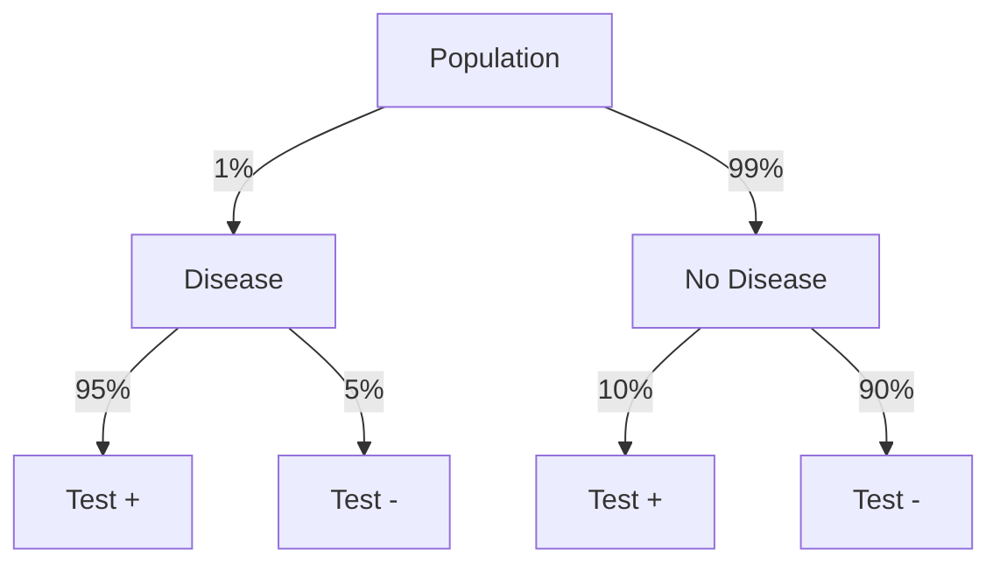

# Probability: The Mathematics of Uncertainty

## Introduction to Probability

Probability is the mathematical framework for quantifying uncertainty and randomness. It provides the theoretical foundation for statistical inference, enabling us to make informed decisions when outcomes are uncertain and to quantify our confidence in conclusions drawn from data.

Understanding probability is essential for interpreting statistical results, designing experiments, and making predictions about future events based on available information.

```
Probability in Statistics and Life
═════════════════════════════════

Why Probability Matters:
• Quantifies uncertainty in a precise mathematical way
• Provides foundation for statistical inference
• Enables prediction and risk assessment
• Models random phenomena in nature and society
• Guides decision-making under uncertainty

Applications:
• Weather forecasting and climate modeling
• Medical diagnosis and treatment effectiveness
• Financial risk assessment and insurance
• Quality control and reliability engineering
• Games of chance and sports betting
• Machine learning and artificial intelligence
• Scientific hypothesis testing

Key Questions Probability Answers:
• What is the likelihood of a specific outcome?
• How confident can we be in our predictions?
• What are the chances of multiple events occurring?
• How do we update beliefs with new information?
• What decisions minimize expected losses?

Historical Development:
• 1654: Pascal and Fermat solve gambling problems
• 1713: Bernoulli's Law of Large Numbers
• 1733: De Moivre's normal approximation
• 1812: Laplace's classical probability theory
• 1933: Kolmogorov's axiomatic foundation
• Modern: Computational and applied probability
```

## Basic Probability Concepts

### Sample Spaces and Events

```
Fundamental Probability Concepts
══════════════════════════════

Sample Space (S):
Set of all possible outcomes of an experiment
Must be mutually exclusive and collectively exhaustive

Examples:
• Coin flip: S = {H, T}
• Die roll: S = {1, 2, 3, 4, 5, 6}
• Card draw: S = {52 different cards}
• Lifetime: S = {t : t ≥ 0} (continuous)

Event (E):
Subset of the sample space
Collection of outcomes of interest

Examples:
• Getting heads: E = {H}
• Rolling even number: E = {2, 4, 6}
• Drawing a heart: E = {13 heart cards}
• Living past 80: E = {t : t > 80}

Types of Events:

Simple Event:
Contains exactly one outcome
Example: Rolling a 3 on a die

Compound Event:
Contains more than one outcome
Example: Rolling an even number

Certain Event:
Always occurs (equals sample space)
P(S) = 1

Impossible Event:
Never occurs (empty set)
P(∅) = 0

Complement Event:
All outcomes not in the event
E' or Ē = S - E
P(E') = 1 - P(E)

Event Relationships:

Union (E₁ ∪ E₂):
Event that occurs if E₁ or E₂ (or both) occurs
"At least one event occurs"

Intersection (E₁ ∩ E₂):
Event that occurs if both E₁ and E₂ occur
"Both events occur"

Mutually Exclusive Events:
Cannot occur simultaneously
E₁ ∩ E₂ = ∅
P(E₁ ∩ E₂) = 0

Example: Rolling a die
E₁ = {rolling odd number} = {1, 3, 5}
E₂ = {rolling even number} = {2, 4, 6}
E₁ and E₂ are mutually exclusive
```

### Probability Definitions and Axioms

```
Approaches to Probability
═══════════════════════

Classical (Theoretical) Probability:
Based on equally likely outcomes
P(E) = Number of favorable outcomes / Total number of outcomes

Example: Fair die
P(rolling a 3) = 1/6
P(rolling even) = 3/6 = 1/2

Requirements:
• Finite sample space
• All outcomes equally likely
• Known structure of experiment

Empirical (Relative Frequency) Probability:
Based on observed data
P(E) = Number of times E occurred / Total number of trials

Example: Manufacturing defects
Out of 1000 items, 25 were defective
P(defective) = 25/1000 = 0.025

Approaches true probability as trials increase (Law of Large Numbers)

Subjective Probability:
Based on personal judgment or belief
Reflects degree of confidence in outcome

Example: "I'm 70% confident it will rain tomorrow"
Used when classical or empirical approaches not feasible

Kolmogorov Axioms:
Mathematical foundation for probability theory

Axiom 1: P(E) ≥ 0 for any event E
(Probabilities are non-negative)

Axiom 2: P(S) = 1
(Probability of sample space is 1)

Axiom 3: For mutually exclusive events E₁, E₂, ...
P(E₁ ∪ E₂ ∪ ...) = P(E₁) + P(E₂) + ...
(Addition rule for disjoint events)

Properties Derived from Axioms:
• 0 ≤ P(E) ≤ 1 for any event E
• P(∅) = 0
• P(E') = 1 - P(E)
• If E₁ ⊆ E₂, then P(E₁) ≤ P(E₂)

Basic Probability Rules:

Addition Rule (General):
P(E₁ ∪ E₂) = P(E₁) + P(E₂) - P(E₁ ∩ E₂)

Addition Rule (Mutually Exclusive):
P(E₁ ∪ E₂) = P(E₁) + P(E₂)

Complement Rule:
P(E') = 1 - P(E)

Example Application:
Drawing a card from standard deck
P(King or Heart) = P(King) + P(Heart) - P(King of Hearts)
                 = 4/52 + 13/52 - 1/52 = 16/52 = 4/13
```

### Counting Techniques in Probability

```
Combinatorics and Probability
═══════════════════════════

When outcomes are equally likely, probability calculations often involve counting.

Multiplication Principle:
If task has k steps with n₁, n₂, ..., nₖ ways respectively,
total ways = n₁ × n₂ × ... × nₖ

Example: License plates (3 letters, 3 digits)
Total possibilities = 26³ × 10³ = 17,576,000

Permutations:
Arrangements where order matters
P(n,r) = n!/(n-r)!

Example: Selecting president, VP, secretary from 10 people
Number of ways = P(10,3) = 10!/7! = 720

Combinations:
Selections where order doesn't matter
C(n,r) = n!/(r!(n-r)!)

Example: Selecting 5-card poker hand from 52 cards
Number of ways = C(52,5) = 2,598,960

Probability Applications:

Example 1: Lottery
Choose 6 numbers from 1 to 49
Total combinations = C(49,6) = 13,983,816
P(winning) = 1/13,983,816 ≈ 7.15 × 10⁻⁸

Example 2: Committee Selection
From 8 men and 6 women, select 4-person committee
P(2 men, 2 women) = [C(8,2) × C(6,2)] / C(14,4)
                   = [28 × 15] / 1001 = 420/1001 ≈ 0.42

Example 3: Birthday Problem
What's probability that at least 2 people in group of 23 share birthday?

P(at least one match) = 1 - P(no matches)
P(no matches) = (365/365) × (364/365) × ... × (343/365)
              ≈ 0.493
P(at least one match) ≈ 1 - 0.493 = 0.507

Surprisingly, probability exceeds 50% with just 23 people!

Hypergeometric Distribution:
Sampling without replacement from finite population

Example: Defective items
Population: 100 items (10 defective, 90 good)
Sample: 5 items without replacement
P(exactly 2 defective) = [C(10,2) × C(90,3)] / C(100,5)
                        = [45 × 117,480] / 75,287,520 ≈ 0.070
```

## Conditional Probability and Independence

### Conditional Probability

```
Conditional Probability Concepts
══════════════════════════════

Definition:
Probability of event A given that event B has occurred
P(A|B) = P(A ∩ B) / P(B), provided P(B) > 0

Interpretation:
• Restricts sample space to outcomes where B occurs
• Updates probability based on additional information
• Foundation for Bayesian reasoning

Example: Card Drawing
Standard deck, draw one card
A = {card is King}, B = {card is face card}

P(A) = 4/52 = 1/13 (unconditional probability)
P(A|B) = P(King and face card) / P(face card)
       = (4/52) / (12/52) = 4/12 = 1/3

Given card is face card, probability of King increases.

Multiplication Rule:
P(A ∩ B) = P(A|B) × P(B) = P(B|A) × P(A)

Example: Medical Testing
Disease prevalence: P(D) = 0.01
Test sensitivity: P(+|D) = 0.95 (detects disease when present)
Test specificity: P(-|D') = 0.98 (negative when no disease)

P(+ and D) = P(+|D) × P(D) = 0.95 × 0.01 = 0.0095

Law of Total Probability:
If B₁, B₂, ..., Bₙ partition the sample space, then:
P(A) = P(A|B₁)P(B₁) + P(A|B₂)P(B₂) + ... + P(A|Bₙ)P(Bₙ)

Example: Manufacturing
Two machines produce items:
Machine 1: 60% of production, 2% defective rate
Machine 2: 40% of production, 5% defective rate

P(defective) = P(defective|M1)P(M1) + P(defective|M2)P(M2)
             = 0.02 × 0.60 + 0.05 × 0.40 = 0.032

Tree Diagrams:
Visual tool for conditional probability problems
• Branches represent conditional probabilities
• Path probabilities multiply along branches
• Final probabilities sum for all paths to same outcome

Example: Two-stage experiment
Stage 1: Select box (Box 1: 0.6, Box 2: 0.4)
Stage 2: Draw ball from selected box
Box 1: 3 red, 2 blue balls
Box 2: 1 red, 4 blue balls

P(red) = P(red|Box1)P(Box1) + P(red|Box2)P(Box2)
       = (3/5)(0.6) + (1/5)(0.4) = 0.36 + 0.08 = 0.44
```

### Independence

```
Statistical Independence
══════════════════════

Definition:
Events A and B are independent if:
P(A|B) = P(A) or equivalently P(A ∩ B) = P(A) × P(B)

Interpretation:
• Occurrence of B doesn't change probability of A
• Knowledge of B provides no information about A
• Events are unrelated

Testing Independence:
Check if P(A ∩ B) = P(A) × P(B)

Example: Coin Flips
Two fair coin flips
A = {first flip heads}, B = {second flip heads}
P(A) = 1/2, P(B) = 1/2
P(A ∩ B) = 1/4 = (1/2) × (1/2) = P(A) × P(B)
Therefore, A and B are independent.

Example: Card Drawing (with replacement)
Draw two cards with replacement
A = {first card is King}, B = {second card is King}
P(A) = 4/52, P(B) = 4/52
P(A ∩ B) = (4/52) × (4/52) = P(A) × P(B)
Events are independent.

Example: Card Drawing (without replacement)
Draw two cards without replacement
A = {first card is King}, B = {second card is King}
P(A) = 4/52
P(B|A) = 3/51 ≠ P(B) = 4/52
Events are not independent.

Mutual Independence:
Events A₁, A₂, ..., Aₙ are mutually independent if:
P(Aᵢ₁ ∩ Aᵢ₂ ∩ ... ∩ Aᵢₖ) = P(Aᵢ₁) × P(Aᵢ₂) × ... × P(Aᵢₖ)
for any subset {i₁, i₂, ..., iₖ}

Applications:
• System reliability (components fail independently)
• Quality control (items produced independently)
• Survey sampling (responses independent)
• Experimental design (treatments applied independently)

Independence vs. Mutual Exclusivity:
• Independent events can occur together
• Mutually exclusive events cannot occur together
• If P(A) > 0 and P(B) > 0, events cannot be both independent and mutually exclusive

Common Misconception:
Independence doesn't mean events are unrelated in real world
Statistical independence is mathematical property that may not reflect causal relationships
```

### Bayes' Theorem

```
Bayes' Theorem
═════════════

Statement:
P(A|B) = P(B|A) × P(A) / P(B)

Alternative form using Law of Total Probability:
P(A|B) = P(B|A) × P(A) / [P(B|A) × P(A) + P(B|A') × P(A')]

Components:
• P(A): Prior probability (before observing B)
• P(A|B): Posterior probability (after observing B)
• P(B|A): Likelihood (probability of B given A)
• P(B): Marginal probability of B

Example: Medical Diagnosis
Disease prevalence: P(D) = 0.01
Test sensitivity: P(+|D) = 0.95
Test specificity: P(-|D') = 0.98, so P(+|D') = 0.02

Patient tests positive. What's probability of having disease?

P(D|+) = P(+|D) × P(D) / P(+)

First find P(+):
P(+) = P(+|D) × P(D) + P(+|D') × P(D')
     = 0.95 × 0.01 + 0.02 × 0.99 = 0.0293

Therefore:
P(D|+) = (0.95 × 0.01) / 0.0293 = 0.324

Despite positive test, probability of disease is only 32.4%!

This counterintuitive result occurs because:
• Disease is rare (low prior probability)
• False positives outnumber true positives

Bayesian Reasoning Process:
1. Start with prior probability P(A)
2. Observe evidence B
3. Update to posterior probability P(A|B)
4. Use posterior as new prior for next observation

Applications:
• Medical diagnosis and screening
• Spam email filtering
• Machine learning and AI
• Legal evidence evaluation
• Quality control and testing
• Weather forecasting
• Financial risk assessment

Example: Spam Filtering
Prior: P(spam) = 0.4
Word "free" appears in email
P("free"|spam) = 0.8
P("free"|not spam) = 0.1

P(spam|"free") = P("free"|spam) × P(spam) / P("free")

P("free") = 0.8 × 0.4 + 0.1 × 0.6 = 0.38

P(spam|"free") = (0.8 × 0.4) / 0.38 = 0.842

Email with "free" has 84.2% probability of being spam.

Bayesian Networks:
Graphical models representing conditional dependencies
Used in expert systems and machine learning
Nodes represent variables, edges represent dependencies
```

## Discrete Probability Distributions

### Random Variables

```
Random Variable Concepts
══════════════════════

Definition:
Function that assigns numerical value to each outcome in sample space
X: S → ℝ

Types:
• Discrete: Countable values (finite or countably infinite)
• Continuous: Uncountable values (intervals of real numbers)

Examples:
Discrete:
• Number of heads in 10 coin flips: X ∈ {0, 1, 2, ..., 10}
• Number of customers per hour: X ∈ {0, 1, 2, ...}
• Score on multiple choice test: X ∈ {0, 1, 2, ..., 100}

Continuous:
• Height of randomly selected person: X ∈ (0, ∞)
• Time until next customer arrives: X ∈ [0, ∞)
• Temperature at noon tomorrow: X ∈ (-∞, ∞)

Probability Mass Function (PMF):
For discrete random variable X
P(X = x) = probability that X equals specific value x

Properties:
• P(X = x) ≥ 0 for all x
• ΣP(X = x) = 1 (sum over all possible values)

Example: Rolling two dice, X = sum
P(X = 2) = 1/36, P(X = 3) = 2/36, ..., P(X = 12) = 1/36

Cumulative Distribution Function (CDF):
F(x) = P(X ≤ x)

Properties:
• 0 ≤ F(x) ≤ 1
• F(x) is non-decreasing
• F(-∞) = 0, F(∞) = 1
• P(a < X ≤ b) = F(b) - F(a)

Expected Value (Mean):
E(X) = μ = Σx × P(X = x)

Interpretation: Long-run average value

Example: Die roll, X = outcome
E(X) = 1×(1/6) + 2×(1/6) + ... + 6×(1/6) = 21/6 = 3.5

Variance:
Var(X) = σ² = E[(X - μ)²] = E(X²) - [E(X)]²

Standard Deviation:
σ = √Var(X)

Properties of Expected Value:
• E(aX + b) = aE(X) + b
• E(X + Y) = E(X) + E(Y)
• If X and Y independent: E(XY) = E(X)E(Y)

Properties of Variance:
• Var(aX + b) = a²Var(X)
• If X and Y independent: Var(X + Y) = Var(X) + Var(Y)
```

### Common Discrete Distributions

```
Bernoulli Distribution
════════════════════

Models single trial with two outcomes (success/failure)
Parameter: p = probability of success

PMF: P(X = x) = p^x(1-p)^(1-x) for x ∈ {0, 1}

Mean: E(X) = p
Variance: Var(X) = p(1-p)

Example: Single coin flip (p = 0.5)
P(X = 0) = 0.5, P(X = 1) = 0.5

Binomial Distribution
═══════════════════

Models number of successes in n independent Bernoulli trials
Parameters: n (trials), p (success probability)

PMF: P(X = x) = C(n,x) × p^x × (1-p)^(n-x) for x ∈ {0, 1, ..., n}

Mean: E(X) = np
Variance: Var(X) = np(1-p)

Example: 10 coin flips, count heads (n = 10, p = 0.5)
P(X = 5) = C(10,5) × (0.5)^5 × (0.5)^5 = 252 × (0.5)^10 ≈ 0.246

Applications:
• Quality control (defective items)
• Medical trials (treatment success)
• Survey research (yes/no responses)
• Marketing (conversion rates)

Poisson Distribution
══════════════════

Models number of events in fixed interval
Parameter: λ = average rate of occurrence

PMF: P(X = x) = (e^(-λ) × λ^x) / x! for x ∈ {0, 1, 2, ...}

Mean: E(X) = λ
Variance: Var(X) = λ

Example: Phone calls per hour (λ = 3)
P(X = 2) = (e^(-3) × 3^2) / 2! = (0.0498 × 9) / 2 ≈ 0.224

Applications:
• Customer arrivals
• Equipment failures
• Radioactive decay
• Network packet arrivals
• Biological mutations

Approximations:
• Binomial approximation: When n large, p small, np moderate
• Normal approximation: When λ large (λ > 10)

Geometric Distribution
════════════════════

Models number of trials until first success
Parameter: p = success probability

PMF: P(X = x) = (1-p)^(x-1) × p for x ∈ {1, 2, 3, ...}

Mean: E(X) = 1/p
Variance: Var(X) = (1-p)/p²

Example: Rolling die until getting 6 (p = 1/6)
P(X = 3) = (5/6)² × (1/6) = 25/216 ≈ 0.116

Memoryless Property:
P(X > m + n | X > m) = P(X > n)
Past failures don't affect future probability

Applications:
• Time until equipment failure
• Number of attempts until success
• Waiting time problems
• Reliability engineering

Hypergeometric Distribution
═════════════════════════

Models sampling without replacement from finite population
Parameters: N (population), K (successes in population), n (sample size)

PMF: P(X = x) = [C(K,x) × C(N-K,n-x)] / C(N,n)

Mean: E(X) = n × (K/N)
Variance: Var(X) = n × (K/N) × (1-K/N) × (N-n)/(N-1)

Example: 52 cards, 13 hearts, draw 5 cards
P(X = 2 hearts) = [C(13,2) × C(39,3)] / C(52,5)

Applications:
• Quality control sampling
• Survey sampling
• Lottery problems
• Acceptance sampling
```

## Continuous Probability Distributions

### Continuous Random Variables

```
Continuous Distribution Concepts
══════════════════════════════

Probability Density Function (PDF):
f(x) such that P(a ≤ X ≤ b) = ∫[a to b] f(x)dx

Properties:
• f(x) ≥ 0 for all x
• ∫[-∞ to ∞] f(x)dx = 1
• P(X = x) = 0 for any specific value x
• P(a ≤ X ≤ b) = P(a < X < b) = P(a < X ≤ b) = P(a ≤ X < b)

Cumulative Distribution Function:
F(x) = P(X ≤ x) = ∫[-∞ to x] f(t)dt

Relationship: f(x) = F'(x) (PDF is derivative of CDF)

Expected Value:
E(X) = ∫[-∞ to ∞] x × f(x)dx

Variance:
Var(X) = ∫[-∞ to ∞] (x - μ)² × f(x)dx = E(X²) - [E(X)]²

Percentiles:
The pth percentile xₚ satisfies: F(xₚ) = p/100

Median: 50th percentile where F(x₀.₅) = 0.5

Mode: Value where f(x) is maximum (if unique)
```

### Normal Distribution

```
Normal Distribution
═════════════════

Most important continuous distribution
Parameters: μ (mean), σ² (variance)

PDF: f(x) = (1/(σ√(2π))) × e^(-(x-μ)²/(2σ²))

Properties:
• Bell-shaped, symmetric about μ
• Mean = Median = Mode = μ
• Inflection points at μ ± σ
• Total area under curve = 1

Standard Normal Distribution:
Z ~ N(0,1) with μ = 0, σ = 1

PDF: φ(z) = (1/√(2π)) × e^(-z²/2)
CDF: Φ(z) = P(Z ≤ z)

Standardization:
If X ~ N(μ, σ²), then Z = (X - μ)/σ ~ N(0,1)

Empirical Rule (68-95-99.7 Rule):
• 68% of data within μ ± σ
• 95% of data within μ ± 2σ
• 99.7% of data within μ ± 3σ

Example: IQ Scores
X ~ N(100, 15²)
P(85 < X < 115) = P(-1 < Z < 1) ≈ 0.68

Finding Probabilities:
P(X ≤ x) = P(Z ≤ (x-μ)/σ) = Φ((x-μ)/σ)

Example: Heights
X ~ N(68, 3²) inches
P(X > 74) = P(Z > (74-68)/3) = P(Z > 2) = 1 - Φ(2) ≈ 0.0228

Finding Values:
If P(X ≤ x) = p, then x = μ + σ × Φ⁻¹(p)

Example: Find height exceeded by 10% of population
P(X > x) = 0.10, so P(X ≤ x) = 0.90
x = 68 + 3 × Φ⁻¹(0.90) = 68 + 3 × 1.28 = 71.84 inches

Central Limit Theorem:
If X₁, X₂, ..., Xₙ are independent with mean μ and variance σ²,
then X̄ = (X₁ + X₂ + ... + Xₙ)/n approaches N(μ, σ²/n) as n → ∞

This holds regardless of original distribution shape!

Applications:
• Measurement errors
• Test scores and grades
• Physical characteristics (height, weight)
• Financial returns
• Quality control
• Natural phenomena
```

### Other Continuous Distributions

```
Uniform Distribution
══════════════════

All values in interval equally likely
Parameters: a (minimum), b (maximum)

PDF: f(x) = 1/(b-a) for a ≤ x ≤ b, 0 otherwise

Mean: E(X) = (a+b)/2
Variance: Var(X) = (b-a)²/12

Example: Random number generator [0,1]
f(x) = 1 for 0 ≤ x ≤ 1
P(0.3 < X < 0.7) = 0.7 - 0.3 = 0.4

Applications:
• Random number generation
• Modeling uncertainty when only range known
• Simulation studies

Exponential Distribution
══════════════════════

Models time between events in Poisson process
Parameter: λ (rate parameter)

PDF: f(x) = λe^(-λx) for x ≥ 0

Mean: E(X) = 1/λ
Variance: Var(X) = 1/λ²

CDF: F(x) = 1 - e^(-λx)

Memoryless Property:
P(X > s + t | X > s) = P(X > t)

Example: Time between customer arrivals (λ = 2 per hour)
P(X > 0.5) = e^(-2×0.5) = e^(-1) ≈ 0.368

Applications:
• Reliability engineering (time to failure)
• Queueing theory (service times)
• Radioactive decay
• Network modeling

Gamma Distribution
════════════════

Generalizes exponential distribution
Parameters: α (shape), β (scale) or λ (rate = 1/β)

PDF: f(x) = (λ^α/Γ(α)) × x^(α-1) × e^(-λx) for x > 0

Mean: E(X) = α/λ
Variance: Var(X) = α/λ²

Special Cases:
• α = 1: Exponential distribution
• α = n/2, λ = 1/2: Chi-square distribution with n degrees of freedom

Applications:
• Modeling waiting times
• Reliability analysis
• Bayesian statistics (conjugate prior)

Beta Distribution
═══════════════

Defined on interval [0,1]
Parameters: α, β (shape parameters)

PDF: f(x) = (Γ(α+β)/(Γ(α)Γ(β))) × x^(α-1) × (1-x)^(β-1)

Mean: E(X) = α/(α+β)
Variance: Var(X) = αβ/[(α+β)²(α+β+1)]

Special Cases:
• α = β = 1: Uniform[0,1]
• α = β: Symmetric about 0.5

Applications:
• Modeling proportions and percentages
• Bayesian statistics (conjugate prior for binomial)
• Project management (PERT distribution)
• Quality control
```

## Summary and Key Concepts

Probability provides the mathematical foundation for understanding uncertainty and making statistical inferences from data.

```
Chapter Summary
══════════════

Essential Skills Mastered:
✓ Understanding sample spaces, events, and probability axioms
✓ Calculating probabilities using counting techniques
✓ Working with conditional probability and independence
✓ Applying Bayes' theorem for updating probabilities
✓ Analyzing discrete probability distributions
✓ Working with continuous distributions, especially normal
✓ Using probability models for real-world applications

Key Concepts:
• Probability quantifies uncertainty mathematically
• Sample spaces and events provide framework for analysis
• Conditional probability updates beliefs with new information
• Independence means events don't influence each other
• Random variables assign numbers to outcomes
• Distributions describe probability patterns

Fundamental Rules:
• Addition rule: P(A ∪ B) = P(A) + P(B) - P(A ∩ B)
• Multiplication rule: P(A ∩ B) = P(A|B) × P(B)
• Complement rule: P(A') = 1 - P(A)
• Bayes' theorem: P(A|B) = P(B|A) × P(A) / P(B)
• Law of total probability for partitioned sample spaces

Important Distributions:
• Binomial: Fixed trials, constant success probability
• Poisson: Events in fixed intervals
• Normal: Bell-shaped, symmetric, ubiquitous
• Exponential: Time between events, memoryless

Problem-Solving Framework:
• Define sample space and events clearly
• Identify appropriate probability approach
• Use counting techniques when outcomes equally likely
• Apply conditional probability for updated information
• Choose appropriate distribution for modeling
• Verify results make intuitive sense

Applications Covered:
• Medical diagnosis and screening
• Quality control and reliability
• Financial risk assessment
• Games and gambling analysis
• Scientific hypothesis testing
• Machine learning and AI

Next Steps:
Probability concepts prepare you for:
- Sampling distributions and Central Limit Theorem
- Confidence intervals and hypothesis testing
- Regression analysis and correlation
- Advanced statistical modeling
- Bayesian statistics and decision theory
```

Probability represents the mathematical language of uncertainty, providing the theoretical foundation that makes statistical inference possible. The concepts developed in this chapter—from basic probability rules to sophisticated distribution theory—enable you to model random phenomena, quantify uncertainty, and make informed decisions based on incomplete information.

Understanding probability is essential not only for advanced statistical methods but also for critical thinking in our uncertain world. Whether you're evaluating medical test results, assessing financial risks, or interpreting research findings, probability provides the framework for reasoning logically about uncertain outcomes and making decisions that account for the inherent variability in data and predictions.

The probability distributions and techniques you've learned form the building blocks for statistical inference, where we use sample data to draw conclusions about populations. As you progress to inferential statistics, these probability concepts will provide the theoretical justification for confidence intervals, hypothesis tests, and other methods that allow us to quantify our uncertainty and make reliable generalizations from limited data.
## Bayes with Probability Tree (Medical Test)



From the tree:
- `P(+)=0.01*0.95 + 0.99*0.10 = 0.1085`
- `P(Disease|+) = (0.01*0.95)/0.1085 ≈ 0.0876`

Even good tests can have low positive predictive value when prevalence is low.

## Monte Carlo Estimation Sketch

Use random simulation to approximate probabilities when analytic formulas are difficult.

```python
import random

def estimate_prob_two_heads(trials=100000):
    success = 0
    for _ in range(trials):
        a = random.choice([0, 1])
        b = random.choice([0, 1])
        if a == 1 and b == 1:
            success += 1
    return success / trials
```
