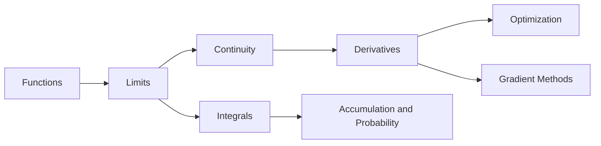

# Calculus for Computer Science and AI

Calculus is fundamental to many areas of computer science, particularly in machine learning, computer graphics, optimization, and algorithm analysis. This chapter covers essential calculus concepts with practical applications in computing.

## Why Calculus Matters in CS/AI

- **Machine Learning**: Gradient descent, backpropagation, optimization
- **Computer Graphics**: Curves, surfaces, animation, physics simulation
- **Algorithm Analysis**: Growth rates, complexity analysis
- **Signal Processing**: Fourier transforms, filtering
- **Optimization**: Finding optimal solutions in algorithms
- **Physics Simulation**: Game engines, robotics

## Chapter Contents

1. [Limits and Continuity](01-limits-continuity.md)
2. [Derivatives and Applications](02-derivatives-applications.md)
3. [Integration and Applications](03-integration-applications.md)
4. [Multivariable Calculus](04-multivariable-calculus.md)
5. [Optimization in Machine Learning](05-optimization-ml.md)
6. [Numerical Methods](06-numerical-methods.md)

## Prerequisites

- Basic algebra and functions
- Understanding of coordinate systems
- Programming experience (helpful for examples)

## Tools and Libraries

We'll use Python with libraries like:
- NumPy for numerical computations
- SciPy for scientific computing
- Matplotlib for visualization
- SymPy for symbolic mathematics
## Concept Dependency Map

## CS-Oriented Study Sequence

1. Learn limits and derivative mechanics.
2. Practice optimization on 1D and 2D functions.
3. Move to gradients/Jacobians for ML.
4. Use integrals for probability density reasoning.

## Quick Diagnostic Exercises

1. Explain why `f(x)=|x|` is non-differentiable at `x=0`.
2. Compute derivative of `x^3 e^x`.
3. Give one CS optimization problem modeled with derivatives.
