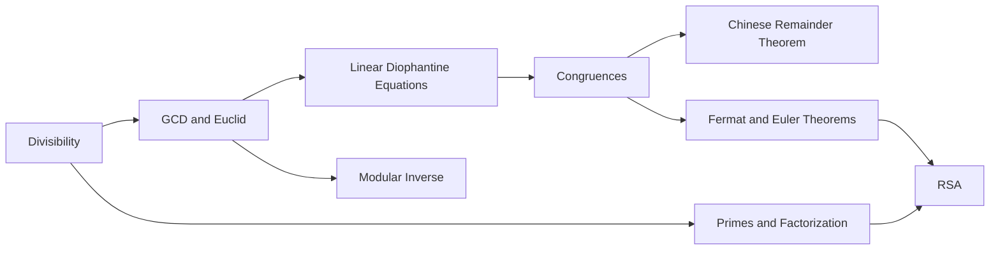

# Number Theory for Computer Science

Number theory is the mathematics of integers. In computer science, it appears in cryptography, hashing, randomized algorithms, coding theory, and modular arithmetic in systems programming.

## Why Number Theory Is Core CS Math

- Public-key cryptography: RSA, Diffie-Hellman, ECC foundations
- Checksums and hashes: modular reductions and residue classes
- Randomness: pseudorandom generators and primality tests
- Competitive programming: fast modular arithmetic, inverses, CRT
- Security engineering: key generation and computational hardness

## Concept Map

## Theorem Roadmap

1. Division Algorithm
2. Euclid's Lemma and gcd identities
3. Bézout's Identity
4. Congruence arithmetic laws
5. Fermat's little theorem and Euler's theorem
6. Chinese Remainder Theorem

## Proof Style You Should Practice

- Constructive proofs (build algorithm and prove correctness)
- Contradiction (especially in primality and irrationality style arguments)
- Induction (modular power identities)
- Equivalence proofs (`a ≡ b (mod m)` iff `m | (a-b)`)

## Worked CS Example Preview

Task: Compute `a/b mod m` when `m` is prime.

Method:
1. Use inverse: `a * b^{-1} mod m`
2. Find inverse as `b^(m-2) mod m` (Fermat)
3. Use fast exponentiation in `O(log m)` time

## Exercise Set

1. Prove that if `d | a` and `d | b`, then `d | (ax + by)` for all integers `x, y`.
2. Compute `gcd(1001, 143)` and write it as `1001x + 143y`.
3. Solve `x ≡ 2 (mod 5), x ≡ 3 (mod 7)`.
4. Show why modular division is invalid when divisor is not coprime to modulus.

## Summary

Number theory gives you a practical toolkit for secure systems and efficient integer computation. The following chapters move from foundational definitions to algorithms and cryptographic constructions.
