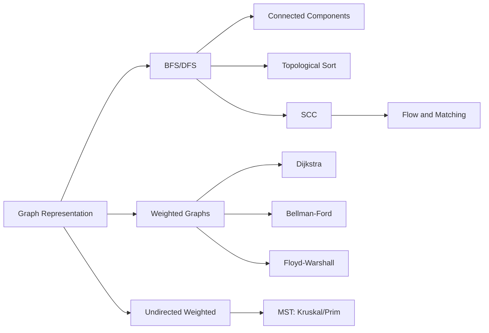

# Graph Theory for Computer Science

Graphs model relationships and interactions between entities. They are central to algorithms, systems, networking, AI, and compilers.

## Why Graphs Are Everywhere in CS

- Internet routing and network topology
- Dependency graphs in package managers and build tools
- Knowledge graphs and recommendation systems
- State-transition systems and automata
- Control-flow and call graphs in compilers

## Course Structure

1. Graph definitions and data structures
2. Traversal algorithms and invariants
3. Trees and spanning structures
4. Shortest path algorithms
5. Connectivity and flow
6. System-level applications

## Core Algorithm Map

## Proof Skills for Graph Algorithms

- Loop invariants (Dijkstra correctness)
- Exchange arguments (MST correctness)
- Reachability and induction on BFS layers
- Cut/cycle properties for weighted graphs

## Exercise Set (Warm-up)

1. Give one real-world system modeled naturally as directed graph.
2. Give one modeled as undirected weighted graph.
3. Explain why adjacency list is preferred for sparse graphs.

## Summary

Graph theory converts structure into computation. This section focuses on both formal correctness and implementation decisions.
