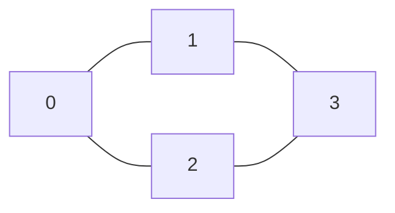

# Graph Basics and Representations

## 1. Formal Definitions

A graph is `G=(V,E)`.

- `V`: set of vertices (nodes)
- `E`: set of edges

Edge types:
- Undirected: `{u,v}`
- Directed: `(u,v)`
- Weighted: edge has value `w(u,v)`

## 2. Terminology

- Adjacent vertices share an edge
- Degree `deg(v)` (undirected)
- In-degree/out-degree (directed)
- Path: sequence of vertices connected by edges
- Simple path: no repeated vertex
- Cycle: path that returns to start

## 3. Theorem (Handshaking Lemma)

For undirected graph:

`sum_{v in V} deg(v) = 2|E|`.

### Proof Sketch

Each edge contributes exactly 1 to degree count of each endpoint, total contribution 2.

## 4. Data Structures

### Adjacency Matrix

- Space: `O(V^2)`
- Edge query: `O(1)`
- Good for dense graphs

### Adjacency List

- Space: `O(V+E)`
- Iterate neighbors efficiently
- Best for sparse graphs

## 5. Worked Example

Graph with `V={0,1,2,3}` and edges `(0,1),(0,2),(1,3),(2,3)`.

Adjacency list:
- 0: 1,2
- 1: 0,3
- 2: 0,3
- 3: 1,2

Adjacency matrix:

```
    0 1 2 3
0 : 0 1 1 0
1 : 1 0 0 1
2 : 1 0 0 1
3 : 0 1 1 0
```

## 6. Traversal Intuition



- BFS from 0 visits by layers: `0 -> {1,2} -> {3}`
- DFS from 0 explores one branch deeply first.

## 7. Python Skeleton

```python
def build_adj_list(n, edges, directed=False):
    g = [[] for _ in range(n)]
    for u, v in edges:
        g[u].append(v)
        if not directed:
            g[v].append(u)
    return g
```

## Exercises

1. Prove number of odd-degree vertices is even.
2. Convert an edge list into both matrix and list representations.
3. Give complexity of checking whether graph has self-loop in each representation.
4. For a complete graph `K_n`, compute number of edges and degrees.

## Summary

Graph representation choice strongly affects complexity and implementation style. This chapter establishes the vocabulary and models needed for all later algorithms.
