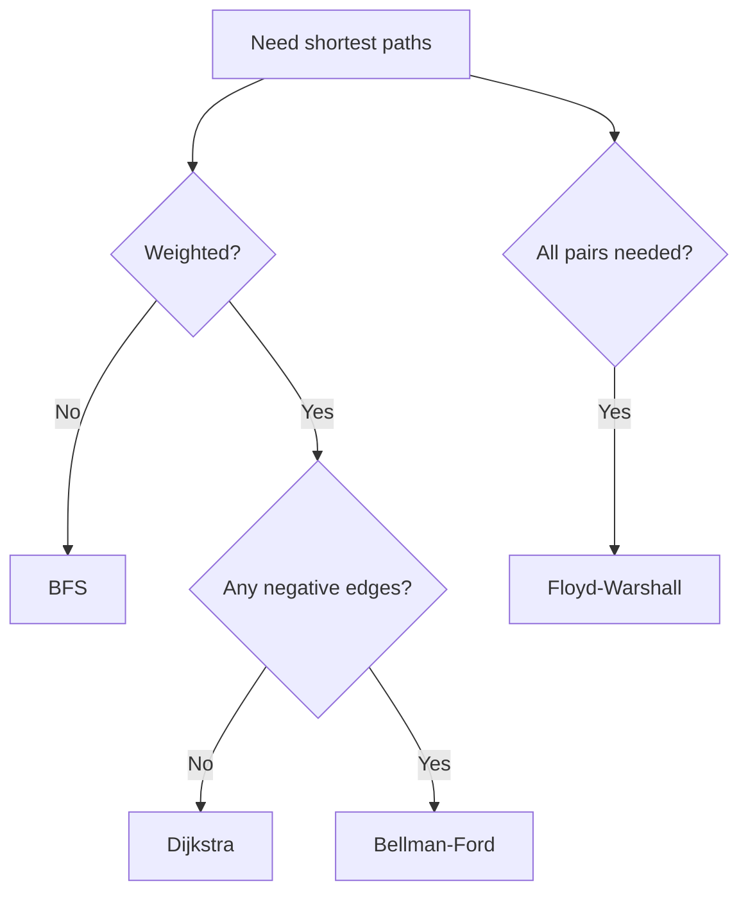

# Shortest Paths

## 1. Problem Variants

- Single-source shortest path (SSSP)
- Single-pair shortest path
- All-pairs shortest path (APSP)

## 2. Unweighted Graphs: BFS

BFS computes shortest path in edge count.

### Invariant

When node is first dequeued, recorded distance is minimal.

Complexity: `O(V+E)`.

## 3. Nonnegative Weights: Dijkstra

Greedy strategy using priority queue.

### Invariant

When vertex `u` is extracted with minimum tentative distance, `dist[u]` is final.

Requires all edge weights `>=0`.

Complexity: `O((V+E)logV)` with binary heap.

## 4. Negative Weights: Bellman-Ford

Relax all edges `V-1` times.

### Theorem

After `k` rounds, shortest paths with at most `k` edges are correct.

Extra round detects negative cycles.

Complexity: `O(VE)`.

## 5. Floyd-Warshall (APSP)

Dynamic programming:
`dist[i][j][k]` uses intermediate vertices from set `{1..k}`.

Complexity: `O(V^3)`, space `O(V^2)`.

## 6. Algorithm Selection Guide

## 7. Worked Example (Dijkstra)

Graph edges:
- `S->A(1), S->B(4), A->B(2), A->C(6), B->C(3)`

Dijkstra from S:
- start `dist[S]=0`
- settle A with 1
- relax B to 3 via A
- settle B with 3
- relax C to 6 via B
Result: shortest to C is 6.

## Exercises

1. Show failure case of Dijkstra with negative edge.
2. Implement path reconstruction using `parent[]`.
3. Compare adjacency matrix vs list implementation costs.
4. Run Bellman-Ford and detect a negative cycle in sample graph.

## Summary

Shortest path algorithms are selected by graph properties, not by habit. Weight sign and query type determine correct algorithmic choice.
