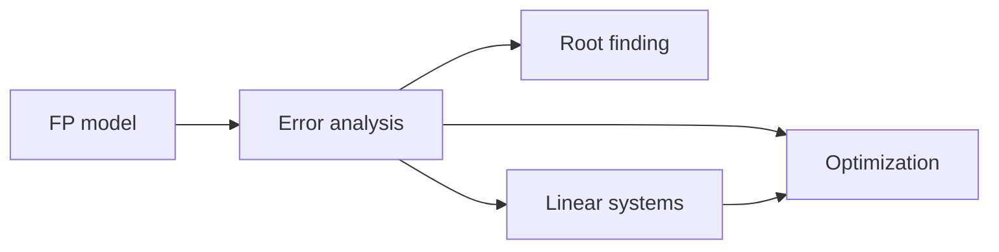

# Numerical Methods for Computer Science

Mathematical formulas assume real numbers and exact arithmetic. Computers use finite binary encodings and finite time. **Numerical methods** study algorithms that compute approximate answers with **controlled error**, **stability**, and **scalability**. This part is essential for scientific computing, graphics, simulation, optimization, and the numeric core of ML frameworks.

## The central tension

| Ideal math | Machine reality |
|------------|-----------------|
| $\mathbb{R}$ arithmetic | Floating-point $\mathbb{F}$ |
| Exact $A^{-1}$ | Approximate solve / iterative methods |
| Continuous derivatives | Finite differences or AD with roundoff |
| Infinite series | Truncation + rounding |
| Global optima | Local solvers, budgets |

A method can be **mathematically convergent** yet **numerically useless** if unstable.

## Core themes

1. **Floating-point representation and rounding**  
2. **Forward vs backward error; conditioning vs stability**  
3. **Root finding** (nonlinear equations)  
4. **Linear systems** (direct and iterative)  
5. **Numerical optimization** (smooth methods in finite precision)

## Conditioning vs stability (preview)

- **Conditioning:** sensitivity of the **problem**. Ill-conditioned: small input changes $\Rightarrow$ large output changes, even with exact arithmetic.  
- **Stability:** behavior of the **algorithm**. Stable algorithms give the exact answer to a slightly perturbed problem (backward stability).

You cannot fix a wildly ill-conditioned problem by clever coding alone—but you can avoid unstable algorithms that make things worse.

### Worked example 1

Solving $Ax=b$ for Hilbert matrix $H_n$ is severely ill-conditioned as $n$ grows. Even a stable solver returns large forward error.

### Worked example 2

Computing $e^x-1$ for tiny $x$ via direct subtraction is unstable; `expm1` is stable. Same mathematical function, different algorithms.

## Accuracy metrics

- Absolute error $| \hat{x}-x |$  
- Relative error $| \hat{x}-x | / |x|$ (meaningful when $x\neq 0$)  
- Residual for equations (e.g. $\|b-A\hat{x}\|$)—necessary but not sufficient for small forward error  

### Worked example 3

$\hat{x}$ with tiny residual for ill-conditioned $A$ may still be far from true $x$. Always check condition numbers when residuals look “good enough.”

## Complexity and structure

Numerical linear algebra exploits structure:

- Sparse matrices (graphs, FEM, Jacobians)  
- Symmetric positive definite (Cholesky, CG)  
- Toeplitz / low-rank / hierarchical  

Time complexities differ: dense GE $O(n^3)$, sparse methods can be near-linear in nonzeros for nice problems.

### Worked example 4

Graph Laplacian systems in spectral clustering: large sparse SPD $\Rightarrow$ conjugate gradient + preconditioning, not dense inverse.

## Roadmap

1. Floating-point, error, stability  
2. Root finding: bisection, Newton, secant  
3. Linear systems: LU, iterative methods, conditioning  
4. Numerical optimization practice  

Related: Optimization (`11`), Linear Algebra Advanced (`18`), Calculus (`08`).

## Tools (conceptual)

Libraries encode decades of numerical analysis: LAPACK, SuiteSparse, Eigen, SciPy, cuSOLVER. Prefer them over hand-rolled GE for production. Understanding when they fail (singular, ill-conditioned, wrong matrix type) is your job.

### Worked example 5

`np.linalg.solve(A,b)` uses LU with pivoting—not $A^{-1}b$. Explicit inverses cost more and usually less accurate.

## A first error budget

Suppose each floating operation introduces relative error $\sim u\approx 10^{-16}$. A long chain of $n$ dependent ops can accumulate $O(nu)$ relative error in the worst naive bound—sometimes much worse with cancellation. Stable algorithms rearrange work so the **backward** error stays $O(u)$ even if the forward error is large because the problem is sensitive.

### Worked example 6 — cancellation vs algebra

Evaluating $f(x)=\sqrt{x+1}-\sqrt{x}$ at $x=10^{16}$ in double often returns $0$, while $1/(\sqrt{x+1}+\sqrt{x})$ returns $\sim 5\cdot 10^{-9}$. Same $f$, different algorithms.

### Worked example 7 — residual vs truth

For $Ax=b$ with $\kappa(A)\sim 10^{12}$, a residual $\|b-A\hat x\|/\|b\|\sim 10^{-16}$ can still leave $\|\hat x-x\|/\|x\|$ order $10^{-4}$ or worse. Always pair residual checks with condition estimates.

## What “convergent algorithm” means

Iterative methods produce $x^{(k)}\to x^\star$ in exact arithmetic under hypotheses (contraction, descent lemma, spectral radius $<1$). In FP:

- Demand tolerances no tighter than problem conditioning allows  
- Prefer residual-based stops for linear solves  
- Watch stagnation from rounding  

### Worked example 8 — Newton for roots

Quadratic convergence of Newton is local and assumes $f'(x^\star)\neq 0$. Far from the root, or at multiple roots, behavior changes—hybridize with bisection.

## Roadmap recap with deliverables

| Chapter | You should be able to |
|---------|----------------------|
| FP & error | Rewrite unstable expressions; define $u$, $\kappa$ |
| Roots | Choose bisection vs Newton; state rates |
| Linear systems | Use LU/Cholesky/CG appropriately; avoid inverses |
| Opt numerics | Line search/trust region; diagnose NaNs |

## Pitfalls

1. Testing equality of floats with `==`  
2. Summing millions of values in poorly ordered reduction (use compensated summation / higher precision accumulators when needed)  
3. Finite differences with $h$ too small (cancellation) or too large (truncation)  
4. Ignoring scaling/units before solving  
5. Treating ML training divergence as “only LR” when numeric overflow/underflow is the cause  

## Checkpoint

- Explain conditioning vs stability with one example each  
- Define absolute/relative error and residual  
- Know why `solve` beats explicit inverse  
- Name the chapter map of this part  
- Spot catastrophic cancellation in a formula  

## Exercises

1. Convert $0.1$ decimal intuition: why is it not exact in binary32/64?
2. Define machine epsilon $u$ and relate to unit roundoff.
3. Give a well-conditioned problem solved unstably (example from next chapter OK).
4. Why is residual not enough for $Ax=b$?
5. Complexity: dense LU vs sparse for $n=10^5$ with $10$ nonzeros/row (qualitative).
6. When would you pick an iterative method over a direct method?
7. Explain overflow risk in $\prod_i e^{a_i}$ vs $\exp(\sum a_i)$.
8. What is a condition number for $f(x)=1/x$ near $0$?
9. List three production domains that depend on numerical linear algebra.
10. Checkpoint writing: rewrite an unstable expression you have seen (e.g. variance one-pass formula issues).

## Summary

Numerical methods make continuous mathematics computable under finite precision and finite work. The discipline separates problem hardness (conditioning) from algorithm quality (stability) and gives reliable tools for roots, linear systems, and optimization—the computational backbone of scientific and ML systems.
