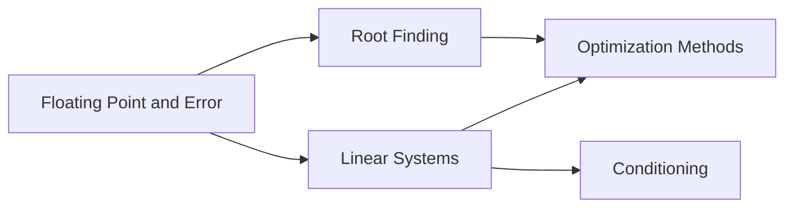

# Numerical Methods for Computer Science

Numerical methods convert mathematical models into reliable finite-precision computation.

## Why This Section Matters

Many mathematically correct formulas become computationally fragile on real hardware. Numerical methods teach how to compute answers that are not only fast, but trustworthy.

## Core Themes

- Floating-point representation and rounding error
- Algorithmic stability vs instability
- Conditioning of problems vs quality of methods
- Iterative vs direct methods
- Convergence guarantees and stopping criteria

## Dependency Map

## Practical Outcomes

After this section, you should be able to:
1. predict when computations are numerically unsafe,
2. choose suitable solvers,
3. justify convergence/stability decisions,
4. validate outputs with diagnostics.

## Exercises

1. Give one example where mathematically equivalent formulas differ numerically.
2. Explain difference between model error and numerical error.
3. Define conditioning in one sentence.
