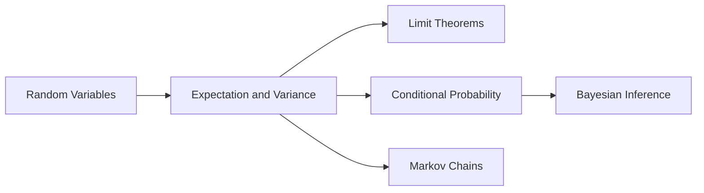

# Advanced Probability for CS and AI

This section extends core probability into the tools used in modern ML, inference, systems modeling, and uncertainty-aware engineering.

## Why Advanced Probability Matters

- Probabilistic modeling in ML and AI
- A/B testing and decision-making under uncertainty
- Queueing and reliability modeling
- Bayesian updating in real-time systems
- Sequential stochastic processes (Markov chains)

## Learning Flow

## Chapter Objectives

1. Formalize random-variable reasoning
2. Use moments and conditional expectation as computational tools
3. Understand convergence and approximation guarantees
4. Apply Bayesian updates in practical settings
5. Analyze Markov dynamics and stationary behavior

## Exercises

1. Define difference between distribution and sample.
2. Explain in one line why CLT is useful in data science.
