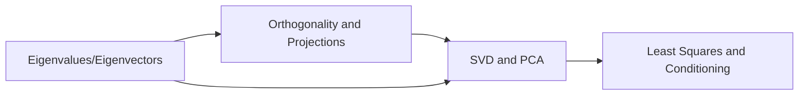

# Advanced Linear Algebra for CS/ML

Advanced linear algebra is the mathematical engine behind modern machine learning, optimization, graphics, and scientific computing.

## Why This Section Matters

- Spectral methods and ranking algorithms
- Dimensionality reduction and latent structure
- Stable numerical solving in large systems
- Matrix factorization-based learning methods

## Learning Path

## Core Competencies

1. Understand spectral decomposition concepts
2. Use projection geometry for data approximation
3. Apply SVD for compression and denoising
4. Analyze numerical sensitivity in linear models

## Exercises

1. Explain relation between orthogonality and numerical stability.
2. Give one ML use-case for each: eigenvectors, SVD, least squares.
