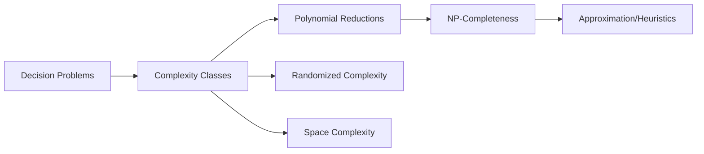

# Complexity Theory for Computer Science

Complexity theory studies the intrinsic resource requirements of computational problems.

## Why This Section Matters

- Distinguishes feasible from infeasible exact computation
- Provides reduction-based hardness reasoning
- Guides use of approximation/randomization/heuristics
- Clarifies time-space tradeoffs in practical systems

## Topic Roadmap

## Learning Goals

1. classify problems by formal resource bounds,
2. prove hardness via reductions,
3. reason about randomized/approximate alternatives,
4. understand memory-bounded computation classes.

## Exercises

1. Define decision vs optimization problem with one example each.
2. Explain why polynomial-time reductions preserve tractability implications.
