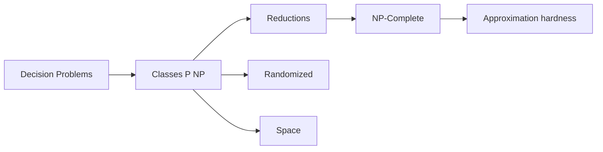

# Complexity Theory for Computer Science

Complexity theory classifies problems by the resources—time, space, randomness—required to solve them. It explains why some tasks admit fast algorithms, why others need heuristics, and how reductions transfer hardness. This part deepens NP-completeness craft, randomized/approximation complexity, and space classes.

## Why it matters in industry

| Decision | Theory input |
|----------|--------------|
| Exact vs approximate solver | NP-hardness, approx hardness |
| Crypto assumptions | average-case hardness (related landscape) |
| Compiler analyses | undecidable vs PTIME fragments |
| Verifier architectures | NP certificates, interactive proofs (advanced) |
| Memory-tight algorithms | L, NL, PSPACE |

## Core map

## Decision problems first

Optimization is converted to decision (“is there a solution with cost $\le k$?”) so classes like $\mathbf{P}$ and $\mathbf{NP}$ apply cleanly. Algorithms for optimization still matter; class theory explains barriers.

### Worked example 1

TSP optimization $\leftrightarrow$ decision TSP with threshold $k$. Binary search on $k$ if decisions are efficient and bounds discrete.

## Roadmap

1. Reductions and NP-completeness  
2. Randomized and approximation complexity  
3. Space complexity  

Related: Algorithms part (`13`) for asymptotics and intro classes.

## Proof culture

Complexity proofs are mostly:

- Construct poly-time reductions carefully (both directions)
- Exhibit verifiers for $\mathbf{NP}$ membership  
- Use hierarchy theorems / padding for separations (advanced)  

### Worked example 2

A wrong-direction reduction “solves” nothing for hardness: always reduce **known hard $\to$ your problem**.

## Pitfalls

1. “NP = hard” slang vs formal $\mathbf{NP}$  
2. Heuristic success as proof of $\mathbf{P}$  
3. Certificate exponential size  
4. Confusing worst-case with average-case crypto  
5. Ignoring promise problems / gap problems in approx hardness  

## Worked mental models

### Verifier view of NP

A language is in $\mathbf{NP}$ if short proofs of YES can be checked quickly—not if the problem is “hard.” Sorting is in $\mathbf{P}\subseteq\mathbf{NP}$; SAT is in $\mathbf{NP}$ and complete.

### Reduction as subroutine

$A\le_p B$ means: “to solve $A$, transform the instance and call a $B$-oracle.” Hardness flows **from** $A$ **to** $B$ along this arrow.

### Space vs time

Savitch’s theorem collapses nondeterministic poly space to deterministic poly space—unlike the open $\mathbf{P}$ vs $\mathbf{NP}$ question for time. Memory and time have different theories.

### Worked example 3 — product call

“Is this scheduling problem NP-complete?” Checklist: decision version? in NP? reduce from 3-SAT/partition/… with poly gadgets and both iff directions?

### Worked example 4 — approx choice

Need a tour on metric distances: Christofides/MST 1.5–2 approx exists. Same problem without triangle inequality: no constant approx unless $\mathbf{P}=\mathbf{NP}$. Modeling assumptions change complexity.

## Checkpoint

- Define $\mathbf{P}$, $\mathbf{NP}$, $\le_p$  
- State NP-completeness method  
- Name RP/BPP intuition  
- Place L, NL, PSPACE in the chain  
- Convert an optimization task to decision  

## Exercises

1. List three NP-complete problems and one problem in P.
2. Why does $\mathbf{P}\subseteq\mathbf{NP}$?
3. Give a language in PSPACE not obviously in NP.
4. What would $\mathbf{P}=\mathbf{NP}$ imply for cryptography (high level)?
5. Checkpoint: write a 5-line NP-completeness plan for a scheduling decision problem.

## Summary

Complexity theory is the map of feasible computation. Mastering reductions, randomness, approximation limits, and space gives principled expectations about what software can guarantee—and when to change the problem.
