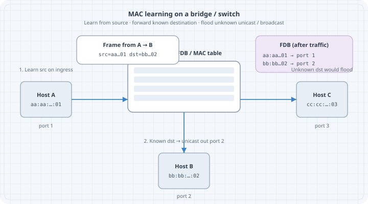

# Link Layer and Ethernet

The **link layer** moves frames between neighbors on a shared medium or point-to-point link. In almost every lab in this book, that means **Ethernet** (physical or virtual).

## Learning goals

- Describe Ethernet frame fields used in daily troubleshooting  
- Explain unicast, multicast, broadcast at L2  
- Contrast hubs (obsolete), switches, and bridges  
- Preview MAC learning (full drills in Layer 2 part)  

## Why link layer matters

IP cannot deliver alone: on multi-access Ethernet, the next hop is identified by **MAC**. Wrong VLAN, wrong MAC, or broken L2 path makes “routing” look broken when the problem is local.

## Ethernet frame (simplified)

| Field | Role |
|-------|------|
| Dest MAC | Who should accept the frame |
| Src MAC | Who sent it (learning key on switches) |
| Ethertype / length | Payload type (e.g. `0x0800` IPv4, `0x86DD` IPv6, `0x0806` ARP) |
| Payload | IP packet, ARP, etc. |
| FCS | Error detection |

802.1Q VLAN tags insert **TPID + TCI** (including VLAN ID) between SA and Ethertype on trunks—details in VLANs chapter.

## MAC addresses

- 48-bit; written `aa:bb:cc:dd:ee:ff`  
- Universally administered vs locally administered  
- **Broadcast** `ff:ff:ff:ff:ff:ff`  
- Multicast: group bit set  

```bash
ip -br link
ip link show eth1
```

## Broadcast domain vs collision domain

- **Collision domain:** historically shared half-duplex media; switched full-duplex Ethernet largely eliminates classic collisions  
- **Broadcast domain:** extent of L2 broadcast/unknown flood—usually one VLAN  

Routers **stop** L2 broadcasts; switches do not.

## Switch vs router (again)

| Device | Forwarding key | Changes MAC? | Changes IP? |
|--------|----------------|--------------|-------------|
| L2 switch | Dest MAC + FDB | No (transparent) | No |
| Router | Dest IP + FIB | **Yes** (new Ethernet hop) | No (until NAT) |

## MAC learning (preview)

1. Learn **src MAC → port** on ingress  
2. If dest MAC known, forward to that port  
3. If unknown unicast, **flood** in the VLAN  
4. Broadcast/multicast: flood per rules  

{fig-alt="Switch learns source MAC and forwards or floods by destination"}

Deep labs: [Ethernet & MAC Learning](../03-layer-2/01-ethernet-mac.qmd).

## Virtual Ethernet in labs

Containerlab connects nodes with **veth pairs** and bridges—same Ethernet model, software implementation:

```bash
ip link
bridge link   # if bridge-utils / iproute2 bridge
```

## Common L2 failures (foundations list)

| Symptom | Typical cause |
|---------|----------------|
| Incomplete ARP | Wrong subnet, wrong VLAN, silent host |
| Flapping MAC | Loops or dual-homing without design |
| No frame at all | Down interface, wrong cable/veth, admin down |

## Checkpoint

Explain what a switch does when it receives a frame with an **unknown** destination MAC, and what it does with the **source** MAC.

## Next

- [IPv4 Addressing and Subnetting](05-ipv4-addressing-and-subnetting.qmd)  
