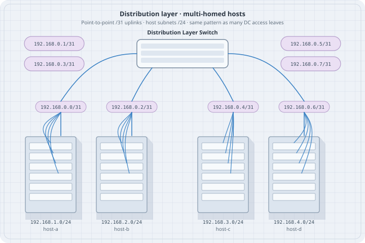

# IPv4 Addressing and Subnetting

IPv4 addressing is the daily language of lab design: **prefixes**, **masks**, **subnets**, and **who is on-link**. Master this before multi-router labs.

## Learning goals

- Read and write CIDR prefixes (`a.b.c.d/nn`) fluently  
- Convert between prefix length and dotted masks  
- Design non-overlapping lab subnets and point-to-point links  
- Identify special-use and documentation ranges  
- Configure addresses on Linux and verify with `ip`  

## IPv4 structure

- **32 bits**, usually dotted decimal (four 0–255 octets)  
- **Prefix length** `/N` = number of network bits; host bits = `32 − N`  
- **Network address**: host bits zero  
- **Broadcast address** (classical Ethernet/IPv4): host bits one (except special cases like /31)  

| Prefix | Mask | Classical usable hosts | Common use |
|--------|------|------------------------|------------|
| /32 | 255.255.255.255 | 1 | Host route, loopback |
| /31 | 255.255.255.254 | 2 | Point-to-point (RFC 3021) |
| /30 | 255.255.255.252 | 2 | Classic P2P |
| /29 | 255.255.255.248 | 6 | Small segment |
| /24 | 255.255.255.0 | 254 | Common LAN |
| /16 | 255.255.0.0 | many | Summaries / big labs |
| /8 | 255.0.0.0 | huge | Rare in labs |

## CIDR and masks

```text
192.168.10.0/24
network: 192.168.10.0
mask:    255.255.255.0
hosts:   192.168.10.1 – 192.168.10.254
bcast:   192.168.10.255
```

```bash
# Linux: add address
ip addr add 192.168.10.10/24 dev eth1
ip -br addr
```

### On-link decision

If the destination is inside a **connected** prefix, the host resolves L2 (ARP) on that interface. Otherwise it looks up a **route** (often default via gateway).

```bash
ip route get 192.168.10.50
ip route get 8.8.8.8
```

## Private and documentation ranges

| Range | Role |
|-------|------|
| `10.0.0.0/8`, `172.16.0.0/12`, `192.168.0.0/16` | Private (RFC 1918)—default lab space |
| `192.0.2.0/24`, `198.51.100.0/24`, `203.0.113.0/24` | Documentation (TEST-NET)—safe in examples |
| `127.0.0.0/8` | Loopback |
| `169.254.0.0/16` | Link-local (APIPA) |
| `224.0.0.0/4` | Multicast |

**Lab hygiene:** pick a documented plan (`10.20.0.0/16` etc.) and never invent overlapping subnets “for now.”

## Subnetting for multi-tier labs

Example allocation from `10.20.0.0/16`:

| Use | Block |
|-----|-------|
| Access / users A | `10.20.1.0/24` |
| Access / users B | `10.20.2.0/24` |
| Servers | `10.20.10.0/24` |
| P2P core | `10.20.255.0/24` carved as `/31` or `/30` |
| Loopbacks | `10.20.254.0/24` as `/32`s |

**Rules:**

1. No accidental overlap  
2. Leave growth room  
3. Write the plan **before** deploy  
4. Align future summaries with real topology  

### Point-to-point links

| Style | Example | Notes |
|-------|---------|--------|
| /31 | `10.20.255.0/31` → `.0` and `.1` | Preferred in modern designs |
| /30 | `10.20.255.0/30` → `.1` and `.2` usable | Classic textbooks |

{fig-alt="Distribution switch with /31 uplinks and host /24s"}

## Summarization (intro)

Advertising `10.20.0.0/22` for four /24s only works if you **own** the whole /22. Bad summaries **blackhole** traffic for space you do not have.

| Action | Risk |
|--------|------|
| Summary too broad | Blackholes |
| No aggregation ever | Table growth later (IGP/BGP scale) |

Layer 3 part continues summarization drills; foundations need the danger signal.

## VLSM

**Variable Length Subnet Masking:** different prefix lengths in one design (`/24` LAN + `/31` core). Required for efficient labs—do not force everything to /24.

## Host configuration checklist

1. Address + prefix on the correct interface  
2. Up state (`ip link set eth1 up`)  
3. Gateway if leaving the subnet  
4. DNS only if apps need names (separate from pure L3 reachability)  

```bash
ip addr add 10.20.1.10/24 dev eth1
ip link set eth1 up
ip route add default via 10.20.1.1
ip -br a
ip route
```

## Paper drills

1. Network, first host, last host, broadcast for `172.16.5.0/26`  
2. How many /24s fit in `10.0.0.0/16`?  
3. Can `10.0.1.0/24` and `10.0.1.128/25` coexist without overlap?  

## Checkpoint

Design addresses for: two LANs (/24 each), one router-router link (/31), two router loopbacks (/32). No overlaps; list every interface IP.

## Next

- [IPv6 Essentials](06-ipv6-essentials.qmd)  
