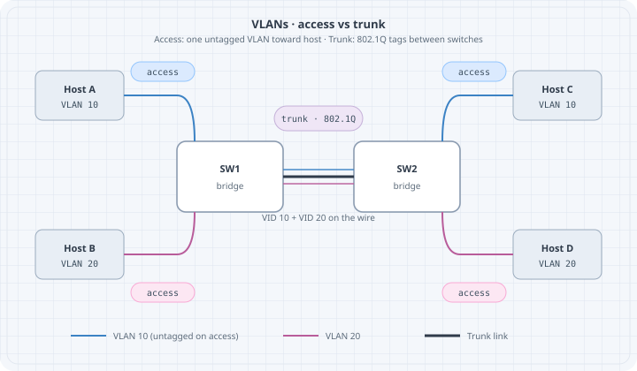

# VLANs & Trunks

VLANs split one physical switching fabric into multiple **broadcast domains**. Trunks carry many VLANs between switches with 802.1Q tags. Mis-matched tags and native VLANs are classic outage factories—this chapter makes them deliberate.

{fig-alt="Two switches with VLAN 10 and VLAN 20 access hosts and a tagged trunk between them"}

## Learning goals

By the end of this chapter you can:

- Explain access vs trunk ports  
- Design a multi-VLAN lab with consistent IDs  
- Predict tag behavior on the wire  
- Spot native VLAN mismatch symptoms  
- Verify isolation between VLANs without a router  

## Concepts

### Broadcast domains

Without VLANs, one bridge = one flood domain. VLAN-aware bridging tags frames with a VLAN ID (VID) and keeps separate FDBs per VLAN (implementation details vary, model holds).

| Port mode | Behavior |
|-----------|----------|
| **Access** | One VLAN; frames untagged on the wire toward the host |
| **Trunk** | Multiple VLANs; tags on the wire (except optional native) |
| **Native VLAN** | Untagged traffic on a trunk is mapped to this VLAN |

### 802.1Q tag

Inserts TPID `0x8100` + PCP/DEI + VID. Capture shows tagged frames between switches:

```bash
tcpdump -ni eth1 -e vlan
# or
tcpdump -ni eth1 -e | head
```

### Router roles

Inter-VLAN traffic needs an L3 device (router-on-a-stick, SVI, separate routed ports). Same switch + different VLANs ⇒ **no IP connectivity** by design.

## Addressing plan example

| VLAN | Name | Subnet | Access ports |
|------|------|--------|--------------|
| 10 | users | 10.10.10.0/24 | h1 |
| 20 | iot | 10.10.20.0/24 | h2 |
| 99 | native/mgmt lab | 10.10.99.0/24 | optional |

Trunk between `sw1` and `sw2` allows 10,20 (and 99 if used).

## Lab topology (conceptual)

```text
h1 --(access VLAN 10)-- sw1 ==trunk== sw2 --(access VLAN 10)-- h3
h2 --(access VLAN 20)-- sw1 ==trunk== sw2 --(access VLAN 20)-- h4
```

### Containerlab sketch using Linux VLAN-aware bridge

Full production-grade switch images are optional; Linux can teach tags.

```yaml
name: l2-vlan

topology:
  nodes:
    sw1:
      kind: linux
      image: alpine:3.20
      binds:
        - ./config/sw1.sh:/startup.sh
      cmd: /bin/sh /startup.sh
    sw2:
      kind: linux
      image: alpine:3.20
      binds:
        - ./config/sw2.sh:/startup.sh
      cmd: /bin/sh /startup.sh
    h1:
      kind: linux
      image: alpine:3.20
      exec:
        - apk add --no-cache iproute2 iputils
        - ip addr add 10.10.10.1/24 dev eth1
        - ip link set eth1 up
    h2:
      kind: linux
      image: alpine:3.20
      exec:
        - apk add --no-cache iproute2 iputils
        - ip addr add 10.10.20.1/24 dev eth1
        - ip link set eth1 up
    h3:
      kind: linux
      image: alpine:3.20
      exec:
        - apk add --no-cache iproute2 iputils
        - ip addr add 10.10.10.3/24 dev eth1
        - ip link set eth1 up
    h4:
      kind: linux
      image: alpine:3.20
      exec:
        - apk add --no-cache iproute2 iputils
        - ip addr add 10.10.20.4/24 dev eth1
        - ip link set eth1 up

  links:
    - endpoints: ["h1:eth1", "sw1:eth1"]
    - endpoints: ["h2:eth1", "sw1:eth2"]
    - endpoints: ["h3:eth1", "sw2:eth1"]
    - endpoints: ["h4:eth1", "sw2:eth2"]
    - endpoints: ["sw1:eth3", "sw2:eth3"]
```

### `config/sw1.sh` (VLAN filtering bridge)

```bash
#!/bin/sh
set -e
apk add --no-cache iproute2 bridge >/dev/null
ip link add br0 type bridge vlan_filtering 1
ip link set br0 up

# access ports
for i in 1 2; do ip link set eth$i up; ip link set eth$i master br0; done
ip link set eth3 up
ip link set eth3 master br0

# clear default VLAN 1 membership as needed; set access VLANs
bridge vlan add vid 10 dev eth1 pvid untagged
bridge vlan del vid 1 dev eth1 2>/dev/null || true
bridge vlan add vid 20 dev eth2 pvid untagged
bridge vlan del vid 1 dev eth2 2>/dev/null || true

# trunk eth3: tagged 10,20
bridge vlan add vid 10 dev eth3
bridge vlan add vid 20 dev eth3
bridge vlan del vid 1 dev eth3 2>/dev/null || true

# bridge self VLANs
bridge vlan add vid 10 dev br0 self
bridge vlan add vid 20 dev br0 self

sleep infinity
```

Mirror on `sw2` with eth1→VLAN10, eth2→VLAN20, eth3 trunk.

Kernel/`bridge` command details vary slightly by version—if a flag fails, check `man bridge` on the image and adjust. The **model** (pvid untagged access, tagged trunk) is the learning target.

## Predict → observe → fix

### Predict

- h1 ↔ h3 (VLAN 10) ping works  
- h2 ↔ h4 (VLAN 20) ping works  
- h1 ↔ h2 fails (no L3 inter-VLAN)  
- Capture on trunk shows VLAN tags for inter-switch frames  

### Observe

```bash
docker exec clab-l2-vlan-h1 ping -c 2 10.10.10.3
docker exec clab-l2-vlan-h2 ping -c 2 10.10.20.4
docker exec clab-l2-vlan-h1 ping -c 1 -W 1 10.10.20.1  # expect fail
docker exec clab-l2-vlan-sw1 bridge vlan show
docker exec clab-l2-vlan-sw1 tcpdump -ni eth3 -e -c 20
```

### Failure drill: native / PVID mismatch

On sw1 trunk, map untagged to VLAN 10; on sw2 map untagged to VLAN 20. Send untagged (or mis-access) traffic.

**Symptoms often seen:**

- Silent discard  
- Hosts “leak” into wrong segment  
- Intermittent weirdness depending on tagging  

**Harden:** Explicitly tag all lab VLANs on trunks; avoid relying on native VLAN for user data. Document native VLAN ID identically on both ends if you must use it.

### Failure drill: missing allowed VLAN

Remove VLAN 20 from sw2 trunk membership.

**Predict:** VLAN 10 still works; VLAN 20 across switches dies.

```bash
# on sw2, delete vid 20 from eth3, retest h2->h4
```

## Router-on-a-stick preview

```text
sw trunk --- r1 eth1.10 + eth1.20
```

```bash
ip link add link eth1 name eth1.10 type vlan id 10
ip link add link eth1 name eth1.20 type vlan id 20
ip addr add 10.10.10.254/24 dev eth1.10
ip addr add 10.10.20.254/24 dev eth1.20
ip link set eth1.10 up
ip link set eth1.20 up
sysctl -w net.ipv4.ip_forward=1
```

Hosts use `.254` as gateway. Full L3 chapters expand routing; here you only prove **VLAN separation needs L3 to merge**.

## Verification checklist

```bash
# Per switch
bridge vlan show
bridge fdb show

# Per host
ip -br a
ip neigh
ping -c 2 <same-vlan-far-host>
ping -c 1 -W 1 <other-vlan-host>   # should fail without router
```

### verify.sh sketch

```bash
#!/usr/bin/env bash
set -euo pipefail
docker exec clab-l2-vlan-h1 ping -c 2 -W 1 10.10.10.3
docker exec clab-l2-vlan-h2 ping -c 2 -W 1 10.10.20.4
if docker exec clab-l2-vlan-h1 ping -c 1 -W 1 10.10.20.1; then
  echo "FAIL: inter-VLAN should be blocked" >&2
  exit 1
fi
echo OK
```

Negative checks are gold.

## Design tips

| Tip | Why |
|-----|-----|
| Plan VLAN IDs globally in the lab | Avoid “VLAN 10 means different things” |
| Do not reuse VLAN 1 for user data | Habit for real gear hygiene |
| Match trunk allow lists both ends | One-way or partial connectivity |
| Document native VLAN | Mismatch class of bugs |
| Separate voice/data IDs even in labs | Practice real patterns |

## Common mistakes

| Mistake | Result |
|---------|--------|
| Access port in wrong VLAN | ARP never reaches partner |
| Trunk missing VID | Works locally, fails across switches |
| Same subnet on two VLANs | Broken design + asymmetric mess |
| Expecting VLANs to route | Need L3 |

## Summary

- VLANs partition broadcast domains; trunks carry tagged sets between switches  
- Access = untagged one VID; trunk = tagged many VIDs  
- Align allow lists and native VLAN on both ends  
- Prove isolation with intentional negative pings  
- Inter-VLAN = router/SVI job  

Next: **loop prevention**—what happens when redundant L2 paths exist without a control protocol.
