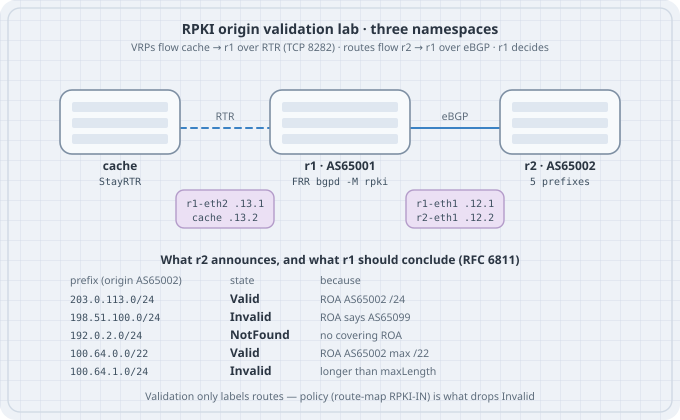

# RPKI — Route Origin Validation

BGP believes whatever its neighbors say. If a peer announces your prefix with someone else's AS at the end of the path, your router installs it, prefers it if it is more specific, and forwards your customers' traffic into the wrong network. Prefix lists help for the handful of customers you know; they do nothing for the 1,000,000 routes arriving from a transit provider. **RPKI route origin validation (ROV)** is the boring, widely deployed answer: address holders publish signed statements of *which AS may originate which prefix, up to which length*, a validator turns those into a flat table, and your router labels every route **Valid**, **Invalid**, or **NotFound**. Policy then drops the Invalids. This chapter builds the whole chain on one Linux box — a cache, a validating FRR router, and a misbehaving peer — and then breaks it the three ways it breaks in production.

## Learning goals

By the end of this chapter you can:

- Explain the chain ROA → validator → VRP → RTR → router, and what each piece is trusted for  
- Apply the RFC 6811 algorithm by hand: covering VRPs, origin AS, maxLength  
- Enable RPKI in FRR, connect it to an RTR cache, and read validation state per route  
- Show that validation without policy changes **nothing** about forwarding  
- Write an inbound route-map that drops Invalid and de-prefers NotFound  
- Explain why a loose `maxLength` turns a sub-prefix hijack into a **Valid** route  
- Predict what happens to routing when the cache is unreachable, and when VRPs change underneath accepted routes  

## Concepts — RPKI in one page

{fig-alt="Three namespaces: a StayRTR cache feeds validated ROA payloads over RTR on TCP 8282 to router r1 in AS65001; r2 in AS65002 announces five prefixes over eBGP; a table lists each prefix and its expected Valid, Invalid, or NotFound state."}

**Who signs what.** The Resource Public Key Infrastructure (RFC 6480) mirrors the address allocation hierarchy: the five RIRs hold trust anchors, they certify the address blocks they hand out, and a holder can publish a **Route Origin Authorization (ROA)** for its space. A ROA says: *prefix P, origin AS A, maximum length M*. It says nothing about the rest of the AS path.

**Who validates.** A **relying-party validator** (Routinator, rpki-client, FORT, OctoRPKI…) fetches every repository, checks every signature and expiry, and emits a flat list of **Validated ROA Payloads (VRPs)**: `(prefix, maxLength, ASN)` tuples. Your routers never touch certificates.

**How the router learns them.** The validator (or a small cache in front of it, such as StayRTR) serves VRPs to routers over the **RPKI-to-Router protocol** (RTR, RFC 8210 for version 1), normally TCP port 8282 or 323. It is a serial-numbered, incremental feed: routers get a full table once, then diffs.

**The algorithm (RFC 6811).** For a route with prefix *R* and origin AS *O* (the last AS in the path):

1. Collect the **covering** VRPs: those whose prefix contains *R*.  
2. None → **NotFound**. Nobody made a claim about this space.  
3. Any covering VRP with ASN = *O* **and** length(*R*) ≤ maxLength → **Valid**.  
4. Covering VRPs exist but none match → **Invalid**. Either the wrong AS, or a longer prefix than the holder authorised.

**What the router does with the label.** Nothing, until you write policy. RFC 7115 describes operational practice; the common baseline today is *drop Invalid, accept NotFound (much of the table still has no ROAs), accept Valid*.

| Term | Meaning |
|------|---------|
| ROA | Signed object: prefix, maxLength, origin ASN |
| VRP | One validated `(prefix, maxLength, ASN)` tuple |
| RP / validator | Software that turns the RPKI into VRPs |
| RTR | Protocol that carries VRPs from cache to router |
| Covering VRP | A VRP whose prefix contains the route's prefix |
| ROV | Labelling routes by RFC 6811; policy acts on the label |

The algorithm fits in a page of Python. Feeding it the lab's VRPs first makes the router output later look familiar:

```python
#!/usr/bin/env python3
# rov.py — RFC 6811 route origin validation, nothing else
import ipaddress, json, sys

def load_vrps(path):
    with open(path) as f:
        roas = json.load(f)["roas"]
    return [(ipaddress.ip_network(r["prefix"]), r["maxLength"],
             int(str(r["asn"]).removeprefix("AS"))) for r in roas]

def validate(route, origin, vrps):
    route = ipaddress.ip_network(route)
    covering = [v for v in vrps
                if v[0].version == route.version and route.subnet_of(v[0])]
    if not covering:
        return "NotFound", []
    for pfx, maxlen, asn in covering:
        if asn == origin and route.prefixlen <= maxlen:
            return "Valid", [(str(pfx), maxlen, asn)]
    return "Invalid", [(str(p), m, a) for p, m, a in covering]

if __name__ == "__main__":
    vrps = load_vrps(sys.argv[1])
    for line in sys.stdin:
        route, origin = line.split()
        state, why = validate(route, int(origin), vrps)
        print(f"{route:<18} AS{origin:<6} {state:<9} {why}")
```

```json
{
  "metadata": { "buildtime": "2026-10-08T00:00:00Z" },
  "roas": [
    { "prefix": "203.0.113.0/24", "maxLength": 24, "asn": "AS65002" },
    { "prefix": "198.51.100.0/24", "maxLength": 24, "asn": "AS65099" },
    { "prefix": "100.64.0.0/22",  "maxLength": 22, "asn": "AS65002" }
  ]
}
```

Save the JSON as `vrps.json` (StayRTR reads the same file later) and run:

```bash
printf '%s\n' "203.0.113.0/24 65002" "198.51.100.0/24 65002" "192.0.2.0/24 65002" \
  "100.64.0.0/22 65002" "100.64.1.0/24 65002" "100.64.1.0/24 65099" \
  | python3 rov.py vrps.json
```

```text
203.0.113.0/24     AS65002  Valid     [('203.0.113.0/24', 24, 65002)]
198.51.100.0/24    AS65002  Invalid   [('198.51.100.0/24', 24, 65099)]
192.0.2.0/24       AS65002  NotFound  []
100.64.0.0/22      AS65002  Valid     [('100.64.0.0/22', 22, 65002)]
100.64.1.0/24      AS65002  Invalid   [('100.64.0.0/22', 22, 65002)]
100.64.1.0/24      AS65099  Invalid   [('100.64.0.0/22', 22, 65002)]
```

Read the last two lines carefully: the /24 inside the /22 is Invalid *whoever* originates it, because the holder only authorised the /22. That is the property that makes sub-prefix hijacks fail — and the property a loose `maxLength` gives away (Drill 3).

## Addressing plan (RPKI lab)

| Node | Interface | Address | Role |
|------|-----------|---------|------|
| r1 | r1-eth1 | 10.0.12.1/24 | AS 65001, validating router |
| r1 | r1-eth2 | 10.0.13.1/24 | Management link to the cache |
| r2 | r2-eth1 | 10.0.12.2/24 | AS 65002, announces five prefixes |
| cache | cache-eth0 | 10.0.13.2/24 | StayRTR, RTR on TCP 8282 |

| Prefix announced by r2 | VRP | Expected state |
|------------------------|-----|----------------|
| 203.0.113.0/24 | 203.0.113.0/24-24 AS65002 | Valid |
| 198.51.100.0/24 | 198.51.100.0/24-24 AS65099 | Invalid (wrong origin — the "hijack") |
| 192.0.2.0/24 | none | NotFound |
| 100.64.0.0/22 | 100.64.0.0/22-22 AS65002 | Valid |
| 100.64.1.0/24 | (covered by the /22) | Invalid (too specific) |

## Lab build (Linux namespaces + FRR + StayRTR)

No container images and no Internet RPKI: three network namespaces, two veth pairs, one FRR instance per router namespace (FRR's pathspace option `-N`, exactly like the BFD chapter's lab), and **StayRTR** serving the `vrps.json` file above as an RTR cache. A real deployment points the same router configuration at a validator such as Routinator or rpki-client; only the cache address changes.

It was run on **Debian 13 with the distro packages FRR 10.3 (`frr`, `frr-rpki-rtrlib`) and StayRTR 0.6.2**, as root. Outputs below are copied from those runs; timestamps and PIDs will differ on yours.

```bash
sudo apt-get install -y frr frr-rpki-rtrlib stayrtr
sudo systemctl disable --now frr      # the lab starts its own instances
```

`frr-rpki-rtrlib` ships the bgpd module `bgpd_rpki.so`; bgpd only loads it when started with `-M rpki`. Without the package bgpd refuses to start with that flag.

```bash
#!/usr/bin/env bash
# lab.sh — r1 (validating FRR) peers with r2 (announcing FRR); "cache" runs StayRTR
# usage: sudo ./lab.sh up | down
set -euo pipefail
FRR=/usr/lib/frr
DAEMONS="mgmtd zebra bgpd staticd"
HERE=$(cd "$(dirname "$0")" && pwd)

up() {
  for ns in r1 r2 cache; do ip netns add "$ns"; ip -n "$ns" link set lo up; done

  # eBGP link r1 <-> r2
  ip link add r1-eth1 netns r1 type veth peer name r2-eth1 netns r2
  ip -n r1 addr add 10.0.12.1/24 dev r1-eth1
  ip -n r2 addr add 10.0.12.2/24 dev r2-eth1
  ip -n r1 link set r1-eth1 up; ip -n r2 link set r2-eth1 up

  # management link r1 <-> RPKI cache (RTR runs over plain TCP here)
  ip link add r1-eth2 netns r1 type veth peer name cache-eth0 netns cache
  ip -n r1 addr add 10.0.13.1/24 dev r1-eth2
  ip -n cache addr add 10.0.13.2/24 dev cache-eth0
  ip -n r1 link set r1-eth2 up; ip -n cache link set cache-eth0 up

  # the relying-party cache: StayRTR serving VRPs from a local JSON file
  ip netns exec cache stayrtr -bind 10.0.13.2:8282 -cache "$HERE/vrps.json" \
    -checktime=false -refresh 5 -metrics.addr "" >"$HERE/stayrtr.log" 2>&1 &
  echo $! > "$HERE/stayrtr.pid"

  for ns in r1 r2; do
    install -d -o frr -g frr "/var/run/frr/$ns" "/etc/frr/$ns"
    : > "/etc/frr/$ns/vtysh.conf"
    for d in $DAEMONS; do
      extra=""; [ "$d" = bgpd ] && [ "$ns" = r1 ] && extra="-M rpki"
      ip netns exec "$ns" "$FRR/$d" -d -N "$ns" -F traditional $extra \
        -u frr -g frr --limit-fds 1024 >/dev/null 2>&1
    done
    vtysh -N "$ns" -f "$HERE/$ns.conf" >/dev/null
  done
}

down() {
  for ns in r1 r2; do
    for d in $DAEMONS; do
      pidf="/var/run/frr/$ns/$d.pid"
      [ -f "$pidf" ] && kill "$(cat "$pidf")" 2>/dev/null || true
    done
  done
  [ -f "$HERE/stayrtr.pid" ] && kill "$(cat "$HERE/stayrtr.pid")" 2>/dev/null || true
  for ns in r1 r2 cache; do ip netns del "$ns" 2>/dev/null || true; done
}

"$@"
```

StayRTR flags used: `-cache` accepts a URL *or* a local file; `-checktime=false` stops it rejecting our hand-written file for having no fresh validator timestamp; `-refresh 5` re-reads the file every five seconds so the drills move quickly (the default is 600 s).

r2 announces all five prefixes; the blackhole statics only exist so that `network` statements have something in the RIB to match:

```text
! r2.conf — AS 65002, announces four prefixes with four different RPKI outcomes
hostname r2
ip route 203.0.113.0/24 blackhole
ip route 198.51.100.0/24 blackhole
ip route 192.0.2.0/24 blackhole
ip route 100.64.0.0/22 blackhole
ip route 100.64.1.0/24 blackhole
router bgp 65002
 bgp router-id 10.0.12.2
 no bgp ebgp-requires-policy
 neighbor 10.0.12.1 remote-as 65001
 address-family ipv4 unicast
  network 203.0.113.0/24
  network 198.51.100.0/24
  network 192.0.2.0/24
  network 100.64.0.0/22
  network 100.64.1.0/24
 exit-address-family
```

r1 connects to the cache and validates — but has **no RPKI policy yet**:

```text
! r1.conf — AS 65001, validates origins against the RPKI cache (no policy yet)
hostname r1
rpki
 rpki cache tcp 10.0.13.2 8282 preference 1
exit
router bgp 65001
 bgp router-id 10.0.12.1
 no bgp ebgp-requires-policy
 neighbor 10.0.12.2 remote-as 65002
```

`preference` orders several caches: the router uses the lowest-numbered group it can reach. Production routers should have at least two caches on different hosts.

Bring it up and check the RTR session:

```bash
chmod +x lab.sh
sudo ./lab.sh up
sleep 12
sudo vtysh -N r1 -c 'show rpki cache-connection'
sudo vtysh -N r1 -c 'show rpki prefix-table'
```

```text
Connected to group 1
rpki tcp cache 10.0.13.2 8282 pref 1 (connected)
RPKI/RTR prefix table
Prefix                                   Prefix Length  Origin-AS
100.64.0.0                                  22 -  22   65002
203.0.113.0                                 24 -  24   65002
198.51.100.0                                24 -  24   65099
Number of IPv4 Prefixes: 3
Number of IPv6 Prefixes: 0
```

`22 - 22` is "prefix length 22, maxLength 22". You can ask the cache directly what it serves, from r1's namespace, with StayRTR's companion tool:

```bash
sudo ip netns exec r1 rtrdump -connect 10.0.13.2:8282 -file /dev/stdout
```

```text
{"metadata":{"vrps":3,"bgpsec_pubkeys":0,"sessionid":16344,"serial":0},"roas":[{"prefix":"198.51.100.0/24","maxLength":24,"asn":65099},{"prefix":"203.0.113.0/24","maxLength":24,"asn":65002},{"prefix":"100.64.0.0/22","maxLength":22,"asn":65002}]}
```

## Drill 1 — validation is a label, not a filter

### Predict

r1 knows that 198.51.100.0/24 belongs to AS65099 and that nothing more specific than /22 should exist inside 100.64.0.0/22. Which of r2's five routes will r1 install?

### Observe

```bash
sudo vtysh -N r1 -c 'show bgp ipv4 unicast'
sudo ip netns exec r1 ip route show proto bgp
```

```text
RPKI validation codes: V valid, I invalid, N Not found

     Network          Next Hop            Metric LocPrf Weight Path
V*>  100.64.0.0/22    10.0.12.2                0             0 65002 i
I*>  100.64.1.0/24    10.0.12.2                0             0 65002 i
N*>  192.0.2.0/24     10.0.12.2                0             0 65002 i
I*>  198.51.100.0/24  10.0.12.2                0             0 65002 i
V*>  203.0.113.0/24   10.0.12.2                0             0 65002 i

Displayed 5 routes and 5 total paths
100.64.0.0/22 nhid 10 via 10.0.12.2 dev r1-eth1 metric 20 
100.64.1.0/24 nhid 10 via 10.0.12.2 dev r1-eth1 metric 20 
192.0.2.0/24 nhid 10 via 10.0.12.2 dev r1-eth1 metric 20 
198.51.100.0/24 nhid 10 via 10.0.12.2 dev r1-eth1 metric 20 
203.0.113.0/24 nhid 10 via 10.0.12.2 dev r1-eth1 metric 20 
```

The per-route view names the state explicitly:

```bash
sudo vtysh -N r1 -c 'show bgp ipv4 unicast 100.64.1.0/24'
sudo vtysh -N r1 -c 'show bgp ipv4 unicast rpki invalid'
```

```text
BGP routing table entry for 100.64.1.0/24, version 2
Paths: (1 available, best #1, table default)
  Advertised to non peer-group peers:
  10.0.12.2
  65002
    10.0.12.2 from 10.0.12.2 (10.0.12.2)
      Origin IGP, metric 0, valid, external, best (First path received), rpki validation-state: invalid
...
     Network          Next Hop            Metric LocPrf Weight Path
I*>  100.64.1.0/24    10.0.12.2                0             0 65002 i
I*>  198.51.100.0/24  10.0.12.2                0             0 65002 i

Displayed 2 routes and 5 total paths
```

### Explain

All five are best (`*>`) and all five are in the kernel FIB, Invalids included. FRR's documentation says so plainly: enabling RPKI does not change best-path selection. Note the two meanings of "valid" in one line — `valid, external, best` is BGP's next-hop/attribute validity, `rpki validation-state: invalid` is origin validation. Do not grep for the wrong one.

## Drill 2 — drop Invalid, de-prefer NotFound

```text
! r1-policy.conf — drop Invalid, de-prefer NotFound, keep Valid
route-map RPKI-IN deny 10
 match rpki invalid
exit
route-map RPKI-IN permit 20
 match rpki notfound
 set local-preference 50
exit
route-map RPKI-IN permit 30
exit
router bgp 65001
 address-family ipv4 unicast
  neighbor 10.0.12.2 soft-reconfiguration inbound
  neighbor 10.0.12.2 route-map RPKI-IN in
 exit-address-family
```

`soft-reconfiguration inbound` keeps an unmodified Adj-RIB-In copy of what the peer sent, including routes your policy rejected. FRR's RPKI documentation requires it for cache updates to be applied to routes; Drill 4 shows why you want it anyway.

```bash
sudo vtysh -N r1 -f r1-policy.conf
sudo vtysh -N r1 -c 'clear bgp ipv4 unicast 10.0.12.2 soft in'
sudo vtysh -N r1 -c 'show bgp ipv4 unicast'
sudo vtysh -N r1 -c 'show bgp ipv4 unicast neighbors 10.0.12.2 received-routes'
sudo ip netns exec r1 ip route show proto bgp
```

```text
     Network          Next Hop            Metric LocPrf Weight Path
V*>  100.64.0.0/22    10.0.12.2                0             0 65002 i
N*>  192.0.2.0/24     10.0.12.2                0     50      0 65002 i
V*>  203.0.113.0/24   10.0.12.2                0             0 65002 i

Displayed 3 routes and 3 total paths
     Network          Next Hop            Metric LocPrf Weight Path
 *> 100.64.0.0/22    10.0.12.2                0             0 65002 i
 *> 100.64.1.0/24    10.0.12.2                0             0 65002 i
 *> 192.0.2.0/24     10.0.12.2                0             0 65002 i
 *> 198.51.100.0/24  10.0.12.2                0             0 65002 i
 *> 203.0.113.0/24   10.0.12.2                0             0 65002 i

Total number of prefixes 5 (2 filtered)
100.64.0.0/22 nhid 10 via 10.0.12.2 dev r1-eth1 metric 20 
192.0.2.0/24 nhid 10 via 10.0.12.2 dev r1-eth1 metric 20 
203.0.113.0/24 nhid 10 via 10.0.12.2 dev r1-eth1 metric 20 
```

The hijacked 198.51.100.0/24 is gone. The too-specific 100.64.1.0/24 is gone, but traffic to 100.64.1.x still flows via the legitimate /22 — dropping an Invalid more-specific does not blackhole the space, it just stops the more-specific from winning longest-match. `received-routes` proves the peer still sends all five and the filter is doing the work.

Why `set local-preference 50` on NotFound rather than dropping it: a large share of the Internet table still has no ROAs. Dropping NotFound would cut you off from it. De-preferring means a Valid path wins whenever one exists.

## Drill 3 — the maxLength trap

### Predict

The holder of 100.64.0.0/22 decides to "save time" and publishes its ROA with `maxLength 24`, so it can announce /24s later without touching RPKI. It still announces only the /22. What happens to r2's 100.64.1.0/24?

Edit `vrps.json`, changing only the /22 line to `"maxLength": 24`. StayRTR notices within five seconds and bumps its serial:

```text
time="2026-10-08T09:03:09+05:30" level=info msg="New update (3 uniques, 3 total prefixes, 0 router keys)."
time="2026-10-08T09:03:09+05:30" level=info msg="Update added, new serial 1"
```

```bash
sudo vtysh -N r1 -c 'show rpki prefix-table'
sudo vtysh -N r1 -c 'clear bgp ipv4 unicast 10.0.12.2 soft in'
sudo vtysh -N r1 -c 'show bgp ipv4 unicast'
```

```text
Prefix                                   Prefix Length  Origin-AS
100.64.0.0                                  22 -  24   65002
...
     Network          Next Hop            Metric LocPrf Weight Path
V*>  100.64.0.0/22    10.0.12.2                0             0 65002 i
V*>  100.64.1.0/24    10.0.12.2                0             0 65002 i
N*>  192.0.2.0/24     10.0.12.2                0     50      0 65002 i
V*>  203.0.113.0/24   10.0.12.2                0             0 65002 i
```

### Explain

The /24 is now **Valid**. In the lab r2 really is AS65002, but on the Internet the attacker does not need to be: a **forged-origin** hijack announces `100.64.1.0/24` with an AS path ending in `65002`. ROV checks only the last AS, so the forged route validates, and because it is more specific than the real /22 it attracts all the traffic for that quarter of the block. With `maxLength 22`, the same forgery is Invalid and dropped by every ROV network.

RFC 9319 (BCP 185) turns this into the rule: **do not use maxLength unless every prefix it authorises is actually announced**; publish one ROA per announced prefix instead ("minimal ROAs"). Put the setting back to 22 before the next drill.

## Drill 4 — state changes under accepted routes

### Predict

You tighten the ROA back to `maxLength 22`. The cache updates; r1's prefix-table updates. Is 100.64.1.0/24 withdrawn from r1's FIB?

### Observe

About ten seconds after the edit, and again twenty seconds later:

```bash
sudo vtysh -N r1 -c 'show bgp ipv4 unicast'
sudo ip netns exec r1 ip route show 100.64.1.0/24
```

```text
     Network          Next Hop            Metric LocPrf Weight Path
V*>  100.64.0.0/22    10.0.12.2                0             0 65002 i
I*>  100.64.1.0/24    10.0.12.2                0             0 65002 i
N*>  192.0.2.0/24     10.0.12.2                0     50      0 65002 i
V*>  203.0.113.0/24   10.0.12.2                0             0 65002 i

Displayed 4 routes and 4 total paths
100.64.1.0/24 nhid 10 via 10.0.12.2 dev r1-eth1 proto bgp metric 20 
```

The label flipped to `I` — and the route stayed best and installed. On this FRR 10.3 build, the new validation state was recorded but the inbound route-map was not re-run for an already-accepted route. Re-running inbound policy fixes it:

```bash
sudo vtysh -N r1 -c 'clear bgp ipv4 unicast 10.0.12.2 soft in'
sudo vtysh -N r1 -c 'show bgp ipv4 unicast'
sudo ip netns exec r1 ip route show 100.64.1.0/24
```

```text
     Network          Next Hop            Metric LocPrf Weight Path
V*>  100.64.0.0/22    10.0.12.2                0             0 65002 i
N*>  192.0.2.0/24     10.0.12.2                0     50      0 65002 i
V*>  203.0.113.0/24   10.0.12.2                0             0 65002 i

Displayed 3 routes and 3 total paths
```

(no FIB line — the /24 is gone). The same happened in the other direction in Drill 3: the /24 rejected under `maxLength 22` did not reappear when the ROA was loosened until the soft clear.

### Explain

FRR's RPKI guide says cache updates are applied and path selection updated, provided soft reconfiguration is enabled. Whether a particular release re-applies *policy* (not just the label) on every VRP change is exactly the kind of thing to **measure on your version** rather than assume. Operational answers that work everywhere: keep `soft-reconfiguration inbound` on RPKI-filtered sessions, alert on `show bgp ipv4 unicast rpki invalid` being non-empty, and schedule a periodic `clear bgp * soft in` (cheap with an Adj-RIB-In) until you have proved your release does it for you.

## Drill 5 — the cache goes away (predict, then try)

Stop the cache and look at r1:

```bash
sudo kill "$(cat stayrtr.pid)"
sleep 8
sudo vtysh -N r1 -c 'show rpki cache-connection'
sudo vtysh -N r1 -c 'show rpki prefix-table' | tail -2
```

```text
Connected to group 1
rpki tcp cache 10.0.13.2 8282 pref 1
Number of IPv4 Prefixes: 3
Number of IPv6 Prefixes: 0
```

The `(connected)` marker is gone but the VRPs remain: RTR data lives until the **expire interval** (StayRTR advertises 7200 s by default; FRR has `rpki expire_interval`). Routing continues unchanged. After expiry, every route becomes NotFound — Invalids included — and your "drop Invalid" policy silently stops dropping anything. ROV **fails open** by design: a dead validator must not take the network down, but it does take your protection away. Hence two caches, on different hosts, monitored. Newer FRR releases add `neighbor PEER rpki strict` to hold a session down until a cache is connected; FRR 10.3 rejects that command (`% Unknown command`), so check your version.

## Checking real-world origins

The same three states exist on the live Internet, and RIPEstat exposes a validator over HTTPS. A real ROA, then a deliberately wrong origin:

```bash
curl -s 'https://stat.ripe.net/data/rpki-validation/data.json?resource=AS13335&prefix=1.1.1.0/24' \
  | python3 -c "import json,sys;d=json.load(sys.stdin)['data'];print(json.dumps({k:d[k] for k in ('resource','prefix','status','validating_roas')},indent=1))"
curl -s 'https://stat.ripe.net/data/rpki-validation/data.json?resource=AS64500&prefix=1.1.1.0/24' \
  | python3 -c "import json,sys;d=json.load(sys.stdin)['data'];print(d['resource'],d['prefix'],d['status'])"
```

```text
{
 "resource": "13335",
 "prefix": "1.1.1.0/24",
 "status": "valid",
 "validating_roas": [
  {
   "origin": "13335",
   "prefix": "1.1.1.0/24",
   "validity": "valid",
   "max_length": 24
  }
 ]
}
64500 1.1.1.0/24 invalid_asn
```

Use it to check your own prefixes before you publish a ROA, and after: the holder can make its own routes Invalid with a mistake, and every ROV network will then drop them.

## Deploying it for real

| Step | What | Why |
|------|------|-----|
| 1 | Publish ROAs for your own space (RIR portal, hosted RPKI) — one per announced prefix, `maxLength` = prefix length | Others can protect you; avoids Drill 3 |
| 2 | Run two validators/caches (e.g., Routinator and rpki-client) on separate hosts | Fail-open is fine only if it is rare (Drill 5) |
| 3 | Point every border router at both (`rpki cache … preference 1/2`) | Cache failover |
| 4 | Start with **monitor-only**: label, do not filter; review `rpki invalid` | Find your customers' broken ROAs first |
| 5 | Enable `deny invalid` on transit and peer sessions, then on customers | The RFC 7115 path |
| 6 | Re-run inbound policy on VRP changes, or prove your release does (Drill 4) | No stale accepts |
| 7 | Alert on cache disconnect, VRP count drops, and serial not advancing | Validator outages are silent |

ROV protects against wrong *origins*. It does not stop route **leaks** (valid origin, wrong path) or forged-origin hijacks of space with loose ROAs; path validation (ASPA, BGPsec) is the next layer and is outside this chapter.

## Verification checklist

| Check | Command | Intent |
|-------|---------|--------|
| Cache connected | `show rpki cache-connection` | `(connected)` on at least one group |
| VRPs loaded | `show rpki prefix-table` | Non-zero, plausible count |
| State per route | `show bgp ipv4 unicast <prefix>` | `rpki validation-state:` line |
| Invalids accepted | `show bgp ipv4 unicast rpki invalid` | Should be empty with policy on |
| Policy attached | `show running-config` → `route-map RPKI-IN in` | Labels mean nothing without it |
| Filter doing work | `… neighbors <ip> received-routes` | `(N filtered)` matches expectations |
| Cache content | `rtrdump -connect <cache>:8282` | What routers actually receive |

## Common mistakes

| Mistake | Symptom |
|---------|---------|
| RPKI enabled, no route-map | Invalids best and installed (Drill 1) |
| Dropping NotFound | Large parts of the Internet unreachable |
| `maxLength` wider than what you announce | Forged-origin sub-prefix hijack validates (Drill 3) |
| No soft-reconfiguration / no re-evaluation | Stale Invalids stay installed after VRP changes (Drill 4) |
| One cache | Validator outage → silent fail-open (Drill 5) |
| ROA for the aggregate only, then announcing a /24 for traffic engineering | Your own /24 is Invalid and dropped by others |
| Grepping for "valid" in `show bgp` | Confuses BGP path validity with RPKI state |

## Summary

- A ROA authorises **one origin AS for a prefix up to a maxLength**; validators flatten the RPKI into VRPs; routers receive VRPs over RTR  
- RFC 6811: no covering VRP → NotFound; matching origin within maxLength → Valid; otherwise → Invalid  
- Validation labels routes; **policy** drops them — without a route-map all five lab routes were installed  
- Loose `maxLength` turned the 100.64.1.0/24 sub-prefix from Invalid into **Valid** (RFC 9319: don't)  
- On FRR 10.3, VRP changes updated labels but did not re-run inbound policy until `clear … soft in`  
- With the cache gone, VRPs persist until expiry, then everything becomes NotFound: ROV fails open  

## Sources

- RFC 6480 — An Infrastructure to Support Secure Internet Routing: <https://www.rfc-editor.org/rfc/rfc6480>  
- RFC 6811 — BGP Prefix Origin Validation: <https://www.rfc-editor.org/rfc/rfc6811>  
- RFC 7115 — Origin Validation Operation Based on the RPKI: <https://www.rfc-editor.org/rfc/rfc7115>  
- RFC 8210 — The RPKI to Router Protocol, Version 1: <https://www.rfc-editor.org/rfc/rfc8210>  
- RFC 9319 (BCP 185) — The Use of maxLength in the RPKI: <https://www.rfc-editor.org/rfc/rfc9319>  
- RFC 9582 — A Profile for Route Origin Authorizations (ROAs): <https://www.rfc-editor.org/rfc/rfc9582>  
- FRRouting user guide — RPKI: <https://docs.frrouting.org/en/latest/bgp.html#prefix-origin-validation-using-rpki> (source: <https://github.com/FRRouting/frr/blob/master/doc/user/rpki.rst>)  
- StayRTR: <https://github.com/bgp/stayrtr>  
- RIPEstat RPKI Validation data call: <https://stat.ripe.net/docs/data-api/api-endpoints/rpki-validation>  
