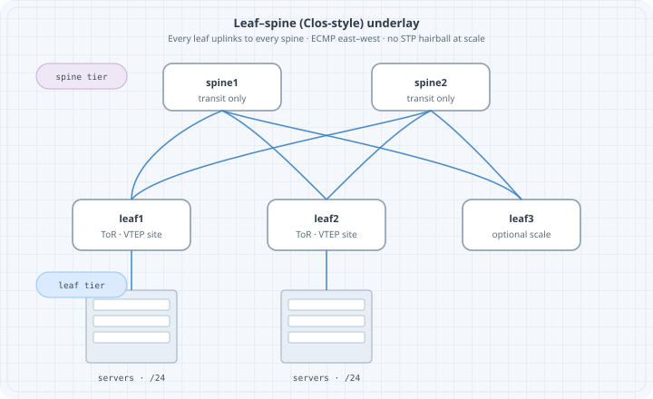

# Clos Leaf-Spine

Modern data-center fabrics prefer **scale-out leaf-spine (Clos-inspired)** topologies over deep access-aggregation trees. This chapter builds the underlay model and a free Containerlab fabric snack with FRR + Linux endpoints (mid-2026).

## Learning goals

By the end of this chapter you can:

- Explain leaf, spine, and east-west vs north-south roles  
- Design a 2-spine × 2-leaf IP underlay with ECMP  
- Choose eBGP vs OSPF underlay trade-offs at a model level  
- Deploy a Clos-ish lab and verify multipath  
- Predict behavior when one spine or one leaf uplink fails  

## Why Clos-style fabrics

| Classic tree pain | Leaf-spine idea |
|-------------------|-----------------|
| Oversubscription at aggregation | East-west via spines with planned ratio |
| STP blocking / L2 sprawl | L3 underlay to leaf; overlay for L2 if needed |
| Hard horizontal scale | Add leaves/spines with more links |
| Big failure domains | Limit L2; contain blasts |

{fig-alt="Two spines fully meshed to leaves with server racks under ToR leaves"}

```text
        +--------+      +--------+
        | spine1 |      | spine2 |
        +---+----+      +----+---+
         /  \   \        /   /  \
        /    \   \      /   /    \
   +---+    +---+ \  +---+ /    +---+
   | l1 |    | l2 |  | l3 |     | l4 |   ...
   +-+--+    +-+--+  +-+--+     +-+--+
     |         |       |          |
    hosts     hosts   hosts      hosts
```

Small lab: **2 spines × 2 leaves** (diagram shows a third leaf for scale intuition).

## Roles

| Role | Function |
|------|----------|
| **Leaf** | Connects servers; VTEP if overlay; default GW / anycast GW often here |
| **Spine** | Transit underlay only (usually no endpoints) |
| **Super-spine / border** | Optional higher tier or DC edge (later) |

Spines should not become “core with lots of features” on day one—**move packets between leaves**.

## Oversubscription (awareness)

```text
oversubscription ≈ (sum leaf downlink speeds) / (sum leaf uplink speeds)
```

Lab ignores real bandwidth; production designs document the ratio.

## Underlay protocol choices

| Underlay | Pros | Cons |
|----------|------|------|
| **eBGP** (often unnumbered) | Scale, policy, isolation | More session design |
| **OSPF / IS-IS** | Simple adjacency model | Large single domain care |
| **Static** | Tiny labs | No scale |

This book’s first fabric: **OSPF or eBGP on FRR**—pick one and stay consistent. eBGP fabric is popular; OSPF is fine for 2×2 learning.

## Addressing plan (2×2)

| Node | Loopback | Links |
|------|----------|-------|
| s1 | 10.0.0.1/32 | to l1, l2 |
| s2 | 10.0.0.2/32 | to l1, l2 |
| l1 | 10.0.0.11/32 | to s1, s2; host eth |
| l2 | 10.0.0.12/32 | to s1, s2; host eth |
| h1 | 192.168.1.10/24 | via l1 |
| h2 | 192.168.2.10/24 | via l2 |

Point-to-point `/31` or `/30` on fabric links—example `/30`:

| Link | Subnet |
|------|--------|
| l1–s1 | 10.1.1.0/30 |
| l1–s2 | 10.1.2.0/30 |
| l2–s1 | 10.1.3.0/30 |
| l2–s2 | 10.1.4.0/30 |

Host subnets via leaf: advertise leaf loopbacks + host subnets into underlay **or** keep hosts only for L3 via leaf and use overlay later.

For pure underlay ECMP lab: ping between leaf loopbacks and between hosts with leaf default routing + OSPF advertised LANs.

## Topology YAML

```yaml
name: clos22

topology:
  nodes:
    s1:
      kind: linux
      image: quay.io/frrouting/frr:10.2.1
      binds:
        - ./config/s1:/etc/frr
    s2:
      kind: linux
      image: quay.io/frrouting/frr:10.2.1
      binds:
        - ./config/s2:/etc/frr
    l1:
      kind: linux
      image: quay.io/frrouting/frr:10.2.1
      binds:
        - ./config/l1:/etc/frr
    l2:
      kind: linux
      image: quay.io/frrouting/frr:10.2.1
      binds:
        - ./config/l2:/etc/frr
    h1:
      kind: linux
      image: alpine:3.20
      exec:
        - apk add --no-cache iproute2 iputils
        - ip addr add 192.168.1.10/24 dev eth1
        - ip link set eth1 up
        - ip route add default via 192.168.1.1
    h2:
      kind: linux
      image: alpine:3.20
      exec:
        - apk add --no-cache iproute2 iputils
        - ip addr add 192.168.2.10/24 dev eth1
        - ip link set eth1 up
        - ip route add default via 192.168.2.1

  links:
    - endpoints: ["l1:eth1", "s1:eth1"]
    - endpoints: ["l1:eth2", "s2:eth1"]
    - endpoints: ["l2:eth1", "s1:eth2"]
    - endpoints: ["l2:eth2", "s2:eth2"]
    - endpoints: ["h1:eth1", "l1:eth3"]
    - endpoints: ["h2:eth1", "l2:eth3"]
```

## FRR daemons

```text
zebra=yes
ospfd=yes
# or bgpd=yes for eBGP underlay
```

## OSPF underlay sketch (l1)

```text
frr version 10.2.1
hostname l1
!
interface lo
 ip address 10.0.0.11/32
 ip ospf area 0
!
interface eth1
 ip address 10.1.1.1/30
 ip ospf network point-to-point
 ip ospf area 0
!
interface eth2
 ip address 10.1.2.1/30
 ip ospf network point-to-point
 ip ospf area 0
!
interface eth3
 ip address 192.168.1.1/24
 ip ospf area 0
!
router ospf
 ospf router-id 10.0.0.11
 passive-interface eth3
!
line vty
```

Spines: loopbacks + fabric links in area 0; **no host interfaces**. l2 mirrors with its addresses. Point-to-point OSPF avoids DR drama on p2p links.

## eBGP underlay sketch (optional alternate)

```text
router bgp 65101
 bgp router-id 10.0.0.11
 neighbor 10.1.1.2 remote-as 65100
 neighbor 10.1.2.2 remote-as 65100
 address-family ipv4 unicast
  network 10.0.0.11/32
  network 192.168.1.0/24
  neighbor 10.1.1.2 activate
  neighbor 10.1.2.2 activate
  maximum-paths 4
 exit-address-family
```

Spines use ASN 65100 (or each spine unique ASN—design choice). Leaves unique ASNs. Enable multipath.

## Deploy and ECMP verify

```bash
sudo containerlab deploy -t clos22.clab.yml

docker exec clab-clos22-l1 vtysh -c 'show ip ospf neighbor'
docker exec clab-clos22-l1 vtysh -c 'show ip route 10.0.0.12'
docker exec clab-clos22-l1 vtysh -c 'show ip route 192.168.2.0'
docker exec clab-clos22-h1 ping -c 3 192.168.2.10
docker exec clab-clos22-h1 traceroute -n 192.168.2.10
```

### Predict

- Each leaf: 2 OSPF neighbors (both spines)  
- Route to remote leaf/host shows **multiple nexthops** (ECMP) if multipath installed  
- traceroute may show s1 or s2  

### Observe multipath

```bash
docker exec clab-clos22-l1 ip route show 192.168.2.0/24
# or
docker exec clab-clos22-l1 vtysh -c 'show ip route 192.168.2.0/24'
```

FRR/zebra may need `maximum-paths` under OSPF:

```text
router ospf
 maximum-paths 4
```

## Drill 1 — Spine loss

```bash
docker exec clab-clos22-s1 ip link set eth1 down
docker exec clab-clos22-s1 ip link set eth2 down
sleep 3
docker exec clab-clos22-l1 vtysh -c 'show ip route 192.168.2.0'
docker exec clab-clos22-h1 ping -c 20 192.168.2.10
```

### Predict → observe → fix

| Predict | ECMP shrinks to remaining spine; brief loss |
| Observe | single nexthop via s2 |
| Fix | if blackhole, check l2 uplink to s2 and SPF |

Restore interfaces after.

## Drill 2 — One leaf uplink down

```bash
docker exec clab-clos22-l1 ip link set eth1 down
docker exec clab-clos22-l1 vtysh -c 'show ip ospf neighbor'
docker exec clab-clos22-h1 traceroute -n 192.168.2.10
```

### Predict

Still reachable via other spine; neighbor count 1.

## Drill 3 — Polarization awareness

Send many parallel iperf flows; without entropy, paths may skew. Underlay traceroute from different sources may stick to one spine. Note in journal; overlays later add UDP entropy.

## East-west vs north-south

| Pattern | Path |
|---------|------|
| East-west h1↔h2 | leaf → spine → leaf |
| North-south to Internet | leaf → border/spine path to edge |

Do not attach WAN carelessly to all spines without a border design.

## Overlay placement (preview)

VTEPs usually on **leaves**. Spines stay underlay-only. That separation keeps failure domains clean—connects to VXLAN/EVPN chapters.

## Verification checklist

| Check | Intent |
|-------|--------|
| All fabric adjacencies | Full mesh leaf-spine links up |
| Loopback mesh | Any lo to any lo |
| ECMP present | ≥2 nexthops where topology allows |
| Host traffic | Data plane |
| Spine failure | Continuity |

## Common mistakes

| Mistake | Symptom |
|---------|---------|
| Hosts on spines | Weird roles, scale pain |
| L2 across spines | Back to tree problems |
| Different OSPF areas accidentally | Missing routes |
| No p2p network type | Extra DR complexity |
| Expecting overlay without VTEP | Hosts same L2 fantasy |

## Summary

- Leaf-spine Clos-style fabrics scale east-west with L3 underlays  
- Spines transit; leaves attach endpoints (and VTEPs)  
- 2×2 FRR lab is enough to feel ECMP and spine loss  
- Pick OSPF or eBGP underlay deliberately  
- Keep overlays on leaves in later designs  

Next: **multi-area OSPF**—when a single area is no longer the right underlay shape (campus/WAN more than fabric).
