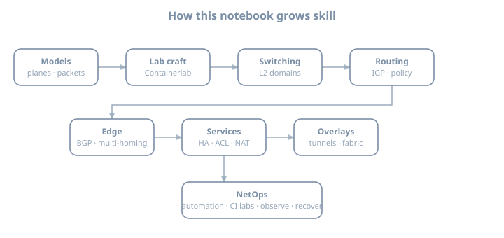
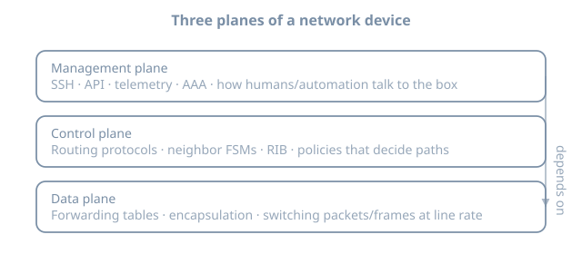
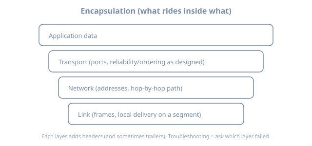
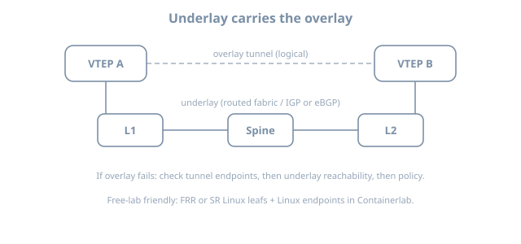
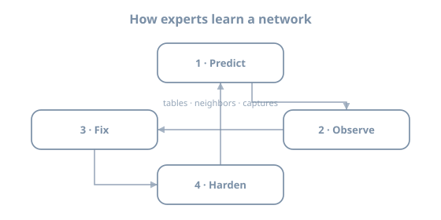
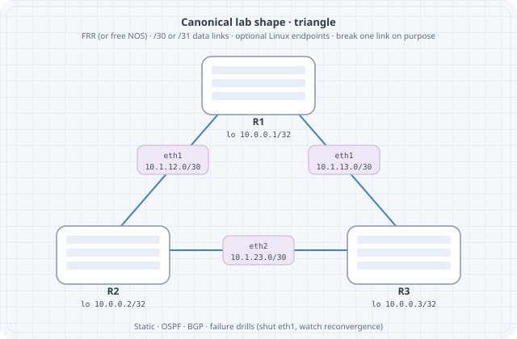

# Networking Journey — Syllabus A (working)

**Working title:** Networking from first principles to NetOps  

A personal notebook on how to learn computer networking **from scratch to expert / NetOps practice**, using **open-source and freely available lab images** (especially via [Containerlab](https://containerlab.dev/)).  

No vendor certification branding. No proprietary exam blueprints. Competence is defined by **what you can design, build, break, prove, and operate**.

**Lab platform:** Containerlab + free/open network OS and endpoint images (e.g. FRR, Linux, Nokia SR Linux community images, SONiC, VyOS, and other kinds that do not require paid licenses).  

**Diagrams:** under `images/diagram-*.svg` — transparent SVG using `currentColor` so they work in Quarto light and dark themes.

---

## 0. How a world-class path is taught

### 0.1 Pedagogy

1. **Models before features** — planes, encapsulation, state machines  
2. **Predict → observe → fix → harden** — every lab  
3. **Lab-as-code** — topologies in git; rebuild from nothing  
4. **Failure is curriculum** — shut links, poison routes, break MTU  
5. **Vendor-agnostic language** — concepts first; CLI is a dialect  
6. **Open tools only** on the main path — paid images are optional footnotes later, never required  

### 0.2 Definition of “expert” here

You can:

- Design a multi-site L2/L3 network with clear underlay/overlay roles  
- Implement it in Containerlab with free images  
- Diagnose control-plane vs data-plane failures with tables + captures  
- Apply routing policy without creating loops  
- Automate lab lifecycle and basic config/validation  
- Operate services with observability and recovery habits  

### 0.3 Open lab stack (default)

| Role | Examples (free/open) |
|------|----------------------|
| Orchestration | Containerlab |
| Routing NOS | FRR, SR Linux (community), SONiC, VyOS |
| Endpoints | Alpine/Ubuntu/Debian containers |
| Capture | tcpdump, tshark |
| Traffic | iperf3, mtr, scapy (as needed) |
| Automation | Ansible, Python (scrapli/netmiko-class tools), git |
| CI | deploy topology smoke tests |

---

## Journey map

```
Models + lab craft
  → Host networking for labs
  → Bridging domains (L2)
  → Addressing & forwarding (L3)
  → Interior routing
  → Edge routing & policy
  → Resilience & services
  → Filtering, QoS intro, hardening
  → Overlays & fabrics
  → Automation & NetOps
  → Capstones
```



---

# Part 00 — Front matter

### Ch 00 — Syllabus (this document + variants)
### Ch 01 — How I learn networking
- Note-taking, lab journal, when to stop and rebuild  
### Ch 02 — Mental models that never expire
- Planes, encapsulation, underlay/overlay  

  
  


### Ch 03 — Verification culture
- Predict → observe → fix → harden  



---

# Part 01 — Lab craft (Containerlab + Linux)

### Ch 01 — Linux networking for lab hosts
- namespaces, veth, bridges, routes, basic filtering  
### Ch 02 — Containerlab fundamentals
- topology YAML, kinds, links, mgmt network, lifecycle  
### Ch 03 — Free image matrix & resources
- what runs without licenses; RAM/CPU planning  
### Ch 04 — Lab hygiene
- addressing plans, naming, git layout, diagram habit  

**Lab:** deploy/destroy a triangle of open routers; export a graph.  



**Checkpoint:** topology-as-code is muscle memory.

---

# Part 02 — Bridging domains (layer-2)

### Ch 01 — Ethernet & MAC learning
### Ch 02 — VLANs & trunks
### Ch 03 — Loop prevention (spanning tree family)
### Ch 04 — Link aggregation
### Ch 05 — L2 failure drills
**Labs:** multi-switch VLAN/trunk; root failover; native-VLAN mismatch.

**Checkpoint:** you can heal a broken multi-switch domain with evidence.

---

# Part 03 — Addressing & basic forwarding

### Ch 01 — IPv4 structure, subnetting, summarization
### Ch 02 — IPv6 essentials for dual-stack labs
### Ch 03 — Static routing & floating statics
### Ch 04 — Host vs router behavior (ARP/ND)
**Labs:** dual-stack; summary black-hole; static failover.

---

# Part 04 — Interior routing

### Ch 01 — Dynamic routing ideas (distance-vector vs link-state)
### Ch 02 — Link-state IGP in one area (adjacency, flood, SPF)
### Ch 03 — Multi-area link-state design
### Ch 04 — IPv6 IGP notes
### Ch 05 — Redistribution & loop prevention
**Labs:** triangle IGP; cost change; multi-area; filtered redistribution.

**Checkpoint:** reconvergence is predictable and documented.

---

# Part 05 — Edge routing & policy

### Ch 01 — Inter-domain routing fundamentals
### Ch 02 — Session types & path selection mental model
### Ch 03 — Policy (prefix filters, attributes, route-maps as idea)
### Ch 04 — Scaling internal meshes (route reflection concepts)
### Ch 05 — Dual-homing & traffic engineering
**Labs:** dual upstream; policy steer; session loss drill.

---

# Part 06 — Resilience & network services

### Ch 01 — First-hop redundancy concepts
### Ch 02 — Address assignment & relay
### Ch 03 — Translation at edges (NAT family)
### Ch 04 — Time, name, and log hygiene in labs
**Labs:** active/standby first hop; NAT edge; DHCP relay.

---

# Part 07 — Policy enforcement, QoS intro, hardening

### Ch 01 — Packet filters (ACL thinking, direction, implicit deny)
### Ch 02 — Protecting the control plane (concepts)
### Ch 03 — QoS vocabulary (classify, mark, queue, shape/police)
### Ch 04 — Device & lab hardening checklist
**Labs:** filter lockout/recovery; simple mark/class demo.

---

# Part 08 — Overlays, tunnels, multicast

### Ch 01 — Tunneling ideas (why encapsulate)
### Ch 02 — Site connectivity patterns
### Ch 03 — DC overlay intro (VXLAN-class data plane)
### Ch 04 — EVPN-class control plane (conceptual + lab if free images allow)
### Ch 05 — Multicast essentials
**Labs:** point-to-point tunnel; mini overlay fabric with open NOS.

---

# Part 09 — Fabrics & multi-node design

### Ch 01 — Clos / leaf-spine
### Ch 02 — Underlay design choices
### Ch 03 — Multi-implementation labs (FRR + SR Linux + Linux endpoints)
**Labs:** small leaf-spine; break a leaf; watch convergence.

---

# Part 10 — NetOps, automation, observability

### Ch 01 — Config as code against lab nodes
### Ch 02 — Containerlab in CI (smoke deploy)
### Ch 03 — Telemetry & captures as operations
### Ch 04 — Runbooks & incident notes
**Labs:** Ansible/Python push; CI deploy; intentional outage write-up.

---

# Part 11 — Capstones

### C1 — Campus-style dual core (open images)
### C2 — Dual-homed site to “provider” edge
### C3 — Mini fabric with overlay
### C4 — Incident week: break, detect, restore, prevent

---

# Part 99 — Appendices

### A — Addressing plan templates  
### B — Free image matrix & host sizing  
### C — Verification cheatsheet (vendor-neutral show/intent)  
### D — Diagram library index  
### E — Resources (RFCs, Containerlab docs, free labs, manuals)  
### F — Deliberate exclusions (wireless deep-dive, paid-only NOS, exam cram)

---

## Writing order (when content starts)

1. Models + Containerlab craft + diagrams  
2. L2 + single-area IGP (highest ROI)  
3. Edge routing dual-home  
4. Services & filters  
5. Multi-area / policy depth  
6. Overlay/fabric  
7. NetOps/CI  

---

## Changelog

| Date | Note |
|------|------|
| 2026-07-24 | Initial multi-syllabus exploration |
| 2026-07-24 | Vendor-agnostic rewrite; open images only; expert pedagogy; diagrams |
