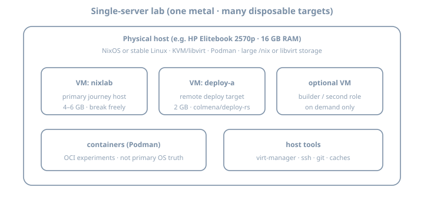

# Lab 0 — Overview: roles before the Why Nix exists chapter

**Before the Why Nix exists chapter.** Do **not** skip this if you will follow the full journey on real hardware. The curriculum assumes you can **break and rebuild** machines without fear. That only works if lab roles are clear.

## Why a lab host exists

NixOS learning fails when:

- The only machine is your daily driver and every `nixos-rebuild` is scary  
- Disk fills because `/nix/store` and VM images share a tiny root  
- Nested “VM inside VM inside laptop on battery” becomes the whole evening  

A **single spare machine** (your case: HP Elitebook 2570p · 16 GB RAM) is enough for the entire path—if you treat it as a **lab server**, not a casual browser laptop.

## Philosophy: host is not an appliance

Homelab hypervisors like Proxmox are excellent—and often **GUI-first**. You *can* automate them (CLI, API, Terraform, Ansible), but day-to-day debugging still tempts **one-off imperative fixes** that never return to git. That drift is annoying for humans and messy if an agent runs dozens of shell “fixes” that leave the machine unreproducible.

This curriculum optimizes for a different contract, in the spirit of operators who moved **Proxmox → NixOS + Incus** (see [Bas Nijholt, *I’ve gone full Nix*](https://www.nijho.lt/post/proxmox-to-nixos/)):

| Idea | What it means for Lab 0 |
|------|-------------------------|
| **Git is the source of truth** | Host networking quirks, hypervisor packages, firewall ports live in the flake—not only in shell history |
| **Host is fully yours** | NixOS-as-host is not a locked appliance: you *may* run tools on metal, but **journey breakage stays in guests** |
| **CLI-first ops** | Prefer `virsh` / `incus` / `nixos-rebuild` over click-only workflows so every step is copy-pasteable |
| **Simulate before bare metal** | Prove a config in a VM that mirrors the host role *before* you reinstall the Elitebook |
| **Hardware fixes are modules** | NIC offload bugs, firmware flags, microcode → commented Nix + systemd, not “I ran ethtool once in 2019” |

Proxmox remains fine software. For **this** guide we default to **NixOS on metal** so one language describes host + guests.

## Three roles (do not collapse them)

| Role | What it is | Mutability |
|------|------------|------------|
| **Lab host (hypervisor)** | Metal OS: KVM/libvirt and/or **Incus**, storage, networking, maybe Podman | Stable; rare rebuilds; **fully declarative** |
| **Journey guest(s)** | NixOS VMs (or Incus VMs) you rebuild, break, roll back (the installing NixOS chapter+) | **Disposable** |
| **Dev environment** | Where you edit flakes, run `nix` CLI, commit git | Stable tools; can be host *or* a dedicated VM |

{fig-alt="Physical host with KVM VMs and containers for NixOS lab"}

## Chapters in this section

| Chapter | Purpose |
|---------|---------|
| **[Lab 0A — Journey single-server](01b-lab-journey-single-server.qmd)** | One metal box: **libvirt and/or Incus**, containers, storage, simulate-before-metal |
| **[Lab 0B — NixOS dev machine](01c-lab-nixos-dev-machine.qmd)** | Editor, flakes, SSH, caches, drift discipline |
| **[Lab 0C — Elitebook 2570p profile](01d-lab-elitebook-2570p.qmd)** | Concrete RAM/CPU/disk/BIOS plan for **your** spare HP |
| **[Lab 0D — Ops cheatsheet](01e-lab-ops-cheatsheet.qmd)** | Daily commands |

You can run **0A and 0B on the same laptop** (recommended for 16 GB): host = stable NixOS with hypervisor; guests = journey; host also has Nix + editor for flakes.

## Recommended topology for this curriculum

```text
Elitebook 2570p (16 GB)
├── Host OS (NixOS 26.05 preferred)     ← fully yours; flake-managed
│   ├── Hypervisor (pick one primary)
│   │   ├── libvirt/KVM  (default for this guide)
│   │   └── and/or Incus (CLI-first VMs + system containers; optional)
│   │       ├── nixlab     4–6 GB   ← primary journey machine
│   │       ├── deploy-a   2 GB     ← deploy-rs / Colmena target
│   │       └── (optional builder)  on demand
│   ├── Podman (rootless)             ← OCI days
│   ├── ~/src/nix-config              ← git = source of truth
│   └── optional: Attic/Cachix
└── Do NOT: run k3s multi-node + desktop + 3 heavy VMs all day
```

## Decision: host OS

| Host choice | Pros | Cons |
|-------------|------|------|
| **NixOS host** | One mental model; host reclaimable via generations; great for Lab 0B | Early days need care not to smash host |
| **Debian/Ubuntu host** | Familiar if you are not ready | Two worlds (apt host + NixOS guests); more drift risk |

**Expert default:** **NixOS as host** with strong separation—host flake boring and pinned; guests are the playground.

### Hypervisor choice (libvirt vs Incus)

| Stack | Strength | Use when |
|-------|----------|----------|
| **libvirt + virt-manager** | Familiar, great snapshots, virt-install simple | **Default** for this curriculum on 16 GB |
| **Incus** (LXD community fork) | CLI-first VMs + system containers; strong for pets + automation | After host is solid, if you want one CLI surface |
| Both | Possible but heavy | Avoid on Elitebook unless you know why |

Lab 0A documents **libvirt fully** and **Incus as an optional path** (aligned with Proxmox→NixOS+Incus style migrations).

## What “ready for the Why Nix exists chapter” means

- [ ] Spare machine boots reliably; disk has free space (see Lab 0C)  
- [ ] Virtualization enabled in BIOS; at least one NixOS VM can boot  
- [ ] You can SSH into the VM from the host (or use console)  
- [ ] You know which disk/VM you are allowed to wipe  
- [ ] Dev tools path chosen (Lab 0B): editor + `nix` + git on host or dev VM  
- [ ] Host (and guest) config lives in **git**, not only live state  

## Time budget

| Task | Estimate |
|------|----------|
| BIOS + disk + host install | 2–4 h |
| KVM/Incus + first guest | 1–2 h |
| Dev tooling (Lab 0B) | 1–2 h |
| Elitebook tuning (Lab 0C) | 30–60 min |

Do this **once** before the Why Nix exists chapter; revisit when Stage II and Stage VI need second VMs.

## Further reading

- [I’ve gone full Nix: Proxmox to NixOS + Incus](https://www.nijho.lt/post/proxmox-to-nixos/) — Bas Nijholt (why declarative host + Incus; simulate-before-metal; hardware quirks in git)

## Next

→ **[Lab 0A — Journey single-server](01b-lab-journey-single-server.qmd)**  
