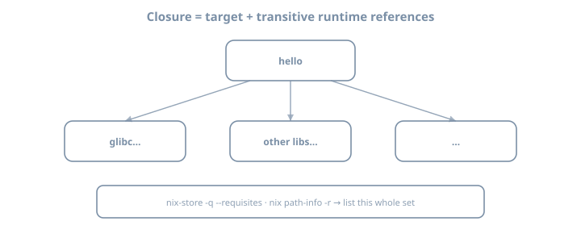

# The Nix store and closures

**Goal:** Read `/nix/store` paths as a graph database of software, define **closures** precisely, and explain **GC roots**—with labs that only *observe* (no aggressive GC yet).

## Why this chapter matters

Every advanced Nix topic—binary caches, deploy, Docker-from-Nix, NixOS activations—is a story about **store paths and references**. Without that theory, later tools feel like superstition.

Ops motivation: disk fills, deploys miss a library, “I deleted the project but used 40 GB”—all are root/closure mistakes. If you can *see* the graph, you can operate it.

---

## Theory 1 — The store is the database

The directory `/nix/store` is not a random cache folder. It is the **authoritative object store** for:

- Package outputs  
- Derivation files (`.drv`)  
- Fixed-output download results  
- Sometimes source mirrors  

### Invariants (practical)

| Invariant | Meaning |
|-----------|---------|
| Paths are immutable | You do not `vim` a store path to “fix prod” |
| Names include hashes | Collision-resistant identity |
| References are explicit | Runtime deps encoded as string refs inside outputs |
| Mutation is via new paths | “Upgrade” means new hash, not overwrite |

Hand-editing the store voids the model (and often permissions prevent it).

### What lives beside the store

| Path (typical) | Role |
|----------------|------|
| `/nix/var/nix/db` | Nix database (references, validity) |
| `/nix/var/nix/profiles` | Profile generations (roots) |
| `/nix/var/nix/gcroots` | Explicit GC roots |
| `/nix/var/nix/daemon-socket` | Multi-user daemon |

You rarely edit these by hand; you query them.

---

## Theory 2 — Path anatomy

{fig-alt="Diagram of /nix/store hash and name components"}

```text
/nix/store/<hash>-<name>-<version>
     │        │       │
     │        │       └─ convenience label (not trust)
     │        └─ cryptographic fingerprint of inputs (typical case)
     └─ global namespace of this Nix installation
```

### Examples (illustrative shapes)

```text
/nix/store/abc…-hello-2.12.1
/nix/store/def…-glibc-2.40-36
/nix/store/ghi…-bash-5.2-p37
```

**Theory punchline:** two paths with the same pretty name and different hashes are **different objects**. Tools that only show names are lying by omission.

### Input-addressed vs content-addressed (awareness)

| Model | Hash depends on | Note |
|-------|-----------------|------|
| Input-addressed (classic default) | Build inputs / derivation | Rebuild if inputs change |
| Content-addressed (experimental/advanced) | Output content | Same bytes → same hash potential |

You will live mostly in input-addressed land until the **Internals** part.

### Name segment is not a version pin

The `-2.12.1` label is human hinting. Trust the **hash**. Two `hello-2.12.1` builds from different nixpkgs revisions are different paths.

---

## Theory 3 — References and the closure

{fig-alt="hello package referencing libraries forming a closure"}

### Direct references

A store path’s **references** are other store paths it mentions (dynamic linker paths, wrapped scripts, metadata). Query:

```bash
nix-store -q --references "$P"
```

### Closure (requisites)

The **closure** of a path **P** is the smallest set **S** such that:

1. **P** is in **S**  
2. If **x** is in **S** and **x** references **y**, then **y** is in **S**

Operationally:

```bash
nix-store -q --requisites "$P"
nix path-info -r "$P"
```

### Why closures matter — worked scenarios

| Scenario | Why closure is the unit |
|----------|-------------------------|
| Copy software to another host | Need all runtime deps |
| Binary cache upload | Serve complete graphs |
| Disk usage of “hello” | Sum of requisites, not one path |
| Container image from Nix | Pack a closure |
| NixOS system activation | Whole system is a giant closure |

### Example narrative

```text
hello
  ├─ glibc
  │    ├─ … 
  ├─ (other runtime inputs)
```

`hello` is a thin node; **glibc** often dominates size. That is normal.

### Closure size theory

```bash
nix path-info -S "$P"      # approx size of one path
nix path-info -rS "$P"     # recursive / closure-oriented sizing
```

Compare single vs recursive. The gap is the theory lesson.

### Referrers (reverse edges)

```bash
nix-store -q --referrers "$P"
```

Useful when asking: “who still holds this library?”

---

## Theory 4 — Evaluation vs realization (store-centric)

Recall the Why Nix exists chapter:

{fig-alt="Evaluation versus realization reminder diagram"}

| Artifact | Typical location / form |
|----------|-------------------------|
| Expression | `.nix` / flake |
| Derivation | `.drv` in store (build plan) |
| Output path | realized directory in store |

**Example commands**

```bash
# realize outputs (modern)
nix build nixpkgs#hello --print-out-paths

# classic query tools still educational
nix-store -q --tree "$HELLO" | head
```

You can evaluate without realizing in some workflows; beginners usually realize first because they want a runnable binary.

---

## Theory 5 — Profiles, generations, and roots

{fig-alt="User profiles result links and system generations as GC roots"}

### Why GC exists

Every experiment can add paths. Without collection, disks fill. Collection must not delete paths still **needed**.

### Root types (non-exhaustive)

| Root kind | Example |
|-----------|---------|
| User profile generations | `~/.nix-profile`, state profiles |
| Result symlinks | `./result` from `nix build` |
| NixOS system profiles | `/nix/var/nix/profiles/system*` (host part) |
| Indirect roots under gcroots | Registered links |
| Running processes | Open files can keep paths live temporarily |

### The `./result` trap (critical theory)

```bash
nix build nixpkgs#hello
# creates ./result -> /nix/store/…-hello-…
```

That symlink is a **GC root**. Leave hundreds of `result` links in temp dirs → permanent pins → “mystery” disk use.

**Discipline:** `rm result` when finished experimenting, or use `--no-link`.

### Generations theory (preview)

Profiles are versioned. Rolling back a profile generation re-points the user environment. Deleting old generations **makes previously live closures collectable** if nothing else roots them.

::: {.callout-important}
Do **not** run `nix-collect-garbage -d` on a machine you care about until you understand generations. Observation only in this chapter.
:::

---

## Theory 6 — Substituters, signatures, trust (preview)

When realizing path **P**:

1. Ask configured **substituters** (e.g. `cache.nixos.org`)  
2. Verify **signatures** against trusted keys  
3. Else build locally  

**Trust model punchline:** a random HTTP server offering store paths is not enough; signatures matter. Self-hosted caches (later packaging/ops chapters) require key management.

```bash
nix config show | grep -i substituter || true
nix path-info --json nixpkgs#hello 2>/dev/null | head -c 400
```

---

## Theory 7 — What “uninstall” means

| Action | Effect |
|--------|--------|
| Remove package from profile | Drop root edge; paths may remain |
| Delete project directory | Does not delete store |
| `rm result` | Drop one root |
| GC | Delete unreferenced paths |

**Example misconception**

```text
"I deleted ~/code/foo, so Nix freed 2GB"
→ False unless GC ran and nothing else rooted those paths
```

### Operational uninstall checklist

1. Remove declarative/profile references  
2. Remove `result` and other roots  
3. Optionally drop old generations  
4. Run GC deliberately  

---

## Theory 8 — Copying closures (ops preview)

```bash
# conceptual modern/classic tools
nix copy --to ssh://host "$P"
# or nix-copy-closure in classic literacy
```

Deploy systems (later parts) are sophisticated closure movers. The unit of transfer is still the **closure**.

---

## Worked examples bank

### Example A — Build and print path

```bash
HELLO=$(nix build nixpkgs#hello --print-out-paths --no-link)
echo "$HELLO"
"$HELLO/bin/hello"
```

### Example B — Direct vs full graph

```bash
nix-store -q --references "$HELLO"
nix-store -q --requisites "$HELLO" | wc -l
```

Expect requisites count ≫ references count.

### Example C — Tree view

```bash
nix-store -q --tree "$HELLO" | head -60
```

### Example D — Result root lifecycle

```bash
cd /tmp
rm -f result
nix build nixpkgs#hello
readlink result
# inspect roots (command variants exist)
nix-store --gc --print-roots 2>/dev/null | grep -i result || true
rm result
```

### Example E — Path info metadata

```bash
nix path-info -sh "$HELLO"
nix path-info -rS "$HELLO" | tail
```

### Example F — Compare two packages

```bash
H=$(nix build nixpkgs#hello --print-out-paths --no-link)
G=$(nix build nixpkgs#git --print-out-paths --no-link)
echo "hello reqs: $(nix-store -q --requisites "$H" | wc -l)"
echo "git reqs:   $(nix-store -q --requisites "$G" | wc -l)"
```

---

## Lab 1 — Realize `hello` and dissect the path

```bash
mkdir -p ~/lab/nixos-book/concepts/store
cd ~/lab/nixos-book/concepts/store
HELLO=$(nix build nixpkgs#hello --print-out-paths --no-link)
echo "$HELLO"
ls -la "$HELLO"
ls -la "$HELLO/bin"
```

Journal: full path, name segment, hash length (approx).

---

## Lab 2 — Closure measurements

```bash
echo "direct refs: $(nix-store -q --references "$HELLO" | wc -l)"
echo "requisites:  $(nix-store -q --requisites "$HELLO" | wc -l)"
nix path-info -S "$HELLO"
nix path-info -rS "$HELLO" | tail -5
```

Write one sentence: *What dominates the closure?*

---

## Lab 3 — Follow one dependency

```bash
nix-store -q --references "$HELLO"
# pick a non-hello path, ls it
```

Observe: another complete package prefix, not a classic `/usr` layout.

---

## Lab 4 — Roots observation

```bash
ls -la /nix/var/nix/gcroots 2>/dev/null | head
ls -la ~/.nix-profile 2>/dev/null
nix profile list 2>/dev/null || true
```

Perform Example D (`result` create/remove). Note difference.

---

## Lab 5 — Teach-back

Without notes, define:

1. Store path  
2. Reference  
3. Closure  
4. GC root  
5. Why `rm -rf project` ≠ free disk  

---

## Exercises

1. Parse five real store paths into hash + name; ignore the pretty version for trust decisions.  
2. Compute requisites count for `hello` and one larger package (`git` or `python3`).  
3. Find the single largest path in `hello`’s closure via `path-info`.  
4. Create three `result` links in different temp dirs; list them via print-roots; clean up.  
5. Explain why binary cache upload granularity is closure-shaped.  
6. Diagram references vs referrers for a tiny graph (3 nodes).  
7. Measure disk before/after realizing a package **without** GC (observe growth).  
8. Document every GC root kind you can observe on your machine.  
9. Use `nix-store -q --tree` and annotate three levels of the tree.  
10. Write a one-page “store operator card” for future-you.  
11. Compare `--no-link` vs default `result` workflow for lab hygiene.  
12. Predict whether deleting `~/.cache` frees store space (then verify: it does not).  

---

## Common pitfalls

| Symptom | Theory |
|---------|--------|
| Disk full after demos | Roots + caches + no GC |
| `result` broken link | GC collected after root removed |
| “Uninstalled but still huge” | Roots remain; GC not run |
| Different hash on friend machine | Different nixpkgs revision |
| Permission denied writing store | Correct — immutability |
| Trusting package *name* only | Hash is identity |
| Blind `nix-collect-garbage -d` | Drops generations/roots you may need |
| Thinking `/nix/store` is a cache you can wipe casually | It is the object database |

---

## Checkpoint

- [ ] Parse a store path into hash + name  
- [ ] Define closure as a transitive reference set  
- [ ] Show requisites count for `hello`  
- [ ] Explain `./result` as a GC root  
- [ ] List ≥2 root kinds  
- [ ] Agree not to blind `-d` GC yet  
- [ ] Single-path vs closure size surprise written down  

### Journal prompts

1. Closure vs single-path size surprise  
2. Where *you* will accidentally create roots  
3. One deploy implication of closures  

---

## Further depth (this book)

| Topic | Chapter / part |
|-------|----------------|
| Derivations producing paths | [Derivations as an idea](06-derivations.qmd) |
| Modern queries (`path-info`) | [Modern Nix CLI](07-modern-cli.qmd) |
| System generations as roots | Host: [Rebuild and generations](../03-nixos-host/03-rebuild-and-generations.qmd) |
| GC hygiene in ops | Part **Ops and fleet** |
| Store daemon internals | Part **Internals** |
