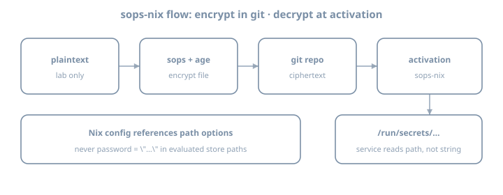

# sops-nix

**Goal:** Wire **sops-nix** end-to-end: encrypt a secret in-repo, decrypt at activation, consume it from a NixOS service or timed script—**without** plaintext secrets in the Nix store evaluation graph.

::: {.callout-note}
**House primary:** sops-nix. The agenix chapter compares agenix; do not run both as permanent dual systems unless you have a reason.
:::

::: {.callout-important}
Use **placeholder values** and lab-only credentials. Never paste production tokens into examples or commits.
:::

## Why this chapter exists

The secrets problem chapter established the threat model. This chapter installs the **default tooling** for this book:

| Property | sops-nix approach |
|----------|-------------------|
| At rest in git | Encrypted YAML/JSON/ENV (SOPS) |
| Encryption keys | Age and/or GPG; **age recommended** |
| On host | Decrypted at activation to a path like `/run/secrets/...` |
| Nix modules | Reference secret **paths**, not secret **strings** |

{fig-alt="sops-nix flow from encrypt in git to activation secret path"}

---

## Theory 1 — Components

| Piece | Role |
|-------|------|
| **SOPS** | Encrypts/decrypts structured files |
| **age** | Modern encryption tool; identities (private) + recipients (public) |
| **sops-nix** | NixOS/HM modules: decrypt during activation; systemd credentials patterns |
| **`.sops.yaml`** | Creation rules: which keys encrypt which files |

### Flow

```text
edit plaintext locally (editor via `sops file`)
    → encrypted file committed
    → nixos-rebuild
    → sops-nix activation decrypts with host/user age key
    → secret file on tmpfs/run with tight perms
    → service reads path
```

---

## Theory 2 — Age keys (host-centric pattern)

Common NixOS pattern: **host age key** on the machine, public key in `.sops.yaml` creation rules.

Generate key (on the lab host; protect private key):

```bash
nix shell nixpkgs#age -c age-keygen -o "$HOME/.config/sops/age/keys.txt"
# private key file — NEVER commit
# public key printed as age1...
```

For unattended host decryption, sops-nix docs describe placing keys where the activation can read them (often `/var/lib/sops-nix/key.txt` or configured path)—**follow current sops-nix README for 26.05-compatible setup**. Private key stays on host disk with root-only permissions—not in git.

::: {.callout-tip}
Also encrypt to **your admin age key** so you can decrypt on a workstation for editing. Creation rules can list multiple recipients.
:::

### Key backup

Losing all private keys without other recipients = **cannot decrypt**. Keep admin recipient + offline backup of identities.

---

## Theory 3 — Flake input

```nix
inputs = {
  nixpkgs.url = "github:NixOS/nixpkgs/nixos-26.05";
  sops-nix.url = "github:Mic92/sops-nix";
  sops-nix.inputs.nixpkgs.follows = "nixpkgs";
};

# modules list includes:
# inputs.sops-nix.nixosModules.sops
```

```nix
# flake.nix sketch
outputs = { self, nixpkgs, sops-nix, ... }@inputs: {
  nixosConfigurations.lab = nixpkgs.lib.nixosSystem {
    system = "x86_64-linux";
    specialArgs = { inherit inputs; };
    modules = [
      ./hosts/lab
      sops-nix.nixosModules.sops
      # or import modules/common/sops.nix that uses inputs
    ];
  };
};
```

Update only this input when bumping:

```bash
nix flake update sops-nix
```

---

## Theory 4 — Minimal NixOS sops config

```nix
# modules/common/sops.nix
{ config, ... }:
{
  sops.defaultSopsFile = ../../secrets/lab.yaml;
  # sops.age.keyFile = "/var/lib/sops-nix/key.txt"; # per upstream guidance
  # sops.age.sshKeyPaths = [ ... ]; # alternative: derive from SSH host key

  sops.secrets."lab/demo_token" = {
    mode = "0400";
    owner = "root";
    # restartUnits = [ "some-service.service" ];
  };
}
```

Consume **path**:

```nix
systemd.services.sops-demo-check = {
  wantedBy = [ "multi-user.target" ];
  serviceConfig = {
    Type = "oneshot";
    RemainAfterExit = true;
    ExecStart = "/bin/sh -c 'test -f /run/secrets/lab/demo_token && echo ok > /var/lib/sops-demo-ok'";
  };
};
```

Exact secret path layout depends on sops-nix version and naming—inspect after activation:

```bash
sudo ls -la /run/secrets
```

**Never** do `builtins.readFile config.sops.secrets."lab/demo_token".path` into another world-readable derivation if that re-embeds content. Prefer systemd `LoadCredential`, `EnvironmentFile` pointing at the secret path, or scripts that read at runtime.

---

## Theory 5 — Creating encrypted files

`.sops.yaml` example shape:

```yaml
keys:
  - &admin age1AAAAAAAAAAAAAAAAAAAAAAAAAAAAAAAAAAAAAAAAAAAAAAA
  - &host age1BBBBBBBBBBBBBBBBBBBBBBBBBBBBBBBBBBBBBBBBBBBBBB
creation_rules:
  - path_regex: secrets/.*\.yaml$
    key_groups:
      - age:
          - *admin
          - *host
```

Edit:

```bash
nix shell nixpkgs#sops nixpkgs#age -c sops secrets/lab.yaml
```

Example structure **before** encryption (editor buffer only):

```yaml
lab:
  demo_token: PLACEHOLDER_LAB_TOKEN_ROTATE_ME
```

After save, file on disk is encrypted ciphertext suitable for git.

### Adding a secret later

1. `sops secrets/lab.yaml`
2. Add key under structured YAML
3. Declare `sops.secrets."…"` in Nix
4. Rebuild
5. Point service at `.path`

---

## Theory 6 — HM secrets (awareness)

sops-nix also integrates with Home Manager for user secrets. Prefer **system** secrets for host services first; user secrets when a user-only app needs them.

---

## Theory 7 — Bootstrapping chicken-and-egg

First host key setup is the awkward part:

1. Generate age key on host
2. Put **public** key in `.sops.yaml`
3. Encrypt secrets to that recipient
4. Place **private** key where sops-nix expects
5. Rebuild

Document bootstrap in `docs/secrets.md`.

### SSH host key method (awareness)

Some setups convert or use SSH host keys as age identities. Follow upstream docs if you choose that—document which method you used.

---

## Theory 8 — systemd integration patterns

| Pattern | Use |
|---------|-----|
| `config.sops.secrets.*.path` in `ExecStart` script | Read file at runtime |
| `LoadCredential=` | systemd credentials API |
| `EnvironmentFile=` | If file is `KEY=value` format |
| `restartUnits` | Restart service when secret changes |

```nix
sops.secrets."lab/demo_token" = {
  mode = "0400";
  restartUnits = [ "lab-token-touch.service" ];
};
```

---

## Theory 9 — Multi-host recipients

```yaml
creation_rules:
  - path_regex: secrets/lab\.yaml$
    key_groups:
      - age: [*admin, *host_lab]
  - path_regex: secrets/prod\.yaml$
    key_groups:
      - age: [*admin, *host_prod]
```

Do not encrypt prod secrets only to a laptop key if the server must decrypt unattended.

---

## Worked example — Secret for a custom script service

```nix
{ config, pkgs, ... }:
{
  sops.secrets."lab/demo_token" = {
    mode = "0400";
    owner = "root";
  };

  systemd.services.lab-token-touch = {
    description = "Demonstrate runtime read of sops secret path";
    wantedBy = [ "multi-user.target" ];
    serviceConfig = {
      Type = "oneshot";
      RemainAfterExit = true;
      ExecStart = pkgs.writeShellScript "lab-token-touch" ''
        set -euo pipefail
        token_path="${config.sops.secrets."lab/demo_token".path}"
        test -r "$token_path"
        # Do NOT echo the token to logs
        wc -c < "$token_path" > /var/lib/lab-token-bytes
      '';
    };
  };
}
```

Note: `writeShellScript` embeds the **path string**, not the secret content—good.

---

## Exercises

### Exercise 1 — Add input and module

```bash
# edit flake inputs; nix flake update sops-nix
# import sops-nix.nixosModules.sops
nix flake metadata
```

### Exercise 2 — Age keys and `.sops.yaml`

1. Generate admin age identity (laptop)
2. Generate or configure host identity per sops-nix docs
3. Write `.sops.yaml` with both public keys
4. Confirm private keys are gitignored

```gitignore
keys.txt
*.agekey
```

### Exercise 3 — First encrypted secret file

```bash
mkdir -p secrets
# create encrypted secrets/lab.yaml via sops
git add secrets/lab.yaml .sops.yaml
# ensure plaintext never staged
```

### Exercise 4 — Declare `sops.secrets` and rebuild

```bash
sudo nixos-rebuild switch --flake .#lab
sudo ls -la /run/secrets
sudo wc -c /run/secrets/...   # do not cat into scrollback you paste publicly
```

### Exercise 5 — Runtime consumer

Add the oneshot that **reads path** without logging secret contents. Prove `/var/lib/lab-token-bytes` or similar.

### Exercise 6 — Failure drill

1. Break key access (rename key file temporarily)
2. Rebuild or restart activation path
3. Observe failure mode
4. Restore key

Journal: how the host fails closed.

### Exercise 7 — Docs

`docs/secrets.md`:

- Key locations
- How to add a secret
- How to add a recipient
- Rotation sketch

### Exercise 8 — Selective lock update

```bash
nix flake update sops-nix
git diff flake.lock | head -80
```

### Exercise 9 — Permission check

```bash
sudo ls -la /run/secrets
# confirm mode 0400 (or intended) and owner
```

### Exercise 10 — Second secret

Add another key in the YAML; declare second `sops.secrets` entry; rebuild; list paths.

### Exercise 11 — No readFile audit

```bash
rg -n 'builtins.readFile.*sops|sops\.secrets' .
```

Ensure no anti-pattern re-embedding.

### Exercise 12 — Journal hygiene

```bash
journalctl -u lab-token-touch.service -b --no-pager | tail
```

Confirm secret values never appear.

### Exercise 13 — Recipient add rehearsal (docs)

Write steps to add a second admin age public key without performing a risky prod op.

### Exercise 14 — Bootstrap checklist in git

Commit `docs/secrets.md` with bootstrap steps a future you can follow on a blank host.

---

## Common gotchas

| Symptom / mistake | What to do |
|-------------------|------------|
| Cannot decrypt on host | Host public key not in creation rules / wrong private key path |
| Cannot edit on laptop | Admin age key missing from recipients |
| Secret path empty | Activation order; sops config; check journal |
| Plaintext committed | Rotate; purge if needed; fix |
| `readFile` secret into store | Use runtime path only |
| Logged secret via `echo $TOKEN` | Never log secrets |
| GPG-only complexity | Prefer age for new labs |
| Private key in git | Rotate immediately; purge |
| Wrong defaultSopsFile path | Fix relative path from module file |
| Dual sops+agenix forever | Pick default after comparison chapter |
| follows missing on sops-nix | Align nixpkgs |

---

## Checkpoint

- [ ] sops-nix input pinned with follows
- [ ] `.sops.yaml` with host + admin recipients
- [ ] Encrypted secret file in git
- [ ] Private keys not in git
- [ ] `sops.secrets` declared; appears under `/run/secrets`
- [ ] Service/script consumes **path** only
- [ ] Bootstrap docs written
- [ ] Failure-closed drill done once

### Journal (optional)

Write three personal gotchas before continuing.

---
