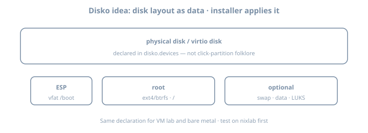

# Disko

**Goal:** Describe disks declaratively with **Disko**, install or reinstall a lab host from that description, and wire Disko into your flake so storage stops being tribal knowledge.

::: {.callout-important}
Disko can **wipe disks**. Use a disposable VM, spare drive, or cloud instance. Never experiment on a disk with irreplaceable data.
:::

{fig-alt="Disko disk layout ESP root optional"}

## Why it matters

Installer GUIs and one-shot `hardware-configuration.nix` fragments do not scale. Fleet habits require **repeatable storage**: partitions, LVM, btrfs/ZFS layouts, LUKS—as code. Disko is the common 2026 answer in many NixOS fleets.

Without Disko (or equivalent), disaster recovery docs say “partition like last time” and nobody remembers last time.

---

## Theory 1 — What Disko is

[Disko](https://github.com/nix-community/disko) turns a Nix attrset into:

1. Partitioning / formatting scripts  
2. Mount configuration compatible with NixOS  
3. Optionally integrated into `nixos-rebuild` / installer flows  

```text
disko.devices = { … }
        │
        ├─► disko script (destroy/create/mount)
        └─► fileSystems / boot / swap NixOS options
```

| Piece | Role |
|-------|------|
| `disko.devices.disk.*` | Physical (or virt) disks |
| `content.type` | `gpt`, `luks`, `btrfs`, `filesystem`, … |
| `mountpoint` | Becomes NixOS `fileSystems` entries |
| CLI modes | destroy / format / mount / disown (names evolve—check `--help`) |

Disko is **not** a backup tool. It describes structure; data durability is the backups chapter.

---

## Theory 2 — Minimal GPT + ext4 root (UEFI)

```nix
# modules/disko-lab.nix
{
  disko.devices = {
    disk = {
      main = {
        type = "disk";
        device = "/dev/vda"; # CHANGE per machine: nvme0n1, sda, …
        content = {
          type = "gpt";
          partitions = {
            ESP = {
              size = "512M";
              type = "EF00";
              content = {
                type = "filesystem";
                format = "vfat";
                mountpoint = "/boot";
                mountOptions = [ "umask=0077" ];
              };
            };
            root = {
              size = "100%";
              content = {
                type = "filesystem";
                format = "ext4";
                mountpoint = "/";
              };
            };
          };
        };
      };
    };
  };
}
```

| Field | Notes |
|-------|-------|
| `device` | Host-specific; inject via host module |
| `type = "gpt"` | UEFI-friendly |
| ESP `EF00` | EFI system partition type |
| `mountpoint` | Becomes NixOS `fileSystems` |

### Prefer stable device paths

```nix
device = "/dev/disk/by-id/nvme-…"; # better than /dev/nvme0n1 when possible
```

Virt devices (`/dev/vda`) are fine in VMs; metal likes `by-id`.

---

## Theory 3 — Flake integration

```nix
# flake.nix fragment
{
  inputs.disko.url = "github:nix-community/disko";
  inputs.disko.inputs.nixpkgs.follows = "nixpkgs";

  outputs = { self, nixpkgs, disko, ... }: {
    nixosConfigurations.lab = nixpkgs.lib.nixosSystem {
      system = "x86_64-linux";
      modules = [
        disko.nixosModules.disko
        ./hosts/lab/disko.nix
        ./hosts/lab/configuration.nix
      ];
    };
  };
}
```

```bash
# From installer ISO or rescue, after networking + clone:
sudo nix --extra-experimental-features "nix-command flakes" run github:nix-community/disko -- \
  --mode destroy,format,mount \
  --flake .#lab
# modes/flags evolve—check current Disko CLI help
```

Then install:

```bash
sudo nixos-install --flake .#lab
```

Or use documented `disko-install` flows when available in your Disko version.

### Evaluate mounts without wiping

```bash
nix eval .#nixosConfigurations.lab.config.fileSystems --json | jq 'keys'
# ensure / and /boot appear as expected after disko module merge
```

---

## Theory 4 — LUKS sketch (common homelab)

```nix
root = {
  size = "100%";
  content = {
    type = "luks";
    name = "crypted";
    settings.allowDiscards = true; # SSDs; understand TRIM tradeoffs
    content = {
      type = "filesystem";
      format = "ext4";
      mountpoint = "/";
    };
  };
};
```

| Unlock method | Notes |
|---------------|-------|
| Passphrase | Simple lab; interactive boot |
| Key file | Automation; protect the key |
| TPM2 | Secure Boot/TPM chapter |

Password vs TPM unlock: passphrase in this chapter’s lab; TPM path appears later. **Store recovery keys offline** before production encryption.

---

## Theory 5 — btrfs subvolumes (impermanence-ready)

```nix
content = {
  type = "btrfs";
  subvolumes = {
    "@" = {
      mountpoint = "/";
    };
    "@home" = {
      mountpoint = "/home";
    };
    "@nix" = {
      mountpoint = "/nix";
    };
    "@persist" = {
      mountpoint = "/persist";
    };
    "@log" = {
      mountpoint = "/var/log";
    };
  };
};
```

Impermanence loves `@persist` + wipe `@` on boot. You can create the layout even if you skip impermanence initially—future-you will thank you.

### ZFS note

Disko can express ZFS layouts; complexity jumps (pools, datasets, encryption). If you already run ZFS operationally, Disko still helps **repeat** the layout; if you are learning both ZFS and Disko, do ext4/btrfs first.

---

## Theory 6 — Host-specific devices without copy-paste hell

```nix
# modules/disko-btrfs-template.nix
{
  disko.devices.disk.main = {
    type = "disk";
    # device set per host
    content = { /* shared layout */ };
  };
}
```

```nix
# hosts/lab/disko.nix
{ lib, ... }:
{
  imports = [ ../../modules/disko-btrfs-template.nix ];
  disko.devices.disk.main.device = lib.mkDefault "/dev/vda";
}
```

```nix
# hosts/metal/disko.nix
{
  imports = [ ../../modules/disko-btrfs-template.nix ];
  disko.devices.disk.main.device = "/dev/disk/by-id/nvme-…";
}
```

Never commit a fleet-wide wrong `device` path.

---

## Theory 7 — Swap, BIOS, and multi-disk

### Swap

```nix
swap = {
  size = "8G";
  content = {
    type = "swap";
    resumeDevice = true; # if you want hibernation carefully
  };
};
```

Or prefer `zramSwap` in NixOS config and skip disk swap on small VMs—**decide intentionally**.

### Legacy BIOS / hybrid

UEFI is the default story here. BIOS/GPT or MBR layouts exist in Disko examples—follow current docs if you must boot old hardware.

### Multi-disk

```text
disk.main → system
disk.data → /var/lib/postgres bulk (example)
```

Keep system vs data responsibilities clear in `DISK.md`.

---

## Theory 8 — Interaction with hardware-configuration.nix

After Disko-driven install, generated hardware config may still detect NICs and kernel modules. **Filesystem mounts** should come from Disko’s merge, not a conflicting hand-maintained `fileSystems` block.

| Source of truth | For |
|-----------------|-----|
| Disko | partitions, formats, mountpoints |
| `hardware-configuration` / `nixos-generate-config` | often CPU microcode, kernel modules, NIC |
| Host module | hostname, networking, roles |

Conflicts: two modules defining different `fileSystems."/"` → merge errors or surprise boots.

---

## Worked example — VM lab checklist

```text
1. Create empty qcow2 / virt disk
2. Boot NixOS 26.05 installer ISO
3. Git clone flake (or nix copy)
4. Identify disk: lsblk / by-id
5. Set device in disko config
6. Run disko (destructive)
7. nixos-install --flake .#lab
8. Reboot; verify findmnt / lsblk
9. Wipe once more; reinstall; time it
```

```bash
lsblk -f
findmnt /
# source of truth is Nix; /etc/fstab is generated view
cat /etc/fstab
```

### DISK.md template

```markdown
# DISK.md
## lab
- device: /dev/vda (virtio)
- layout: GPT ESP 512M + ext4 root
- LUKS: no
- disko command that saved us: …
- recovery: installer ISO + flake URL + this file
```

---

## Lab — multi-step

Suggested workspace: your main lab flake + `~/lab/nixos/ops/disko` notes

### Step 1 — Snapshot safety

Confirm target disk is disposable. `lsblk` screenshot/paste into notes.

### Step 2 — Add Disko input

Pin via flake; `follows` nixpkgs; update lock.

### Step 3 — Write simplest UEFI layout

ext4 root + ESP. Parameterize `device`.

### Step 4 — Dry evaluation

```bash
nix eval .#nixosConfigurations.lab.config.fileSystems --json | jq 'keys'
```

### Step 5 — Apply on VM

Run Disko + install **or** rebuild path if reinstalling an already-Disko host per docs.

### Step 6 — Reinstall proof (core)

Wipe once more (VM) and reinstall from same flake. Time it. Note pain points.

### Step 7 — Optional LUKS or btrfs

Add one complexity only if Step 6 succeeded cleanly.

### Step 8 — Document recovery

`DISK.md`: device names per host, LUKS key location, disko command that saved you.

### Step 9 — Wrong-disk tabletop

Write a five-line “stop the line” checklist if `lsblk` shows unexpected serials.

---

## Exercises

1. Convert your layout from `device = "/dev/vda"` to a `by-id` path in a metal story (even if hypothetical).  
2. Sketch a three-disk server (boot/system/data) as Disko attrset stubs.  
3. Explain why Disko does not replace backups (one paragraph).  
4. Diff `fileSystems` eval before and after adding a swap partition.  
5. Time: first install vs second reinstall—what was slow (download, format, copy)?

---

## Common gotchas

| Symptom / mistake | What to do |
|-------------------|------------|
| Wiped wrong disk | Device IDs; prefer `/dev/disk/by-id/…` |
| No EFI boot | Missing ESP / wrong bootloader module |
| Device path differs after hardware change | by-id; update host module |
| Forgot disko module import | `fileSystems` empty/wrong |
| Swap forgotten | Add swap partition or zram intentionally |
| Cloud images | Device often `/dev/vda` or `/dev/nvme0n1`; check vendor docs |
| Conflicting `fileSystems` | One source of truth |
| LUKS without recovery key | Create and store offline **before** prod |
| Impermanence without `@persist` | Plan subvolumes early |

---

## Checkpoint

- [ ] Disko input wired in flake  
- [ ] Declarative layout for lab host committed  
- [ ] At least one real format/install or reinstall on disposable media  
- [ ] `fileSystems` matches intent after boot  
- [ ] `DISK.md` recovery notes written  
- [ ] Device path strategy chosen (by-id vs virt path)  
- [ ] Optional LUKS/btrfs attempted or deferred with reason  

### Commit

```bash
git add .
git commit -m "ops: disko layout and reinstall proof"
```

Write three personal gotchas before impermanence.
