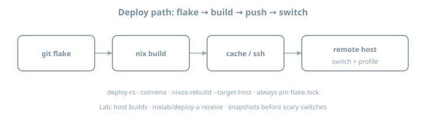

# deploy-rs

**Goal:** Deploy a flake-defined NixOS host to a remote machine with **deploy-rs**, understand activation profiles, and succeed at least once end-to-end over SSH. Target config: **NixOS 26.05**.

::: {.callout-note}
`nixos-rebuild --target-host` works; fleets still standardize on deploy tools for profiles, magic rollback, and multi-node later. **deploy-rs** is a common choice for small-to-medium flakes before (or beside) Colmena.
:::

{fig-alt="Flake build deploy switch flow"}

## Why it matters

Pushing a closure and activating it **without** sitting on the machine is the core of fleet ops. This chapter installs the boring muscle memory: SSH auth, profile activation, proof file, second delta, and a safe failure story.

---

## Theory 1 — Deploy pipeline

```text
local eval (flake) → build (local/remote) → copy closure → activate → health check → keep/rollback
```

| Step | Failure mode |
|------|----------------|
| Eval | Module errors |
| Build | Compile / missing cache |
| Copy | SSH/disk |
| Activate | Boot/switch scripts fail |
| Confirm | Custom checks fail → auto rollback (when configured) |

Understanding *where* it failed is half the job—read the stage in the log before rewriting modules blindly.

```text
deploy-rs
  builds profile path P (NixOS system)
  copies closure of P to target
  activates P (switch-to-configuration)
  optional confirm / magic rollback window
```

---

## Theory 2 — Flake skeleton with deploy-rs

```nix
{
  description = "deploy-rs lab";

  inputs = {
    nixpkgs.url = "github:NixOS/nixpkgs/nixos-26.05";
    deploy-rs.url = "github:serokell/deploy-rs";
    deploy-rs.inputs.nixpkgs.follows = "nixpkgs";
  };

  outputs = { self, nixpkgs, deploy-rs, ... }:
    let
      system = "x86_64-linux";
    in {
      nixosConfigurations.lab-vm = nixpkgs.lib.nixosSystem {
        inherit system;
        modules = [ ./hosts/lab-vm/configuration.nix ];
      };

      deploy.nodes.lab-vm = {
        hostname = "lab-vm.example.internal"; # or IP
        profiles.system = {
          user = "root";
          path = deploy-rs.lib.${system}.activate.nixos
            self.nixosConfigurations.lab-vm;
        };
      };

      checks = builtins.mapAttrs
        (system: deployLib: deployLib.deployChecks self.deploy)
        deploy-rs.lib;
    };
}
```

```bash
nix shell github:serokell/deploy-rs -c deploy .#lab-vm
# or after packaging deploy-rs in a shell:
deploy .#lab-vm
```

Pin via flake input so CI and laptop match. Exact CLI entrypoints: prefer current serokell docs for your pin.

---

## Theory 3 — SSH prerequisites

```bash
ssh root@lab-vm.example.internal nix --version
# or deploy user with passwordless sudo / root activation per your policy
```

| Requirement | Notes |
|-------------|-------|
| Nix on target | NixOS has it; confirm version band |
| Flakes enabled | On target as needed for activation |
| Disk space | Closures are large first time |
| Network to substituters | Or pre-pushed cache |
| Non-interactive auth | Keys, not passwords |
| Same arch (or builder) | Arch mismatch fails painfully |

```nix
# target snippets
services.openssh.enable = true;
users.users.root.openssh.authorizedKeys.keys = [
  "ssh-ed25519 AAAA… deploy"
];
# Prefer dedicated deploy key; hardening still applies
system.stateVersion = "26.05";
```

---

## Theory 4 — Magic rollback / confirmation

deploy-rs can require confirmation that the new system is healthy; if SSH dies, it rolls back. Read current serokell docs for `confirmTimeout` / magic-rollback options for your version—**enable something** before testing firewall changes remotely.

```nix
deploy.nodes.lab-vm = {
  hostname = "192.0.2.50";
  # sshOpts = [ "-p" "22" ];
  profiles.system = {
    user = "root";
    path = deploy-rs.lib.x86_64-linux.activate.nixos
      self.nixosConfigurations.lab-vm;
    # magicRollback / confirmTimeout per current docs
  };
};
```

Always keep a **console/VNC** path on the first remote firewall experiment. Magic rollback is not a substitute for out-of-band access.

| If this fails… | Look at |
|----------------|---------|
| Eval on laptop | modules, flake inputs |
| Build | caches, builders, arch |
| Copy | SSH, disk, bandwidth |
| Activate | systemd, scripts, secrets paths |
| Confirm timeout | network cut by your own firewall |

---

## Theory 5 — Build locality

| Mode | Idea |
|------|------|
| Build local, copy | Laptop/CI builds; target only activates |
| Build on target | Sometimes via remote builder / deploy options |
| Build on remote builder + cache | Packaging machinery |

For lab: local build + copy is fine if architectures match. Cross-arch without a builder is pain—fix remote builders first if needed.

### Cache interaction

Deploy once with cold cache (or after GC on target), once with warm substitutes. Record wall times. Deploy without cache is a social incident for fleets.

---

## Theory 6 — Profiles beyond `system`

deploy-rs supports multiple **profiles** per node (system is the common first). Later you might activate user/home profiles; master **one** system profile end-to-end first.

| Profile idea | Role |
|--------------|------|
| `system` | NixOS activation |
| Future custom | App-only activations (advanced) |

Do not invent multi-profile complexity until single profile is boring.

---

## Theory 7 — vs `nixos-rebuild --target-host`

```bash
nixos-rebuild switch --flake .#lab-vm --target-host root@lab-vm
```

| Concern | rebuild --target-host | deploy-rs |
|---------|----------------------|-----------|
| Built-in | Yes | Flake input |
| Magic rollback ergonomics | Limited | Stronger story |
| Multi-node | Manual | `deploy.nodes` |
| Checks | Manual | `deployChecks` |
| Learning cost | Low | Medium |

Write five lines on when you prefer each after you have used both once.

---

## Worked example — trivial visible change

```nix
# hosts/lab-vm/configuration.nix
{ pkgs, ... }:
{
  networking.hostName = "lab-vm";
  environment.systemPackages = [ pkgs.hello pkgs.git ];
  environment.etc."deploy-proof".text = "deployed-by-deploy-rs\n";
  services.openssh.enable = true;
  system.stateVersion = "26.05";
}
```

```bash
deploy .#lab-vm
ssh lab-vm cat /etc/deploy-proof
```

Second deploy: change the text; redeploy; confirm update. Two successful deploys beat one lucky shot.

### Generation awareness

```bash
ssh lab-vm -- sudo nix-env -p /nix/var/nix/profiles/system --list-generations | tail
```

Note generation number before/after deploy. You cannot rollback what you never listed.

---

## Worked example — RUNBOOK seed

```markdown
# Deploy lab-vm
1. VPN/SSH path reachable
2. nix flake lock status known
3. deploy .#lab-vm
4. health: cat /etc/deploy-proof && systemctl is-system-running
5. if fail: console access; list generations; rollback
```

---

## Lab — multi-step

Suggested notes: `~/lab/nixos/ops/deploy`

### Step 1 — Target ready

Disposable NixOS VM with SSH key auth. Snapshot the VM **before** first deploy.

### Step 2 — Add deploy-rs input

`follows` nixpkgs; lock; commit.

### Step 3 — Wire `deploy.nodes`

Match `nixosConfigurations` name; set hostname/IP. Prefer IP in lab DNS chaos.

### Step 4 — First deploy

```bash
nix flake check   # includes deployChecks if wired
deploy .#lab-vm
# -s / skip-checks flags: know them; don’t live on skip forever
```

Capture full terminal output in notes.

### Step 5 — Prove activation

```bash
ssh lab-vm cat /etc/deploy-proof
ssh lab-vm nixos-version
ssh lab-vm readlink /run/current-system
```

### Step 6 — Second deploy delta

Change `environment.etc` text; redeploy; confirm update. Note wall time vs first deploy (cache effects).

### Step 7 — Failure drill (safe)

Deploy a config that adds a harmless broken oneshot **or** bad package, observe failure handling; restore from snapshot if needed. Do **not** lock yourself out on purpose without console.

### Step 8 — Compare one-liner

Once, run classic `nixos-rebuild --target-host`. Write comparison notes.

### Step 9 — Document RUNBOOK seed

As above.

### Step 10 — Generation awareness after deploy

List generations; record numbers.

### Step 11 — Cache interaction

Cold vs warm deploy times.

### Step 12 — Multi-node sketch (optional)

Add a second node attr in `deploy.nodes` even if only one is real—prove eval shape.

---

## Exercises

1. Draw the pipeline and mark where magic rollback acts.  
2. Design a deploy key policy (who has it, rotation).  
3. Estimate first-deploy closure size for your lab host (`nix path-info -Sh`).  
4. Write a “deploy failed at copy” runbook paragraph.  
5. Compare deploy-rs vs Colmena for a 2-node vs 20-node mental model (preview).

---

## Common gotchas

| Symptom / mistake | What to do |
|-------------------|------------|
| Arch mismatch | Build on same system or use remote builder |
| Permission denied | root keys / sudo deploy user |
| Out of disk on target | GC; grow disk |
| Hang on activation | Console; magic rollback timeouts |
| `deploy` not found | `nix shell` the tool |
| Hostname DNS | Use IP for lab |
| Checks fail locally | Fix `deployChecks` or understand impure needs |
| `follows` forgotten | Mixed nixpkgs between deploy-rs and host |
| Firewall lockout | Console first; enable magic rollback |
| Secrets missing on target | sops keys / paths must exist before service start |

---

## Checkpoint

- [ ] deploy-rs in flake  
- [ ] Successful remote activation  
- [ ] Visible file/package change verified over SSH  
- [ ] Second delta deploy succeeded  
- [ ] Comparison note vs `nixos-rebuild --target-host`  
- [ ] RUNBOOK seed written  
- [ ] Generation numbers recorded  
- [ ] Magic rollback / confirm awareness  

### Commit

```bash
git add .
git commit -m "ops: deploy-rs end-to-end"
```

Write three personal gotchas before Colmena.
