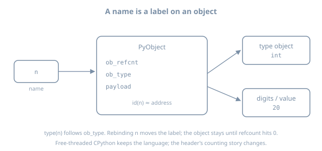

# Internals

This section is the **machine** under the notation. It is Path B. You should already be able to write a small module, a function, and a test. If not, finish Getting started through Data structures first — this book is self-contained; come back here later.

## Mental model

```text
  your .py file
       |
       v
  parse  →  AST  →  compile  →  code object (bytecode)
                                      |
                                      v
                               eval loop (CEVAL)
                                      |
                                      v
                               PyObject heap  +  frames
```

CPython is a C program that walks that pipeline. We stay at the level you can see from Python (`dis`, `sys.getsizeof`, `gc`, `__code__`) and only dip into C names when they are the usual ones (`PyObject`, GIL).



## Chapters

| Page | Question it answers |
|------|---------------------|
| [Object model](01-object-model.qmd) | What is an object? type, `id`, refcount |
| [Names, namespaces, frames](02-names-namespaces-frames.qmd) | Where do names live at runtime? |
| [Bytecode and eval](03-bytecode-and-eval.qmd) | What does `dis` print? |
| [GIL and free-threading](04-gil-and-free-threading.qmd) | Why threads and CPU, and what 3.14 changed |
| [Memory and GC](05-memory-and-gc.qmd) | Refcount + cyclic collector |
| [Import system](06-import-system.qmd) | How `import` finds a module |
| [Descriptors and slots](07-descriptors-and-slots.qmd) | How `obj.x` actually works |

## How to work these pages

1. Run every `dis` / `sys` snippet.
2. Draw the objects. If you cannot draw it, you do not have it yet.
3. Stay at the Python-visible layer (`dis`, `sys`, `__code__`) unless a later internals page opens a C name on purpose. This book will not become a C tutorial.

## What this is not

- Not a substitute for Shaw’s *CPython Internals* or the [devguide](https://devguide.python.org/internals/).
- Not a JIT textbook. 3.13+ has an experimental JIT and 3.14 a faster eval loop; we treat them as “the machine got faster,” not as something you configure on day one.
- Not PyPy or MicroPython internals.

## Further reading

- [CPython internals (devguide)](https://devguide.python.org/internals/)
- Anthony Shaw, *CPython Internals*
- Luciano Ramalho, *Fluent Python* 2e — data model chapters
- [What’s New in Python 3.14](https://docs.python.org/3/whatsnew/3.14.html)
