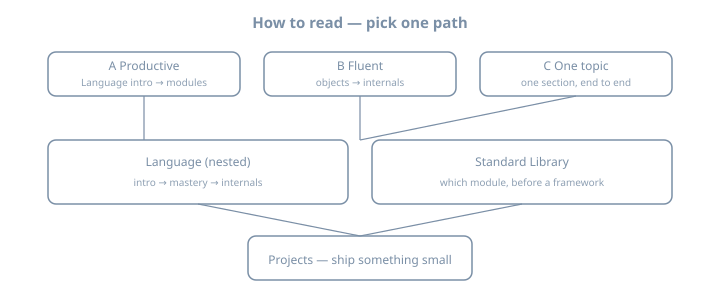

# Everything Python — Comprehensive Syllabus

::: {.content-visible when-format="html"}

:::

A **deep library**, not a single linear course. Use a path below so the sidebar does not feel endless.

**Baseline:** Python **3.14** · toolchain **`uv`** + a virtual environment · type hints after the first syntax pass.

This book is **self-contained**. You do not need any other title in this library (Linux, Maths, Networking, Go, …) to read it. The published sidebar is three parts for now: **Language**, **Standard Library**, and **Projects**. Other domains (CS, maths, data/AI, ops, apps) are parked and will be organized later — they will stay **Python + that domain**, a small experiment *here*, not a second textbook from elsewhere.

## How to read this book (pick a path)

```text
Path A — Productive Python (≈ 2–4 weeks)
  Language: Intro → Getting started → Syntax → Control → Functions
  → Data structures → Modules
  → one small project in Projects

Path B — Fluent Python / internals
  Language: Objects → Errors/I/O → Typing → Idioms → Concurrency
  → Internals (object model, bytecode, GIL / free-threading)
  → Standard Library tour

Path C — depth on one topic
  Pick one Language section, or the Standard Library map, and work it end-to-end
```



## 1. Language

Linux-style tree: **section → chapter**, with **Internals** nested under Language.

- **Intro:** why Python exists; language vs CPython vs the ecosystem; how to read this library; the 2026 map (3.14, free-threading, `uv`).
- **Getting started:** install; editors and fonts (VS Code family, Zed, Sublime, …); Linux CLI-only; REPL vs file; first program; project layout.
- **Core language:** types, control flow (`match`), functions, lists/dicts/sets, modules and `uv`, classes, exceptions and `pathlib`.
- **Craft:** stdlib essentials, typing, pytest, idioms, concurrency.
- **Internals:** object model, names and frames, bytecode and eval, GIL and official free-threading (PEP 703 / 779), GC, import system, descriptors.

Start at **Language → Intro**. Do not open Internals until you can write a small module and a test.

## 2. Standard Library

A reference tour: when to reach for which module before a framework. Language → Stdlib essentials is the working set; this part is the map (`pathlib`, `json`, `datetime`, `argparse`, `collections`, `subprocess`, …).

## 3. Projects

Build practice that uses Language + the standard library: a temperature CLI, file/rename scripts, word counts, then grow from there.

## How chapters are written

Most Language pages include:

1. A one-sentence goal  
2. A mental model (ASCII, sometimes SVG)  
3. A **complete file** you can save (`# name.py`) and run with `uv run python name.py`  
4. Named worked examples, each also a complete file, with expected output  
5. Pitfalls  
6. An optional **Python + CS** or **Python + maths** note (a small experiment in this book)  
7. Exercises  
8. Further reading (docs, PEPs, named books — original prose only)

## Prerequisites

- A computer, a terminal (the text window where you type commands), and a text editor you already like
- Willingness to type programs, break them, and read the traceback
- No prior Python, and no other book from this library. Some programming experience helps but is not required for Path A

## Conventions

- Examples assume **Python 3.14** unless a page says otherwise.
- Prefer **`uv`** for installing Python and creating environments; `pip` + `venv` are still shown so you can read older projects.
- Format and lint with **Ruff** when a project exists; do not bikeshed style in the first week.
- Worked examples over API dumps.

## Formats

HTML, PDF, and EPUB when built via the monorepo portal.

## Acknowledgments {.unnumbered}

The syllabus is distilled from the official tutorial and from widely used books and courses (Sweigart, Matthes, Downey, Lutz, Slatkin, Ramalho, Beazley, Shaw, and others listed in `content/_planning/syllabus.md`). Chapters are original teaching text for this library, not extracts.
