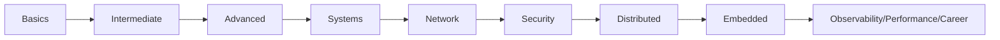

# Rust Book Syllabus (Simple Chapter Path)

## Program Goal

Learn Rust from beginner to production engineer through small, focused chapters with clear examples and hands-on practice.

## Parts Overview

1. Rust Basics (12 simple chapters)
2. Rust Intermediate (10 chapters)
3. Rust Advanced (10 chapters)
4. Rust Systems Programming (10 chapters)
5. Network Programming (5 chapters)
6. Security Programming (5 chapters)
7. Distributed Systems (5 chapters)
8. Embedded and IoT (5 chapters)
9. Observability, Performance, and Career (5 chapters)

## Learning Flow

## How to Study Each Chapter

- Read concept and mental model first.
- Run the chapter example exactly once.
- Modify it in at least two ways.
- Complete practice tasks before moving on.
- Keep notes of errors and fixes.
